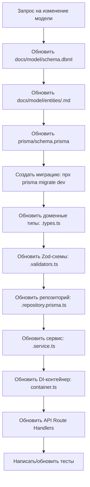

# 🗄️ ПРАВИЛА УПРАВЛЕНИЯ МОДЕЛЬЮ ДАННЫХ

## 1. Двухуровневая модель данных

| Уровень | Расположение | Назначение |
|---------|-------------|-----------|
| **Концептуальный** | `docs/model/` | DBML-схема + markdown-описание. Единый источник истины для структуры данных |
| **Физический** | `prisma/schema.prisma` | Исполняемая схема БД. Производная от концептуальной модели |

> **Принцип:** Концептуальная модель — Source of Truth. Физическая модель всегда следует за концептуальной.

---

## 2. Структура `docs/model/`

```
docs/model/
├── schema.dbml          # Полная DBML-схема БД
├── README.md            # Общее описание модели, ER-диаграмма
├── entities/            # Описание каждой сущности
│   ├── user.md
│   ├── member.md
│   ├── plot.md
│   ├── agreement.md
│   └── payment.md
└── conventions.md       # Конвенции именования, типы данных, стандарты
```

---

## 3. Порядок внесения изменений в модель



**Запрещено** пропускать шаги или начинать с физического уровня.

---

## 4. Правила синхронизации

- Концептуальная модель (`docs/model/`) — **Source of Truth**. Любое изменение начинается с неё.
- Если ИИ-агент обнаруживает рассинхронизацию между DBML и Prisma — он обязан остановиться и запросить уточнение.
- После каждого изменения Prisma-схемы необходимо проверять, что доменные типы в `<domain>.types.ts` соответствуют полям модели.

---

## 5. Конвенции именования

### 5.1. Соответствие между слоями

| Слой | Стиль именования | Примеры | Описание |
|------|------------------|---------|----------|
| **База данных (PostgreSQL)** | `snake_case` | `user_id`, `created_at`, `first_name` | Имена таблиц и колонок в БД |
| **Prisma Schema** | `camelCase` | `userId`, `createdAt`, `firstName` | Имена моделей и полей в Prisma схеме с использованием `@map()` для указания snake_case колонок |
| **TypeScript домен** | `camelCase` | `userId`, `createdAt`, `firstName` | Типы в доменных слоях |
| **API JSON** | `camelCase` | `userId`, `createdAt`, `firstName` | Поля в JSON запросах и ответах API |

### 5.2. Примеры преобразований

| БД (snake_case) | Prisma (camelCase) | TS Домен (camelCase) | API JSON (camelCase) |
|-----------------|-------------------|---------------------|---------------------|
| `user_id` | `userId` | `userId: string` | `userId` |
| `created_at` | `createdAt` | `createdAt: Date` | `createdAt` |
| `first_name` | `firstName` | `firstName: string` | `firstName` |
| `is_active` | `isActive` | `isActive: boolean` | `isActive` |
| `plot_number` | `plotNumber` | `plotNumber: string` | `plotNumber` |

### 5.3. Правила именования полей

#### Идентификаторы
- Первичный ключ: `id` (String, cuid)
- Внешний ключ: `<ref>_id` (например, `user_id`, `member_id`, `plot_id`)

#### Стандартные поля
- `created_at` — дата создания записи (DateTime)
- `updated_at` — дата последнего обновления (DateTime)

#### Имена полей
- Использование `snake_case` для всех полей в БД
- Отрицательные/булевы значения: `is_`, `has_`, `can_` префиксы
- Даты: поле `date` + суффикс (`start_date`, `end_date`)
- Числовые значения: явное указание (`amount`, `area`, `price`)

### 5.4. Нумерация таблиц (примеры)

| Таблица | Описание |
|---------|----------|
| `users` | Пользователи системы |
| `members` | Члены СНТ |
| `plots` | Участки СНТ |
| `agreements` | Договоры |
| `payments` | Платежи |

---

## 6. Обязательные артефакты при изменении модели

При добавлении/изменении сущности ИИ-агент обязан создать/обновить:

1. `docs/model/entities/<entity>.md` — описание сущности, поля, бизнес-правила, ограничения
2. `docs/model/schema.dbml` — актуальная DBML-схема
3. `prisma/schema.prisma` — физическая модель
4. Миграция через `npx prisma migrate dev --name <descriptive-name>`
5. `src/domains/<domain>/<domain>.types.ts` — типы DTO
6. `src/domains/<domain>/<domain>.validators.ts` — Zod-схемы
7. `src/domains/<domain>/<domain>.repository.interface.ts` — интерфейс репозитория
8. `src/domains/<domain>/<domain>.repository.prisma.ts` — реализация репозитория
9. `src/domains/<domain>/<domain>.service.ts` — сервис с бизнес-логикой
10. `src/domains/<domain>/<domain>.errors.ts` — доменные ошибки
11. `src/domains/<domain>/index.ts` — реэкспорт публичного API
12. `src/di/container.ts` — регистрация в DI

---

## 7. Шаблон описания сущности (`docs/model/entities/<entity>.md`)

```markdown
# <EntityName>

## Описание
<Бизнес-описание сущности>

## Поля
| Поле | Тип | Обязательное | Описание | Бизнес-правила |
|------|-----|-------------|----------|----------------|
| id | String | Да | Уникальный идентификатор | Генерируется автоматически (cuid) |
| ... | ... | ... | ... | ... |

## Связи
| Сущность | Тип связи | Описание |
|----------|-----------|----------|
| User | belongs_to | Член СНТ связан с пользователем |

## Индексы
| Поля | Тип | Описание |
|------|-----|----------|
| email | unique | Уникальный email |

## Бизнес-инварианты
- <правило 1>
- <правило 2>

## Конвенции именования
- **БД (PostgreSQL):** <snake_case имена>
- **Prisma:** <camelCase имена с @map>
- **TypeScript домен:** <PascalCase тип, camelCase поля>
```

---

## 8. Строгие запреты

- ❌ **Запрещено** изменять `prisma/schema.prisma` без предварительного обновления `docs/model/`
- ❌ **Запрещено** создавать миграции вручную (SQL-файлы) — только через `npx prisma migrate dev`
- ❌ **Запрещено** использовать `prisma db push` в продакшн-окружении
- ❌ **Запрещено** удалять миграции из `prisma/migrations/` — только создавать новые
- ❌ **Запрещено** импортировать Prisma Client напрямую в сервисы — только через репозиторий
- ❌ **Запрещено** дублировать типы: доменные типы должны быть совместимы с Prisma-генерируемыми, но не зависеть от них напрямую
- ❌ **Запрещено** использовать camelCase для имен полей в БД — всегда использовать `snake_case` через `@map()`

---

## 9. Пример Prisma-схемы с snake_case

```prisma
model Member {
  id          String        @id @default(cuid())
  user_id     String        @unique @map("user_id")
  first_name  String        @map("first_name")
  last_name   String        @map("last_name")
  birth_date  DateTime?     @map("birth_date")
  phone       String?       @map("phone")
  email       String?       @map("email")
  is_active   Boolean       @default(true) @map("is_active")
  note        String?       @map("note")
  created_at  DateTime      @default(now()) @map("created_at")
  updated_at  DateTime      @updatedAt @map("updated_at")

  plot        Plot?
  agreements  Agreement[]
  payments    Payment[]

  @@map("members") // Имя таблицы в БД
}
```

**Важно:** В коде используется `member.firstName`, но в БД это колонка `first_name`.
