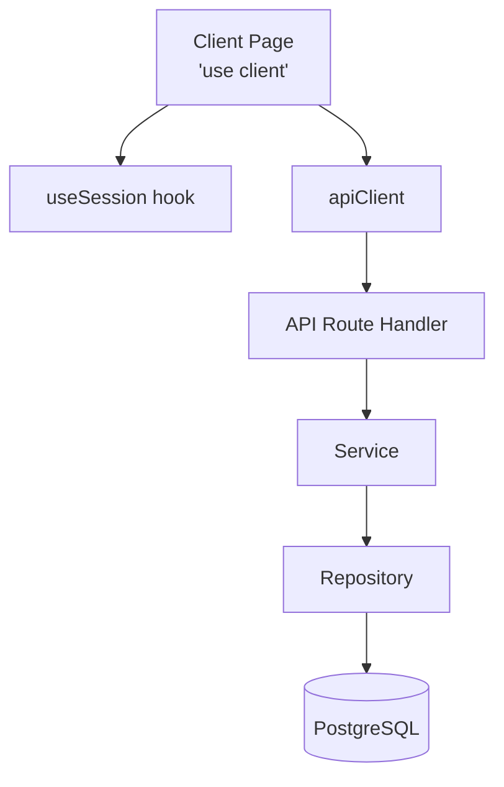

# ГЛОБАЛЬНЫЕ ПРАВИЛА ПРОЕКТА (Next.js)

## 1. Роли и взаимодействие
- **Architect Mode** — проектирует архитектуру, проверяет спецификации на соответствие правилам, создаёт User Stories в `docs/user-stories/`.
- **Code Mode** — реализует код строго по спецификации и правилам ниже. Любое отклонение считается ошибкой.
- **Orchestrator Mode** — координирует сложные задачи, требующие нескольких режимов.
- Все режимы обязаны следовать правилам из `architecture.md` и `PROJECT.md`.

## 2. Архитектура компонентов и поток данных

### Архитектурный паттерн



### Типовая цепочка запроса

### Типовая цепочка запроса
Каждый запрос следует строгой цепочке слоёв. Переход через границу слоя допускается только к соседнему слою.

    page → UI-компонент → api-client → API Route Handler → Service → Repository → БД

### Описание слоёв
- **page** — страница Next.js App Router. Отвечает за компоновку и передачу props. ВСЕ страницы являются Client Components с директивой `'use client'`.
- **UI-компонент** — компонент из `src/components/features/` или `src/components/ui/`. Отображает данные, обрабатывает пользовательские события. Клиентские компоненты помечаются `'use client'`.
- **api-client** — экземпляр `ApiClient` из `src/lib/api-client.ts`. Единственный способ общения клиента с сервером. Запрещено использовать `fetch()` напрямую в компонентах.
- **API Route Handler** — файл `route.ts` в `src/app/api/v1/`. Принимает HTTP-запрос, делегирует бизнес-логику сервису, возвращает JSON-ответ. Не содержит бизнес-логики.
- **Service** — класс в `src/domains/[domain]/`. Содержит бизнес-логику и валидацию (Zod). Доступ к данным — **строго через Repository**. Сервис не должен импортировать Prisma напрямую.
- **Repository** — реализация интерфейса из `src/domains/[domain]/`. Единственный слой, имеющий право обращаться к Prisma Client и выполнять запросы к БД.

### Правила Client Components
- **ВСЕ страницы являются Client Components** с директивой `'use client'`
- **НЕ ИСПОЛЬЗУЕТСЯ SSR** для страниц приложения
- Интерактивные элементы (кнопки, формы) выносятся в минимально возможные Client-компоненты
- Все страницы используют `useSession()` из `next-auth/react` для аутентификации

### Правила доступа к данным
- **Сервисный слой** обращается к данным только через интерфейс репозитория (например, `IMemberRepository`). Запрещён прямой импорт Prisma Client в сервис.
- **API Route Handlers** получают сервисы через DI-контейнер или фабрики из `src/di/container.ts`.
- **Компоненты** не импортируют сервисы и репозитории напрямую — только через `apiClient`.

## 3. Работа с данными и мутации (API-first)
- **Архитектурный стиль:** Проект использует API-first подход. Данные запрашиваются и мутируются через REST API endpoints.
- **API Route Handlers:** Взаимодействие с БД осуществляется через API Route Handlers в `src/app/api/v1/`. Каждый ресурс имеет свой маршрут (`route.ts`).
- **API Client:** На клиенте используется централизованный `ApiClient` из `src/lib/api-client.ts`. Запрещено использовать `fetch()` напрямую в компонентах — только через `apiClient`.
- **Server Actions:** Допускаются как альтернатива для простых форм, не требующих сложной логики. Не являются основным паттерном мутаций.
- **Валидация:** Входящие данные валидируются через Zod-схемы в Service-слое (`domains/*/validators.ts`), а не в API Route Handlers.
- **UX состояний форм:** Клиентские формы должны отображать состояние загрузки и блокировать кнопку отправки при активном запросе.

## 4. Обработка ошибок и UX States
- **Иерархия ошибок:** Все бизнес-ошибки наследуются от `BaseError` из `src/shared/errors/`. Доменные ошибки (MemberNotFoundError, MemberInvalidDataError и т.д.) наследуются от соответствующих базовых классов (NotFoundError, ValidationError, ConflictError).
- **API Route Handlers:** Обязаны перехватывать ошибки и возвращать стандартизированный JSON-ответ `{ success: false, error: { code, message } }` с соответствующим HTTP-статусом.
- **Загрузка:** Для каждой динамической страницы используется управляемая загрузка через `useState` в Client Components. Файлы `loading.tsx` и `error.tsx` используются для graceful degradation.
- **Ошибки UI:** Использовать файлы `error.tsx` для изоляции и перехвата критических ошибок в рантайме.
- **Пустые состояния:** Если массив данных пуст, компонент обязан отрендерить явный `EmptyState` — выделенный переиспользуемый компонент из `src/components/ui/`, а не inline-разметку.

## 5. Структура папок (Clean Architecture + App Router)

### Общий принцип
Исходный код находится в `src/`. Корневые директории `app/`, `components/`, `domains/`, `infrastructure/` и др. НЕ используются — они являются устаревшими. Все новые файлы создаются строго внутри `src/`.

### Директории

```
src/
├── app/                          # Next.js App Router
│   ├── layout.tsx                # Корневой layout
│   ├── not-found.tsx             # 404 страница
│   ├── (auth)/                   # Группа маршрутов авторизации
│   │   └── login/page.tsx
│   ├── (dashboard)/              # Группа маршрутов приложения
│   │   ├── layout.tsx
│   │   ├── page.tsx
│   │   └── members/page.tsx
│   └── api/v1/                   # REST API Route Handlers
│       ├── route.ts              # Health check
│       ├── members/
│       │   ├── route.ts          # GET /members, POST /members
│       │   └── [id]/route.ts     # GET/PATCH/DELETE /members/:id
│       └── plots/
│           └── route.ts
│
├── components/
│   ├── ui/                       # Переиспользуемые UI-атомы
│   │   ├── Button/
│   │   │   ├── Button.tsx
│   │   │   └── index.ts          # Re-export
│   │   ├── Card/
│   │   ├── Input/
│   │   ├── Badge/
│   │   └── EmptyState/           # Компонент пустого состояния
│   └── features/                 # Изолированные компоненты бизнес-фич
│       └── members/
│           ├── MemberList.tsx
│           └── index.ts
│
├── domains/                      # Бизнес-логика (Clean Architecture)
│   ├── _shared/                  # Общие доменные утилиты
│   └── members/                  # Домен «Члены СНТ»
│       ├── index.ts              # Публичный API домена (re-exports)
│       ├── member.types.ts       # Типы сущности (Member, CreateMemberData...)
│       ├── member.repository.interface.ts  # Интерфейс репозитория
│       ├── member.repository.prisma.ts     # Реализация репозитория (Prisma)
│       ├── member.service.ts     # Бизнес-логика (валидация + вызовы repo)
│       ├── member.validators.ts  # Zod-схемы валидации
│       └── member.errors.ts      # Доменные ошибки
│
├── infrastructure/               # Инфраструктурный слой
│   ├── auth/
│   │   └── auth.config.ts        # Конфигурация next-auth
│   ├── prisma/
│   │   └── client.ts             # Singleton Prisma Client
│   └── ws/
│       └── ws.client.ts          # WebSocket клиент
│
├── di/                           # Dependency Injection
│   └── container.ts              # DI-контейнер и фабрики сервисов
│
├── shared/                       # Общий код между слоями
│   ├── errors/                   # Иерархия ошибок (BaseError → *)
│   │   ├── BaseError.ts
│   │   ├── NotFoundError.ts
│   │   ├── ValidationError.ts
│   │   ├── ConflictError.ts
│   │   ├── UnauthorizedError.ts
│   │   ├── ForbiddenError.ts
│   │   ├── BusinessRuleError.ts
│   │   └── index.ts
│   ├── types/                    # Общие типы (ApiResponse, PaginatedResponse...)
│   └── utils/                    # Общие утилиты (cn, formatting)
│
├── lib/                          # Библиотечный код
│   ├── api-client.ts             # Централизованный REST API клиент
│   └── utils.ts                  # Общие утилиты
│
└── hooks/                        # Переиспользуемые React-хуки
```

### Правила для доменов
- Каждый домен следует структуре файлов как в `domains/members/`.
- Для создания нового домена использовать скрипт: `npm run domain:create`.
- Каждый домен обязан иметь `index.ts` с re-экспортом публичного API.
- Сервисы получают репозитории через интерфейсы (DI), а не напрямую.

## 6. Внедрение зависимостей (DI)
- **Контейнер:** Используется класс `Container` из `src/di/container.ts` с singleton-паттерном для сервисов.
- **Фабрики:** Для создания сервисов вне контейнера используются фабричные функции (например, `createMemberService()`).
- **API Route Handlers** получают сервисы через фабрики или контейнер, но НЕ создают экземпляры репозиториев напрямую.
- **Интерфейсы:** Сервисы зависят от интерфейсов репозиториев (`IMemberRepository`), а не от конкретных реализаций.

## 7. Аутентификация (Client-side)
- **Библиотека:** next-auth v4.
- **Конфигурация:** `src/infrastructure/auth/auth.config.ts` — содержит провайдеры, страницы и коллбэки авторизации.
- **Маршруты:** Страница входа — `/login`, защищённый контент — `/(dashboard)/*`.
- **Защита маршрутов:** Client-side через `useSession()` из `next-auth/react` в **Dashboard Layout** и всех страницах.
- **Session Management:**
  - **Client Components** используют `useSession()` для отслеживания состояния сессии
  - **Dashboard Layout** оборачивает приложение в `SessionProvider` и защищает маршруты через `useSession()`
  - При отсутствии сессии — redirect на `/login` через клиентский роутер
  - **НЕ ИСПОЛЬЗУЕТСЯ** `getServerSession()` для проверки авторизации на сервере
- **Роли:** Модель `User` содержит поле `role` с перечислением `Role` (MEMBER, ADMIN и т.д.).

## 8. Тестирование
- **Фреймворк:** Jest + ts-jest.
- **Команды:** `npm test`, `npm run test:watch`, `npm run test:coverage`.
- **Структура тестов:** Тесты размещаются рядом с тестируемым кодом или в директории `tests/` на корневом уровне.
- **Приоритет тестирования:** Service-слой → Repository-слой → API Route Handlers → UI-компоненты.
- **Моки:** Репозитории мокаются через интерфейсы. Запрещено мокать сервисы при тестировании API Route Handlers — мокать только репозитории.

## 9. Создание новых доменов
- Использовать скрипт `npm run domain:create` для генерации структуры домена.
- Скрипт создаёт:
  - Файлы домена в `src/domains/[name]/`
  - Компоненты фичи в `src/components/features/[name]/`
  - API Route Handler в `src/app/api/v1/[name]/route.ts`
  - Страницу в `src/app/(dashboard)/[name]/page.tsx`
- После генерации необходимо заполнить бизнес-логику и типы вручную.