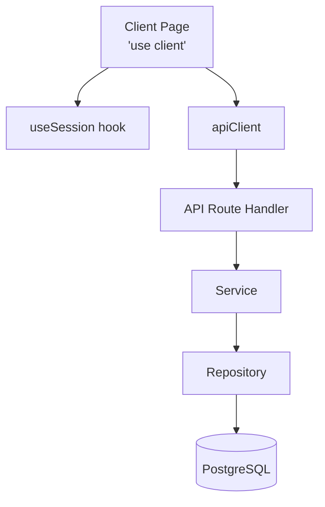

# ГЛОБАЛЬНЫЕ ПРАВИЛА ПРОЕКТА (Next.js)

## 1. Роли и взаимодействие
- **Architect Mode** — проектирует архитектуру, проверяет спецификации на соответствие правилам, создаёт User Stories в `docs/user-stories/`.
- **Code Mode** — реализует код строго по спецификации и правилам ниже. Любое отклонение считается ошибкой.
- **Orchestrator Mode** — координирует сложные задачи, требующие нескольких режимов.
- Все режимы обязаны следовать правилам из `ARCHITECTURE.md` и `PROJECT.md`.

## 2. Архитектура компонентов и поток данных

> **Детальная архитектура проекта описана в [`ARCHITECTURE.md`](ARCHITECTURE.md).**
> Ниже — краткая сводка ключевых принципов.

### Архитектурный паттерн



### Типовая цепочка запроса

Каждый запрос следует строгой цепочке слоёв. Переход через границу слоя допускается только к соседнему слою.

```
page → UI-компонент → apiClient → API Route Handler → Service → Repository → БД
```

### Описание слоёв
- **page** — страница Next.js App Router. Отвечает за компоновку и передачу props. ВСЕ страницы являются Client Components с директивой `'use client'`.
- **UI-компонент** — компонент из `src/components/features/` или `src/components/ui/`. Отображает данные, обрабатывает пользовательские события. Клиентские компоненты помечаются `'use client'`.
- **apiClient** — экземпляр `ApiClient` из `src/lib/api-client.ts`. Единственный способ общения клиента с сервером. Запрещено использовать `fetch()` напрямую в компонентах.
- **API Route Handler** — файл `route.ts` в `src/app/api/v1/`. Принимает HTTP-запрос, делегирует бизнес-логику сервису, возвращает JSON-ответ. Не содержит бизнес-логики.
- **Service** — класс в `src/domains/[domain]/`. Содержит бизнес-логику и валидацию (Zod). Доступ к данным — **строго через Repository**. Сервис не должен импортировать Prisma напрямую.
- **Repository** — реализация интерфейса из `src/domains/[domain]/`. Единственный слой, имеющий право обращаться к Prisma Client и выполнять запросы к БД.

### Правила Client Components
- **ВСЕ страницы являются Client Components** с директивой `'use client'`
- **НЕ ИСПОЛЬЗУЕТСЯ SSR** для страниц приложения
- Интерактивные элементы (кнопки, формы) выносятся в минимально возможные Client-компоненты
- Все страницы используют `useSession()` из `next-auth/react` для аутентификации

### Правила доступа к данным
- **Сервисный слой** обращается к данным только через интерфейс репозитория (например, `IMemberRepository`). Запрещён прямой импорт Prisma Client в сервис.
- **API Route Handlers** получают сервисы через DI-контейнер или фабрики из `src/di/container.ts`.
- **Компоненты** не импортируют сервисы и репозитории напрямую — только через `apiClient`.

## 3. Работа с данными и мутации (API-first)
- **Архитектурный стиль:** Проект использует API-first подход. Данные запрашиваются и мутируются через REST API endpoints.
- **API Route Handlers:** Взаимодействие с БД осуществляется через API Route Handlers в `src/app/api/v1/`. Каждый ресурс имеет свой маршрут (`route.ts`).
- **API Client:** На клиенте используется централизованный `ApiClient` из `src/lib/api-client.ts`. Запрещено использовать `fetch()` напрямую в компонентах — только через `apiClient`.
- **Server Actions:** Допускаются как альтернатива для простых форм, не требующих сложной логики. Не являются основным паттерном мутаций.
- **Валидация:** Входящие данные валидируются через Zod-схемы в Service-слое (`domains/*/validators.ts`), а не в API Route Handlers.
- **UX состояний форм:** Клиентские формы должны отображать состояние загрузки и блокировать кнопку отправки при активном запросе.

## 4. Обработка ошибок и UX States
- **Иерархия ошибок:** Все бизнес-ошибки наследуются от `BaseError` из `src/shared/errors/`. Доменные ошибки (MemberNotFoundError, MemberInvalidDataError и т.д.) наследуются от соответствующих базовых классов (NotFoundError, ValidationError, ConflictError).
- **API Route Handlers:** Обязаны перехватывать ошибки и возвращать стандартизированный JSON-ответ `{ success: false, error: { code, message } }` с соответствующим HTTP-статусом.
- **Загрузка:** Для каждой динамической страницы используется управляемая загрузка через `useState` в Client Components. Файлы `loading.tsx` и `error.tsx` используются для graceful degradation.
- **Ошибки UI:** Использовать файлы `error.tsx` для изоляции и перехвата критических ошибок в рантайме.
- **Пустые состояния:** Если массив данных пуст, компонент обязан отрендерить явный `EmptyState` — выделенный переиспользуемый компонент из `src/components/ui/`, а не inline-разметку.

## 5. Структура папок (Clean Architecture + App Router)

### 🚫 ЗАПРЕТНЫЕ КОМБИНАЦИИ маршрутов

❌ **Строго запрещено одновременно использовать:**
- Группы маршрутов `(dashboard)`
- Обычные директории `dashboard`

**Последствия нарушения:**
- Конфликты компиляции Next.js
- 404 ошибки на динамические маршруты `[id]`
- Нестабильное поведение роутинга

### ✅ ПРАВИЛЬНАЯ СТРУКТУРА

```
src/
├── app/                          # Next.js App Router
│   ├── layout.tsx                # Корневой layout
│   ├── not-found.tsx             # 404 страница
│   ├── (public)/                 # Группа для публичных страниц (layout only)
│   │   └── login/
│   │       └── page.tsx
│   ├── dashboard/                # КОНКРЕТНАЯ директория (НЕ скобки!)
│   │   ├── layout.tsx
│   │   ├── page.tsx
│   │   ├── plots/
│   │   │   ├── page.tsx
│   │   │   └── [id]/
│   │   │       └── page.tsx
│   │   └── members/
│   │       ├── page.tsx
│   │       └── [id]/
│   │           └── page.tsx
│   └── api/v1/                   # REST API Route Handlers
│       ├── route.ts              # Health check
│       ├── members/
│       │   ├── route.ts          # GET /members, POST /members
│       │   └── [id]/
│       │       └── route.ts      # GET/PATCH/DELETE /members/:id
│       └── plots/
│           ├── route.ts          # GET /plots, POST /plots
│           └── [id]/
│               └── route.ts      # GET/PATCH/DELETE /plots/:id
│
├── components/
│   ├── ui/                       # Переиспользуемые UI-атомы
│   │   ├── Button/
│   │   │   ├── Button.tsx
│   │   │   └── index.ts          # Re-export
│   │   ├── Card/
│   │   ├── Input/
│   │   ├── Badge/
│   │   └── EmptyState/           # Компонент пустого состояния
│   └── features/                 # Изолированные компоненты бизнес-фич
│       └── members/
│           ├── MemberList.tsx
│           └── index.ts
│
├── domains/                      # Бизнес-логика (Clean Architecture)
│   ├── _shared/                  # Общие доменные утилиты
│   └── members/                  # Домен «Члены СНТ»
│       ├── index.ts              # Публичный API домена (re-exports)
│       ├── member.types.ts       # Типы сущности (Member, CreateMemberData...)
│       ├── member.repository.interface.ts  # Интерфейс репозитория
│       ├── member.repository.prisma.ts     # Реализация репозитория (Prisma)
│       ├── member.service.ts     # Бизнес-логика (валидация + вызовы repo)
│       ├── member.validators.ts  # Zod-схемы валидации
│       └── member.errors.ts      # Доменные ошибки
│
├── infrastructure/               # Инфраструктурный слой
│   ├── auth/
│   │   └── auth.config.ts        # Конфигурация next-auth
│   ├── prisma/
│   │   └── client.ts             # Singleton Prisma Client
│   └── ws/
│       └── ws.client.ts          # WebSocket клиент
│
├── di/                           # Dependency Injection
│   └── container.ts              # DI-контейнер и фабрики сервисов
│
├── shared/                       # Общий код между слоями
│   ├── errors/                   # Иерархия ошибок (BaseError → *)
│   │   ├── BaseError.ts
│   │   ├── NotFoundError.ts
│   │   ├── ValidationError.ts
│   │   ├── ConflictError.ts
│   │   ├── UnauthorizedError.ts
│   │   ├── ForbiddenError.ts
│   │   ├── BusinessRuleError.ts
│   │   └── index.ts
│   ├── types/                    # Общие типы (ApiResponse, PaginatedResponse...)
│   └── utils/                    # Общие утилиты (cn, formatting)
│
├── lib/                          # Библиотечный код
│   ├── api-client.ts             # Централизованный REST API клиент
│   └── utils.ts                  # Общие утилиты
│
└── hooks/                        # Переиспользуемые React-хуки
```

### 📌 Правила маршрутизации

#### Правило №1: Конфликт структур
Если существует `src/app/dashboard/`, **ЗАПРЕЩЕНО** создавать `src/app/(dashboard)/` и наоборот.

#### Правило №2: Динамические роуты
Динамические роуты `[id]/` должны находиться **ПРЯМО в родительской директории**:
- ✅ Правильно: `src/app/dashboard/plots/[id]/page.tsx`
- ❌ Неправильно: `src/app/dashboard/[id]/plots/page.tsx`

#### Правило №3: Проверка перед созданием
Перед созданием нового роута выполни проверку:
```bash
# Поиск дублирующих структур
dir /s /b src\app | findstr /i "dashboard (dashboard)"

# Очистка кэша при изменении структуры
rmdir /s /q .next
```

### Правила для доменов
- Каждый домен следует структуре файлов как в `domains/members/`.
- Для создания нового домена использовать скрипт: `npm run domain:create`.
- Каждый домен обязан иметь `index.ts` с re-экспортом публичного API.
- Сервисы получают репозитории через интерфейсы (DI), а не напрямую.

---

## 6. AI-Agent Workflow

### 6.1. Порядок генерации кода

ИИ-агент обязан соблюдать следующий порядок при реализации любой задачи:

```
1. SKELETON  → JSDoc-аннотации + throw new Error('Not implemented')
2. VALIDATE  → npm run type-check (компиляция без ошибок)
3. IMPLEMENT → Замена throw new Error на реальную логику
4. VERIFY    → npm run type-check + npm run lint
```

| Этап | Действие | Критерий успеха |
|------|----------|-----------------|
| **SKELETON** | Создать файл с JSDoc-аннотациями и `throw new Error('Not implemented')` в телах методов | Файл существует, JSDoc полный, код компилируется |
| **VALIDATE** | Запустить `npm run type-check` | 0 ошибок типов |
| **IMPLEMENT** | Заменить `throw new Error` на рабочую логику | Функциональность реализована |
| **VERIFY** | Запустить `npm run type-check` + `npm run lint` | 0 ошибок типов, 0 lint-ошибок |

### 6.2. Правила валидации
- После каждого изменения файла: `npm run type-check`
- Перед завершением задачи: `npm run lint`
- При ошибке: исправить немедленно, не продолжать до следующего слоя
- Если ошибка компиляции препятствует продолжению — исправить, не создавать новые файлы

### 6.3. Повторное использование кода (DRY)

| Ресурс | Где искать | Примеры |
|--------|-----------|---------|
| **UI-атомы** | `src/components/ui/` | Button, Card, Input, Badge, EmptyState |
| **Ошибки** | `src/shared/errors/` | BaseError, NotFoundError, ValidationError, ConflictError |
| **Утилиты** | `src/shared/utils/`, `src/lib/` | cn (clsx+tailwind-merge), API-клиент |
| **Хуки** | `src/hooks/` | useTheme, useRegister, useUrlState |
| **Доменные шаблоны** | `src/domains/_shared/` | Zod-утилиты, общие валидаторы |

**Запрещено:**
- ❌ Дублировать UI-компоненты — использовать `src/components/ui/`
- ❌ Создавать новые классы ошибок — наследовать от `src/shared/errors/`
- ❌ Писать fetch-обёртки — использовать `ApiClient` из `src/lib/api-client.ts`
- ❌ Копировать Zod-схемы — использовать утилиты из `src/domains/_shared/zod.utils.ts`

### 6.4. Обработка ошибок при генерации

| Ситуация | Действие |
|----------|----------|
| Рассинхронизация L1 (JSDoc) / L2 (User Story) | Остановиться, запросить уточнение у пользователя |
| Ошибка компиляции TypeScript | Исправить немедленно, не создавать новые файлы |
| Несоответствие модели данных (`docs/model/` vs `prisma/schema.prisma`) | Остановиться, сначала обновить `docs/model/` |
| Отсутствие User Story для задачи | Запросить создание US в Architect Mode |
| Конфликт структур маршрутов (`dashboard` vs `(dashboard)`) | Проверить существующую структуру, не создавать конфликт |

---

## 7. Слои и правила (Layer-by-Layer Rules)

### 7.1. Модель данных (Prisma + DBML)

| Параметр | Значение |
|----------|----------|
| **Технологии** | Prisma ORM, DBML, PostgreSQL |
| **Файлы** | `docs/model/schema.dbml`, `docs/model/entities/*.md`, `prisma/schema.prisma` |
| **Порядок действий** | DBML → Entity.md → Prisma → Миграция |

**Чек-лист (Definition of Done):**
- [ ] Обновлён `docs/model/schema.dbml`
- [ ] Обновлён `docs/model/entities/<entity>.md`
- [ ] Обновлён `prisma/schema.prisma` с `@map()` для snake_case
- [ ] Создана миграция: `npx prisma migrate dev --name <descriptive-name>`

### 7.2. Types (Доменные типы)

| Параметр | Значение |
|----------|----------|
| **Технологии** | TypeScript interfaces, JSDoc |
| **Файлы** | `src/domains/<domain>/<entity>.types.ts` |
| **Порядок действий** | Interface → JSDoc → Поля с комментариями |

**Чек-лист:**
- [ ] JSDoc: `@type`, `@domain`, `@description`, `@spec`
- [ ] Все поля описаны с комментариями
- [ ] Указаны инварианты и констрейнты
- [ ] Связь с моделью данных: `@see docs/model/entities/<entity>.md`

### 7.3. Validators (Zod-схемы)

| Параметр | Значение |
|----------|----------|
| **Технологии** | Zod, JSDoc |
| **Файлы** | `src/domains/<domain>/<entity>.validators.ts` |
| **Порядок действий** | Схемы валидации → JSDoc → Реализация |

**Чек-лист:**
- [ ] JSDoc: `@schema`, `@domain`, `@spec`
- [ ] Валидация охватывает все обязательные поля
- [ ] Опциональные поля обрабатываются корректно (empty string → null)
- [ ] Сообщения об ошибках на русском языке
- [ ] Пустые строки трансформируются в null, где требуется

### 7.4. Errors (Доменные ошибки)

| Параметр | Значение |
|----------|----------|
| **Технологии** | Классы TypeScript, наследование от `BaseError` |
| **Файлы** | `src/domains/<domain>/<entity>.errors.ts` |
| **Порядок действий** | Базовые классы (`src/shared/errors/`) → Доменные классы |

**Чек-лист:**
- [ ] Класс ошибки наследуется от базового (NotFoundError, ValidationError, ConflictError и т.д.)
- [ ] JSDoc: `@error`, `@domain`, `@description`
- [ ] Сообщение об ошибке на русском языке
- [ ] HTTP-статус указан в конструкторе

### 7.5. Repository (Интерфейс + Реализация)

| Параметр | Значение |
|----------|----------|
| **Технологии** | TypeScript interfaces, Prisma Client |
| **Файлы** | `src/domains/<domain>/<entity>.repository.interface.ts`, `<entity>.repository.prisma.ts` |
| **Порядок действий** | Interface → JSDoc → Prisma implementation → JSDoc |

**Чек-лист:**
- [ ] Интерфейс: JSDoc `@interface`, `@domain`, `@spec`
- [ ] Методы: `@param`, `@returns`, `@throws`
- [ ] Prisma: используются доменные типы, а не сырые данные
- [ ] `findById` возвращает `null` если не найден (НЕ бросает ошибку)
- [ ] Обработка ошибок через доменные ошибки

### 7.6. Service (Бизнес-логика)

> **Детальные правила:** [`service-development.md`](service-development.md)
> **Пошаговый промпт:** [`service-prompt.md`](../prompt/service-prompt.md)

| Параметр | Значение |
|----------|----------|
| **Технологии** | TypeScript classes, Zod, DI |
| **Файлы** | `src/domains/<domain>/<entity>.service.ts` |
| **Порядок действий** | JSDoc → Валидация → Бизнес-правила → Вызов repo |

**Чек-лист:**
- [ ] JSDoc: `@service`, `@domain`, `@param`, `@returns`, `@throws`, `@spec`
- [ ] Валидация входных данных через Zod-схемы
- [ ] Бизнес-валидация через доменные ошибки
- [ ] Вызов репозитория через DI (интерфейс, не Prisma напрямую)
- [ ] Методы не превышают 50 строк

### Операции удаления

| Параметр | Значение |
|----------|----------|
| **Тип удаления** | При физическом удалении (DELETE) вызывать `prisma.X.delete()`, при soft delete — `prisma.X.update({ where: { id }, data: { deletedAt: new Date() } })` |
| **Явная спецификация** | В JSDoc метода сервиса должно быть указано: `@spec - Удаляет запись физически / мягко` |
| **Валидация перед удалением** | Проверка на наличие связанных записей и внешних ограничений |
| **Транзакции** | Для критичных операций использовать `prisma.$transaction()` |

### 7.7. DI Container

| Параметр | Значение |
|----------|----------|
| **Технологии** | Класс `Container`, фабрики |
| **Файлы** | `src/di/container.ts` |
| **Порядок действий** | Интерфейс → Фабрика → Регистрация |

**Чек-лист:**
- [ ] Фабрика зарегистрирована в контейнере
- [ ] Используется singleton-паттерн (если применимо)
- [ ] Экспортирована публичная функция `create<Entity>Service()`
- [ ] Сервисы получают репозитории через интерфейсы

### 7.8. API Route Handlers

| Параметр | Значение |
|----------|----------|
| **Технологии** | Next.js Route Handlers, Zod, next-auth |
| **Файлы** | `src/app/api/v1/<resource>/route.ts` |
| **Порядок действий** | JSDoc → Auth → Body parse → Service call → Response |

**Чек-лист:**
- [ ] JSDoc: `@route`, `@auth`, `@body`, `@response`, `@spec`
- [ ] Используется `auth()` для проверки авторизации
- [ ] Валидация тела запроса через Zod-схемы в сервисе
- [ ] Обработка ошибок через `instanceof BaseError`
- [ ] Возврат стандартизированного ответа: `{ success: true/false, data?, error? }`
- [ ] Соответствующие HTTP-статусы (200, 201, 400, 401, 403, 404, 409, 500)
- [ ] Путь без `/api/v1` префикса при вызове `apiClient`

### 7.9. UI Components (Фича-компоненты)

| Параметр | Значение |
|----------|----------|
| **Технологии** | React, TypeScript, Tailwind CSS, JSDoc |
| **Файлы** | `src/components/features/<domain>/<ComponentName>.tsx` |
| **Порядок действий** | JSDoc → 'use client' → Props → State → Render |

**Чек-лист:**
- [ ] JSDoc: `@component`, `@category`, `@spec`
- [ ] Директива `'use client'` наверху файла
- [ ] Обработаны состояния: `loading`, `error`, `empty`, `success`
- [ ] Используется `apiClient` для запросов (не `fetch()` напрямую)
- [ ] Используется `useSession()` для проверки авторизации
- [ ] Кнопки блокируются при `isLoading`
- [ ] Пустое состояние отображается через `EmptyState`
- [ ] Доступность: aria-label, focus-ring

### 7.10. Pages (Страницы)

| Параметр | Значение |
|----------|----------|
| **Технологии** | Next.js App Router, React, TypeScript |
| **Файлы** | `src/app/dashboard/<resource>/page.tsx` |
| **Порядок действий** | JSDoc → 'use client' → useSession → Data load → Render |

**Чек-лист:**
- [ ] JSDoc: `@page`, `@auth`, `@role`, `@spec`, `@data-flow`
- [ ] Директива `'use client'` наверху файла
- [ ] Используется `useSession()` для проверки авторизации и редиректа на `/login`
- [ ] Данные загружаются через `apiClient`
- [ ] Обработаны состояния: `loading`, `error`, `empty`
- [ ] Используется `EmptyState` для пустого списка

### 7.11. UI Components: управление состоянием и событиями

| Параметр | Значение |
|----------|----------|
| **Управление состоянием** | Все управляемые состояния (isLoading, error, data) должны инициализироваться явно через useState |
| **Обработчики событий** | Все обработчики событий должны использовать useCallback для предотвращения дублирования |
| **Один источник истины** | Логика мутации (создание/обновление/удаление) должна находиться в **одном месте** — либо в родительском компоненте, либо в child-компоненте, но не в обоих одновременно |
| **Делегирование событий** | Если child-компонент может trigger мутацию, он должен вызывать callback в props (например, onDelete), а не выполнять мутацию самостоятельно |
| **Ссылки на рефетчи** | При использовании forwardRef для child-компонентов, родитель должен явно вызывать метод refetch через childRef.current.refetch() |

**Пример правильной архитектуры:**

```typescript
// ✅ Правильно: родитель управляет состоянием и мутацией
function ParentComponent() {
  const [isLoading, setIsLoading] = useState(false);
  
  const handleDelete = useCallback(async (id: string) => {
    setIsLoading(true);
    await apiClient.delete(`/items/${id}`);
    setIsLoading(false);
  }, []);
  
  return <ChildComponent onDelete={handleDelete} />;
}

function ChildComponent({ onDelete }: { onDelete: (id: string) => void }) {
  return <Button onClick={() => onDelete('123')}>Удалить</Button>;
}

// ❌ Неправильно: дублирование мутации в родителе и child
function ParentComponent() {
  const [items, setItems] = useState([]);
  
  const handleDelete = useCallback(async (id: string) => {
    await apiClient.delete(`/items/${id}`);
    setItems(prev => prev.filter(i => i.id !== id));
  }, []);
  
  return <ChildComponent onDelete={handleDelete} />;
}

function ChildComponent({ onDelete }: { onDelete: (id: string) => void }) {
  const handleDelete = useCallback(async (id: string) => {
    await apiClient.delete(`/items/${id}`); // ДУБЛИРОВАНИЕ!
    onDelete(id);
  }, [onDelete]);
  
  return <Button onClick={() => handleDelete('123')}>Удалить</Button>;
}
```

**Чек-лист:**
- [ ] JSDoc: `@component`, `@category`, `@spec`
- [ ] Директива `'use client'` наверху файла
- [ ] Обработаны состояния: `loading`, `error`, `empty`, `success`
- [ ] Используется `apiClient` для запросов (не `fetch()` напрямую)
- [ ] Используется `useSession()` для проверки авторизации
- [ ] Кнопки блокируются при `isLoading`
- [ ] Пустое состояние отображается через `EmptyState`
- [ ] Доступность: aria-label, focus-ring
- [ ] Callbacks для мутаций, а не прямые API вызовы
- [ ] Используется `useCallback` для всех обработчиков событий

---

## 8. Code Style и Соглашения

### 8.1. Именование файлов

| Тип | Стиль | Пример |
|-----|-------|--------|
| Домены (TS) | `snake_case.ts` | `member.types.ts`, `plot.validators.ts` |
| Компоненты (TSX) | `PascalCase.tsx` | `Button.tsx`, `MemberList.tsx` |
| API routes | `route.ts` | `route.ts`, `participants/route.ts` |
| Хуки | `usePascalCase.ts` | `useTheme.tsx`, `useRegister.ts` |
| Интерфейсы репозиториев | `<entity>.repository.interface.ts` | `member.repository.interface.ts` |
| Реализации репозиториев | `<entity>.repository.prisma.ts` | `member.repository.prisma.ts` |

### 8.2. Экспорты

- Каждый домен: `index.ts` с re-export публичного API домена
- Каждый UI-компонент: `index.ts` с re-export
- Предпочитать named exports, избегать `export default`

```typescript
// ✅ Правильно
export { Button } from './Button/Button';
export type { ButtonProps } from './Button/Button';

// ❌ Неправильно
export default Button;
```

### 8.3. JSDoc минимальный стандарт

| Тег | Обязательно | Где |
|-----|-------------|-----|
| `@description` | ✅ Всегда | Все публичные элементы |
| `@domain` | ✅ Для доменов | `src/domains/*` |
| `@type` | ✅ Для интерфейсов | `.types.ts` |
| `@param` | ✅ Для методов | Все публичные методы |
| `@returns` | ✅ Для методов | Все публичные методы |
| `@throws` | ✅ Если бросает | При доменных ошибках |
| `@spec` | ✅ Для нетривиальной логики | Бизнес-правила, состояния |

---

## 9. Тестирование

### 9.1. Покрытие по слоям

| Слой | Тип тестов | Инструмент | Что тестировать |
|------|-----------|------------|-----------------|
| **Service** | Unit | jest / vitest | Каждый публичный метод, граничные случаи |
| **Repository** | Unit | jest / vitest | Мокает Prisma, проверяет SQL-логические пути |
| **API Route Handlers** | Integration | jest / vitest | Zod валидация, HTTP-статусы, обработка ошибок |
| **UI Components** | Snapshot | jest + @testing-library | Рендер с разными props, состояния |

### 9.2. Команды

| Команда | Описание |
|---------|----------|
| `npm run type-check` | Проверка типов TypeScript |
| `npm run lint` | Линтинг ESLint |
| `npm run test` | Запуск тестов |

### 9.3. Требования к тестам
- Покрытие Service-слоя: минимум 80%
- Каждый доменный метод должен иметь тест для happy path
- Edge cases (404, 409, 400) должны иметь отдельные тесты
- Тесты должны быть изолированными (моки зависимостей)

---

## 10. Аутентификация (Client-side)
- **Библиотека:** next-auth v4.
- **Конфигурация:** `src/infrastructure/auth/auth.config.ts` — содержит провайдеры, страницы и коллбэки авторизации.
- **Маршруты:** Страница входа — `/login`, защищённый контент — `/dashboard/*`.
- **Защита маршрутов:** Client-side через `useSession()` из `next-auth/react` в **Dashboard Layout** и всех страницах.
- **Session Management:**
  - **Client Components** используют `useSession()` для отслеживания состояния сессии
  - **Dashboard Layout** оборачивает приложение в `SessionProvider` и защищает маршруты через `useSession()`
  - При отсутствии сессии — redirect на `/login` через клиентский роутер
  - **НЕ ИСПОЛЬЗУЕТСЯ** `getServerSession()` для проверки авторизации на сервере
- **Роли:** Модель `User` содержит поле `role` с перечислением `Role` (MEMBER, ADMIN и т.д.).

### Проверка ролей и редиректы

| Параметр | Значение |
|----------|----------|
| **Массив допустимых ролей** | Проверка на один тип роли недопустима — всегда использовать массив `['ADMIN', 'SUPER_ADMIN']` |
| **Задержка перед редиректом** | При переходе на `/login` из-за 401 ошибки обязательна задержка `setTimeout(() => router.replace('/login'), 100)` |
| **Отключение кнопки при редиректе** | Блокировать кнопку входа до завершения редиректа (disabled состояние) |

## 11. Создание новых доменов
- Использовать скрипт `npm run domain:create` для генерации структуры домена.
- Скрипт создаёт:
  - Файлы домена в `src/domains/[name]/`
  - Компоненты фичи в `src/components/features/[name]/`
  - API Route Handler в `src/app/api/v1/[name]/route.ts`
  - Страницу в `src/app/dashboard/[name]/page.tsx`
- После генерации необходимо заполнить бизнес-логику и типы вручную.

## 12. Связь с другими правилами

| Правило | Описание | Ссылка |
|---------|----------|--------|
| **ARCHITECTURE.md** | Архитектурные паттерны, DI, Spec-Driven Development | [ARCHITECTURE.md](ARCHITECTURE.md) |
| **SPECS.md** | JSDoc-аннотации, Code-Spec (L1), User Stories (L2) | [SPECS.md](SPECS.md) |
| **MODEL.md** | Управление моделью данных (DBML, Prisma) | [MODEL.md](MODEL.md) |
| **CODE_REVIEW.md** | Чек-лист code review | [CODE_REVIEW.md](CODE_REVIEW.md) |
| **REQ-SPEC.md** | Формулирование требований | [REQ-SPEC.md](REQ-SPEC.md) |
| **REQ-DECOMPOSITION.md** | Декомпозиция требований в User Stories | [REQ-DECOMPOSITION.md](REQ-DECOMPOSITION.md) |
| **api-paths.md** | Формирование путей API в клиенте | [api-paths.md](api-paths.md) |
| **us-realization-plan.md** | Шаблон плана реализации US | [us-realization-plan.md](../../docs/templates/us-realization-plan.md) |

---

**Последнее обновление:** 2026-07-06  
**Версия:** v2.0  
**Изменения:** Переоформлена структура, добавлены секции AI-Agent Workflow, Layer-by-Layer Rules, Code Style, Тестирование, ссылка на ARCHITECTURE.md
