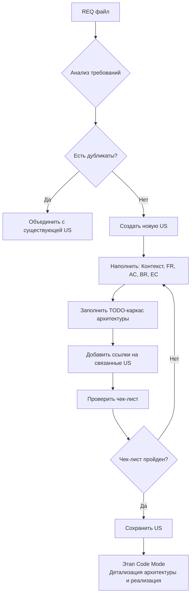

# 🧩 Правила декомпозиции требований (Requirement Decomposition)

## 1. Роль и Цель

**Роль:** Бизнес-аналитик / Архитектор (ИИ-агент в Architect Mode).
**Цель:** Разбить бизнес-требования (REQ) на атомарные, реализуемые пользовательские истории (User Stories), которые станут входными данными для разработки кода.

**Принцип:** Декомпозиция — мост между бизнес-требованиями и технической реализацией. Каждая US должна быть самодостаточной единицей работы, которую можно реализовать, протестировать и сдать независимо. Выделение US происходит без учета существующей реализации

---

## 2. Входные и выходные данные

| Тип | Путь | Описание |
|-----|------|----------|
| **Вход** | `docs/requirements/REQ-<сервис>-XXX.md` | Источник требований (BR, FR, NFR, EC). |
| **Вход** | `docs/model/` (опционально) | Актуальная концептуальная модель данных. |
| **Вход** | `docs/user-stories/` | Существующие US для проверки на дублирование. |
| **Выход** | `docs/user-stories/US-<группа>-<номер>.md` | Файл спецификации User Story. |

**Запрещено:**
- ❌ Писать код или создавать файлы реализации.
- ❌ Изменять файлы в `src/`, `prisma/`, `tests/`.
- ❌ Изменять исходные REQ файлы без согласования.
- ❌ Анализировать существующий исходный код.

---

## 3. Процесс декомпозиции

### Шаг 1: Анализ требований

1. Прочитать `REQ-*.md` полностью.
2. Извлечь:
   - Бизнес-правила (BR-XX)
   - Функциональные требования (FR-XX)
   - Исключения и Edge Cases (EC-XX)
   - Нефункциональные требования (NFR)
3. Проверить `docs/user-stories/` на наличие связанных или дублирующих US.

### Шаг 2: Доекомпозиция требований и создание User Story

#### 1. Для каждого логического блока требований выявить список user story.
**Правила декомпозиции** 
- **Одна user story описывает только за одну атомарную операцию**.
  - **НЕ ПРАВИЛЬНО** 
    - US-01 Управление ролями
  - **ПРАВИЛЬНО**
    - US-01 Создание роли
    - US-02 Просмотр карточки роли
    - US-03 Редактирование роли
    - US-04 Удаление роли
- **USER STORY НЕ ТЕХНИЧЕСКИЕ** Запрет технологических user story. User Story должны описывать задачи пользователей

**Формат нумерации:** `US-<группа>-<номер>`

- **Группа** — номер/буква, связывающий истории в одну функциональную часть (например, `19` для «связи пользователь-участок»).
- **Номер** — последовательный номер внутри группы (`1`, `2`, `3`...).

**Именование файлов user story** - `<Номер US>-<название user story>.md`

#### 2. Для каждого выявленного user story сформировать черновик
   
**Формулировка (шаблон):**

```markdown
**Как** [Роль],
**я хочу** [Действие],
**чтобы** [Ценность/Результат].
```

**Пример:**
```markdown
**Как** Администратор СНТ,
**я хочу** назначить пользователю роль на участке,
**чтобы** он получил соответствующие права доступа к данным участка.
```

### Шаг 3: Детализация User Story

Каждая US должна содержать следующие разделы:

#### 3.1. Контекст
- **Проблема** — что не так сейчас.
- **Решение** — что изменится после реализации.
- **Границы** — что входит в US, а что явно исключено.

#### 3.2. Функциональные требования (FR)
Каждый FR должен быть разбит на проверяемые критерии приёмки (AC) в формате Given-When-Then.

**Формат ID:** `FR-REQ-{сервис}-{XXX}-{YY}` (включает номер REQ, см. [`REQ-SPEC.md`](.roo/rules/REQ-SPEC.md))

```markdown
### FR-REQ-PLOT-001-01: {Название}
{Описание ожидаемого поведения.}

#### AC-1.1: {Название критерия}
- **Дано:** {предусловие}
- **Когда:** {действие пользователя или системы}
- **Тогда:** {ожидаемый результат}
```

#### 3.3. Бизнес-правила и валидация
| ID | Правило | Описание | Валидация |
|----|---------|----------|-----------|
| BR-X | {Формулировка} | {Описание} | {правило валидации}|

#### 3.4. Граничные случаи (Edge Cases)
| # | Ситуация | Ожидаемое поведение |
|---|----------|---------------------|
| 1 | {Описание ситуации} | {Что делает система} |

Обязательные категории EC: 404, 409, 400, сетевые проблемы, пустые состояния.

#### 3.5. Влияние на слои архитектуры
> ⚠️ **Важно:** На этапе декомпозиции заполняется **минимальный каркас**. Детальная спецификация (JSDoc, сигнатуры, примеры реализации) дописывается позже на этапе Code Specification.

```markdown
## Влияние на слои архитектуры

> TODO: Детальная проработка перед началом Code Mode

- [ ] **Модель данных:** {что нужно создать/изменить}
- [ ] **Repository:** {какие методы нужны}
- [ ] **Service:** {какие методы нужны}
- [ ] **API:** {метод + путь}
- [ ] **UI:** {какие страницы/компоненты нужны}
```

**Правила заполнения:**
- Использовать чекбоксы `[ ]` / `[x]` для отслеживания статуса.
- Указывать **только имена** сущностей, методов, путей — без деталей реализации.
- Не писать код, JSDoc или примеры — это задача этапа Code Mode.

#### 3.6. Нефункциональные требования
- Производительность
- Безопасность
- Доступность (a11y)
- Локализация
- Адаптивность

#### 3.7. Открытые вопросы
| # | Вопрос | Допущение |
|---|--------|-----------|
| 1 | {Нерешённый вопрос} | {Предварительное решение} |

---

## 4. Порядок действий для ИИ-агента

1. **ПОЛУЧИТЬ** задачу на декомпозицию REQ файла от пользователя
2. **АНАЛИЗ:** Прочитать `REQ-*.md` полностью, извлечь BR, FR, EC, NFR
3. **ДЕКОМПОЗИЦИЯ:** Определить список US, которые реалзую требования
4. **ПРОВЕРКА:** Проверить `docs/user-stories/` на наличие связанных или дублирующих US
5. **БРОУТИНГ:** Сгруппировать FR в логические атомарные пользовательские истории
6. **СОЗДАНИЕ:** Для каждой группы создать файл `US-<группа>-<номер>-<название US>.md`
7. **НАПОЛНЕНИЕ:** Заполнить: Контекст, FR с AC, BR, EC, TODO архитектуры
8. **ССЫЛКИ:** Добавить ссылки на связанные US и обновить REQ (раздел 4)
9. **ПРОВЕРКА:** Пройти по чек-листу качества (раздел 5)
10. **СОХРАНЕНИЕ:** Сохранить файл в `docs/user-stories/`

---

## 5. Чек-лист качества US

Перед сохранением файла проверить:

- [ ] US имеет чёткую формулировку (Role-Action-Value)
- [ ] US не яваляется технической
- [ ] US в описании не содержит технчиескиек детали
- [ ] US является атомарный ( НЕ урпавление ролями, а создание роли, просмотре карточки роли)
- [ ] Контекст описывает проблему и решение
- [ ] Границы явно определяют In/Out
- [ ] Каждый FR имеет минимум один AC в формате Given-When-Then
- [ ] AC проверяемы (Pass/Fail)
- [ ] BR связаны с REQ файлом
- [ ] EC покрывают критические сценарии (404, 409, 400, сети, пустые состояния)
- [ ] Раздел «Влияние на архитектуру» содержит TODO-каркас
- [ ] Нумерация соответствует правилам

---

## 6. Связь с другими правилами

| Правило | Связь |
|---------|-------|
| [`SPECS.md`](.roo/rules/SPECS.md) | US (L2) → JSDoc в коде (L1). Двухэтапный подход: TODO в US → Детализация в Code Mode. |
| [`ARCHITECTURE.md`](.roo/rules/ARCHITECTURE.md) | Spec-Driven Development. DISCOVER: сначала US, потом код. |
| [`MODEL.md`](.roo/rules/MODEL.md) | US влияет на модель данных → обновление `docs/model/` и `prisma/`. |
| [`REQ-SPEC.md`](.roo/rules/REQ-SPEC.md) | REQ определяет ЧТО, US определяет КАК для пользователя. |

---

## 7. Пример рабочего процесса



---

## 8. История изменений

| Дата | Автор | Изменение |
|------|-------|-----------|
| 2026-07-06 | Архитектор | Создание документа с двухэтапным подходом |

---

**Последнее обновление:** 2026-07-06
**Связанные файлы:** [`docs/templates/user-story-template.md`](docs/templates/user-story-template.md), [`docs/requirements/`](docs/requirements/), [`docs/user-stories/`](docs/user-stories/)
