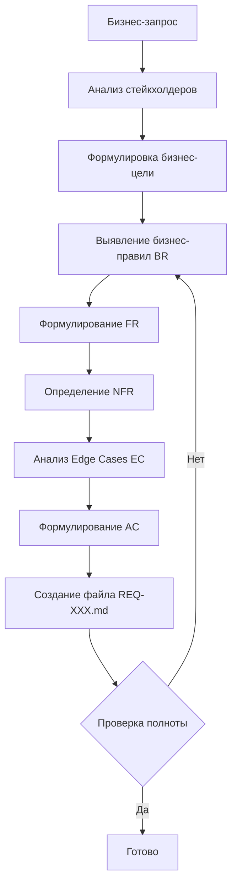

# 📋 Правила формулирования требований (Requirement Specification)

## 1. Назначение

Эти правила определяют формат и структуру документов требований (`REQ-*`) для ИИ-агентов при формулировании требований на основе бизнес-запросов.

> **Цель:** Обеспечить единообразие, полноту и машиночитаемость спецификаций требований для последующей трансформации в User Stories и Code-Spec.

---

## 2. Область применения

### ✅ Входит в сферу

Документ требований (`REQ-<сервис>-XXX.md`) должен содержать следующие разделы:

| Раздел | Описание | Обязательность |
|--------|----------|---------------|
| **Бизнес-контекст и Цель** | Описание бизнес-проблемы и ценности | Обязательно |
| **Бизнес-правила (BR)** | Жесткие ограничения системы | Обязательно |
| **Функциональные требования (FR)** | Что система должна делать | Обязательно |
| **Нефункциональные требования (NFR)** | Безопасность, производительность, доступность | Обязательно |
| **Исключения и Edge Cases (EC)** | Обработка ошибок и граничных ситуаций | Обязательно |
| **Критерии приёмки** | Проверяемые условия завершения | Обязательно |

### ❌ Не входит в сферу этого этапа

Документ требований **НЕ содержит** (добавляется на других этапах):

- Пользовательские истории (User Stories) — создаются отдельно в `docs/user-stories/` на этапе декомпозиции
- Детали реализации (архитектура, код, сигнатуры методов)
- Тест-кейсы — создаются отдельно в `docs/tests/`
- Анализ существующего кода

> **Правило:** Пользовательские истории формируются на этапе декомпозиции требований из FR и BR. В документе требований — только ссылки на US (после их создания).
> **Правило:** Требования формулируются бнез учета текущей реализации. 

---

## 3. Структура документа требований

```markdown
# REQ-<сервис>-XXX: [Название требования]

## 1. Бизнес-контекст и Цель
## 2. Бизнес-правила и Логика (Business Rules)
## 3. Функциональные требования
## 4. Пользовательские истории (ссылки)
## 5. Нефункциональные требования (NFR) и Ограничения
## 6. Исключения и Граничные кейсы (Edge Cases)
## 7. Критерии приёмки
```

### 3.1 Именование файлов

| Паттерн | Пример | Описание |
|---------|--------|----------|
| `REQ-{сервис}-{XXX}.md` | `REQ-PLOT-001.md` | Сервис + порядковый номер |

**Правила:**
- `сервис` — имя домена в нижнем регистре (например, `plot`, `auth`, `profile`, `plotuser`)
- `XXX` — трёхзначный порядковый номер (001, 002, ...)
- Название требования — краткое описание

### 3.2 Раздел 1: Бизнес-контекст и Цель

```markdown
## 1. Бизнес-контекст и Цель

*Описание бизнес-проблемы и ценности.*

* **Бизнес-цель:** [Измеримая цель]
* **Стейкхолдеры / Пользователи:** [Роли]
```

**Правила:**
- Бизнес-цель должна быть измеримой (SMART-принцип)
- Указать всех стейкхолдеров
- Максимум 3-5 предложений

### 3.3 Раздел 2: Бизнес-правила (Business Rules)

```markdown
## 2. Бизнес-правила и Логика (Business Rules)

* **BR-01:** [Правило]
* **BR-02:** [Правило]
```

**Формат ID:** `BR-XX` (два знака, уникальные в пределах документа)

**Правила формулировки:**

| # | Правило | Пример ✅ | Пример ❌ |
|---|---------|-----------|-----------|
| 1 | Использовать "должен/не может/запрещено" | `BR-01: Номер участка не может быть изменён` | `BR-01: Номер изменяется` |
| 2 | Одно правило — одна мысль | `BR-02: Уникальный кадастровый номер` | `BR-02: Уникальны номер и кадастр` |
| 3 | Без технических деталей | `BR-03: Роль — одна из: владелец, проживающий` | `BR-03: Роль в ENUM` |
| 4 | Бизнес-значимость, не реализация | `BR-04: Удаление участка необратимо` | `BR-04: DELETE запрос в БД` |

**Шаблоны формулировок:**
```
[Объект] + [должен/не может/запрещено] + [условие]

Примеры:
- Номер участка не может быть изменён после создания
- Кадастровый номер должен быть уникальным, если указан
- Дата истечения должна быть в будущем, если указана
```

### 3.4 Раздел 3: Функциональные требования

```markdown
## 3. Функциональные требования

* **FR-REQ-PLOT-001-01:** Система должна...
* **FR-REQ-PLOT-001-02:** Система должна позволять...
```

**Формат ID:** `FR-{REQ-SERVICE}-{XXX}-{YY}` (включает номер требования)

**Примеры:**
| REQ файл | FR ID | Описание |
|----------|-------|----------|
| `REQ-PLOT-001.md` | `FR-REQ-PLOT-001-01` | Первое FR требования |
| `REQ-PLOT-001.md` | `FR-REQ-PLOT-001-02` | Второе FR требования |
| `REQ-AUTH-001.md` | `FR-REQ-AUTH-001-01` | Первое FR требования |

**Структура ID:**
```
FR-REQ-{сервис}-{XXX}-{YY}
│  │   │       │       │
│  │   │       │       └─ Порядковый номер FR (01, 02, ...)
│  │   │       └──────── Порядковый номер REQ (001, 002, ...)
│  │   └──────────────── Имя домена (plot, auth, profile, ...)
│  └──────────────────── Статический префикс REQ
└─────────────────────── Статический префикс FR
```

**Правила формулировки:**

| # | Правило | Пример ✅ | Пример ❌ |
|---|---------|-----------|-----------|
| 1 | Начинать с "Система должна..." | `FR-REQ-PLOT-001-01: Система должна отображать список` | `FR-01: Показать таблицу` |
| 2 | Фокус на WHAT, не HOW | `FR-REQ-PLOT-001-02: Система должна поддерживать создание` | `FR-02: Создать форму с кнопкой` |
| 3 | Одно действие на FR | `FR-REQ-PLOT-001-03: Система должна поддерживать поиск` | `FR-03: Поиск и фильтрация и экспорт` |
| 4 | Без UI-деталей | `FR-REQ-PLOT-001-04: Система должна позволять удалять` | `FR-04: Кнопка удаления в строке` |

**Шаблоны формулировок:**
```
Система должна + [действие] + [объект] + [условие]

Примеры:
- FR-REQ-PLOT-001-01: Система должна отображать список всех участков в таблице
- FR-REQ-PLOT-001-02: Система должна поддерживать создание нового участка с валидацией
- FR-REQ-PLOT-001-03: Система должна позволять пользователю искать участки по номеру
```

### 3.5 Раздел 4: Пользовательские истории (ссылки)

```markdown
## 4. Пользовательские истории

* Ссылки на User Stories:
  * `docs/user-stories/US-XXX.md` — описание
```

**Правила:**
- ТОЛЬКО ссылки, НЕ содержание
- Каждая US покрывает одну или группу FR
- Формат: абсолютный путь от корня репозитория

> **Примечание:** Этот раздел заполняется после создания User Stories на этапе декомпозиции.

### 3.6 Раздел 5: Нефункциональные требования (NFR)

```markdown
## 5. Нефункциональные требования (NFR) и Ограничения

* **Безопасность:**
  * [Требование]
* **Производительность:**
  * [Требование]
* **Доступность:**
  * [Требование]
```

**Подкатегории:**

| Подкатегория | Что описывать | Пример |
|-------------|---------------|--------|
| **Безопасность** | Авторизация, валидация, защита данных | "Все операции требуют авторизации" |
| **Производительность** | Время отклика, пропускная способность | "< 500ms при до 1000 записей" |
| **Доступность** | ARIA, семантика, клавиатура | "ARIA-метки для фильтров" |
| **Локализация** | Язык интерфейса | "Все сообщения на русском языке" |
| **Адаптивность** | Поддержка устройств | "Корректно на мобильных" |

**Обязательные подкатегории:** безопасность, производительность, доступность

### 3.7 Раздел 6: Исключения и Edge Cases

```markdown
## 6. Исключения и Граничные кейсы (Edge Cases)

* **EC-01:** [Ситуация] — система должна [поведение]
```

**Формат ID:** `EC-XX` (два знака, уникальные в пределах документа)

**Правила формулировки:**

| # | Правило | Пример ✅ | Пример ❌ |
|---|---------|-----------|-----------|
| 1 | Формат: "Если [ситуация], система должна [поведение]" | `EC-01: Участок не найден — система сообщает` | `EC-01: Ошибка 404` |
| 2 | Конкретное поведение системы | `EC-02: Медленная сеть — показать индикатор` | `EC-02: Обработать ошибку сети` |
| 3 | Включить сетевые ошибки | Таймаут, потеря соединения | Только бизнес-ошибки |

**Категории EC:**

| Категория | Что покрывать | Пример |
|-----------|---------------|--------|
| **Данные** | Не найдено, дубликат, пусто | Участок не существует |
| **Сеть** | Таймаут, оффлайн, медленная | >3 секунды без ответа |
| **Бизнес** | Просрочено, неполные данные | Карта истекла |
| **Параллелизм** | Одновременное обновление | Два пользователя одновременно |
| **UI** | Без ID, компонент не загружен | Нет идентификатора участка |

**Шаблоны формулировок:**
```
EC-XX: [Ситуация] — система должна [конкретное поведение]

Примеры:
- EC-01: Участок не существует — система сообщает, что участок не найден
- EC-02: Медленная сеть (более 3 секунд) — показать индикатор загрузки
- EC-03: Попытка создать дублирующую связь — система сообщает о дублировании
```

### 3.8 Раздел 7: Критерии приёмки

```markdown
## 7. Критерии приёмки

1. [Проверяемое условие]
2. [Проверяемое условие]
```

**Правила:**
- Нумерация: `1, 2, 3...` (без префиксов)
- Проверяемость: ответ "да/нет"
- Покрывать все ключевые FR и BR
- Формулировать от лица пользователя: "Пользователь может X"

---

## 4. Сводная таблица форматирования

| Тип | ID формат | Включает REQ ID | Пример |
|-----|-----------|-----------------|--------|
| BR | `BR-XX` | Нет | `BR-01` |
| FR | `FR-REQ-{сервис}-{XXX}-{YY}` | Да | `FR-REQ-PLOT-001-01` |
| EC | `EC-XX` | Нет | `EC-01` |

---

## 5. Workflow формулирования требований



### Шаги для ИИ-агента

1. **ПОЛУЧИТЬ** бизнес-запрос от пользователя
2. **АНАЛИЗ:** Определить стейкхолдеров и бизнес-цель
3. **BR:** Выявить все бизнес-правила
4. **FR:** Сформулировать функциональные требования с ID `FR-REQ-{сервис}-{XXX}-{YY}`
5. **NFR:** Определить нефункциональные требования
6. **EC:** Проанализировать ошибки и граничные ситуации
7. **AC:** Сформулировать проверяемые критерии приёмки
8. **СОЗДАТЬ** файл `REQ-XXX.md`
9. **ПРОВЕРИТЬ** полноту по чек-листу (раздел 6)

---

## 6. Чек-лист полноты требований

| Проверка | Статус |
|----------|--------|
| Бизнес-цель измерима и конкретна | [ ] |
| Все стейкхолдеры указаны | [ ] |
| BR-правила неделимы и однозначны | [ ] |
| FR-требования имеют ID с номером REQ (FR-REQ-XXX-YY) | [ ] |
| FR не содержат UI-деталей | [ ] |
| NFR покрывают все подкатегории | [ ] |
| EC покрывают все FR с потенциальными ошибками | [ ] |
| AC проверяемы (да/нет) | [ ] |
| AC покрывают все ключевые BR и FR | [ ] |
| Форматирование соответствует шаблону | [ ] |

---

## 7. Примеры существующих требований

См. в `docs/requirements/`:

- [`REQ-PLOT-001.md`](../../docs/requirements/REQ-PLOT-001.md) — Управление участками
- [`REQ-PLOTUSER-001.md`](../../docs/requirements/REQ-PLOTUSER-001.md) — Связи пользователей с участками
- [`REQ-AUTH-001.md`](../../docs/requirements/REQ-AUTH-001.md) — Аутентификация
- [`REQ-PROFILE-001.md`](../../docs/requirements/REQ-PROFILE-001.md) — Профиль пользователя

---

## 8. Связь с другими спецификациями

### REQ → User Story

```
REQ-PLOT-001 (FR-REQ-PLOT-001-01) → US-13 (Список участков)
REQ-PLOT-001 (FR-REQ-PLOT-001-02) → US-14 (Регистрация участка)
```

> **Правило:** Одна User Story покрывает одну или группу связанных FR.

### User Story → Code-Spec

```
US-13 (FR-REQ-PLOT-001-01) → JSDoc в MemberList.tsx
US-13 (FR-REQ-PLOT-001-05) → JSDoc в MemberService.ts
```

> **Правило:** Code-Spec (JSDoc) живёт в коде и ссылается на User Story.

### Иерархия спецификаций


---

## 9. Лучшие практики для ИИ-агентов

### ✅ Делать

1. **Начинать с бизнес-цели** — всё должно быть связано с ценностью
2. **Использовать существующие REQ как референс** — проверить `docs/requirements/`
3. **Формулировать BR максимально точно** — основа для валидации в Zod
4. **Покрывать все FR через EC** — каждый FR должен иметь edge case
5. **Делать AC проверяемыми** — "да/нет", а не "хорошо работает"
6. **Использовать уникальный FR ID с номером REQ** — `FR-REQ-PLOT-001-01`

### ❌ Не делать

1. **Не дублировать информацию** — REQ определяет ЧТО, US — КАК для пользователя, Code-Spec — КАК для кода
2. **Не добавлять детали реализации** — без "использовать React", "создать API endpoint"
3. **Не игнорировать NFR** — безопасность и производительность — обязательные разделы
4. **Не создавать слишком общие FR** — "быстрая система" → "Время отклика < 500ms"
5. **Не пропускать EC для сетевых ошибок** — всегда включать таймауты

---

## 10. Шаблон для копирования

При создании нового требования использовать шаблон:

```
docs/templates/requirement-template.md
```

---

## 11. Строгие запреты

- ❌ **Запрещено** создавать требования без бизнес-контекста
- ❌ **Запрещено** включать User Stories в тело REQ (только ссылки после декомпозиции)
- ❌ **Запрещено** использовать неопределённые метрики ("быстро", "удобно")
- ❌ **Запрещено** создавать рассинхронизацию между REQ и User Stories
- ❌ **Запрещено** изменять существующие REQ без обновления истории изменений

---

## 12. История изменений

| Дата | Автор | Изменение |
|------|-------|-----------|
| 2026-07-05 | ИИ-архитектор | Создание документа |

---

**Последнее обновление:** 2026-07-05  
**Связанные файлы:** [`docs/templates/requirement-template.md`](../../docs/templates/requirement-template.md), [`docs/requirements/`](../../docs/requirements/)
