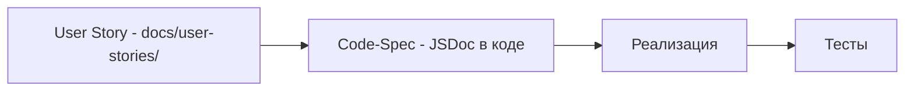
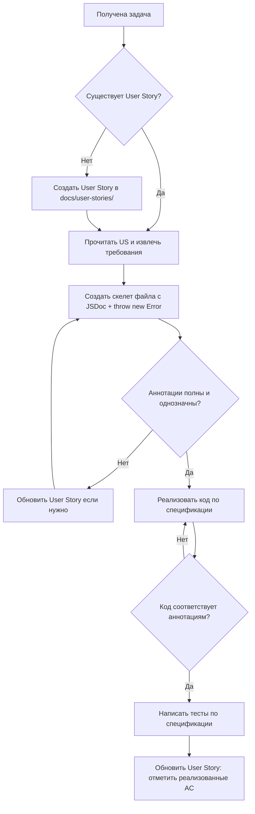
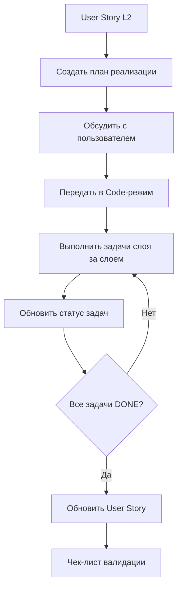

# 📐 ПРАВИЛА УПРАВЛЕНИЯ СПЕЦИФИКАЦИЯМИ

## 1. Философия: Spec-in-Code

> **Принцип:** Спецификация компонента живёт в самом компоненте через JSDoc/TSDoc аннотации. Отдельные markdown-документы создаются только для объектов, которые нельзя выразить в коде.

### Два уровня спецификаций

| Уровень | Носитель | Что описывает | Когда используется |
|---------|----------|---------------|-------------------|
| **L1: Code-Spec** | JSDoc/TSDoc в исходном коде | Контракты: типы, параметры, возвращаемые значения, выбрасываемые ошибки, инварианты | Обязательно для всех публичных API проекта |
| **L2: User Story** | Markdown в `docs/user-stories/` | Пользовательские истории, бизнес-потоки, acceptance criteria, edge cases, кросс-доменные зависимости | Создаётся ДО начала разработки как входной артефакт |

> **Правило:** Если спецификацию можно выразить в JSDoc — она ДОЛЖНА быть в JSDoc. User Story в `docs/user-stories/` — это предусловие для начала работы, а не артефакт, создаваемый в процессе.

### Порядок создания артефактов



> User Story создаётся ДО спецификации и реализации. В процессе разработки спецификации User Story может быть только ОБНОВЛЕНА — не создана заново.

### Зоны ответственности — что где описывается

| Артефакт | Где описан | Пример |
|----------|-----------|--------|
| Типы, интерфейсы, поля | L1 JSDoc | `@property {string} firstName - Имя члена СНТ` |
| Сигнатуры методов, возвращаемые значения | L1 JSDoc | `@returns Member[]`, `@throws MemberNotFoundError` |
| Инварианты отдельного компонента | L1 JSDoc `@spec` | `@spec - При isLoading=true: кнопка блокируется` |
| Бизнес-поток фичи | L2 User Story | AC-1: Given/When/Then |
| Валидация на уровне фичи | L2 User Story | BR-1: email уникален → Zod |
| Edge cases на уровне фичи | L2 User Story | Таблица граничных случаев |
| Обработка ошибок на уровне фичи | L2 User Story | Таблица HTTP-коды + доменные ошибки |
| Кросс-доменные зависимости | L2 User Story | Секция влияния на слои архитектуры |
| Модель данных | Отдельно: `docs/model/` | DBML + entity.md — см. MODEL.md |

---

## 2. Рабочий процесс: Spec-First Development



### Порядок действий для ИИ-агента

1. **DISCOVER:** Проверить наличие User Story в `docs/user-stories/`. Если нет — создать.
2. **PLAN:** Создать план реализации в `docs/plans/us-<номер>-<название>-plan.md` по шаблону [`docs/templates/us-realization-plan.md`](../docs/templates/us-realization-plan.md) — декомпозиция US на задачи по слоям архитектуры.
3. **DISCUSS:** Обсудить план с пользователем.
4. **SKELETON:** Создать файлы-скелеты с JSDoc-аннотациями + `throw new Error('Not implemented')` в телах методов — БЕЗ реализации.
5. **UPDATE PLAN:** Обновить статус задач в плане реализации ([TODO] → [IN PROGRESS] → [DONE]).
6. **UPDATE US:** Обновить User Story — заполнить/обновить раздел Влияние на слои архитектуры.
7. **REVIEW:** Убедиться, что аннотации полностью описывают контракт компонента и соответствуют User Story.

---

## 2.1. План реализации User Story

> **Назначение:** План реализации — это документ, который декомпозирует User Story (L2) на технические задачи по слоям архитектуры. Он создаётся на этапе PLAN и передаётся в Code-режим для выполнения.

### Структура плана реализации

План создаётся по шаблону [`docs/templates/us-realization-plan.md`](../docs/templates/us-realization-plan.md) и включает:

| Раздел | Описание |
|--------|----------|
| **Метаданные** | US-ID, название, версия, дата, статус |
| **Ссылки** | На User Story, REQ, модель данных |
| **Дерево файлов** | Какие файлы создаются/изменяются |
| **Задачи по слоям** | Декомпозиция по слоям: Модель данных → Types → Validators → Errors → Repository → Service → DI → API → UI → Pages |
| **Матрица AC → Задачи** | Сопоставление acceptance criteria с задачами |
| **Чек-лист валидации** | Перед передачей в Code-режим |
| **История изменений** | Отслеживание версий плана |

### Формат задачи в плане

Каждая задача содержит:

| Параметр | Описание |
|----------|----------|
| **ID задачи** | Уникальный идентификатор: `US-{id}-T{слой}-{номер}` |
| **Статус** | `[TODO]` → `[IN PROGRESS]` → `[DONE]` |
| **Целевое состояние** | Что должно быть в результате (конкретное описание) |
| **Чек-лист** | Пошаговый список действий для достижения целевого состояния |

### Порядок обновления плана

1. **ARCHITECT** создаёт план по шаблону на основе User Story
2. **ARCHITECT** обсуждает план с пользователем
3. При передаче в **CODE** режим:
   - ИИ-агент выполняет задачи последовательно
   - Обновляет статус задач: `[TODO]` → `[IN PROGRESS]` → `[DONE]`
   - Отмечает выполненные пункты чек-листа
4. После выполнения: план отражает фактическое состояние реализации



---

## 3. Однонаправленность изменений (Unidirectional Change Flow)

> **Принцип:** Изменения в спецификациях должны быть однонаправленными: от требований (L2) к реализации (L1).

### Порядок изменений

```mermaid
flowchart TD
    A[Изменение требований] --> B[Обновить User Story<br/>(L2)]
    B --> C[Обновить JSDoc<br/>(L1)]
    C --> D[Изменить реализацию<br/>(Код)]
    D --> E[Написать/обновить тесты]
```

**Правила:**
- ✅ **Верно:** Изменения начинаются с L2 (User Story), затем L1 (JSDoc), затем код
- ❌ **Неверно:** Изменения в коде без обновления User Story
- ❌ **Неверно:** Обновление User Story без обновления JSDoc

**Пример правильного workflow:**
1. Пользователь меняет требование (например, "сделать поля опциональными")
2. Обнови `docs/user-stories/US-6.md` — изменить BR-1, BR-2 на опциональные
3. Обновите JSDoc в `userProfile.validators.ts` — отметьте поля как optional
4. Реализуйте изменения в коде
5. Обновите тесты

**Запрещено:**
- Изменять код до обновления спецификаций
- Оставлять рассинхронизацию между L1 и L2 в production-PR
- Изменять требования в процессе разработки без обновления US

---

## 4. Обязательный скелет-режим

При создании нового файла ИИ-агент обязан сначала создать скелет:

```typescript
/**
 * @service PlotService
 * @domain plots
 * @description Бизнес-логика управления участками СНТ
 *
 * @spec
 * - Валидация: через Zod-схемы из plot.validators.ts
 * - Ошибки: PlotNotFoundError, PlotInvalidDataError
 * - Зависимости: IPlotRepository через DI
 */
export class PlotService {
  /**
   * Найти участок по идентификатору
   *
   * @param id - Уникальный идентификатор участка
   * @returns Полный объект Plot
   * @throws {PlotNotFoundError} если участок не найден
   */
  async findById(id: string): Promise<Plot> {
    throw new Error('Not implemented');
  }
}
```

**Правила скелета:**
- Все публичные методы содержат `throw new Error('Not implemented')`
- Все JSDoc-аннотации заполнены полностью
- Типы импортированы, интерфейсы определены
- Скелет компилируется без ошибок TypeScript

---

## 5. Стандарты JSDoc-аннотаций по слоям

### 5.1. UI-компоненты — `src/components/`

```typescript
/**
 * @component Button
 * @category ui
 * @description Универсальная кнопка с вариантами оформления и состоянием загрузки
 *
 * @example
 * ```tsx
 * <Button variant="primary" size="md">Сохранить</Button>
 * <Button variant="danger" isLoading>Удаление...</Button>
 * ```
 *
 * @spec
 * - Состояния: default, hover, focus, disabled, loading
 * - Варианты: primary — основное действие, secondary — альтернатива, danger — деструктивное, ghost — контекстное
 * - Размеры: sm — компактный, md — стандартный, lg — акцентный
 * - Доступность: focus-ring обязателен, disabled через native attribute
 * - При isLoading=true: кнопка блокируется, показывается спиннер слева от текста
 */
export interface ButtonProps extends ButtonHTMLAttributes<HTMLButtonElement> {
  /** Вариант оформления кнопки @default 'primary' */
  variant?: 'primary' | 'secondary' | 'danger' | 'ghost';
  /** Размер кнопки @default 'md' */
  size?: 'sm' | 'md' | 'lg';
  /** Показывать ли индикатор загрузки. При true кнопка блокируется @default false */
  isLoading?: boolean;
}
```

> **Тег `@spec`** опускается для тривиальных компонентов без логики и состояний — например, чисто декоративных обёрток.

### 5.9. UI-компоненты с обработчиками событий

```typescript
/**
 * @component ParticipantRow
 * @category features/plotUser
 * @description Ряд таблицы участника участка
 *
 * @prop participant - Объект участника
 * @prop isAdmin - Флаг администратора для отображения кнопок управления
 * @prop onEdit - Callback для редактирования участника
 * @prop onDelete - Callback для удаления участника
 * @prop ref - Forward ref для child refetch-методов
 *
 * @spec
 * - Кнопки редактирования/удаления отображаются только при isAdmin === true
 * - onDelete вызывает callback, мутация выполняется в родительском компоненте
 * - Не вызывает window.confirm, делегирует подтверждение родительскому компоненту
 * - При удалении должен быть вызван parent callback для обновления состояния
 */
export interface ParticipantRowProps {
  participant: PlotUserRoleParticipant;
  isAdmin: boolean;
  onEdit?: (participant: PlotUserRoleParticipant) => void;
  onDelete?: (participant: PlotUserRoleParticipant) => void;
}
```

**Чек-лист:**
- [ ] Используется `useCallback` для всех обработчиков событий
- [ ] Callbacks передаются в child-компоненты, а не выполняются напрямую
- [ ] Мутация выполняется в родительском компоненте, child-компонент только вызывает callback
- [ ] Forward ref используется только для методов рефетча, а не для мутаций

### 5.2. Доменные типы — `src/domains/<domain>/<domain>.types.ts`

```typescript
/**
 * @type Member
 * @domain members
 * @description Член СНТ — основной субъект домена
 *
 * @spec
 * - Бизнес-ключ: нет натурального ключа, идентификация через id
 * - Жизненный цикл: создается активным, может быть деактивирован
 * - Инварианты: firstName и lastName обязательны и непусты
 *
 * @see docs/model/entities/member.md — концептуальная модель
 */
export interface Member {
  /** Уникальный идентификатор. Генерируется автоматически cuid */
  id: string;
  /** Ссылка на пользователя системы */
  userId: string;
  /** Имя — обязательно, непустое */
  firstName: string;
  /** Фамилия — обязательно, непустая */
  lastName: string;
  // ...каждое поле с описанием
}
```

### 5.3. Сервисы — `src/domains/<domain>/<domain>.service.ts`

```typescript
/**
 * @service MemberService
 * @domain members
 * @description Бизнес-логика управления членами СНТ
 *
 * @spec
 * - Валидация: через Zod-схемы из member.validators.ts
 * - Ошибки: MemberNotFoundError, MemberInvalidDataError, MemberDuplicateError
 * - Зависимости: IMemberRepository через DI
 */
export class MemberService {

  /**
   * Найти члена по идентификатору
   *
   * @param id - Уникальный идентификатор члена
   * @returns Полный объект Member
   * @throws {MemberNotFoundError} если член с данным id не найден
   *
   * @spec
   * - Возвращает полный объект Member без фильтрации полей
   * - Не кэширует результат
   */
  async findById(id: string): Promise<Member> { ... }
}
```

### 5.4. Репозитории — `src/domains/<domain>/<domain>.repository.interface.ts`

```typescript
/**
 * @interface IMemberRepository
 * @domain members
 * @description Контракт доступа к данным членов СНТ
 *
 * @spec
 * - Все методы асинхронные
 * - findById возвращает null если не найден — НЕ бросает ошибку
 * - create/update могут выбросить ошибку уникальности на уровне БД
 */
export interface IMemberRepository {
  /** Найти по ID. Возвращает null если не найден */
  findById(id: string): Promise<Member | null>;
  // ...
}
```

### 5.5. API Route Handlers — `src/app/api/v1/<resource>/route.ts`

```typescript
/**
 * @route GET /api/v1/members
 * @auth required
 * @description Возвращает список всех членов СНТ
 *
 * @response 200 { success: true, data: Member[] }
 * @response 500 { success: false, error: { code: string, message: string } }
 *
 * @spec
 * - Без пагинации в текущей реализации
 * - Возвращает всех членов включая неактивных
 */
export async function GET() { ... }

/**
 * @route POST /api/v1/members
 * @auth required
 * @description Создаёт нового члена СНТ
 *
 * @body CreateMemberData
 * @response 201 { success: true, data: Member }
 * @response 400 { success: false, error: { code: string, message: string } }
 * @response 409 { success: false, error: { code: string, message: string } }
 *
 * @spec
 * - Валидация тела запроса через Zod в сервисе
 * - При дублировании email возвращает 409
 */
export async function POST(request: NextRequest) { ... }
```

### 5.6. Страницы — `src/app/.../page.tsx`

```typescript
/**
 * @page /dashboard/members
 * @auth required
 * @role MEMBER, ADMIN
 * @description Страница списка членов СНТ
 *
 * @spec
 * - SSR: данные загружаются на сервере через API
 * - Пустое состояние: показывается EmptyState если список пуст
 * - Загрузка: через Suspense + loading.tsx
 * - Ошибки: через error.tsx
 *
 * @data-flow
 * - Server Component → fetch /api/v1/members → MemberList
 */
```

### 5.7. Хуки — `src/hooks/`

```typescript
/**
 * @hook useMemberList
 * @description Хук для загрузки и управления списком членов СНТ
 *
 * @spec
 * - Загружает данные при монтировании через apiClient
 * - Управляет состояниями: loading, error, data
 * - При ошибке повторяет запрос не более 3 раз
 *
 * @returns {Object} - Объект с полями data, isLoading, error, refetch
 */
```

### 5.8. Утилиты — `src/lib/`, `src/shared/utils/`

```typescript
/**
 * @function cn
 * @description Утилита для условного объединения CSS-классов. Обёртка над clsx + tailwind-merge
 *
 * @param {...ClassValue} inputs - Классы, условия, массивы классов
 * @returns {string} Объединённая строка классов
 *
 * @spec
 * - Разрешает конфликты Tailwind-классов через tailwind-merge
 * - Обрабатывает falsy-значения: null, undefined, false — игнорируются
 */
```

---

## 6. Custom JSDoc Tags — Реестр

| Тег | Слой | Назначение | Обязательность |
|-----|------|-----------|---------------|
| `@component` | UI | Имя компонента | Обязательно для компонентов |
| `@service` | Domain | Имя сервиса | Обязательно для сервисов |
| `@interface` | Domain | Имя интерфейса | Обязательно для интерфейсов |
| `@hook` | Hooks | Имя хука | Обязательно для хуков |
| `@function` | Utils | Имя функции | Обязательно для утилит |
| `@type` | Domain | Имя типа | Обязательно для доменных типов |
| `@route` | API | HTTP-метод + путь | Обязательно для route handlers |
| `@page` | Pages | URL маршрута | Обязательно для страниц |
| `@domain` | Domain | Принадлежность к домену | Обязательно для всех файлов домена |
| `@category` | UI | ui или features | Обязательно для компонентов |
| `@description` | Все | Краткое описание | Обязательно |
| `@spec` | Все | Спецификация поведения — маркированный список | Обязательно для нетривиальной логики; опускается для тривиальных компонентов |
| `@auth` | API, Pages | Требуется ли авторизация: required или none | Обязательно |
| `@role` | Pages | Допустимые роли | Условно — если есть авторизация |
| `@param` | Все | Параметр метода/функции | Обязательно для всех публичных методов |
| `@returns` | Все | Возвращаемое значение | Обязательно для всех публичных методов |
| `@throws` | Service, Repository | Выбрасываемые ошибки | Обязательно если метод может выбросить ошибку |
| `@response` | API | HTTP-ответ: статус + формат | Обязательно для route handlers |
| `@body` | API | Формат тела запроса | Обязательно для POST/PUT/PATCH |
| `@example` | UI | Пример использования | Рекомендовано для компонентов |
| `@see` | Все | Ссылка на связанный документ | Рекомендовано при наличии связей |
| `@data-flow` | Pages | Цепочка загрузки данных | Обязательно для страниц |
| `@default` | UI, Types | Значение по умолчанию | Рекомендовано для опциональных полей |

---

## 7. L2 User Story — связь с L1 Code-Spec

### User Story как входной артефакт

User Story — это **предусловие** для начала разработки. Она создаётся ДО спецификации и реализации, а не в процессе.

**Порядок:**
1. Создаётся User Story в `docs/user-stories/`
2. На основе User Story разрабатываются L1 Code-Spec (JSDoc в скелетах)
3. В процессе разработки спецификации User Story может только **обновляться** — не создаваться заново

### Когда нужна User Story

User Story создаётся если выполняется хотя бы одно условие:

1. Фича затрагивает **2 и более доменов**
2. Фича включает сложный **бизнес-поток** со многими шагами и альтернативными ветками
3. Фича требует **acceptance criteria** в формате Given/When/Then
4. Фича затрагивает **внешние интеграции** — email, OAuth, платёжные системы

> Для изолированного компонента одного домена User Story не требуется — достаточно L1 Code-Spec.

### Как User Story ссылается на Code-Spec

User Story НЕ дублирует информацию из JSDoc. Вместо этого она ссылается на L1:

**В секции «Влияние на слои архитектуры»:**

```markdown
### Service
- [ ] Новые методы: см. @service PaymentService в src/domains/payments/payment.service.ts
- [x] Без изменений
```

**В секции «Бизнес-правила и валидация»:**

```markdown
| BR-1 | Email уникален | Zod + DB Constraint — см. @type CreateMemberData в member.types.ts |
```

### Чего НЕ должно быть в User Story

- ❌ Повторения типов, параметров, сигнатур — это в L1 JSDoc
- ❌ Описания модели данных — это в `docs/model/` (см. MODEL.md)
- ❌ Деталей реализации — это в коде

---

## 8. Связь с другими правилами

### С MODEL.md

- Модель данных — отдельный контур, управляемый через `docs/model/`
- JSDoc в доменных типах содержит **@see docs/model/entities/\<entity\>.md** для связи
- При изменении модели — сначала обновить `docs/model/`, потом обновить JSDoc в типах

### С architecture.md

- Правило SPEC-DRIVEN DEVELOPMENT уточняется:
  - L1 Code-Spec в JSDoc = спецификация компонента
  - L2 User Story в `docs/user-stories/` = спецификация фичи
- Пункт DISCOVER: проверить L2 в `docs/user-stories/`, затем L1 в JSDoc-аннотациях
- **Обновление:** в architecture.md каталог `specs/` заменяется на `docs/user-stories/`

### С PROJECT.md

- EXECUTION PROTOCOL обновляется: шаг WRITE включает обязательный подшаг SKELETON с JSDoc-аннотациями + `throw new Error('Not implemented')`

### С api-paths.md

- Правила формирования путей в `apiClient` описаны в [`api-paths.md`](api-paths.md)
- `@route` в JSDoc содержит **полный путь** (например, `@route GET /api/v1/members`) — документация маршрута
- Путь в клиентском коде (`apiClient.get('/members')`) — **относительный**, без `/api/v1`
- Разделение: `@route` описывает HTTP-контракт, а `apiClient` путь — реализацию вызова

---

## 9. Ретроактивная аннотация существующего кода

Все существующие нетривиальные файлы проекта должны быть аннотированы JSDoc в соответствии с данным документом.

### Приоритет аннотации

1. Сервисы — `src/domains/*/` — наивысший приоритет
2. API Route Handlers — `src/app/api/v1/`
3. Feature-компоненты — `src/components/features/`
4. UI-компоненты — `src/components/ui/`
5. Репозитории — интерфейсы и реализации
6. Утилиты и хуки

### Порядок аннотации

- Аннотация выполняется при первом изменении файла — не отдельной задачей
- Если файл не меняется — аннотация выполняется по мере необходимости
- Аннотация тривиальных компонентов — только `@component`, `@category`, `@description` без `@spec`

---

## 10. Строгие запреты

- ❌ **Запрещено** реализовывать код без предшествующих JSDoc-аннотаций при создании новых файлов
- ❌ **Запрещено** дублировать информацию между L1 JSDoc и L2 User Story
- ❌ **Запрещено** создавать User Story в процессе разработки спецификации — она должна существовать до начала
- ❌ **Запрещено** создавать User Story для изолированного компонента одного домена — достаточно L1
- ❌ **Запрещено** создавать отдельные markdown-файлы спецификаций для типов, сигнатур и контрактов — это должно быть в JSDoc
- ❌ **Запрещено** изменять поведение кода без обновления соответствующих JSDoc-аннотаций
- ❌ **Запрещено** пропускать шаг SKELETON — сначала JSDoc + throw, потом реализация
- ❌ **Запрещено** использовать пути с `/api/v1` префиксом в `apiClient` — см. [`api-paths.md`](api-paths.md)
- ❌ **Запрещено** использовать `fetch()` напрямую в компонентах — только через `apiClient` (см. [`api-paths.md`](api-paths.md))