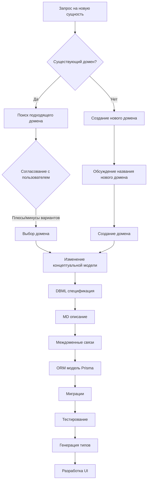
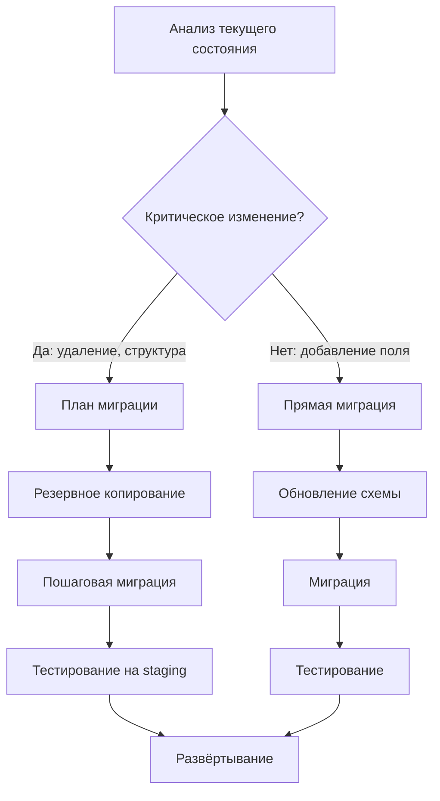

# DATA MODELING RULES

## 📖 Глоссарий

| Термин | Описание |
|--------|----------|
| **Домен** | Логическая группа сущностей, относящихся к одной области предметной области (например: Core, Бухгалтерия, Общение) |
| **Концептуальная модель** | Формальное описание сущностей, их атрибутов и связей в терминах предметной области (DBML + MD спецификации) |
| **ORM модель** | Физическое представление модели в Prisma Schema, соответствующее концептуальной модели |
| **Каноническая модель** | Единообразный справочник определений сущностей, используемый как эталон при создании UI компонентов и типов |
| **Миграция** | Версионированное изменение ORM модели с автоматическим применением к базе данных |

---

## 1. Состав модели данных

### 1.1 Иерархия спецификаций

```
specs/
├── concept.md                    # Общая концепция приложения
└── models/
    ├── README.md                 # Гид по моделям и навигация
    ├── <domain>.dbml             # DBML спецификация домена
    ├── <domain>.md               # Детальное описание сущностей домена
    └── relationships.md          # Междоменные связи
```

### 1.2 Распределение ответственности

| Уровень | Файл | Назначение | Ответственность |
|---------|------|------------|-----------------|
| Концептуальный | `specs/models/*.dbml` | Формальное описание структуры | Структура, связи, типы данных |
| Концептуальный | `specs/models/*.md` | Бизнес-контекст и правила | Описание, ограничения, валидация |
| Физический | `prisma/schema.prisma` | ORM представление | Реализация, миграции, клиент |
| Применение | `src/types/*.ts` | TypeScript типы | Бизнес-логика, UI компоненты |

---

## 2. Группировка сущностей (Домены)

### 2.1 Критерии выделения домена

Домен должен соответствовать принципу **High Cohesion, Low Coupling**:

1. **Высокая связанность** — сущности внутри домена тесно взаимосвязаны
2. **Низкая связность** — минимальные зависимости на другие домены
3. **Логическое завершение** — домен представляет отдельную бизнес-область

### 2.2 Рекомендуемые домены для проекта

| Домен | Описание | Файл |
|-------|----------|------|
| `core` | Пользователи, участники, участки | `core.dbml`, `core.md` |
| `accounting` | Начисления, платежи, отчёты | `accounting.dbml`, `accounting.md` |
| `publications` | Документы, объявления, страницы | `publications.dbml`, `publications.md` |
| `votes` | Голосования и их результаты | `votes.dbml`, `votes.md` |
| `communication` | Форумы, чаты, уведомления | `communication.dbml`, `communication.md` |

### 2.3 Именование файлов

```
<domain>.dbml       # DBML спецификация домена (lowercase, underscores)
<domain>.md         # Описание сущностей (lowercase, underscores)
```

---

## 3. Порядок изменения модели

### 3.1 Общий принцип

⚠️ **ИЗМЕНЕНИЯ МОДЕЛИ НАЧИНАЮТСЯ С ИЗМЕНЕНИЯ КОНЦЕПТУАЛЬНОЙ МОДЕЛИ**

### 3.2 Процесс создания новой сущности



#### Шаги процесса:

1. **Анализ требований**
   - Определить бизнес-цель новой сущности
   - Выявить связанные сущности
   - Определить необходимые операции (CRUD)

2. **Поиск домена**
   - Просмотреть существующие домены
   - Оценить соответствие критериям
   - Предоставить варианты с анализом плюсов/минусов
   - Обсудить с пользователем

3. **Создание нового домена** (при необходимости)
   - Обсудить название нового домена
   - Определить границы домена
   - Создать файлы `README.md`, `<domain>.dbml`, `<domain>.md`

4. **Внесение изменений в спецификацию концептуальной модели**
   - DBML: определить сущности, поля, связи
   - MD: описать семантику, ограничения, правила валидации
   - Relationships: добавить междоменные связи

5. **Внесение изменений в ORM модуль**
   - Обновить `prisma/schema.prisma`
   - Создать миграцию: `pnpm db:generate`
   - Применить миграцию: `pnpm db:migrate`

6. **Тестирование**
   - Проверить связность модели
   - Протестировать запросы с Join
   - Убедиться в целостности данных

7. **Генерация типов**
   - Обновить `src/types/` если необходимо
   - Убедиться в type-safe импорте

8. **Разработка UI**
   - Создать компоненты на основе типов

### 3.3 Процесс изменения существующей сущности



#### Шаги процесса:

1. **Анализ текущих зависимостей**
   - Найти все сущности, ссылающиеся на изменяемую
   - Определить количество записей (риск потери данных)
   - Выявить использованность в UI компонентах

2. **Оценка критичности**
   - **Некритические**: добавление необязательных полей
   - **Критические**: удаление полей, изменение типов, удаление сущностей

3. **План миграции** (для критических изменений)
   - Двухэтапное изменение: сначала добавить новое, затем удалить старое
   - Миграция исторических данных (если требуется)
   - Резервное копирование перед развёртыванием

4. **Реализация**
   - Обновить DBML и MD спецификации
   - Создать миграцию с инструкциями
   - Протестировать на локальной/staging базе

5. **Развёртывание**
   - Применить миграцию на production
   - Проверить работу системы
   - Обновить документацию

### 3.4 Процесс рефакторинга сущностей

1. **Анализ кода**
   - Найти все использования сущности через Prisma Introspection
   - Выявить зависимости в API, Server Actions, компонентах

2. **План изменений**
   - Разбить на мелкие атомарные изменения
   - Определить последовательность

3. **Реализация с backward compatibility**
   - Добавить новое поле/сущность
   - Обновить миграции данных
   - Обновить код
   - Удалить устаревшее

---

## 4. Версионирование и миграции

### 4.1 Правила версионирования

- **Файлы миграций**: `prisma/migrations/<timestamp>_<name>/migration.sql`
- **Семантическое версионирование**: `MAJOR.MINOR.PATCH`
- **Именование миграций**: использовать понятные имена с действием и объектом

### 4.2 Процесс применения миграций

```bash
# 1. Создать миграцию после изменений schema.prisma
pnpm db:generate      # Обновить Prisma Client
pnpm db:migrate       # Применить миграции к БД

# 2. Проверить результаты
pnpm db:studio        # Открыть Prisma Studio для визуализации
pnpm db:validate      # Проверить валидность схемы

# 3. (Опционально) Сформировать отчёт
pnpm db:format        # Привести schema.prisma к стандарту
```

### 4.3 Откат изменений

```sql
-- Пример отката критического изменения
BEGIN TRANSACTION;

-- Восстановление данных
INSERT INTO affected_table SELECT ... FROM backup_table;

-- Откат схемы (если возможно)
ALTER TABLE table_name DROP COLUMN column_name;

-- Проверка целостности
SELECT COUNT(*) FROM affected_table WHERE ...;

COMMIT; -- или ROLLBACK;
```

---

## 5. Междоменные связи

### 5.1 Правила построения связей

1. **Однозначные связи (1:1, 1:N)**
   - Реализовать через прямые foreign key
   - Использовать в большинстве случаев

2. **Многие-ко-многим (N:M)**
   - Создавать явную таблицу-связку
   - Добавлять атрибуты связи (например, `role`, `since`, `share`)
   - Использовать составные уникальные индексы

3. **Избежать циклических зависимостей**
   - Проверять на наличие циклов в графе доменов
   - Использовать промежуточные домены при необходимости

### 5.2 Файл `relationships.md`

| Сущность A | Домен A | Связь | Сущность B | Домен B | Тип |
|------------|---------|-------|------------|---------|-----|
| `User` | Core | 1:N | `Notification` | Communication | Прямая ссылка |
| `Member` | Core | 1:N | `Payment` | Accounting | Прямая ссылка |
| `Plot` | Core | 1:N | `Charge` | Accounting | Прямая ссылка |
| `User` | Core | 1:N | `Document` | Publications | Прямая ссылка |

---

## 6. Валидация и тестирование

### 6.1 Чек-лист проверки изменений

- [ ] Концептуальная модель (DBML) синтаксически корректна
- [ ] Описание сущностей (MD) содержит все необходимые правила
- [ ] ORM модель соответствует концептуальной
- [ ] Миграции протестированы на staging
- [ ] Индексы добавлены для часто запрашиваемых полей
- [ ] Foreign key ограничения корректны
- [ ] Cascade behavior определён для всех связей
- [ ] TypeScript типы сгенерированы корректно
- [ ] Документация обновлена

---

## 7. Связь с другими артефактами

### 7.1 Согласование с `specs/concept.md`

- Все изменения модели должны соответствовать общей концепции приложения
- При расширении функциональности обновлять концептуальное описание

### 7.2 Синхронизация с `prisma/schema.prisma`

- ORM модель всегда следует за концептуальной
- Прямое изменение `schema.prisma` без обновления DBML запрещено

### 7.3 Интеграция с `src/types/`

- TypeScript типы должны производиться из Prisma Client
- Дополнительные типы создаются только для специфики бизнес-логики

---

## 8. Депрекация и удаление

### 8.1 Процесс депрекации

1. **Маркировка в схеме**
   ```prisma
   /// @deprecated Use User.email instead
   oldField String?
   ```

2. **Обновление документации**
   - Добавить раздел о депрекации в MD файл
   - Указать альтернативу и срок удаления

3. **Уведомление потребителей**
   - Обновить API документацию
   - Предупредить команду о будущем удалении

### 8.2 Процесс удаления

1. Убедиться что срок депрекации истёк
2. Найти все точки использования
3. Обновить код (UI, Server Actions, API)
4. Удалить из схемы
5. Применить миграцию

---

## 9. Приложения

### A. Шаблон DBML для сущности

```dbml
Table users {
  id cid [] // unique identifier
  email text [unique, not null]
  passwordHash text [not null]
  role enum ['ADMIN', 'MEMBER', 'GUEST'] [default: 'MEMBER', not null]
  name text
  phone text
  isActive bool [default: true, not null]
  
  // Связи
  member member [unique]
  notifications notification[]
  forumPosts forum_post[]
  
  // Audit fields
  createdAt timestamp [default: `now()`, not null]
  updatedAt timestamp [default: `now()`, not null]
}

// Mapping to database
Map users_pk {
  id [pk]
}

Map users_email_key {
  email [unique]
}
```

### B. Шаблон MD описания сущности

```markdown
# User

## Описание
Сущность представляет пользователя системы.

## Атрибуты

| Поле | Тип | Обязательное | Описание |
|------|-----|--------------|----------|
| `id` | UUID | Да | Уникальный идентификатор |
| `email` | String | Да | Email для входа |
| `role` | UserRole | Да | Роль пользователя |

## Правила валидации

- `email`: должен быть валидным email, уникальный
- `passwordHash`: хеширован bcrypt, минимальная длина 60 символов
- `role`: одно из ADMIN, MEMBER, GUEST

## Связи

- **1:1 Member** — каждый пользователь должен иметь запись участника
- **1:N Notifications** — пользователь может получать уведомления
```

---

## 10. История версий правил

| Версия | Дата | Автор | Описание изменений |
|--------|------|-------|-------------------|
| 1.0.0 | 2026-06-23 | Architect | Первоначальная версия |
