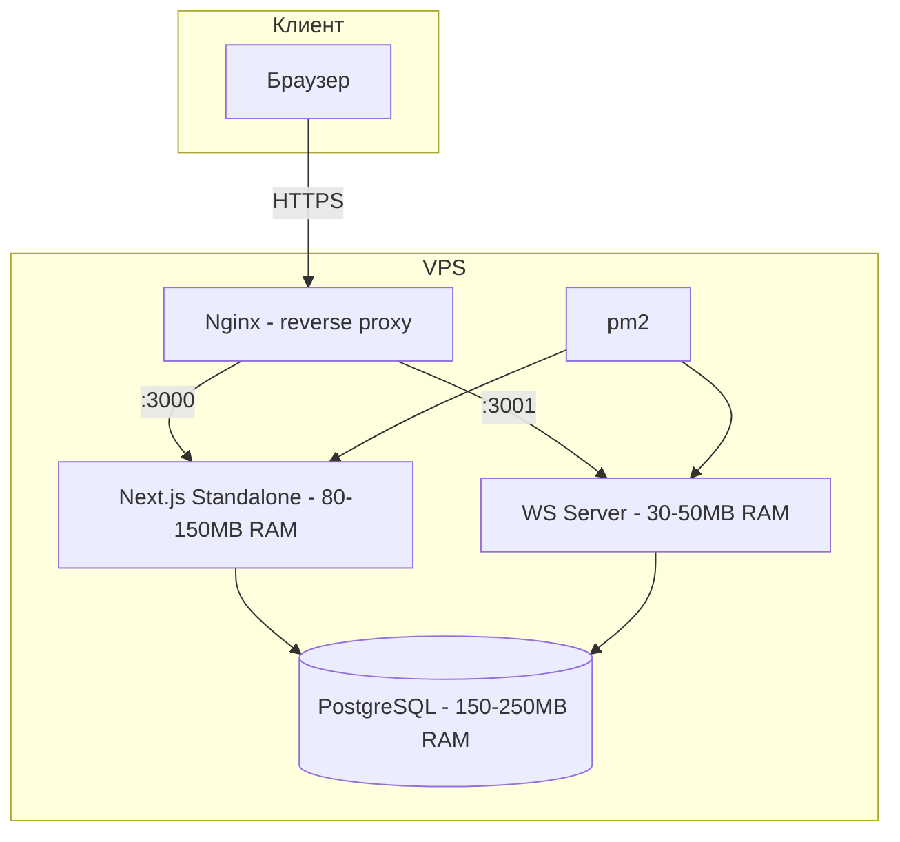

# Архитектура и технологические решения

## 1. Архитектурные решения

| Решение | Выбор | Обоснование |
|---------|-------|-------------|
| Фреймворк | Next.js standalone | SSR + REST API (API Routes) в одном процессе |
| База данных | PostgreSQL | Полнотекстовый поиск, jsonb, надёжность |
| ORM | Prisma | Типобезопасность, миграции, лёгкая смена БД |
| UI | TailwindCSS | Минимум CSS-кода, быстрый прототипинг |
| WebSocket | Отдельный минисервер | Чаты и уведомления, не нагружает Next.js |
| Runtime | pnpm | Экономия диска, быстрый install |
| Деплой | nginx + pm2 | Reverse proxy + process management |

## 2. Архитектурная диаграмма



## 3. Потребление ресурсов

| Компонент | RAM | Диск |
|-----------|-----|------|
| Next.js standalone | 80-150 MB | 200-400 MB |
| WebSocket server | 30-50 MB | 10-20 MB |
| PostgreSQL | 150-250 MB | 1-5 GB данные |
| Nginx | 5-10 MB | 5 MB |
| pm2 | 20-30 MB | 5 MB |
| ОС Linux | 100-150 MB | 1-2 GB |
| **Итого** | **385-590 MB** | **3-8 GB** |

При 1 GB RAM — комфортно, запас ~400 MB. При 500 MB — впритык.

## 4. Поток данных

```mermaid
sequenceDiagram
    participant U as Пользователь
    participant N as Nginx
    participant NX as Next.js
    participant PG as PostgreSQL
    participant WS as WS Server

    U->>N: HTTPS запрос
    N->>NX: Проксирование :3000
    NX->>PG: SQL через Prisma
    PG-->>NX: Данные
    NX-->>N: HTML/JSON
    N-->>U: HTTP ответ

    Note over U,WS: WebSocket соединение
    U->>N: WSS :3001
    N->>WS: Проксирование
    WS->>PG: Сохранить сообщение
    WS-->>U: Push уведомление