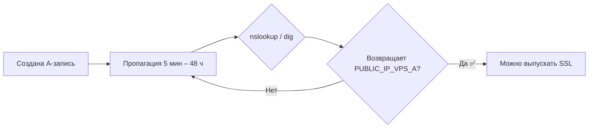

# Пошаговое руководство: регистрация домена `snt-berezki-nt.ru` и настройка DNS для публикации

> Цель документа: зарегистрировать домен в зоне `.ru`, настроить A-записи на публичный IP VPS-A и подготовить инфраструктуру к выпуску SSL-сертификата (Let's Encrypt) для `https://snt-berezki-nt.ru`.
>
> Смежные документы: [развёртывание 2-VPS](docker-prod-2vps.md), [план публикации](../../../plans/deployment-publish-plan.md).

---

## 1. Выбор регистратора

Домен `.ru` — национальная зона РФ. Регистрация выполняется только у **аккредитованных регистраторов** с оплатой в рублях.

| Регистратор | Особенности | Встроенный DNS | Оплата |
|---|---|---|---|
| **REG.RU** | Крупнейший, надёжный | Да | МИР, СБП, карты |
| **Ruvds** | Совпадает с VPS-провайдером — единый кабинет | Да | Да |
| **Timeweb** | Дешёвые домены, пакеты с хостингом | Да | Да |
| **2domains** | Бюджетный | Нет | Да |

**Рекомендация:** если VPS куплен на Ruvds — регистрировать домен там же (единый кабинет, DNS и VPS вместе). Альтернатива — REG.RU.

---

## 2. Проверка доступности имени

1. Открыть сайт регистратора → раздел «Проверить домен / Whois».
2. Ввести `snt-berezki-nt.ru`.
3. Если статус **«Свободен»** — переходить к регистрации.
   - Если занят — подобрать альтернативу (`snt-berezki-nt.com`, `snt-berezki-nt.site` и т.п.) и согласовать с командой.

---

## 3. Данные администратора (обязательно для `.ru`)

Зона `.ru` регистрируется **только на реальные данные**:

- **Физлицо:** ФИО, дата рождения, серия/номер паспорта РФ, адрес, email, телефон.
- **Юрлицо / ИП:** ОГРН/ИНН, наименование, юридический адрес, email, телефон.

> ⚠️ Для `.ru` WHOIS-приваси ограничено: данные администратора видны в публичной выдаче whois (паспортные данные не отображаются полностью, но ФИО/адрес — да).

---

## 4. Регистрация и оплата

1. Добавить домен в корзину на 1 год (при необходимости — несколько лет).
2. При желании докупить услуги: DNS-хостинг (обычно бесплатен), авто-продление.
3. Внести данные администратора **точно как в паспорте / ЕГРЮЛ**.
4. Подтвердить **email** (на почту придёт письмо с кодом) — без этого регистрация не завершится.
5. Оплатить удобным способом (карта, СБП, баланс).
6. Дождаться статуса «Зарегистрирован» (обычно 1–15 минут, до 24 ч).

✅ Домен зарегистрирован. Далее — настройка DNS.

---

## 5. Настройка DNS (A-записи на VPS-A)

Цель — направить `snt-berezki-nt.ru` и `www.snt-berezki-nt.ru` на **публичный** IP сервера **VPS-A** (приложение), а не VPS-DB.

### 5.1. Открыть DNS-редактор

В кабинете регистратора → раздел «DNS / Zone Editor / Управление DNS-записями» для домена.

### 5.2. Создать A-записи

| Host (Имя) | Тип | Значение (IP) | TTL |
|---|---|---|---|
| `@` | A | `<PUBLIC_IP_VPS_A>` | 3600 |
| `www` | A | `<PUBLIC_IP_VPS_A>` | 3600 |

> `<PUBLIC_IP_VPS_A>` — **публичный** (внешний) IP сервера VPS-A, видимый из интернета. Не использовать private IP приватной сети Ruvds.

### 5.3. Дополнительно (по необходимости)

- **Почта** — добавить MX-записи и SPF (TXT) позже. Для веб-приложения достаточно A-записей.
- **HTTPS-запись** (опционально) — не требуется для Let's Encrypt, если используется порт 80 для webroot.

---

## 6. Проверка распространения DNS (пропагация)



Проверка на любой ОС:

```bash
nslookup snt-berezki-nt.ru
nslookup www.snt-berezki-nt.ru
```

Точная проверка (Linux/macOS, пакеты `dnsutils` / `bind-utils`):

```bash
dig snt-berezki-nt.ru A +short
dig www.snt-berezki-nt.ru A +short
```

**Ожидаемый результат:** обе записи возвращают публичный IP VPS-A.

> ⏱️ Изменения DNS могут распространяться до 48 часов. При отсутствии результата — подождать и повторить.

---

## 7. Открыть порты на VPS-A (обязательно до SSL)

На VPS-A (панель Ruvds + `ufw`):

```bash
sudo ufw allow 22/tcp
sudo ufw allow 80/tcp
sudo ufw allow 443/tcp
sudo ufw enable
sudo ufw status
```

> Порты **80** и **443** обязательны для Let's Encrypt (проверка владения доменом) и для HTTPS.

---

## 8. Выпуск SSL-сертификата (Let's Encrypt)

Когда DNS-записи указывают на VPS-A и порты открыты:

```bash
ssh deploy@<PUBLIC_IP_VPS_A>

cd /opt/snt-app
docker compose -f docker-compose.prod.yml run --rm certbot
docker compose exec -T nginx nginx -t && docker compose exec -T nginx nginx -s reload

curl -I https://snt-berezki-nt.ru/    # → 200 OK
curl -I http://snt-berezki-nt.ru/     # → 301 (редирект на HTTPS)
```

Полная инструкция по развёртыванию стека — [`docker-prod-2vps.md`](docker-prod-2vps.md).

---

## 9. Чек-лист

- [ ] Выбран регистратор (рекомендация: Ruvds / REG.RU)
- [ ] Домен `snt-berezki-nt.ru` свободен
- [ ] Данные администратора внесены корректно (паспорт / юрлицо)
- [ ] Email подтверждён, оплата прошла, домен «Зарегистрирован»
- [ ] A-записи `@` и `www` → публичный IP VPS-A
- [ ] Пропагация завершена (`nslookup`/`dig` показывает IP VPS-A)
- [ ] Порты 22/80/443 открыты на VPS-A (UFW)
- [ ] SSL-сертификат выпущен, `https://snt-berezki-nt.ru` отвечает 200
- [ ] `https://` редирект с `http://` работает (301)
- [ ] Вход в приложение через `https://snt-berezki-nt.ru` работает

---

## 10. Типичные проблемы

| Проблема | Причина | Решение |
|---|---|---|
| Сайт не открывается после регистрации | Пропагация DNS ещё не завершена | Подождать до 48 ч, проверить `dig` |
| Let's Encrypt не выдаёт сертификат | Домен не указывает на VPS-A, или закрыт порт 80/443 | Проверить A-запись и UFW |
| `curl http://...` не даёт 301 | nginx слушает не тот `server_name` | Заменить `server_name _;` на `snt-berezki-nt.ru` |
| Не открывается панель регистратора | Блокировки сети | Обратиться в поддержку регистратора |

---

*Документ создан в рамках подготовки к публикации приложения на 2-VPS архитектуре (Ruvds).*