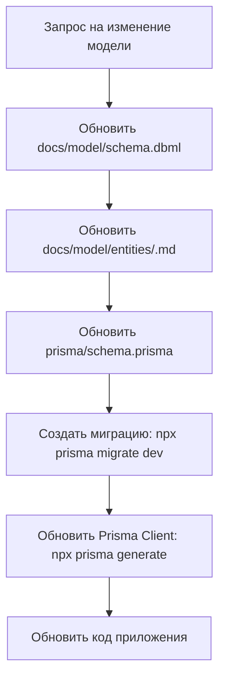

# Модель данных СНТ Березки НТ

## Общая информация

Эта документация описывает концептуальную модель данных системы управления СНТ "Березки НТ".

## Архитектура

### Двухуровневая модель данных

| Уровень | Расположение | Назначение |
|---------|-------------|-----------|
| **Концептуальный** | `docs/model/` | DBML-схема + markdown-описание. Источник истины для структуры данных |
| **Физический** | `prisma/schema.prisma` | Исполняемая схема БД. Производная от концептуальной модели |

> **Принцип:** Концептуальная модель является Source of Truth. Физическая модель всегда следует за концептуальной.

## Конвенции именования

Для работы с моделью данных используются следующие конвенции:

| Слой | Стиль | Пример | Описание |
|------|-------|--------|----------|
| **База данных (PostgreSQL)** | `snake_case` | `user_id`, `created_at` | Имена таблиц и колонок в БД |
| **Prisma Schema** | `camelCase` | `userId`, `createdAt` | Имена моделей и полей в Prisma схеме |
| **TypeScript домен** | `camelCase` | `userId`, `createdAt` | Типы в доменных слоях |
| **API JSON** | `camelCase` | `userId`, `createdAt` | Поля в JSON ответах API |

Полное описание конвенций см. в [conventions.md](./conventions.md).

## Схема базы данных

Полная DBML-схема доступна в файле [schema.dbml](./schema.dbml).

## Сущности

| Сущность | Файл описания |
|----------|---------------|
| [User](./entities/user.md) | Пользователь системы |
| [Plot](./entities/plot.md) | Участок СНТ |

| [Role](./entities/role.md) | Настраиваемая роль системы (RBAC) |
| [Page](./entities/page.md) | Реестр страниц приложения |
| [ApiEndpoint](./entities/api-endpoint.md) | Реестр API endpoints с категориями доступа |
| [UserRole](./entities/user-role.md) | Связь M:N users↔roles |
| [RolePage](./entities/role-page.md) | Связь M:N roles↔pages |
| [RoleApiEndpoint](./entities/role-api-endpoint.md) | Связь M:N roles↔api_endpoints |
| [AccessConfigVersion](./entities/access-config-version.md) | Глобальная версия конфигурации доступа (инвалидация сессий) |

### Обновления схемы

| Документ | Описание |
|----------|----------|
| [schema-update-notice.md](./schema-update-notice.md) | Добавление поля `theme` в user_profiles |
| [schema-update-roles-notice.md](./schema-update-roles-notice.md) | Ролевая модель доступа (US-8): удаление enum Role, добавление roles/user_roles/pages/role_pages/api_endpoints/role_api_endpoints, защита страниц и API |
| [schema-update-roles-notice.md](./schema-update-roles-notice.md) | Дополнение US-9: поле `access_type` в `pages`, таблица `access_config_version` для инвалидации сессий |

## Структура документации

```
docs/model/
├── README.md                              # Общая информация и навигация
├── conventions.md                         # Конвенции именования
├── schema.dbml                            # Полная DBML-схема БД
├── schema-update-notice.md                # Уведомление: поле theme
├── schema-update-roles-notice.md          # Уведомление: ролевая модель (US-8)
└── entities/                              # Описание каждой сущности
    ├── user.md
    ├── user-profile.md
    ├── plot.md
    ├── role.md                            # Роль системы (RBAC)
    ├── page.md                            # Реестр страниц
    ├── api-endpoint.md                    # Реестр API endpoints
    ├── user-role.md                       # Связь M:N users↔roles
    ├── role-page.md                       # Связь M:N roles↔pages
    └── role-api-endpoint.md               # Связь M:N roles↔api_endpoints
```

## Внесение изменений

При изменении модели данных необходимо следовать установленному процессу:



## Быстрый старт

### Создание новой миграции

```bash
npx prisma migrate dev --name <описание-изменения>
```

### Генерация Prisma Client

```bash
npx prisma generate
```

## Примечания

- Все поля баз данных используют `snake_case`
- В коде TypeScript используются `camelCase` имена полей
- Prisma автоматически преобразует `camelCase` в `snake_case` при работе с БД
- Используйте директиву `@map("snake_case")` для явного указания имен колонок
