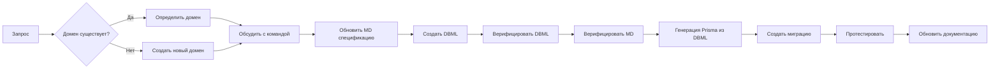

# Правила работы с моделью данных

> 📌 Документ описывает проектно-независимые стандарты работы с моделью данных.
> Для перечня доменов и специфических правил проекта см. [`domains.md`](domains.md).

---

## Содержание

- [1. Общие принципы](#1-общие-принципы)
- [2. Соглашения об именовании](#2-соглашения-об-именовании)
- [3. Версионирование и миграции](#3-версионирование-и-миграции)
- [4. Процессы изменений](#4-процессы-изменений)
- [5. Правила валидации](#5-правила-валидации)
- [6. Депрекация и удаление](#6-депрекация-и-удаление)
- [7. Проверка перед коммитом](#7-проверка-перед-коммитом)

---

## 1. Общие принципы

### 1.1 Единственный источник истины

| Артефакт | Хранится в | Роль |
|----------|-----------|------|
| **Prisma Schema** | [`prisma/schema.prisma`](prisma/schema.prisma) | Физическое представление модели |
| **DBML спецификация** | [`docs/model/<domain>.dbml`](docs/model/) | Логическая спецификация (создаётся при необходимости) |
| **MD описание** | [`docs/model/<domain>.md`](docs/model/) | Бизнес-контекст и правила валидации |
| **Справочная документация** | `docs/architecture/` | Справочная документация |

**Запрещено:** Вставлять полный Prisma Schema в markdown-файлы документации.

### 1.2 Архитектурные ограничения

- **Только PostgreSQL** — Prisma provider = `postgresql`
- **Генерация ID** — все primary key использует `cuid()` для строковых ID
- **Decimal точность** — финансовые поля: `@db.Decimal(12, 2)`
- **Бинарные данные** — файлы хранятся в PostgreSQL как `@db.Bytes` (bytea)
- **Audit поля** — все модели с датами содержат `createdAt` и `updatedAt`

---

## 2. Соглашения об именовании

### 2.1 Имена моделей

| Элемент | Соглашение | Пример |
|---------|-----------|--------|
| Model name | `PascalCase` | `ChatMessage`, `PlotMembership` |
| Database table | `snake_case` | `chat_messages`, `plot_memberships` |
| Relation field | `camelCase` | `chatMessages`, `plotMemberships` |
| Foreign key column | `snake_case` | `chat_id`, `plot_id` (автогенерируется) |
| Index name | автогенерация Prisma | `@@index` |
| Unique constraint | автогенерация Prisma | `@@unique` |

### 2.2 Имена полей

| Поле | Соглашение | Пример |
|------|-----------|--------|
| Primary key | `id` | `id String @id` |
| Foreign key | `<relatedModelId>` (camelCase) | `chatId`, `plotId` |
| Timestamps | `createdAt`, `updatedAt` | `createdAt DateTime @default(now())` |
| Boolean | `is<name>` | `isActive`, `isPublic` |
| Nullable | `Type?` | `name String?` |
| Unique | `@unique` | `email String @unique` |

### 2.3 Имена перечислений (Enums)

| Элемент | Соглашение | Пример |
|---------|-----------|--------|
| Enum model | `PascalCase` | `UserRole`, `ChargeType` |
| Enum value | `SCREAMING_SNAKE_CASE` | `ADMIN`, `MEMBERSHIP_FEE`, `ACTIVE` |

### 2.4 Имена маппингов таблиц

```prisma
@@map("table_name")  // snake_case
```

---

## 3. Версионирование и миграции

### 3.1 Процесс создания миграции

```bash
# 1. Внести изменения в prisma/schema.prisma
# 2. Сгенерировать клиент
pnpm db:generate

# 3. Создать миграцию с версией и именем
pnpm db:migrate --name <имя_миграции> --version <версия>

# 4. Применить миграцию (если нужно сразу)
pnpm db:migrate:deploy
```

### 3.2 Именование миграций

Используйте понятные имена, описывающие действие и объект:

| Формат | Пример |
|--------|--------|
| Добавление | `add_user_phone_field` |
| Удаление | `remove_redundant_index` |
| Изменение | `change_charge_status_to_enum` |
| Новая таблица | `create_chat_messages_table` |

### 3.3 Правила для миграций

- **Избегайте `ALTER COLUMN TYPE`** — если нужно изменить тип, создайте новое поле, перенесите данные, удалите старое
- **Каскадное удаление** — указывайте явно `onDelete: Cascade` или `onDelete: SetNull`
- **Ограничения** — добавляйте после создания таблицы, если есть данные
- **Откат** — каждая миграция должна быть атомарной и откатываемой

### 3.4 Безопасные изменения

| Тип изменения | Безопасность | Действие |
|---------------|-------------|----------|
| Добавление nullable поля | ✅ Безопасно | `ALTER TABLE ADD COLUMN` |
| Добавление поля с дефолтом | ✅ Безопасно | `ALTER TABLE ADD COLUMN DEFAULT` |
| Добавление NOT NULL поля | ⚠️ Риск | Добавить сначала nullable, затем populate, затем NOT NULL |
| Удаление поля | ⚠️ Риск | Добавить в депрекацию, удалить в следующей версии |
| Изменение типа поля | ❌ Опасно | Создать новое поле, миграция данных |

---

## 4. Процессы изменений

### 4.1 Добавление новой сущности



**Шаги:**

1. Определить домен
2. Предложить план изменений команде
3. Обновить MD спецификацию (`docs/model/<domain>.md`)
4. Создать или изменить DBML спецификацию (`docs/model/<domain>.dbml`)
5. Верифицировать DBML и MD (см. раздел 5)
6. Сгенерировать модель в [`prisma/schema.prisma`](prisma/schema.prisma) из верифицированного DBML
7. Создать миграцию с версией: `pnpm db:migrate --name <имя> --version <версия>`
8. Протестировать в staging-среде
9. Обновить справочную документацию

### 4.2 Изменение существующей сущности

| Тип изменения | Процесс |
|---------------|---------|
| Добавление поля | Обновить MD → DBML → Верификация → `schema.prisma` → `pnpm db:migrate` |
| Изменение типа | Депрекация старого → миграция → удаление |
| Удаление поля | Депрекация → ожидание → удаление |
| Изменение связей | Анализ зависимостей → миграция → тестирование |

### 4.3 Изменение связи

1. **Проанализировать** все места использования связи
2. **Оценить влияние** — каскадное удаление, ограничения
3. **Создать миграцию** с безопасным изменением
4. **Протестировать** все операции с затронутой связью

---

## 5. Правила валидации

### 5.1 Валидация DBML спецификаций

```bash
# Установка валидатора DBML
npm install -g @dbml/cli

# Проверка синтаксиса DBML
dbml-cli validate docs/model/<domain>.dbml

# Экспорт для проверки синтаксиса
dbml-cli output docs/model/<domain>.dbml
```

### 5.2 Валидация MD описаний

```bash
# Проверка синтаксиса Markdown
node docs/model/scripts/validate-md.mjs docs/model/<domain>.md

# Проверка согласованности между MD и DBML
node docs/model/scripts/verify-consistency.mjs docs/model/<domain>.dbml docs/model/<domain>.md
```

### 5.3 Валидация на уровне Prisma

- **Уникальность** — все уникальные поля помечать `@unique`
- **Обязательность** — не-null поля без `?`
- **Дефолты** — значения по умолчанию для `createdAt`, `updatedAt`, статусы
- **Каскады** — явно указывать `onDelete` поведение

### 5.4 Валидация на уровне приложения

```typescript
// ✅ Используйте Zod для валидации входных данных
import { z } from 'zod'

const CreateMemberSchema = z.object({
  surname: z.string().min(1),
  firstName: z.string().min(1),
  patronymic: z.string().optional(),
  // ...
})
```

### 5.5 Тестирование модели данных

**Unit-тесты:**

- Тестирование сервисов с mocked Prisma client
- Проверка бизнес-правил валидации
- Проверка корректности агрегаций (суммы платежей, подсчёт голосов)

**Интеграционные тесты:**

- CRUD операции с реальными данными
- Связи и каскадные удаления
- Транзакции

### 5.6 Чек-лист изменения модели

- [ ] MD спецификация обновлена
- [ ] DBML спецификация обновлена
- [ ] DBML прошёл валидацию (`dbml-cli validate`)
- [ ] MD прошёл валидацию (`validate-md.mjs`)
- [ ] Согласованность MD и DBML подтверждена
- [ ] Схема `schema.prisma` синтаксически корректна
- [ ] Миграция создана с версией и применена к staging
- [ ] Все связи имеют корректный `onDelete`
- [ ] Индексы добавлены для частых запросов
- [ ] TypeScript-клиент сгенерирован
- [ ] Сервисы и репозитории обновлены
- [ ] Тесты прошли успешно
- [ ] Документация обновлена

---

## 6. Депрекация и удаление

### 6.1 Процесс депрекации

```prisma
// Шаг 1: Пометить поле как deprecated (комментарий)
model User {
  // @deprecated Use User.preferredEmail instead
  oldEmail String?
  preferredEmail String?
}
```

### 6.2 Жизненный цикл депрекированного поля

| Этап | Время | Действие |
|------|-------|----------|
| Депрекация | Версия N | Добавить комментарий `@deprecated`, добавить новое поле |
| Миграция данных | Версия N+1 | Скопировать данные в новое поле, удалить старые записи |
| Удаление | Версия N+2 | Удалить поле из схемы |

### 6.3 Правила

- **Никогда не удаляйте** данные без резервной копии
- **Всегда мигрируйте** данные перед удалением поля
- **Уведомляйте** команду о плане депрекации
- **Обновляйте** документацию о депрекации

---

## 7. Проверка перед коммитом

### 7.1 Команды проверки

```bash
# 1. Сгенерировать клиент Prisma
pnpm db:generate

# 2. Проверить схему
pnpm db:validate

# 3. Сформатировать схему
pnpm db:format

# 4. Применить миграции к staging
pnpm db:migrate:deploy
```

### 7.2 Чек-лист

- [ ] `pnpm db:generate` прошёл успешно
- [ ] `pnpm db:validate` подтвердил корректность схемы
- [ ] Миграция создана с понятным именем и версией
- [ ] Все индексы обоснованы
- [ ] Все связи имеют `onDelete`
- [ ] TypeScript-типы сгенерированы
- [ ] Сервисы адаптированы под новую модель
- [ ] Тесты проходят
- [ ] Документация обновлена
- [ ] Коммит-сообщение описывает изменение модели

### 7.3 Запрещённые действия

- ❌ Коммитить `schema.prisma` без миграции
- ❌ Удалять данные без резервной копии
- ❌ Изменять структуру таблиц напрямую (через SQL) в обход Prisma
- ❌ Использовать `@map` для нестандартных имён таблиц без причины
- ❌ Создавать индексы без обоснования
- ❌ Использовать `any` или `unknown` в TypeScript-типах для моделей

---

## Приложение A. Полезные команды

```bash
# Основные
pnpm db:generate    # Генерация Prisma Client
pnpm db:migrate     # Создание новой миграции
pnpm db:migrate:deploy  # Применение миграций
pnpm db:validate    # Валидация схемы
pnpm db:format      # Форматирование схемы
pnpm db:studio      # Открытие Prisma Studio

# Полезные
pnpm db:push        # Протолкнуть изменения без миграции (dev only!)
pnpm db:seed        # Заполнение тестовыми данными
```

## Приложение B. Шаблон описания новой модели

```markdown
# ModelName

## Описание
Краткое описание назначения модели.

## Атрибуты

| Поле | Тип | Обязательное | Описание |
|------|-----|--------------|----------|
| `id` | `String` | Да | Уникальный идентификатор (cuid) |
| `field` | `Type` | Да/Нет | Описание |

## Валидация

- `field`: правило валидации
- `status`: возможные значения и их значение

## Связи

- **1:1 OtherModel** — описание связи
- **1:N OtherModel** — описание связи
```

---

## История версий

| Версия | Дата | Автор | Изменение |
|--------|------|-------|----------|
| 1.0.0 | 2026-06-25 | Architect | Первоначальная версия |
| 1.1.0 | 2026-06-25 | Architect | Отделение доменов, добавление валидации DBML/MD |
