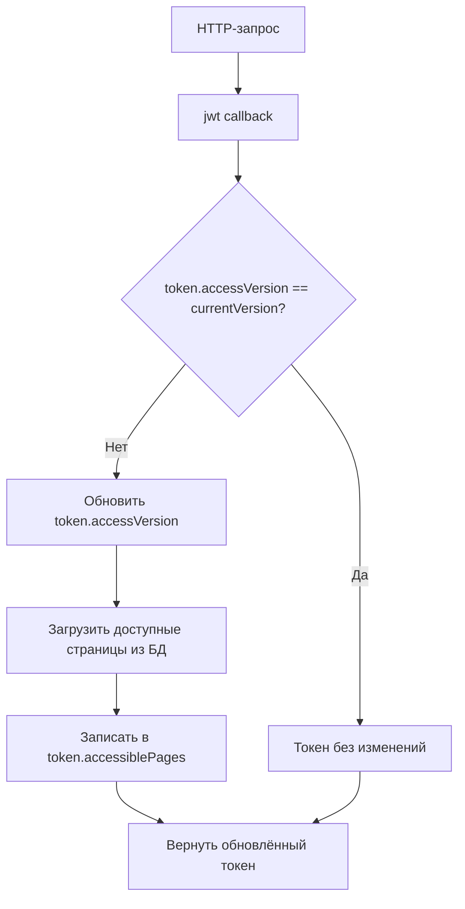

# AccessConfigVersion

## Описание

Однострочная таблица, хранящая глобальную версию конфигурации доступа (роли, страницы, API endpoints, их связи). Используется для инвалидации клиентских сессий (JWT) при изменении прав доступа.

Механизм:
1. JWT-токен пользователя содержит `accessVersion` — версию на момент создания/обновления токена
2. При каждом запросе `session` callback сравнивает `token.accessVersion` с текущим значением в `access_config_version`
3. При несовпадении — `token.accessVersion` обновляется, `session` обогащается свежими данными (список доступных страниц)
4. Клиентский `usePageAccess` и навигационное меню используют актуальные данные из сессии

> Таблица создаётся в US-9 для обеспечения актуальности прав доступа без принудительного re-login.

## Поля

| Поле | Тип | Обязательное | Описание | Бизнес-правила |
|------|-----|-------------|----------|----------------|
| `id` | Integer | Да | Единственная запись (id=1) | Всегда `1`; однострочная таблица |
| `version` | BigInt | Да | Текущая версия конфигурации | Начальное значение `0`; инкрементируется при любом изменении ролей/страниц/endpoints/связей |
| `updated_at` | DateTime | Да | Время последнего обновления версии | Обновляется при инкременте |

## Связи

Нет — таблица не имеет связей с другими сущностями.

## Индексы

| Поля | Тип | Описание |
|------|-----|----------|
| `id` | unique | Единственная запись (id=1) |

## Бизнес-инварианты

- В таблице всегда существует ровно одна запись с `id=1`
- `version` монотонно возрастает (только инкремент, никогда не декремент)
- Инкремент выполняется при:
  - Создании/обновлении/удалении роли (`roles`)
  - Назначении/снятии роли пользователю (`user_roles`)
  - Создании/обновлении/удалении страницы (`pages`)
  - Назначении/снятии страницы роли (`role_pages`)
  - Создании/обновлении/удалении API endpoint (`api_endpoints`)
  - Назначении/снятии API endpoint роли (`role_api_endpoints`)
  - Изменении `is_active` у страницы или endpoint
- Инкремент НЕ выполняется при:
  - Обновлении `description` роли/страницы/endpoint (не влияет на доступ)
  - Обновлении `title`/`group_name`/`sort_order` страницы (влияет только на меню, но не на доступ — обновится при следующей загрузке меню)
- Seed: создаётся запись `{ id: 1, version: 0, updated_at: now() }` при начальной инициализации
- Сравнение версий: `token.accessVersion !== currentVersion` → обновить токен

## Seed данные

| id | version | updated_at |
|----|---------|------------|
| 1 | 0 | now() |

## Конвенции именования

- **БД (PostgreSQL):** `access_config_version`, `id`, `version`, `updated_at`
- **Prisma:** `AccessConfigVersion`, `id`, `version`, `updatedAt`
- **TypeScript домен:** `AccessConfigVersionData`, `id: number`, `version: bigint`, `updatedAt: Date`

## Механизм обновления

Инкремент выполняется в сервисном слое (не через БД-триггеры):

```typescript
// Пример: RoleService.create() — после создания роли
await roleRepository.create(data);
await accessConfigRepository.incrementVersion();
```

Для атомарности инкремент выполняется в той же транзакции, что и основное изменение.

## Интеграция с JWT



@see docs/user-stories/US-9-page-access.md — спецификация проверки доступа к страницам
