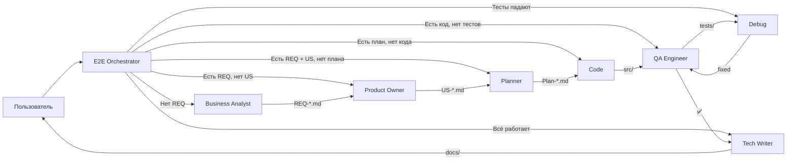

# Навигатор по режимам (Modes)

> Этот файл — единая карта всех режимов, навыков и шаблонов системы автоматизированной разработки.
> Используйте его для быстрой навигации и понимания связей между артефактами.

---

## 📋 Таблица: Режим → Skill → Шаблон → Пример

| Режим | Skill | Шаблон | Пример | Примечание |
|-------|-------|--------|--------|------------|
| 📋 **Business Analyst** | [`create-requirement.md`](../skills/create-requirement.md) | [`requirement-template.md`](../templates/requirement-template.md) | [`REQ-AUTH-001.md`](../requirements/REQ-AUTH-001.md) | *Включает итеративное обсуждение BR/FR/EC через черновики* |
| 📖 **Product Owner** | [`create-user-stories.md`](../skills/create-user-stories.md) | [`user-story-template.md`](../templates/user-story-template.md) | [`US-01-автоматическое-назначение-роли-GUEST-при-регистрации.md`](../user-stories/US-01-автоматическое-назначение-роли-GUEST-при-регистрации.md) | *Включает итеративное обсуждение списка US и каждой US через черновики* |
| 🏗️ **Data Architect** | [`update-data-model.md`](../skills/update-data-model.md) | — | [`user.md`](../model/entities/user.md) | |
| 📋 **Planner** | [`create-realization-plan.md`](../skills/create-realization-plan.md) | [`us-realization-plan.md`](../templates/us-realization-plan.md) | [`payments-implementation-plan.md`](../../plans/payments-implementation-plan.md) | |
| 🧪 **QA Engineer** | [`create-tests.md`](../skills/create-tests.md) | — | [`plots.test.ts`](../../tests/api/plots.test.ts) | |
| 📝 **Tech Writer** | [`update-documentation.md`](../skills/update-documentation.md) | — | [`README.md`](../../README.md) | |
| 🪃 **E2E Orchestrator** | — | [`templates/`](../templates/) | — | |

---

## 🔄 Pipeline-диаграмма



---

## 🧭 Как читать диаграмму

1. **Пользователь** задаёт задачу (бизнес-идея, баг, фича)
2. **E2E Orchestrator** анализирует существующие артефакты и определяет маршрут
3. Задача делегируется специализированному режиму через `new_task`
4. Каждый режим работает со своими артефактами (REQ → US → Plan → Code → Tests → Docs)
5. При ошибках — задача возвращается в `debug`, при успехе — в `tech-writer`

---

## 📁 Структура директорий

```
docs/
├── modes/                    # ← Этот файл
├── skills/                   # Алгоритмы работы режимов
│   ├── create-requirement.md
│   ├── create-user-stories.md
│   ├── update-data-model.md
│   ├── create-realization-plan.md
│   ├── create-tests.md
│   ├── update-documentation.md
│   ├── implement-domain.md
│   └── run-tests-and-fix.md
├── templates/                # Шаблоны артефактов
│   ├── requirement-template.md
│   ├── user-story-template.md
│   ├── us-realization-plan.md
│   └── requirement-readme-template.md
├── requirements/             # Созданные требования (REQ-*)
├── user-stories/             # Созданные User Stories (US-*)
├── model/                    # Модель данных
│   ├── entities/
│   ├── schema.dbml
│   └── conventions.md
└── plans/                    # Планы реализации
```

---

## 🔧 Как добавить новый режим

1. **Создайте skill** в `docs/skills/{name}.md` по аналогии с существующими
2. **Добавьте режим в `.roomodes`** с `roleDefinition`, который ссылается на skill
3. **Добавьте строку в таблицу выше** с указанием всех связей
4. **Обновите E2E Orchestrator** — добавьте новый режим в список sub-агентов

---

## 📚 Ссылки

- **Конфигурация режимов:** [`.roomodes`](../../.roomodes)
- **Правила API:** [`docs/rules/api-endpoint-rules.md`](../rules/api-endpoint-rules.md)
- **Тестирование:** [`docs/tests/README.md`](../tests/README.md)
