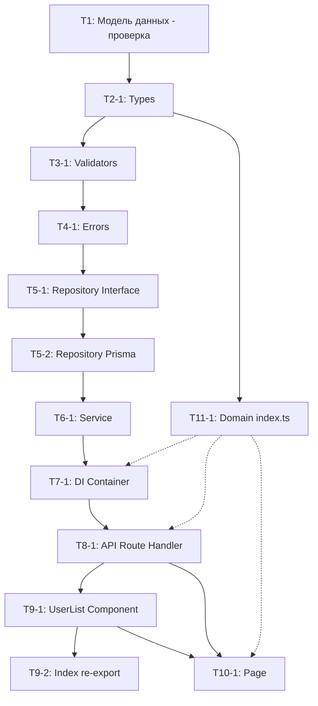

# План реализации: US-20-01 Просмотр списка пользователей

> **План декомпозирует User Story на технические задачи по слоям архитектуры.**  
> Статусы задач: `[TODO]` → `[IN PROGRESS]` → `[DONE]`

---

## 📋 Метаданные

| Параметр       | Значение                                                                  |
| -------------- | ------------------------------------------------------------------------- |
| **US-ID**      | `US-20-01`                                                                |
| **Название**   | Просмотр списка пользователей                                             |
| **Версия плана** | `v1.0`                                                                    |
| **Дата создания** | `2026-07-13`                                                             |
| **Статус**     | `[DONE]`                                                           |
| **Зависит от** | Нет                                                                       |

---

## 📎 Ссылки

- **User Story:** [`docs/user-stories/US-20-01-просмотр-списка-пользователей.md`](../user-stories/US-20-01-просмотр-списка-пользователей.md)
- **Требования (REQ):** [`docs/requirements/REQ-USERS-001.md`](../requirements/REQ-USERS-001.md)
- **Модель данных:**
  - [`docs/model/entities/user.md`](../model/entities/user.md)
  - [`docs/model/entities/user-profile.md`](../model/entities/user-profile.md)
  - [`docs/model/entities/user-role.md`](../model/entities/user-role.md)

---

## 📁 Дерево файлов

```
src/
├── domains/
│   └── users/                            # 🆕 Новый домен
│       ├── index.ts                      # 🆕 Re-export публичного API
│       ├── users.types.ts                # 🆕 Типы (UserListItem, UserFilters, UserListResponse)
│       ├── users.validators.ts           # 🆕 Zod-схемы (listUsersQuerySchema)
│       ├── users.errors.ts               # 🆕 Доменные ошибки (UsersAccessForbiddenError)
│       ├── users.repository.interface.ts # 🆕 Интерфейс репозитория
│       ├── users.repository.prisma.ts    # 🆕 Prisma-реализация
│       └── users.service.ts              # 🆕 Бизнес-логика
│
├── app/
│   ├── api/v1/
│   │   └── users/
│   │       └── route.ts                  # ✏️ Заменить существующий search → list endpoint
│   └── dashboard/
│       └── users/
│           └── page.tsx                  # 🆕 Страница списка пользователей
│
├── components/
│   └── features/
│       └── users/
│           ├── UserList/
│           │   ├── UserList.tsx          # 🆕 Таблица пользователей
│           │   └── index.ts              # 🆕 Re-export
│           └── index.ts                  # 🆕 Re-export
│
└── di/
    └── container.ts                      # ✏️ Добавить UsersService
```

**Легенда:** 🆕 = создаётся, ✏️ = изменяется

---

## 🔍 Контекст существующей реализации

| Ресурс | Текущее состояние | Действие |
|--------|------------------|----------|
| `src/app/api/v1/users/route.ts` | Существует, но реализует **поиск** пользователей (`GET /api/v1/users?q=`) для добавления в роли | **Заменить** на список пользователей с пагинацией. Поиск вынесен в US-20-02. |
| `src/app/dashboard/users/` | Не существует | **Создать** страницу |
| `src/domains/users/` | Не существует | **Создать** новый домен |
| `src/components/features/users/` | Не существует | **Создать** компоненты фичи |

---

## 📦 Задачи по слоям

---

### 1. Модель данных (Prisma + DBML)

#### Задача 1: Проверка модели данных

| Параметр   | Значение                                         |
| ---------- | ------------------------------------------------ |
| **ID**     | `US-20-01-T1`                                    |
| **Статус** | `[DONE]`                                         |
| **Файлы**  | `docs/model/schema.dbml`, `prisma/schema.prisma` |
| **Действие** | Проверка                                       |

**Целевое состояние:**

- Убедиться, что модели `User`, `UserProfile`, `UserRole` и `Role` существуют и готовы к использованию. Изменения в модели данных **не требуются** — используются существующие сущности.

**Чек-лист:**

- [x] Проверить, что `User` модель содержит: `id`, `email`, `password_hash`, `created_at`, `updated_at`
- [x] Проверить, что `UserProfile` модель содержит: `user_id`, `first_name`, `last_name`
- [x] Проверить, что `UserRole` модель содержит: `user_id`, `role_id`, `created_at`
- [x] Проверить, что `Role` модель содержит: `id`, `name`, `description`
- [x] Подтвердить, что миграции актуальны (`npx prisma validate`)

---

### 2. Types (Доменные типы)

#### Задача 1: Определить типы для списка пользователей

| Параметр   | Значение                                         |
| ---------- | ------------------------------------------------ |
| **ID**     | `US-20-01-T2-1`                                  |
| **Статус** | `[DONE]`                                         |
| **Файл**   | `src/domains/users/users.types.ts`               |
| **Действие** | Создать                                         |

**Целевое состояние:**

- Определены типы: `UserListItem`, `UserFilters`, `UserListResponse`

**Чек-лист:**

- [x] `UserListItem` определён с JSDoc (`@type`, `@domain`, `@spec`)
- [x] `UserFilters` определён с JSDoc (для будущей пагинации — page, limit)
- [x] `UserListResponse` определён с JSDoc (items[], total, page, limit)
- [x] Все поля описаны с комментариями

**Типы:**

```typescript
/**
 * @type UserListItem
 * @domain users
 * @description Строка пользователя в списке
 *
 * @spec
 * - firstName/lastName — nullable (не у всех пользователей есть профиль)
 * - roles — массив названий ролей (строковых)
 *
 * @see docs/model/entities/user.md
 */
export interface UserListItem {
  id: string;
  email: string;
  firstName: string | null;
  lastName: string | null;
  roles: string[];
  createdAt: Date;
}

/**
 * @type UserFilters
 * @domain users
 * @description Фильтры для списка пользователей (пагинация)
 */
export interface UserFilters {
  page: number;
  limit: number;
}

/**
 * @type UserListResponse
 * @domain users
 * @description Ответ API со списком пользователей и метаданными пагинации
 */
export interface UserListResponse {
  items: UserListItem[];
  total: number;
  page: number;
  limit: number;
}
```

---

### 3. Validators (Zod-схемы)

#### Задача 1: Создать Zod-схему для query-параметров

| Параметр   | Значение                                         |
| ---------- | ------------------------------------------------ |
| **ID**     | `US-20-01-T3-1`                                  |
| **Статус** | `[DONE]`                                         |
| **Файл**   | `src/domains/users/users.validators.ts`          |
| **Действие** | Создать                                         |

**Целевое состояние:**

- `listUsersQuerySchema` — валидация query-параметров (`page`, `limit`) с дефолтными значениями

**Чек-лист:**

- [x] Схема определена с JSDoc (`@schema`, `@domain`, `@spec`)
- [x] `page` — опциональный number, default 1, min 1
- [x] `limit` — опциональный number, default 25, min 1, max 100
- [x] Сообщения об ошибках на русском языке

---

### 4. Errors (Доменные ошибки)

#### Задача 1: Создать доменные ошибки

| Параметр   | Значение                                         |
| ---------- | ------------------------------------------------ |
| **ID**     | `US-20-01-T4-1`                                  |
| **Статус** | `[DONE]`                                         |
| **Файл**   | `src/domains/users/users.errors.ts`              |
| **Действие** | Создать                                         |

**Целевое состояние:**

- `UsersAccessForbiddenError` — наследуется от `ForbiddenError`, код `USERS_ACCESS_FORBIDDEN`, HTTP 403

**Чек-лист:**

- [x] Класс наследуется от `ForbiddenError` из `src/shared/errors/`
- [x] JSDoc: `@error`, `@domain`
- [x] Сообщение на русском: «Доступ запрещен. Только супер-администратор может просматривать список пользователей»
- [x] HTTP-статус: 403

---

### 5. Repository (Интерфейс + Реализация)

#### Задача 1: Определить интерфейс репозитория

| Параметр   | Значение                                                     |
| ---------- | ------------------------------------------------------------ |
| **ID**     | `US-20-01-T5-1`                                              |
| **Статус** | `[DONE]`                                                     |
| **Файл**   | `src/domains/users/users.repository.interface.ts`            |
| **Действие** | Создать                                                      |

**Целевое состояние:**

- `IUsersRepository` с методом `findAllUsers(filters)`

**Чек-лист:**

- [x] Интерфейс определён с JSDoc (`@interface`, `@domain`, `@spec`)
- [x] Метод `findAllUsers(filters: UserFilters): Promise<UserListResponse>` описан с `@param`, `@returns`
- [x] Инварианты задокументированы в `@spec`

**Интерфейс:**

```typescript
export interface IUsersRepository {
  /**
   * Найти всех пользователей с пагинацией
   *
   * @param filters - Фильтры (page, limit)
   * @returns Ответ с_items, total, page, limit_
   */
  findAllUsers(filters: UserFilters): Promise<UserListResponse>;
}
```

#### Задача 2: Реализовать репозиторий на Prisma

| Параметр   | Значение                                                 |
| ---------- | -------------------------------------------------------- |
| **ID**     | `US-20-01-T5-2`                                          |
| **Статус** | `[DONE]`                                                 |
| **Файл**   | `src/domains/users/users.repository.prisma.ts`           |
| **Действие** | Создать                                                  |

**Целевое состояние:**

- `UsersRepositoryPrisma` реализует `IUsersRepository` с JOIN `user_profiles` + `user_roles` + `roles`

**Чек-лист:**

- [x] Реализация метода `findAllUsers` через Prisma Client
- [x] Query: SELECT users + LEFT JOIN user_profiles + LEFT JOIN user_roles + LEFT JOIN roles
- [x] Группировка ролей по пользователю (массив `roles: string[]`)
- [x] Пагинация через `skip` / `take`
- [x] Подсчёт `total` через `prisma.user.count()`
- [x] Используется singleton Prisma Client из `src/infrastructure/prisma/client.ts`
- [x] Доменные типы (`UserListItem`, `UserListResponse`), а не сырые данные Prisma

**Пример Prisma-запроса:**

```typescript
const [items, total] = await Promise.all([
  prisma.user.findMany({
    skip: (filters.page - 1) * filters.limit,
    take: filters.limit,
    include: {
      profile: true,
      roles: { include: { role: { select: { name: true } } } },
    },
    orderBy: { created_at: 'desc' },
  }),
  prisma.user.count(),
]);
```

---

### 6. Service (Бизнес-логика)

#### Задача 1: Создать UsersService

| Параметр   | Значение                                  |
| ---------- | ----------------------------------------- |
| **ID**     | `US-20-01-T6-1`                           |
| **Статус** | `[DONE]`                                  |
| **Файл**   | `src/domains/users/users.service.ts`      |
| **Действие** | Создать                                  |

**Целевое состояние:**

- `UsersService` с методом `findAllUsers(filters)` — валидация через Zod, вызов репозитория

**Чек-лист:**

- [x] Класс с JSDoc (`@service`, `@domain`, `@spec`)
- [x] Метод `findAllUsers(filters): Promise<UserListResponse>` с JSDoc
- [x] Валидация `filters` через `listUsersQuerySchema` (Zod)
- [x] Вызов `this.repository.findAllUsers(validatedFilters)`
- [x] Репозиторий передан через DI (конструктор)
- [x] Экспорт factory-функции `createUsersService(repository)`

---

### 7. DI Container

#### Задача 1: Зарегистрировать UsersService в DI-контейнере

| Параметр   | Значение                           |
| ---------- | ---------------------------------- |
| **ID**     | `US-20-01-T7-1`                    |
| **Статус** | `[DONE]`                           |
| **Файл**   | `src/di/container.ts`              |
| **Действие** | Изменить                          |

**Целевое состояние:**

- Фабрика `createUsersServiceDI()` и getter `getUsersService()` в `Container`

**Чек-лист:**

- [x] Добавлен import типов и классов из `src/domains/users/`
- [x] Создана factory-функция `createUsersServiceDI()`
- [x] Добавлено private-поле `usersService` в `Container`
- [x] Добавлен getter `getUsersService()` с lazy initialization (singleton)
- [x] `npm run type-check` — 0 ошибок

---

### 8. API Route Handlers

#### Задача 1: Заменить `GET /api/v1/users` на список пользователей

| Параметр   | Значение                                              |
| ---------- | ----------------------------------------------------- |
| **ID**     | `US-20-01-T8-1`                                       |
| **Статус** | `[DONE]`                                              |
| **Файл**   | `src/app/api/v1/users/route.ts`                       |
| **Действие** | Изменить (замена существующего search → list)        |

**Целевое состояние:**

- `GET /api/v1/users?page=&limit=` — список пользователей с пагинацией, защищённый ролью `SUPER_ADMIN`

**Чек-лист:**

- [x] JSDoc: `@route GET /api/v1/users`, `@auth required`, `@role SUPER_ADMIN`, `@response`
- [x] Используется `withRoleGuard` с ролями `['SUPER_ADMIN']`
- [x] Получение `page` и `limit` из query-параметров
- [x] Вызов `container getUsersService().findAllUsers({ page, limit })`
- [x] Возврат `{ success: true, data: UserListResponse }` со статусом 200
- [x] Обработка ошибок через `instanceof BaseError`
- [x] При 403 — возврат `{ success: false, error: { code, message } }`
- [x] Путь в клиенте: `apiClient.get('/users')` (без `/api/v1`)
- [x] **Важно:** существующий функционал поиска (`?q=`) временно заменяется. Поиск будет восстановлен в US-20-02.

---

### 9. UI Components (Фича-компоненты)

#### Задача 1: Создать компонент UserList

| Параметр   | Значение                                                     |
| ---------- | ------------------------------------------------------------ |
| **ID**     | `US-20-01-T9-1`                                              |
| **Статус** | `[DONE]`                                                     |
| **Файл**   | `src/components/features/users/UserList/UserList.tsx`        |
| **Действие** | Создать                                                      |

**Целевое состояние:**

- Компонент `UserList` — таблица пользователей с состояниями loading/error/empty

**Чек-лист:**

- [x] `'use client'` директива
- [x] JSDoc: `@component`, `@category`, `@spec`
- [x] Props: `users: UserListItem[]`, `isLoading: boolean`, `error: string | null`
- [x] Таблица со столбцами: Email, Имя, Фамилия, Роли, Дата регистрации
- [x] Роли отображаются как бейджи (`<Badge />`)
- [x] Пустые значения (`null`) отображаются как «—»
- [x] Состояние `loading` — индикатор загрузки с текстом «Загрузка данных...»
- [x] Состояние `error` — сообщение об ошибке
- [x] Состояние `empty` — `EmptyState` с текстом «Пользователи не найдены»
- [x] Используется `cn()` для классов
- [x] ARIA-метки для доступности

#### Задача 2: Создать index.ts re-export

| Параметр   | Значение                                                    |
| ---------- | ----------------------------------------------------------- |
| **ID**     | `US-20-01-T9-2`                                             |
| **Статус** | `[DONE]`                                                    |
| **Файл**   | `src/components/features/users/UserList/index.ts`            |
| **Действие** | Создать                                                      |

**Чек-лист:**

- [x] Re-export: `export { UserList } from './UserList'`

---

### 10. Pages (Страницы)

#### Задача 1: Создать страницу `/dashboard/users`

| Параметр   | Значение                                   |
| ---------- | ------------------------------------------ |
| **ID**     | `US-20-01-T10-1`                           |
| **Статус** | `[DONE]`                                   |
| **Файл**   | `src/app/dashboard/users/page.tsx`         |
| **Действие** | Создать                                    |

**Целевое состояние:**

- Client Component страница `/dashboard/users`, защищённая ролью `SUPER_ADMIN`

**Чек-лист:**

- [x] `'use client'` директива
- [x] JSDoc: `@page /dashboard/users`, `@auth required`, `@role SUPER_ADMIN`, `@spec`, `@data-flow`
- [x] `useSession()` для проверки авторизации
- [x] Проверка роли `SUPER_ADMIN` — если нет, отображение сообщения «Доступ запрещен»
- [x] Загрузка данных через `apiClient.get('/users')` при монтировании
- [x] Состояния: `loading`, `error`, `data`
- [x] Рендер `UserList` компонента с данными
- [x] `EmptyState` при пустом списке
- [x] Задержка `setTimeout(() => router.replace('/login'), 100)` при редиректе (согласно PROJECT.md)
- [x] `useCallback` для обработчиков событий

**Data flow:**

```
Page → useSession() → проверка роли → apiClient.get('/users') → UserList → Таблица
```

---

### 11. Domain Index (Re-exports)

#### Задача 1: Создать `index.ts` для домена users

| Параметр   | Значение                              |
| ---------- | ------------------------------------- |
| **ID**     | `US-20-01-T11-1`                      |
| **Статус** | `[DONE]`                              |
| **Файл**   | `src/domains/users/index.ts`          |
| **Действие** | Создать                               |

**Чек-лист:**

- [x] Re-export типов: `UserListItem`, `UserFilters`, `UserListResponse`
- [x] Re-export ошибок: `UsersAccessForbiddenError`
- [x] Re-export интерфейса: `IUsersRepository`
- [x] Re-export сервиса: `UsersService`, `createUsersService`
- [x] Re-export валидаторов: `listUsersQuerySchema`

---

## 📊 Матрица соответствия AC → Задачи

| AC | Описание | Задачи | Статус |
|----|----------|--------|--------|
| AC-1.1 | Загрузка списка пользователей | T5-2 (repo), T6-1 (service), T8-1 (API), T10-1 (page) | `[DONE]` |
| AC-1.2 | Структура таблицы (email, имя, фамилия, роли, дата) | T2-1 (types), T9-1 (UI) | `[DONE]` |
| AC-1.3 | Отображение ролей как бейджей | T5-2 (repo — JOIN roles), T9-1 (UI — Badge) | `[DONE]` |
| AC-1.4 | Доступ заблокирован для не-администраторов (страница) | T10-1 (page — useSession + role check) | `[DONE]` |
| AC-1.5 | Блокировка на уровне API (403) | T8-1 (API — withRoleGuard SUPER_ADMIN) | `[DONE]` |
| AC-1.6 | Блокировка на уровне страницы | T10-1 (page — role check + сообщение) | `[DONE]` |
| EC-01 | Список пуст → EmptyState | T9-1 (UI — empty state), T10-1 (page) | `[DONE]` |
| EC-02 | Пользователь без роли SUPER_ADMIN → 403 | T4-1 (error), T8-1 (API), T10-1 (page) | `[DONE]` |
| EC-03 | Нет профиля → пустые значения имя/фамилия | T5-2 (repo — LEFT JOIN), T9-1 (UI — «—») | `[DONE]` |
| EC-04 | Нет ролей → пустой столбец | T5-2 (repo), T9-1 (UI — «—») | `[DONE]` |
| EC-05 | Медленная сеть → индикатор загрузки | T9-1 (UI — loading state), T10-1 (page) | `[DONE]` |

---

## ✅ Чек-лист валидации плана

Перед передачей плана в Code-режим убедиться:

### Полнота
- [x] Все AC из User Story покрыты задачами
- [x] Все EC (Edge Cases) из User Story покрыты задачами
- [x] Все слои архитектуры охвачены (Model → Types → Validators → Errors → Repository → Service → DI → API → UI → Page)

### Соответствие правилам
- [x] API путь без `/api/v1` префикса в `apiClient` — см. [`api-paths.md`](../../.roo/rules/api-paths.md)
- [x] `withRoleGuard` используется для защиты API endpoint
- [x] `useSession()` используется на странице
- [x] `EmptyState` для пустого состояния
- [x] `'use client'` на странице и компоненте
- [x] Задержка `setTimeout` перед редиректом на `/login`

### Порядок выполнения



---

## 📝 История изменений

| Дата       | Версия | Автор     | Изменение                                |
| ---------- | ------ | --------- | ---------------------------------------- |
| 2026-07-13 | v1.0   | Architect | Создание плана реализации для US-20-01   |
| 2026-07-13 | v1.1   | Code      | Реализация завершена, все задачи DONE    |

---

## 📎 Дополнительные ссылки

- [`SPECS.md`](../../.roo/rules/SPECS.md) — правила управления спецификациями
- [`MODEL.md`](../../.roo/rules/MODEL.md) — правила управления моделью данных
- [`ARCHITECTURE.md`](../../.roo/rules/ARCHITECTURE.md) — правила архитектуры
- [`PROJECT.md`](../../.roo/rules/PROJECT.md) — глобальные правила проекта
- [`api-paths.md`](../../.roo/rules/api-paths.md) — правила формирования API-путей
