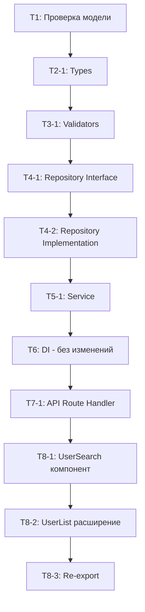

# План реализации: US-20-02 Поиск и сортировка пользователей

> **План декомпозирует User Story на технические задачи по слоям архитектуры.**  
> Статусы задач: `[TODO]` → `[IN PROGRESS]` → `[DONE]`

---

## 📋 Метаданные

| Параметр       | Значение                                                                  |
| -------------- | ------------------------------------------------------------------------- |
| **US-ID**      | `US-20-02`                                                                |
| **Название**   | Поиск и сортировка пользователей                                          |
| **Версия плана** | `v1.0`                                                                    |
| **Дата создания** | `2026-07-13`                                                             |
| **Статус**     | `[NOT STARTED]`                                                           |
| **Зависит от** | `US-20-01` (базовый список пользователей с пагинацией)                    |

---

## 📎 Ссылки

- **User Story:** [`docs/user-stories/US-20-02-поиск-и-сортировка-пользователей.md`](../user-stories/US-20-02-поиск-и-сортировка-пользователей.md)
- **Требования (REQ):** [`docs/requirements/REQ-USERS-001.md`](../requirements/REQ-USERS-001.md)
- **Модель данных:**
  - [`docs/model/entities/user.md`](../model/entities/user.md)
  - [`docs/model/entities/user-profile.md`](../model/entities/user-profile.md)
- **План US-20-01:** [`docs/plans/us-20-01-просмотр-списка-пользователей-plan.md`](./us-20-01-просмотр-списка-пользователей-plan.md)

---

## 📁 Дерево файлов

Только изменяемые файлы (домен `users` уже создан в US-20-01):

```
src/
├── domains/
│   └── users/
│       ├── users.types.ts                # ✏️ Добавить q, sort, order в UserFilters
│       ├── users.validators.ts           # ✏️ Расширить listUsersQuerySchema полями q, sort, order
│       ├── users.repository.interface.ts # ✏️ Расширить findAllUsers параметрами поиска/сортировки
│       └── users.repository.prisma.ts    # ✏️ Реализовать ILIKE-поиск + динамический orderBy
│
├── app/
│   └── api/v1/
│       └── users/
│           └── route.ts                  # ✏️ Поддержать параметры q, sort, order в GET
│
├── components/
│   └── features/
│       └── users/
│           ├── UserSearch/
│           │   ├── UserSearch.tsx        # 🆕 Поле поиска с debounce
│           │   └── index.ts              # 🆕 Re-export
│           ├── UserList/
│           │   └── UserList.tsx          # ✏️ Кликабельные заголовки, индикатор сортировки, интеграция UserSearch
│           └── index.ts                  # ✏️ Добавить re-export UserSearch
```

**Легенда:** 🆕 = создаётся, ✏️ = изменяется

---

## 🔍 Контекст существующей реализации

| Ресурс | Текущее состояние (US-20-01) | Действие |
|--------|-----------------------------|----------|
| `UserFilters` | `{ page, limit }` | **Добавить** `q`, `sort`, `order` |
| `listUsersQuerySchema` | Валидирует `page`, `limit` | **Расширить** полями `q`, `sort`, `order` |
| `IUsersRepository.findAllUsers` | Принимает `UserFilters` | **Расширить** параметрами поиска/сортировки |
| `UsersRepositoryPrisma.findAllUsers` | Пагинация + `createdAt DESC` | **Добавить** ILIKE-поиск + динамический `orderBy` |
| `UsersService.findAllUsers` | Валидирует query через Zod | **Расширить** для новых полей |
| `GET /api/v1/users` | `?page=&limit=` | **Добавить** `?q=&sort=&order=` |
| `UserList` | Таблица + пагинация | **Добавить** поиск (UserSearch) + кликабельные заголовки |
| `UserSearch` | Не существует | **Создать** компонент с debounce |

---

## 📦 Задачи по слоям

---

### 1. Модель данных (Prisma + DBML)

#### Задача 1: Проверка модели данных

| Параметр   | Значение                                         |
| ---------- | ------------------------------------------------ |
| **ID**     | `US-20-02-T1`                                    |
| **Статус** | `[DONE]`                                         |
| **Файлы**  | `docs/model/schema.dbml`, `prisma/schema.prisma` |
| **Действие** | Проверка                                       |

**Целевое состояние:**

- Подтвердить, что изменения в модели данных **не требуются** — поиск и сортировка реализуются на уровне Prisma-запросов (ILIKE + orderBy) без изменения схемы БД.

**Чек-лист:**

- [ ] Проверить, что модель `User` содержит поля для поиска: `email`, `created_at`
- [ ] Проверить, что модель `UserProfile` содержит поля для поиска: `first_name`, `last_name`
- [ ] Подтвердить, что индексы достаточны для производительности поиска (ILIKE требует полнотекстового индекса для больших объёмов, но для <1000 записей достаточно стандартного)
- [ ] Подтвердить, что миграции актуальны (`npx prisma validate`)

---

### 2. Types (Доменные типы)

#### Задача 1: Расширить `UserFilters` полями поиска и сортировки

| Параметр   | Значение                                         |
| ---------- | ------------------------------------------------ |
| **ID**     | `US-20-02-T2-1`                                  |
| **Статус** | `[DONE]`                                         |
| **Файл**   | `src/domains/users/users.types.ts`               |
| **Действие** | Изменить                                       |

**Целевое состояние:**

- `UserFilters` расширен полями `q` (текст поиска), `sort` (поле сортировки), `order` (направление сортировки)
- Все поля опциональны с дефолтными значениями

**Чек-лист:**

- [ ] `q` — опциональный string | undefined — текст поиска
- [ ] `sort` — опциональный string из whitelist `email | firstName | lastName | createdAt`
- [ ] `order` — опциональный `'asc' | 'desc'` с дефолтом `'asc'`
- [ ] JSDoc обновлён с описанием новых полей

**Изменение:**

```typescript
/**
 * @type UserFilters
 * @domain users
 * @description Фильтры для списка пользователей (пагинация, поиск, сортировка)
 *
 * @spec
 * - q: текст поиска по email, firstName, lastName (ILIKE)
 * - sort: поле сортировки (whitelist: email, firstName, lastName, createdAt)
 * - order: направление сортировки (asc/desc), по умолчанию asc
 * - При отсутствии sort/order используется дефолтная сортировка: createdAt DESC
 */
export interface UserFilters {
  /** Номер страницы (начиная с 1) @default 1 */
  page: number;
  /** Количество записей на странице @default 25 */
  limit: number;
  /** Текст поиска по email, firstName, lastName */
  q?: string;
  /** Поле сортировки (whitelist: email, firstName, lastName, createdAt) */
  sort?: 'email' | 'firstName' | 'lastName' | 'createdAt';
  /** Направление сортировки @default 'asc' */
  order?: 'asc' | 'desc';
}
```

---

### 3. Validators (Zod-схемы)

#### Задача 1: Расширить `listUsersQuerySchema` полями поиска и сортировки

| Параметр   | Значение                                         |
| ---------- | ------------------------------------------------ |
| **ID**     | `US-20-02-T3-1`                                  |
| **Статус** | `[DONE]`                                         |
| **Файл**   | `src/domains/users/users.validators.ts`          |
| **Действие** | Изменить                                       |

**Целевое состояние:**

- `listUsersQuerySchema` валидирует `q`, `sort`, `order`
- Whitelist допустимых полей сортировки: `email`, `firstName`, `lastName`, `createdAt`
- При неверном `sort` — игнорировать (не валидировать строго, чтобы не ломать запрос)

**Чек-лист:**

- [ ] `q` — опциональный string, trim + isEmpty → undefined
- [ ] `sort` — опциональный string, whitelist: `['email', 'firstName', 'lastName', 'createdAt']`, если не в whitelist → undefined
- [ ] `order` — опциональный enum `['asc', 'desc']`, default `'asc'`, если неверный → `'asc'`
- [ ] JSDoc обновлён
- [ ] Сообщения об ошибках на русском языке (если валидация строгая)

**Изменение:**

```typescript
/**
 * @schema listUsersQuerySchema
 * @domain users
 * @description Валидация query-параметров для списка пользователей
 *
 * @spec
 * - page: опциональный number, default 1, min 1
 * - limit: опциональный number, default 25, min 1, max 100
 * - q: опциональный string, trim + пустая строка → undefined
 * - sort: опциональный string, whitelist полей, неверное поле → undefined (использовать дефолтную сортировку)
 * - order: опциональный enum asc/desc, default asc, неверное значение → asc
 */
```

**Реализация (кратко):**

```typescript
// Добавить в существующую схему:
q: z
  .string()
  .optional()
  .transform(val => (val ? val.trim() : undefined))
  .pipe(z.string().min(1, 'Поисковый запрос слишком короткий').optional()),

sort: z
  .string()
  .optional()
  .refine(val => !val || ['email', 'firstName', 'lastName', 'createdAt'].includes(val), {
    message: 'Недопустимое поле сортировки',
  })
  .transform(val => val ?? undefined),

order: z
  .string()
  .optional()
  .refine(val => !val || ['asc', 'desc'].includes(val), {
    message: 'Недопустимое направление сортировки',
  })
  .transform(val => (val === 'desc' ? 'desc' : 'asc')) as z.ZodEffect<z.ZodString, 'asc' | 'desc'>,
```

---

### 4. Repository (Интерфейс + Реализация)

#### Задача 1: Расширить интерфейс `IUsersRepository.findAllUsers`

| Параметр   | Значение                                         |
| ---------- | ------------------------------------------------ |
| **ID**     | `US-20-02-T4-1`                                  |
| **Статус** | `[DONE]`                                         |
| **Файл**   | `src/domains/users/users.repository.interface.ts`|
| **Действие** | Изменить                                       |

**Целевое состояние:**

- `findAllUsers` принимает `UserFilters` с полями `q`, `sort`, `order`
- JSDoc обновлён

**Изменение:**

```typescript
/**
 * Получить список пользователей с пагинацией, поиском и сортировкой
 *
 * @param filters - Фильтры (page, limit, q, sort, order)
 * @returns Пагинированный ответ со списком пользователей
 *
 * @spec
 * - JOIN user_profiles (LEFT) для firstName, lastName
 * - JOIN user_roles + roles для списка ролей
 * - Поиск через ILIKE по email, first_name, last_name (если q указан)
 * - Сортировка: динамический orderBy по sort/order (если указаны), иначе createdAt DESC
 * - Пагинация: skip = (page - 1) * limit, take = limit
 */
findAllUsers(filters: UserFilters): Promise<UserListResponse>;
```

#### Задача 2: Реализовать поиск и сортировку в `UsersRepositoryPrisma`

| Параметр   | Значение                                         |
| ---------- | ------------------------------------------------ |
| **ID**     | `US-20-02-T4-2`                                  |
| **Статус** | `[DONE]`                                         |
| **Файл**   | `src/domains/users/users.repository.prisma.ts`   |
| **Действие** | Изменить                                       |

**Целевое состояние:**

- `findAllUsers` поддерживает:
  - **Поиск:** `WHERE email ILIKE %q% OR first_name ILIKE %q% OR last_name ILIKE %q%`
  - **Сортировка:** динамический `orderBy` на основе `sort`/`order`
  - **Сортировка по умолчанию:** `createdAt DESC`

**Чек-лист:**

- [ ] IF `q` THEN добавить `WHERE` с `ILIKE` для email + profile.first_name + profile.last_name
- [ ] IF `sort` + `order` THEN динамический `orderBy` с маппингом полей
- [ ]ELSE `orderBy: { createdAt: 'desc' }` (дефолт)
- [ ] Маппинг полей сортировки:
  - `email` → `orderBy: { email: order }`
  - `firstName` → `orderBy: { profile: { first_name: order } }`
  - `lastName` → `orderBy: { profile: { last_name: order } }`
  - `createdAt` → `orderBy: { createdAt: order }`
- [ ] Подсчёт `total` с учётом фильтра поиска (где применимо)
- [ ] JSDoc обновлён

**Пример реализации (кратко):**

```typescript
async findAllUsers(filters: UserFilters): Promise<UserListResponse> {
  const { page, limit, q, sort, order } = filters;
  const skip = (page - 1) * limit;
  const take = limit;

  // Поиск: WHERE条件
  const where: Prisma.UserWhereInput = {};
  if (q) {
    where.OR = [
      { email: { contains: q, mode: 'insensitive' } },
      { profile: { first_name: { contains: q, mode: 'insensitive' } } },
      { profile: { last_name: { contains: q, mode: 'insensitive' } } },
    ];
  }

  // Сортировка
  const orderBy = this.buildOrderBy(sort, order ?? 'asc');

  // Подсчёт с фильтром
  const total = await prisma.user.count({ where });

  // Запрос
  const users = await prisma.user.findMany({
    where,
    skip,
    take,
    orderBy,
    include: { profile: true, roles: { include: { role: true } } },
  });

  // ... маппинг в UserListItem[]
}

private buildOrderBy(sort?: string, order: 'asc' | 'desc' = 'asc') {
  if (!sort) return { createdAt: 'desc' as const };

  const fieldMap: Record<string, string> = {
    email: 'email',
    firstName: 'first_name',
    lastName: 'last_name',
    createdAt: 'createdAt',
  };

  // Для полей профиля нужен вложенный orderBy
  if (sort === 'firstName' || sort === 'lastName') {
    const field = fieldMap[sort];
    return { profile: { [field]: order } };
  }

  return { [fieldMap[sort] || 'createdAt']: order };
}
```

---

### 5. Service

#### Задача 1: Расширить `UsersService.findAllUsers` для новых полей

| Параметр   | Значение                                         |
| ---------- | ------------------------------------------------ |
| **ID**     | `US-20-02-T5-1`                                  |
| **Статус** | `[DONE]`                                         |
| **Файл**   | `src/domains/users/users.service.ts`             |
| **Действие** | Изменить                                       |

**Целевое состояние:**

- `findAllUsers` передаёт `q`, `sort`, `order` в `filters` после валидации

**Чек-лист:**

- [ ] `listUsersQuerySchema.parse(query)` теперь включает `q`, `sort`, `order`
- [ ] Фильтры передаются в `repository.findAllUsers(filters)` целиком
- [ ] JSDoc обновлён

**Изменение:**

```typescript
async findAllUsers(query: Record<string, string | string[] | undefined>): Promise<UserListResponse> {
  const parsed = listUsersQuerySchema.parse(query);
  const filters: UserFilters = {
    page: parsed.page,
    limit: parsed.limit,
    q: parsed.q,
    sort: parsed.sort,
    order: parsed.order,
  };

  return this.repository.findAllUsers(filters);
}
```

---

### 6. DI Container

| Параметр   | Значение                                         |
| ---------- | ------------------------------------------------ |
| **ID**     | `US-20-02-T6`                                    |
| **Статус** | `[TODO]`                                         |
| **Файл**   | `src/di/container.ts`                            |
| **Действие** | Без изменений                                  |

**Целевое состояние:**

- Без изменений — `UsersService` уже зарегистрирован в US-20-01.

**Чек-лист:**

- [ ] Подтвердить, что `getUsersService()` возвращает актуальный сервис

---

### 7. API Route Handler

#### Задача 1: Расширить `GET /api/v1/users` параметрами поиска и сортировки

| Параметр   | Значение                                         |
| ---------- | ------------------------------------------------ |
| **ID**     | `US-20-02-T7-1`                                  |
| **Статус** | `[DONE]`                                         |
| **Файл**   | `src/app/api/v1/users/route.ts`                  |
| **Действие** | Изменить                                       |

**Целевое состояние:**

- GET `/api/v1/users?q=&sort=&order=&page=&limit=` поддерживает все параметры
- JSDoc обновлён

**Чек-лист:**

- [ ] `request.nextUrl.searchParams.entries()` передаёт все query-параметры в `service.findAllUsers(query)`
- [ ] JSDoc: обновить `@query` секцию с параметрами `q`, `sort`, `order`
- [ ] JSDoc: обновить `@spec` с описанием поиска и сортировки

**Изменение JSDoc:**

```typescript
/**
 * @route GET /api/v1/users
 * @auth required
 * @role SUPER_ADMIN
 * @description Список пользователей с поиском, сортировкой и пагинацией
 *
 * @query q — текст поиска по email/имени/фамилии
 * @query sort — поле сортировки (email, firstName, lastName, createdAt)
 * @query order — направление сортировки (asc, desc)
 * @query page — номер страницы (default: 1)
 * @query limit — количество записей (default: 25, max: 100)
 * @response 200 { success: true, data: { items: UserListItem[], total: number, page: number, limit: number } }
 * @response 403 { success: false, error: { code: string, message: string } }
 *
 * @spec
 * - Поиск: ILIKE по email, firstName, lastName (case-insensitive)
 * - Сортировка: по полю sort с направлением order; по умолчанию createdAt DESC
 * - Whitelist полей сортировки на сервере (защита от SQL-инъекций)
 * - Доступ только для SUPER_ADMIN
 */
```

---

### 8. UI Компоненты

#### Задача 1: Создать компонент `UserSearch`

| Параметр   | Значение                                         |
| ---------- | ------------------------------------------------ |
| **ID**     | `US-20-02-T8-1`                                  |
| **Статус** | `[DONE]`                                         |
| **Файл**   | `src/components/features/users/UserSearch/UserSearch.tsx` |
| **Действие** | Создать                                        |

**Целевое состояние:**

- Компонент `UserSearch` — поле поиска с debounce ~300ms
- Вызывает `onSearch` callback с текстом поиска

**Чек-лист:**

- [ ] JSDoc: `@component`, `@category`, `@spec`
- [ ] Директива `'use client'`
- [ ] `onSearch(query: string)` — callback при изменении текста (с debounce)
- [ ] `value` — контролируемое значение
- [ ] Дебаунс через `useEffect` с `setTimeout` ~300ms
- [ ] ARIA-label: «Поиск пользователей»
- [ ] Плейсхолдер: «Поиск по email, имени, фамилии...»
- [ ] Re-export в `index.ts`

**Пример props:**

```typescript
/**
 * @component UserSearch
 * @category features/users
 * @description Поле поиска пользователей с debounce
 *
 * @prop value - Текущий текст поиска
 * @prop onSearch - Callback при изменении текста (с debounce ~300ms)
 *
 * @spec
 * - Debounce: 300ms
 * - При очистке поля — вызов onSearch('') для сброса фильтра
 * - ARIA-label: "Поиск пользователей"
 */
interface UserSearchProps {
  value: string;
  onSearch: (query: string) => void;
}
```

#### Задача 2: Расширить `UserList` — интеграция поиска и сортировки

| Параметр   | Значение                                         |
| ---------- | ------------------------------------------------ |
| **ID**     | `US-20-02-T8-2`                                  |
| **Статус** | `[DONE]`                                         |
| **Файл**   | `src/components/features/users/UserList/UserList.tsx` |
| **Действие** | Изменить                                       |

**Целевое состояние:**

- `UserList` поддерживает:
  - **Поиск:** интеграция `UserSearch`, передача `q` в API
  - **Сортировка:** кликабельные заголовки столбцов с индикатором направления
  - **Пагинация с поиском:** при изменении поиска — сброс на page=1

**Чек-лист:**

- [ ] Добавить state: `searchQuery`, `sortBy`, `sortOrder`
- [ ] Интегрировать `UserSearch` над таблицей
- [ ] При изменении `searchQuery` — сбросить `page` на 1
- [ ] Debounce на клиенте: 300ms перед отправкой запроса
- [ ] Кликабельные заголовки столбцов для `email`, `firstName`, `lastName`, `createdAt`
- [ ] Индикатор сортировки (стрелка ↑/↓) в активном заголовке
- [ ] При клике на заголовок:
  - IF текущее поле = кликнутое AND порядок = 'asc' → переключить на 'desc'
  - ELSE → установить поле + 'asc'
- [ ] API-запрос: `getWithQuery('/users', { page, limit, q, sort, order })`
- [ ] `EmptyState` с сообщением «Ничего не найдено по указанному запросу» при поиске
- [ ] `useCallback` для всех обработчиков
- [ ] Обновить JSDoc

**Состояния сортировки:**

```typescript
interface SortState {
  field: 'email' | 'firstName' | 'lastName' | 'createdAt' | null;
  direction: 'asc' | 'desc';
}
```

#### Задача 3: Обновить re-export в `src/components/features/users/index.ts`

| Параметр   | Значение                                         |
| ---------- | ------------------------------------------------ |
| **ID**     | `US-20-02-T8-3`                                  |
| **Статус** | `[DONE]`                                         |
| **Файл**   | `src/components/features/users/index.ts`         |
| **Действие** | Изменить                                       |

**Чек-лист:**

- [ ] Добавить `export { UserSearch } from './UserSearch/UserSearch'`

---

## 🔗 Матрица AC → Задачи

| AC | Описание | Покрывающие задачи |
|----|----------|-------------------|
| AC-1.1 | Поиск через поле ввода с debounce ~300ms | T8-1 (UserSearch), T8-2 (UserList) |
| AC-1.2 | Поиск по email | T4-2 (ILIKE email), T3-1 (валидация q) |
| AC-1.3 | Поиск по имени и фамилии | T4-2 (ILIKE first_name/last_name) |
| AC-1.4 | Поиск без результатов → EmptyState | T8-2 (EmptyState с сообщением) |
| AC-1.5 | Очистка поиска → полный список | T8-2 (onSearch('') → сброс q) |
| AC-1.6 | Сортировка по клику на заголовок | T8-2 (кликабельные заголовки) |
| AC-1.7 | Повторная сортировка (переключение направления) | T8-2 (toggle asc/desc) |
| AC-1.8 | Визуальный индикатор сортировки | T8-2 (стрелка ↑/↓ в заголовке) |
| AC-1.9 | Дефолтная пагинация | Уже реализовано в US-20-01 |
| AC-1.10 | Переключение страниц | Уже реализовано в US-20-01 |
| AC-1.11 | Пагинация с поиском | T8-2 (сброс page=1 при поиске), T4-2 (total с фильтром) |

---

## ✅ Чек-лист валидации

### До передачи в Code-режим

- [ ] Все задачи имеют чёткое целевое состояние
- [ ] Все AC покрываются задачами
- [ ] Модель данных не меняется (подтверждено)
- [ ] Задачи декомпозированы по слоям архитектуры
- [ ] Зависимости между задачами учтены (порядок выполнения)

### Порядок выполнения задач



### npm-команды для верификации

| Этап | Команда |
|------|---------|
| Проверка типов | `npm run type-check` |
| Линтинг | `npm run lint` |
| Тесты | `npm run test` |

---

## 📝 История изменений

| Дата | Автор | Изменение |
|------|-------|-----------|
| 2026-07-13 | ИИ-архитектор | Создание плана v1.0 |

---

**Последнее обновление:** 2026-07-13  
**Версия плана:** v1.0  
**Статус:** `[NOT STARTED]`
