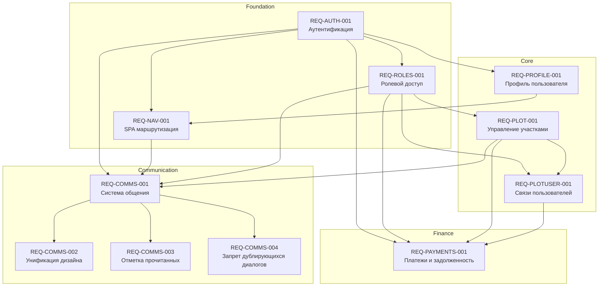

# Реестр требований приложения СНТ Берёзки-НТ

## Обзор

Данный каталог содержит спецификации требований к приложению для управления садоводческим некоммерческим товариществом (СНТ) «Берёзки-НТ». Приложение разработано на базе Next.js с использованием Client Components, next-auth для аутентификации, Prisma для работы с PostgreSQL базой данных и Clean Architecture / Layered Architecture.

* **Технологический стек:** Next.js 14+, TypeScript, PostgreSQL, Prisma, next-auth, Zod
* **Архитектура:** Clean Architecture с разделением на домены (domains), сервисы (services), репозитории (repositories) и API Route Handlers
* **Модель данных:** [`/docs/model/README.md`](/docs/model/README.md)

## Границы решения (In Scope / Out of Scope)

### In Scope

- Аутентификация и регистрация пользователей
- Управление профилями пользователей (данные, аватар, тема)
- Управление земельными участками (CRUD, поиск)
- Управление связями пользователей с участками
- Ролевой доступ (RBAC)
- SPA маршрутизация и навигация
- **Финансовое управление** — учёт платежей, расчёт задолженности, уведомления должников
- **Система общения** — личные сообщения, групповые чаты, объявления, модерация

### Out of Scope

- Документооборот (приказы, протоколы)
- Интеграции с внешними системами (Госуслуги, Росреестр)
- Мобильное приложение

## Бизнес-глоссарий

| Термин | Определение |
|--------|-------------|
| **СНТ** | Садоводческое некоммерческое товарищество — форма коллективного-ownedства земельными участками |
| **Участок (Plot)** | Земельный участок в пределах СНТ с уникальным номером и кадастровым номером |
| **Участник (Participant)** | Пользователь, связанный с участком через роль (владелец, проживающий, представитель) |
| **Пользователь (User)** | Регистрация в системе с email и паролем |
| **Профиль (UserProfile)** | Расширенная информация о пользователе (имя, фамилия, телефон, аватар) |
| **Роль (Role)** | Уровень доступа в системе (GUEST, MEMBER, ADMIN) |
| **Связь (PlotUser)** | Связь между пользователем и участком с указанием роли и статуса |
| **Платёж (Payment)** | Финансовая запись о внесении взноса: членского, целевого или пени |
| **Задолженность (Debt)** | Разница между установленной суммой взноса и суммой оплаченных платежей за период |
| **Ставка взноса (ContributionRate)** | Конфигурация суммы взноса на один участок за год для заданного типа взноса |

## Роли и стейкхолдеры

| Роль | Описание | Ответственность |
|------|----------|-----------------|
| **GUEST** | Гость системы | Доступ только к публичным страницам (landing, login, register) |
| **MEMBER** | Член СНТ | Просмотр участков, управление своим профилем, просмотр своих связей, просмотр своих платежей и задолженности |
| **ADMIN** | Администратор СНТ | Полный доступ: управление участками, участниками, ролями, управление взносами и платежами, отправка уведомлений должникам |

## Реестр требований

| ID | Название | Домен | Тип | Приоритет | Статус | Спецификация |
|----|----------|-------|-----|-----------|--------|--------------|
| [REQ-AUTH-001](REQ-AUTH-001.md) | Аутентификация и регистрация | Auth | functional | critical | Черновик | [Открыть](REQ-AUTH-001.md) |
| [REQ-PROFILE-001](REQ-PROFILE-001.md) | Управление профилем пользователя | UserProfile | functional | high | Черновик | [Открыть](REQ-PROFILE-001.md) |
| [REQ-PLOT-001](REQ-PLOT-001.md) | Управление участками | Plots | functional | critical | Черновик | [Открыть](REQ-PLOT-001.md) |
| [REQ-PLOTUSER-001](REQ-PLOTUSER-001.md) | Связи пользователей с участками | PlotUser | functional | high | Черновик | [Открыть](REQ-PLOTUSER-001.md) |
| [REQ-ROLES-001](REQ-ROLES-001.md) | Управление ролями и доступом | Roles | functional | high | Черновик | [Открыть](REQ-ROLES-001.md) |
| [REQ-NAV-001](REQ-NAV-001.md) | SPA маршрутизация и навигация | Navigation | functional | medium | Реализовано | [Открыть](REQ-NAV-001.md) |
| [REQ-PAYMENTS-001](REQ-PAYMENTS-001.md) | Уведомления о задолженности по взносам | Payments | functional | high | Черновик | [Открыть](REQ-PAYMENTS-001.md) |
| [REQ-COMMS-001](REQ-COMMS-001.md) | Система общения в СНТ | Communications | functional | high | Реализовано | [Открыть](REQ-COMMS-001.md) |
| [REQ-COMMS-002](REQ-COMMS-002.md) | Унификация дизайна экранов личных диалогов и групповых чатов | Communications | functional | medium | Утверждено | [Открыть](REQ-COMMS-002.md) |
| [REQ-COMMS-003](REQ-COMMS-003.md) | Отметка прочитанных сообщений и счётчики непрочитанных | Communications | functional | high | Реализовано | [Открыть](REQ-COMMS-003.md) |
| [REQ-COMMS-004](REQ-COMMS-004.md) | Запрет создания дублирующихся личных диалогов | Communications | functional | high | Реализовано | [Открыть](REQ-COMMS-004.md) |
| [REQ-INFRA-CICD-001](REQ-INFRA-CICD-001.md) | CI/CD пайплайн (GitHub Actions) | Infrastructure | tech-debt | medium | Реализовано | [Открыть](REQ-INFRA-CICD-001.md) |

## Зависимости между требованиями

## Нефункциональные требования (общие)

| Категория | Требование |
|-----------|-----------|
| **Безопасность** | Аутентификация через встроенный механизм, хеширование паролей, RBAC для доступа, валидация данных |
| **Производительность** | Загрузка страниц < 1s, API ответы < 500ms, кэширование данных |
| **Доступность** | WCAG 2.1 compliance, поддержка скринридеров, keyboard navigation |
| **Адаптивность** | Мобильные устройства, планшеты, десктоп |
| **Локализация** | Все сообщения на русском языке |
| **Тестирование** | Unit-тесты для Service-слоя, интеграционные тесты для API, component-тесты для UI |

## История изменений

| Версия | Дата | Описание изменений |
|--------|------|-------------------|
| 1.15 | 2026-08-06 | REQ-INFRA-CICD-001: Статус обновлён на "Реализовано" (B-013 завершён). Добавлено руководство разработчика по CI/CD (docs/guides/ci-cd-development.md) |
| 1.14 | 2026-08-06 | Добавлено REQ-INFRA-CICD-001: CI/CD пайплайн (GitHub Actions) (статус: Черновик, B-013) |
| 1.13 | 2026-08-04 | REQ-COMMS-004: Статус обновлён на "Реализовано" (B-029 завершён). Добавлена документация: API (POST 409/201), руководство разработчика (раздел 14), руководство пользователя, модель |
| 1.12 | 2026-08-04 | Добавлено REQ-COMMS-004: Запрет создания дублирующихся личных диалогов (статус: Черновик, B-029) |
| 1.11 | 2026-08-03 | REQ-COMMS-003: Статус обновлён на "Реализовано" (B-026 завершён). Добавлена документация: API (read endpoints), руководство разработчика (раздел 12) |
| 1.10 | 2026-07-31 | REQ-COMMS-003 актуализирован: нумерация BR/FR/NFR/EC/AC, формат приведён к единому стандарту. Статус → На согласовании |
| 1.9 | 2026-07-31 | Добавлено REQ-COMMS-003: Отметка прочитанных сообщений и счётчики непрочитанных (статус: Черновик) |
| 1.8 | 2026-07-30 | Добавлено REQ-COMMS-002: Унификация дизайна экранов личных диалогов и групповых чатов (статус: Утверждено) |
| 1.7 | 2026-07-28 | B-023 — sticky-низ контрола ввода сообщений: добавлен подраздел «Layout контрола ввода сообщений» с FR-REQ-COMMS-001-68..75 в REQ-COMMS-001 |
| 1.6 | 2026-07-27 | Реализована смена пароля (B-015): API `PUT /api/v1/auth/password`, UI `/settings/security`, 42 теста. Документация: API-спецификация и руководство пользователя |
| 1.5 | 2026-07-26 | REQ-NAV-001: Статус обновлён на "Реализовано", добавлена документация навигационной системы |
| 1.3 | 2026-07-24 | REQ-COMMS-001: Статус обновлён на "Реализовано", добавлена документация MVP |
| 1.2 | 2026-07-23 | Добавлено REQ-COMMS-001: Система общения в СНТ |
| 1.1 | 2026-07-21 | Добавлено REQ-PAYMENTS-001: Уведомления о задолженности по взносам |
| 1.0 | 2026-07-05 | Первоначальное создание реестра требований |
