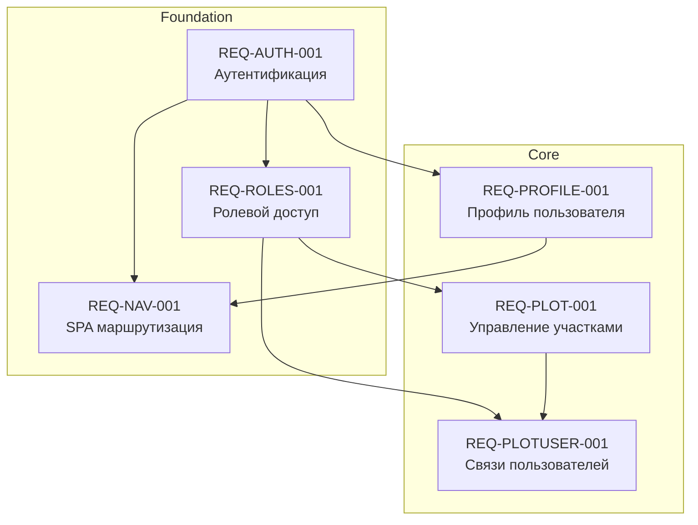

# Реестр требований приложения СНТ Берёзки-НТ

## Обзор

Данный каталог содержит спецификации требований к приложению для управления садоводческим некоммерческим товариществом (СНТ) «Берёзки-НТ». Приложение разработано на базе Next.js с использованием Client Components, next-auth для аутентификации, Prisma для работы с PostgreSQL базой данных и Clean Architecture / Layered Architecture.

* **Технологический стек:** Next.js 14+, TypeScript, PostgreSQL, Prisma, next-auth, Zod
* **Архитектура:** Clean Architecture с разделением на домены (domains), сервисы (services), репозитории (repositories) и API Route Handlers
* **Модель данных:** [`/docs/model/README.md`](/docs/model/README.md)

## Границы решения (In Scope / Out of Scope)

### In Scope

- Аутентификация и регистрация пользователей
- Управление профилями пользователей (данные, аватар, тема)
- Управление земельными участками (CRUD, поиск)
- Управление связями пользователей с участками
- Ролевой доступ (RBAC)
- SPA маршрутизация и навигация

### Out of Scope

- Финансовое управление (оплаты, задолженности)
- Документооборот (приказы, протоколы)
- Уведомления (email, SMS, push)
- Интеграции с внешними системами (Госуслуги, Росреестр)
- Мобильное приложение

## Бизнес-глоссарий

| Термин | Определение |
|--------|-------------|
| **СНТ** | Садоводческое некоммерческое товарищество — форма коллективного-ownedства земельными участками |
| **Участок (Plot)** | Земельный участок в пределах СНТ с уникальным номером и кадастровым номером |
| **Участник (Participant)** | Пользователь, связанный с участком через роль (владелец, проживающий, представитель) |
| **Пользователь (User)** | Регистрация в системе с email и паролем |
| **Профиль (UserProfile)** | Расширенная информация о пользователе (имя, фамилия, телефон, аватар) |
| **Роль (Role)** | Уровень доступа в системе (GUEST, MEMBER, ADMIN) |
| **Связь (PlotUser)** | Связь между пользователем и участком с указанием роли и статуса |

## Роли и стейкхолдеры

| Роль | Описание | Ответственность |
|------|----------|-----------------|
| **GUEST** | Гость системы | Доступ только к публичным страницам (landing, login, register) |
| **MEMBER** | Член СНТ | Просмотр участков, управление своим профилем, просмотр своих связей |
| **ADMIN** | Администратор СНТ | Полный доступ: управление участками, участниками, ролями |

## Реестр требований

| ID | Название | Домен | Тип | Приоритет | Статус | Спецификация |
|----|----------|-------|-----|-----------|--------|--------------|
| [REQ-AUTH-001](REQ-AUTH-001.md) | Аутентификация и регистрация | Auth | functional | critical | Черновик | [Открыть](REQ-AUTH-001.md) |
| [REQ-PROFILE-001](REQ-PROFILE-001.md) | Управление профилем пользователя | UserProfile | functional | high | Черновик | [Открыть](REQ-PROFILE-001.md) |
| [REQ-PLOT-001](REQ-PLOT-001.md) | Управление участками | Plots | functional | critical | Черновик | [Открыть](REQ-PLOT-001.md) |
| [REQ-PLOTUSER-001](REQ-PLOTUSER-001.md) | Связи пользователей с участками | PlotUser | functional | high | Черновик | [Открыть](REQ-PLOTUSER-001.md) |
| [REQ-ROLES-001](REQ-ROLES-001.md) | Управление ролями и доступом | Roles | functional | high | Черновик | [Открыть](REQ-ROLES-001.md) |
| [REQ-NAV-001](REQ-NAV-001.md) | SPA маршрутизация и навигация | Navigation | functional | medium | Черновик | [Открыть](REQ-NAV-001.md) |

## Зависимости между требованиями

## Нефункциональные требования (общие)

| Категория | Требование |
|-----------|-----------|
| **Безопасность** | Аутентификация через встроенный механизм, хеширование паролей, RBAC для доступа, валидация данных |
| **Производительность** | Загрузка страниц < 1s, API ответы < 500ms, кэширование данных |
| **Доступность** | WCAG 2.1 compliance, поддержка скринридеров, keyboard navigation |
| **Адаптивность** | Мобильные устройства, планшеты, десктоп |
| **Локализация** | Все сообщения на русском языке |
| **Тестирование** | Unit-тесты для Service-слоя, интеграционные тесты для API, component-тесты для UI |

## История изменений

| Версия | Дата | Описание изменений |
|--------|------|-------------------|
| 1.0 | 2026-07-05 | Первоначальное создание реестра требований |
