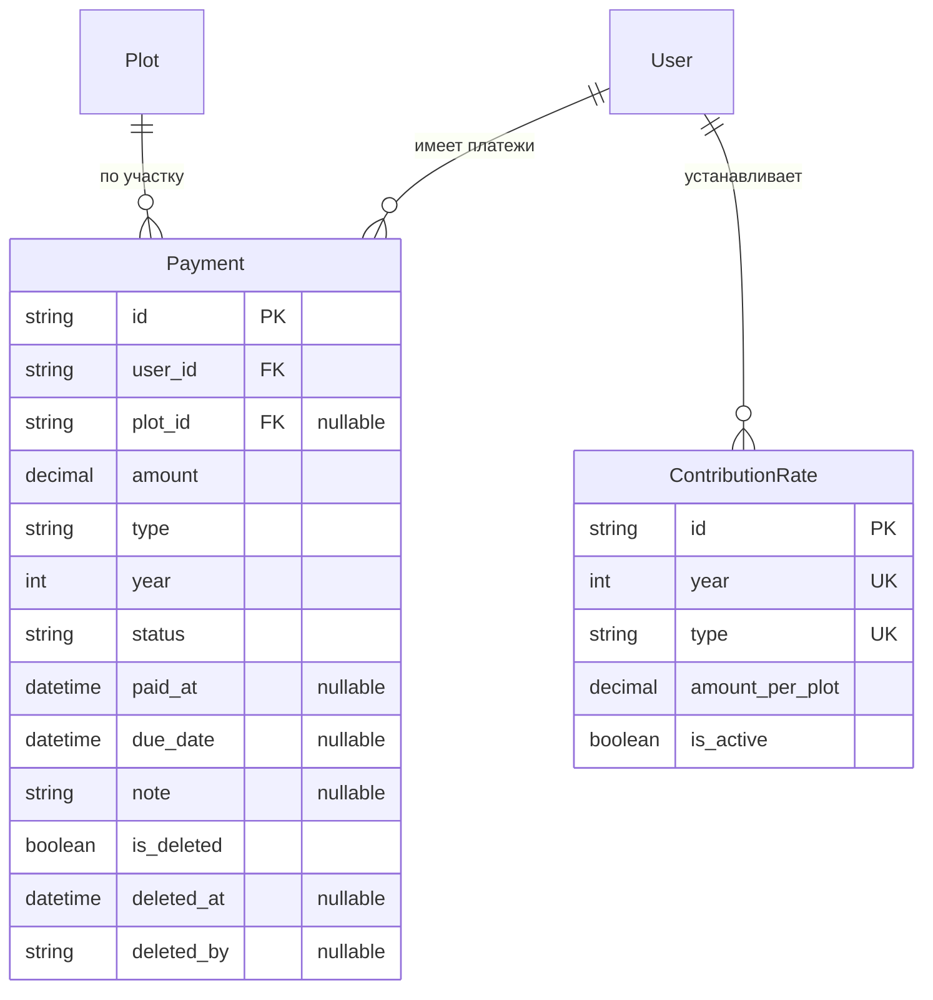

# REQ-PAYMENTS-001: Уведомления о задолженности по взносам

## 1. Бизнес-контекст и Цель

*В СНТ «Берёзки-НТ» ежегодно устанавливаются членские и целевые взносы. Председатель и бухгалтер тратят до 3 дней в месяц на ручное информирование должников. Требуется автоматизировать учёт платежей, расчёт задолженности и информирование садоводов.*

* **Бизнес-цель:** Сократить время на информирование должников с 3 дней до нескольких минут за счёт автоматического расчёта задолженности и отправки уведомлений.
* **Стейкхолдеры / Пользователи:**
  * *Бухгалтер* — хочет видеть список должников и отправлять уведомления одной кнопкой
  * *Садовод (член СНТ)* — хочет получать уведомления о задолженности и видеть историю платежей
  * *Председатель* — хочет контролировать процесс взыскания задолженности

## 2. Бизнес-правила и Логика (Business Rules)

* **BR-01:** Платежи принимаются только в рублях (RUB) — сумма должна быть положительным числом с точностью до 2 знаков после запятой
* **BR-02:** Один платёж относится к одному году и одному типу взноса
* **BR-03:** История платежей не удаляется физически — только soft delete (isDeleted = true)
* **BR-04:** Финансовые данные платежа видны только владельцу (садоводу, к чьему участку привязан платёж) и администратору
* **BR-05:** Типы взносов: членский (MEMBERSHIP_FEE), целевой (TARGET_FEE), пеня (PENALTY)
* **BR-06:** Статусы платежа: оплачен (PAID), ожидает подтверждения (PENDING), просрочен (OVERDUE), отменён (CANCELLED)
* **BR-07:** Задолженность рассчитывается как разница между установленной суммой взноса за год и суммой оплаченных платежей за этот год
* **BR-08:** Установленный размер взноса на год задаётся администратором в конфигурации (ContributionRate)

## 3. Функциональные требования

* **FR-01:** Система должна хранить историю платежей с полями: сумма, тип взноса, год, статус, ссылка на пользователя и участок
* **FR-02:** Система должна хранить конфигурацию ежегодных взносов: год, тип взноса, сумма на участок
* **FR-03:** Система должна предоставлять API для текущего пользователя (`GET /api/v1/payments/my-debt`) — информация о задолженности по всем его участкам
* **FR-04:** Система должна предоставлять API для администратора (`POST /api/v1/payments/notifications`) — создание уведомлений о задолженности для выбранных должников
* **FR-05:** Система должна предоставлять API для администратора (`GET /api/v1/payments/debtors`) — список всех должников с суммой задолженности
* **FR-06:** Система должна предоставлять API для администратора CRUD платежей (`GET/POST/PATCH/DELETE /api/v1/payments` и `/api/v1/payments/:id`)
* **FR-07:** Система должна предоставлять API для управления ставками взносов (`GET/POST/PATCH /api/v1/payments/rates`)
* **FR-08:** Система должна отображать страницу «Мои взносы» в личном кабинете садовода
* **FR-09:** Система должна отображать страницу «Управление взносами» в админ-панели
* **FR-10:** При удалении платежа (soft delete) запись помечается как удалённая, но остаётся в БД

## 4. Пользовательские истории

<!-- Будут созданы после утверждения требований -->

## 5. Нефункциональные требования (NFR) и Ограничения

* **Безопасность:**
  * Все операции с платежами требуют авторизации
  * Финансовые данные конфиденциальны: садовод видит только свои платежи, администратор — все
  * Валидация всех входных данных на сервере через Zod-схемы
  * Аудит действий: soft delete фиксирует, кто и когда удалил запись
* **Производительность:**
  * Расчёт задолженности: < 500ms для одного пользователя
  * Загрузка списка должников: < 1s при до 1000 записей
* **Финансовые ограничения:**
  * Все суммы в рублях (RUB)
  * Точность: Decimal(10, 2) — до 2 знаков после запятой
  * Максимальная сумма платежа: 99 999 999.99 руб.
* **Локализация:** Все сообщения на русском языке

## 6. Исключения и Граничные кейсы (Edge Cases)

* **EC-01:** Садовод не привязан ни к одному участку — отображается сообщение «Нет привязанных участков»
* **EC-02:** За год не установлена ставка взноса — задолженность не рассчитывается, отображается «Ставка не установлена»
* **EC-03:** Платеж с нулевой или отрицательной суммой — ошибка валидации
* **EC-04:** Попытка удалить платёж без указания причины (deletedBy) — ошибка валидации
* **EC-05:** Должник с несколькими участками — задолженность суммируется по всем участкам
* **EC-06:** Переплата по взносу (оплачено больше, чем начислено) — отображается положительный баланс

## 7. Критерии приёмки

1. Садовод может просмотреть свою задолженность на странице «Мои взносы»
2. Садовод видит сумму задолженности за текущий и предыдущие годы
3. Администратор может просмотреть список всех должников с суммой задолженности
4. Администратор может создать уведомление о задолженности для выбранных должников
5. Администратор может добавлять/редактировать платежи (ручной ввод оплаты)
6. Администратор может устанавливать ставки взносов на год
7. При удалении платежа запись не исчезает из БД (soft delete)
8. Неавторизованный пользователь получает 401 при попытке доступа к API платежей
9. Садовод не видит чужие платежи (403 при попытке доступа)

## 8. Модель данных

### Сущности

#### Payment — Платёж

| Поле | Тип | Обязательное | Описание |
|------|-----|-------------|----------|
| `id` | String | Да | Уникальный идентификатор (cuid) |
| `user_id` | String | Да | Ссылка на пользователя (кто оплатил) |
| `plot_id` | String? | Нет | Ссылка на участок (за который платёж) |
| `amount` | Decimal(10,2) | Да | Сумма платежа в рублях |
| `type` | PaymentType | Да | Тип взноса: MEMBERSHIP_FEE, TARGET_FEE, PENALTY |
| `year` | Int | Да | Год, за который производится платёж |
| `status` | PaymentStatus | Да | Статус: PAID, PENDING, OVERDUE, CANCELLED |
| `paid_at` | DateTime? | Нет | Дата фактической оплаты |
| `due_date` | DateTime? | Нет | Срок оплаты |
| `note` | String? | Нет | Примечание к платежу |
| `is_deleted` | Boolean | Да | Флаг soft delete |
| `deleted_at` | DateTime? | Нет | Дата удаления |
| `deleted_by` | String? | Нет | ID пользователя, удалившего запись |
| `created_at` | DateTime | Да | Дата создания |
| `updated_at` | DateTime | Да | Дата обновления |

#### ContributionRate — Ставка взноса

| Поле | Тип | Обязательное | Описание |
|------|-----|-------------|----------|
| `id` | String | Да | Уникальный идентификатор (cuid) |
| `year` | Int | Да | Год действия ставки |
| `type` | PaymentType | Да | Тип взноса |
| `amount_per_plot` | Decimal(10,2) | Да | Сумма на один участок |
| `is_active` | Boolean | Да | Активна ли ставка |
| `created_at` | DateTime | Да | Дата создания |
| `updated_at` | DateTime | Да | Дата обновления |

### Связи

## 9. API Endpoints

| Метод | Путь | Доступ | Описание |
|-------|------|--------|----------|
| `GET` | `/api/v1/payments/my-debt` | owner | Задолженность текущего пользователя |
| `GET` | `/api/v1/payments/debtors` | role (ADMIN) | Список всех должников |
| `POST` | `/api/v1/payments/notifications` | role (ADMIN) | Создание уведомлений для должников |
| `GET` | `/api/v1/payments` | role (ADMIN) | Список всех платежей |
| `POST` | `/api/v1/payments` | role (ADMIN) | Создание платежа |
| `GET` | `/api/v1/payments/:id` | owner/role | Детали платежа |
| `PATCH` | `/api/v1/payments/:id` | role (ADMIN) | Обновление платежа |
| `DELETE` | `/api/v1/payments/:id` | role (ADMIN) | Soft delete платежа |
| `GET` | `/api/v1/payments/rates` | role (ADMIN) | Список ставок взносов |
| `POST` | `/api/v1/payments/rates` | role (ADMIN) | Создание ставки |
| `PATCH` | `/api/v1/payments/rates/:id` | role (ADMIN) | Обновление ставки |

## 10. Роли и права доступа

| Роль | Платежи | Ставки | Уведомления |
|------|---------|--------|-------------|
| **ADMIN** | Полный CRUD | Полный CRUD | Создание |
| **MEMBER (садовод)** | Только свои (my-debt) | Только просмотр | Только получение |
| **GUEST** | Нет доступа | Нет доступа | Нет доступа |
