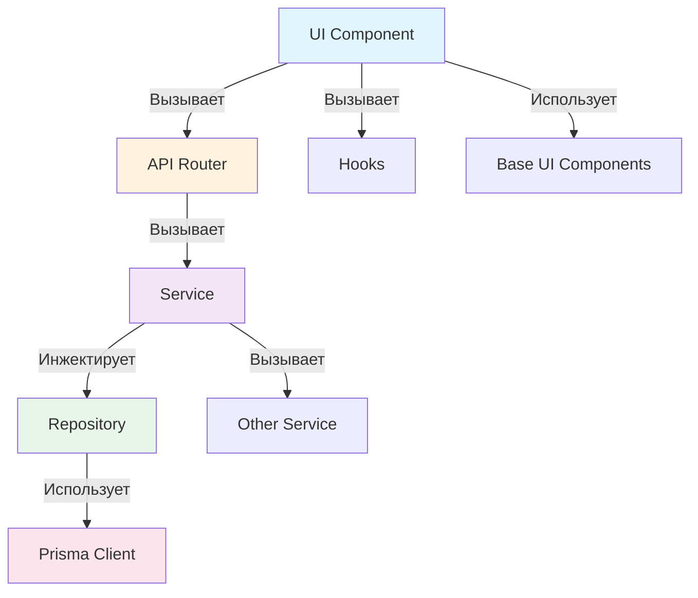

# Матрица зависимостей компонентов

## Навигация

| Тип | Зависимости |
|-----|-------------|
| [Repository](#1-repository-зависимости) | БД, ORM |
| [Service](#2-service-зависимости) | Repository, другие Service |
| [API Router](#3-api-router-зависимости) | Service, Auth utilities |
| [UI Component](#4-ui-component-зависимости) | Server Components, API Routes, Hooks |

---

## 1. Repository зависимости

| Зависимость | Путь | Назначение |
|-------------|------|------------|
| `@prisma/client` | `src/lib/prisma.ts` | ORM клиент |
| `_errors` | `src/repositories/_lib/errors.ts` | Классы ошибок |

### Правила

- Repository НЕ зависит от других Repository
- Repository НЕ зависит от Service
- Repository НЕ зависит от UI компонентов

---

## 2. Service зависимости

| Зависимость | Путь | Назначение |
|-------------|------|------------|
| Repository | `src/repositories/` | Доступ к данным |
| другие Service | `src/services/` | Вызов бизнес-логики |
| `_errors` | `src/services/_lib/errors.ts` | Классы ошибок |

### Правила

- Service НЕ зависит от API Router
- Service НЕ зависит от UI компонентов
- Service НЕ зависит от Next.js (чистая логика)

---

## 3. API Router зависимости

| Зависимость | Путь | Назначение |
|-------------|------|------------|
| Service | `src/services/` | Бизнес-логика |
| Auth utility | `src/app/api/_lib/auth.ts` | Аутентификация |
| Response utility | `src/app/api/_lib/response.ts` | Форматирование ответов |
| Zod | `zod` | Валидация |

### Правила

- API Router НЕ содержит бизнес-логику
- API Router НЕ работает с Prisma напрямую

---

## 4. UI Component зависимости

| Зависимость | Путь | Назначение |
|-------------|------|------------|
| UI базовые | `src/components/ui/` | Button, Input и т.д. |
| Layout | `src/components/layout/` | Header, Sidebar |
| Forms | `src/components/forms/` | Формы |
| Features | `src/components/features/` | Доменные компоненты |
| Hooks | `src/hooks/` | Кастомные хуки |
| Lib | `src/lib/` | Утилиты |
| Providers | `src/components/providers/` | Контекст-провайдеры |

### Rules

- UI НЕ работает с Prisma напрямую
- UI НЕ содержит бизнес-логику — только вызов Server Actions или API
- Предпочтительно использовать Client Components с `use client`

---

## Граф зависимостей

---

## Внешние зависимости

| Пакет | Версия | Назначение | Уровень |
|-------|--------|------------|---------|
| `next` | ^14.x | Фреймворк | Все |
| `react` | ^18.x | UI | UI |
| `prisma` | ^5.x | ORM | Repository |
| `zod` | ^3.x | Валидация | Все |
| `next-auth` | ^5.x | Аутентификация | API, Middleware |
| `clsx` | ^2.x | Классы | UI |
| `tailwind-merge` | ^2.x | Слияние классов | UI |

> ⚠️ Новые пакеты без согласования через спецификацию устанавливать запрещено.
