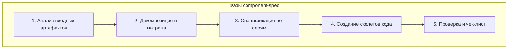

# 🏗️ Skill: Создание спецификации компонент

> **Назначение:** Skill для режима `component-spec` — создание спецификаций компонент и скелетов кода на основе плана реализации и User Stories.
> **Вызывается:** Orchestrator'ом при переходе от `planner` к `component-spec` режиму.
> **Вход:** План реализации + US + REQ + Модель данных

---

## Входные артефакты

| Артефакт | Путь | Назначение |
|---|---|---|
| План реализации | `docs/plans/{feature}-realization-plan.md` | Основной источник задач |
| User Stories | `docs/user-stories/US-*.md` | Критерии приёмки и поведение |
| Требования | `docs/requirements/REQ-*.md` | Бизнес-правила |
| Модель данных | `docs/model/entities/*.md` | Сущности и связи |
| Существующие компоненты | `src/components/features/` | Референс для переиспользования |
| Существующие домены | `src/domains/` | Референсная архитектура |
| Шаблон spec | `docs/templates/component-spec-template.md` | Шаблон для заполнения |

## Выходные артефакты

| Артефакт | Путь | Описание |
|---|---|---|
| Спецификация компонент | `docs/specs/{feature}/component-spec.md` | Документ со спецификацией |
| Доменный слой | `src/domains/{domain}/` | Скелеты types, validators, errors, repository, service |
| API слой | `src/app/api/v1/{resource}/` | Скелеты route handlers |
| UI слой | `src/components/features/{domain}/` | Скелеты компонентов |
| Hooks | `src/hooks/use{Hook}.ts` | Скелеты хуков |
| Pages | `src/app/dashboard/{resource}/` | Скелеты страниц |

---

## Процесс работы



---

### Фаза 1: Анализ входных артефактов

1. **Прочитать план реализации** (`docs/plans/{feature}-realization-plan.md`)
   - Определить все задачи по слоям (Domain, API, UI, Hooks, Pages)
   - Определить новые домены и изменения в существующих

2. **Прочитать User Stories** (`docs/user-stories/US-*.md`)
   - Выделить критерии приёмки (AC) для каждой US
   - Зафиксировать граничные случаи (EC)

3. **Прочитать требования** (`docs/requirements/REQ-*.md`)
   - Определить бизнес-правила (BR)
   - Зафиксировать функциональные требования (FR)

4. **Прочитать модель данных** (`docs/model/entities/*.md`)
   - Определить сущности, поля, типы, связи

5. **Проанализировать существующий код**
   - Проверить `src/components/features/` на переиспользование
   - Проверить `src/domains/` на существующие паттерны
   - Проверить `src/components/ui/` на базовые UI-компоненты

---

### Фаза 2: Декомпозиция и матрица трассировки

1. **Выделить все компоненты по слоям** на основе задач из плана:

| Слой | Тип компонента | Источник в плане |
|---|---|---|
| Domain | `Types`, `Validators`, `Errors`, `Repository`, `Service` | Задачи 2.x |
| API | `Route handlers` | Задачи 8.x |
| UI | `Feature components` | Задачи 9.x |
| Hooks | `use{Hook}` | Задачи 10.x |
| Pages | `Page` | Задачи 11.x |

2. **Определить действие** для каждого компонента:

| Действие | Когда |
|---|---|
| 🆕 Создать | Компонента нет в проекте (новый домен) |
| ✏️ Добавить | Существующий файл + новый метод/тип |
| 🔧 Изменить | Изменение существующего enum/interface |

3. **Сформировать матрицу трассировки** (формат V2 — компактная):

```markdown
| # | Компонент | Слой | Действие | US | AC | Задача | Статус |
|---|---|---|---|---|---|---|---|
| 1 | DocumentTypes | Domain | 🆕 | US-22-05 | AC-1..3 | DOCS-T2.1.2 | `[TODO]` |
```

4. **Проверить покрытие AC:**

```markdown
### Проверка покрытия AC

| US | AC | Покрыт в строке | Статус |
|---|---|---|---|
| US-22-05 | AC-1 | #1, #5 | ✅ |
| US-22-05 | AC-8 | — | ❌ `[MISSING]` |
```

5. **Показать матрицу пользователю для обсуждения**

---

### Фаза 3: Спецификация по слоям

Для каждого слоя заполнить описание компонентов.

#### 3.1 Domain Layer

**Для каждой сущности:**

| Компонент | Что заполнить |
|---|---|
| `Types` | Таблица интерфейсов + поля + инварианты |
| `Validators` | Таблица схем + правила валидации |
| `Errors` | Таблица классов ошибок + сценарии |
| `Repository Interface` | Таблица методов + параметры + возврат |
| `Repository Prisma` | Описание DI-зависимостей |
| `Service` | Таблица методов + бизнес-правила + DI |

**Пример Types:**
```markdown
#### 3.1.1 `DocumentTypes`

| Параметр | Значение |
|---|---|
| **Файл** | `src/domains/documents/document.types.ts` |
| **Действие** | 🆕 Создать |
| **Задача** | DOCS-T2.1.2 |
| **Трассировка** | US-22-05 AC-1..3 → FR-05 |

**Интерфейсы:**

| Интерфейс | Описание | Поля |
|---|---|---|
| `Document` | Полная сущность | `id, title, description?, originalName, ...` |
| `CreateDocumentData` | Данные для создания | `originalName, storagePath, ...` |
| `DocumentFilter` | Фильтры поиска | `categoryId?, status?, search?, page?, limit?` |

**Инварианты:**
- `document.status` transition: draft → published → archived
- `visibleRoles` не может быть пустым при публикации
```

#### 3.2 API Layer

**Для каждого resources:**

| Компонент | Что заполнить |
|---|---|
| Collection Route | Таблица endpoints (GET/POST) с auth, ролями, response, ошибками |
| Detail Route | Таблица endpoints (GET/PUT/DELETE) |

**Пример:**
```markdown
#### 3.2.1 `DocumentsRoute` (Collection)

| Параметр | Значение |
|---|---|
| **Файл** | `src/app/api/v1/documents/route.ts` |
| **Действие** | 🆕 Создать |
| **Задача** | DOCS-T8.1 |

**Endpoints:**

| Метод | Путь | Auth | Роль | Response | Ошибки |
|---|---|---|---|---|---|
| GET | /documents | ✅ | Все | 200: { success, data } | 401 |
| POST | /documents | ✅ | ADMIN | 201: { success, data } | 400, 401, 403, 409 |
```

#### 3.3 UI Layer

**Для каждого компонента:**

| Компонент | Что заполнить |
|---|---|
| Feature Component | Props interface + таблица состояний + поведение + оценка 50 строк |

**Пример:**
```markdown
#### 3.3.1 `DocumentList`

| Параметр | Значение |
|---|---|
| **Файл** | `src/components/features/documents/DocumentList.tsx` |
| **Задача** | DOCS-T9.1 |

**Props:**

| Пропс | Тип | Обязательный | Описание |
|---|---|---|---|
| filter | DocumentFilter | ❌ | Фильтры |
| onCardClick | (id: string) => void | ❌ | Callback |

**Состояния:** loading, error, empty, data

**⚠️ Оценка:** ~45 строк — в пределах 50
```

#### 3.4 Hooks

**Для каждого хука:**

```markdown
#### 3.4.1 `useDocuments`

| Параметр | Значение |
|---|---|
| **Файл** | `src/hooks/useDocuments.ts` |
| **Задача** | DOCS-T10.1 |

**Возвращает:** `{ data, loading, error, refetch, page, setPage }`

**Поведение:**
- Загружает данные при mount через apiClient.get('/documents')
- Debounce 300ms для поиска
- Cleanup при unmount
```

#### 3.5 Pages

**Для каждой страницы:**

```markdown
#### 3.5.1 `DocumentsPage`

| Параметр | Значение |
|---|---|
| **Файл** | `src/app/dashboard/documents/page.tsx` |
| **Задача** | DOCS-T11.1 |

**Состав:** DocumentList, DocumentFilters, DocumentPagination
```

---

### Фаза 4: Создание скелетов кода

> **Важно:** Скелеты создаются как **отдельные файлы** в `src/` (не в spec.md).

#### 4.1 Порядок создания

1. Domain Layer (снизу вверх): types → validators → errors → repository → service
2. API Layer: routes
3. DI Container: регистрация
4. Hooks
5. UI Layer: feature components
6. Pages

#### 4.2 Правила для каждого файла

| Правило | Описание |
|---|---|
| **Imports** | Все необходимые импорты из проекта |
| **JSDoc** | `@component`/`@type`/`@domain`/`@spec`/`@traces`/`@task` |
| **Interfaces** | Полные типизированные интерфейсы |
| **Реализация** | `throw new Error('[TODO] Описание — TASK-ID')` для методов |
| **index.ts** | Re-export всех публичных элементов |
| **'use client'** | Наверху UI-компонентов |

#### 4.3 Пример скелета (Domain)

```typescript
/**
 * @interface IDocumentRepository
 * @domain documents
 * @description Интерфейс репозитория для работы с документами
 *
 * @spec
 * - Все методы асинхронные
 * - findById возвращает null если не найден
 *
 * @traces US-22-05 AC-1..5
 * @task DOCS-T2.4.1
 */
export interface IDocumentRepository {
  findById(id: string): Promise<Document | null>;
  findByFilter(filter: DocumentFilter): Promise<PaginatedResult<Document>>;
  create(data: CreateDocumentData): Promise<Document>;
  update(id: string, data: UpdateDocumentData): Promise<Document>;
  delete(id: string): Promise<void>;
}

/**
 * @class DocumentRepositoryPrisma
 * @implements IDocumentRepository
 */
export class DocumentRepositoryPrisma implements IDocumentRepository {
  constructor(private prisma: PrismaClient) {}

  async findById(id: string): Promise<Document | null> {
    throw new Error('[TODO] Реализовать поиск документа по ID — DOCS-T2.5.1');
  }

  async findByFilter(filter: DocumentFilter): Promise<PaginatedResult<Document>> {
    throw new Error('[TODO] Реализовать поиск документов по фильтру — DOCS-T2.5.2');
  }

  // ... остальные методы
}
```

#### 4.4 Пример скелета (UI)

```tsx
'use client';

import { useState, useEffect } from 'react';
import { apiClient } from '@/lib/api-client';
import { useSession } from 'next-auth/react';
import type { Document, DocumentFilter } from '@/domains/documents/document.types';

/**
 * @component DocumentList
 * @category documents
 * @description Список документов с поддержкой фильтрации
 *
 * @spec
 * - Загружает данные при mount
 * - Обработаны состояния: loading, error, empty, data
 *
 * @traces US-22-05 AC-1, AC-9
 * @task DOCS-T9.1
 */
export interface DocumentListProps {
  filter?: DocumentFilter;
  onCardClick?: (documentId: string) => void;
}

export function DocumentList({ filter, onCardClick }: DocumentListProps) {
  const { data: session } = useSession();
  const [documents, setDocuments] = useState<Document[]>([]);
  const [loading, setLoading] = useState(true);
  const [error, setError] = useState<string | null>(null);

  useEffect(() => {
    // [TODO] Загрузить список документов — DOCS-T9.1
  }, [filter]);

  if (loading) return <div role="status" aria-label="Загрузка">Загрузка...</div>;
  if (error) return <div role="alert" aria-label="Ошибка">{error}</div>;
  if (documents.length === 0) return <div>Пустое состояние</div>;

  return (
    <div role="region" aria-label="Список документов">
      {/* [TODO] Отобразить список документов — DOCS-T9.1 */}
    </div>
  );
}
```

---

### Фаза 5: Проверка и чек-лист

1. **Spec-файл:**
   - [ ] Матрица трассировки покрывает все AC из всех US
   - [ ] Каждый компонент имеет TASK-ID из плана

2. **Скелеты кода:**
   - [ ] Все файлы созданы по матрице трассировки
   - [ ] JSDoc с `@spec`, `@traces`, `@task` на каждом элементе
   - [ ] TypeScript компилируется (`tsc --noEmit`)
   - [ ] index.ts файлы содержат правильные re-export

3. **Архитектура:**
   - [ ] DDD-архитектура соблюдена
   - [ ] DI через интерфейсы
   - [ ] API пути относительные (без `/api/v1`)
   - [ ] `'use client'` наверху клиентских компонентов
   - [ ] `apiClient` для запросов, `useSession()` для авторизации

4. **Запросить approve у пользователя**

---

## Правила и ограничения

- **Скелеты — это НЕ реализация.** Только интерфейсы + `throw new Error('[TODO]')`
- **Один файл — одна ответственность**
- **Следовать существующим конвенциям** (см. `src/domains/auth/` для примера)
- **Не добавлять бизнес-логику** — только структуру
- **Предупреждать о >50 строках** — предлагать разбиение

## Критерии качества

- [ ] Все задачи из плана имеют соответствующий скелет
- [ ] Матрица трассировки покрывает все AC
- [ ] Интерфейсы полные и типизированные
- [ ] TypeScript компилируется (`tsc --noEmit`)
- [ ] Скелеты следуют DDD-архитектуре проекта

## Взаимодействие с пользователем

- После декомпозиции — показать матрицу для обсуждения
- После создания скелетов — показать diff и запросить approve
- При неоднозначностях — предложить 2 варианта с pros/cons

## 🔗 Связанные артефакты

- **Шаблон:** [`docs/templates/component-spec-template.md`](../templates/component-spec-template.md)
- **Правила:** [`docs/rules/component-spec-rules.md`](../rules/component-spec-rules.md)
- **Референс:** [`src/domains/auth/`](../../../src/domains/auth/)
- **Референс UI:** [`src/components/features/auth/LoginForm/LoginForm.tsx`](../../../src/components/features/auth/LoginForm/LoginForm.tsx)
- **Правила API:** [`docs/rules/api-endpoint-rules.md`](../rules/api-endpoint-rules.md)
