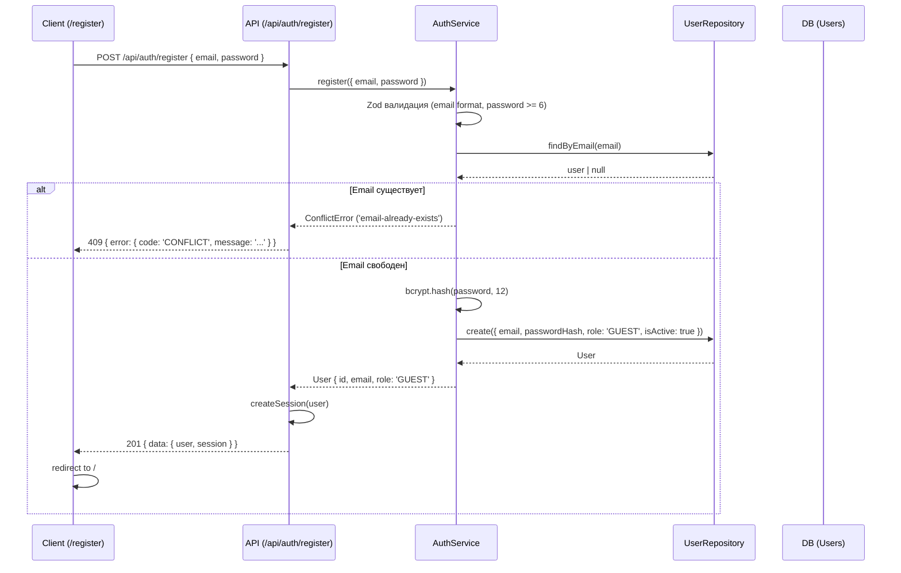
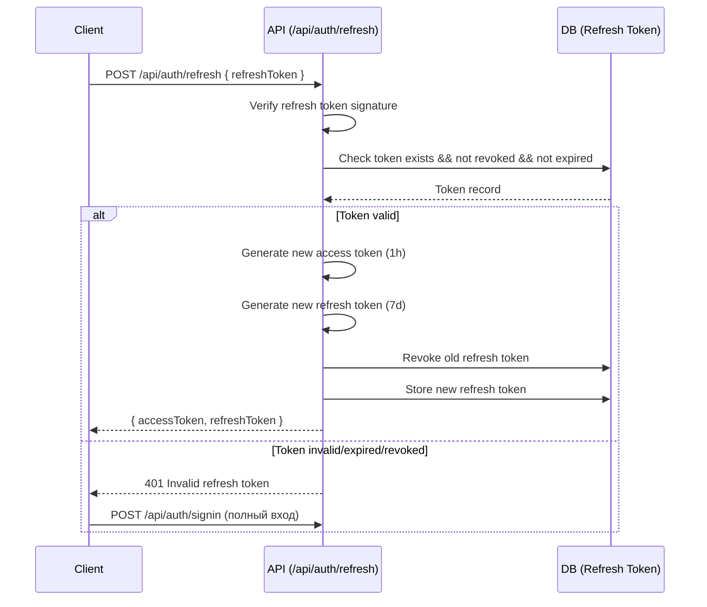
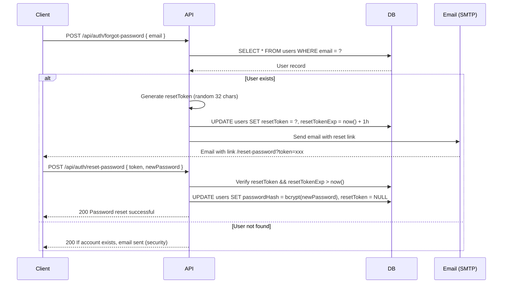

# Auth & Authorization — Аутентификация и авторизация

## Статус: На обсуждении

---

## 0. Общие положения

### 0.1 Назначение

Спецификация определяет общие правила аутентификации, авторизации и управления сессиями в приложении.

### 0.2 Инструмент

**NextAuth.js** (v5) с JWT стратегией и refresh tokens.

---

## 1. Аутентификация

### 1.1 Метод аутентификации

| Метод | Описание | Статус |
|-------|----------|--------|
| **Email/Password** | Логин через email + bcrypt пароль | Обязательно |
| **Регистрация** | Создание учётной записи по email + password | Обязательно |

### 1.2 Регистрация (Register)

**Описание:** Новый пользователь может создать учётную запись через `/register`, введя email и пароль.

**Параметры:**

| Параметр | Требование | Обоснование |
|----------|------------|-------------|
| Email | Валидный email, уникальный | Основной идентификатор |
| Пароль | Минимальная длина 6 символов | Безопасность |
| Роль | GUEST (по умолчанию) | Новый пользователь без полного доступа |
| isActive | true (авто-активация) | Без email-верификации на данном этапе |

**Процесс:**



**Бизнес-правила:**

| ID | Правило | Описание | Ошибка |
|----|---------|----------|--------|
| REG-001 | Уникальность email | email не должен существовать в системе | `ConflictError` |
| REG-002 | Минимальная длина пароля | >= 6 символов | `ValidationError` |
| REG-003 | Автоматическая роль GUEST | Новый пользователь получает роль GUEST | — |
| REG-004 | Автоматическая активация | `isActive = true` сразу | — |

### 1.3 Email/Password аутентификация

**Параметры:**

| Параметр | Требование | Обоснование |
|----------|------------|-------------|
| Email | Валидный email, уникальный | Основной идентификатор |
| Пароль | Минимальная длина зависит от требований безопасности | Безопасность |
| Хеширование | bcrypt, rounds = 12 | Стойкость к брутфорсу |

### 1.4 JWT Token

**Структура access токена:**

```typescript
interface AccessToken {
  sub: string        // User ID
  email: string      // Email пользователя
  exp: number        // Expires (timestamp)
  iat: number        // Issued at (timestamp)
}
```

**Параметры токена:**

| Параметр | Значение | Обоснование |
|----------|----------|-------------|
| Secret | `process.env.NEXTAUTH_SECRET` (32 chars base64) | Безопасность подписи |
| Expiration | 1 час | Баланс безопасности и удобства |
| Algorithm | HS256 | Стандарт JWT |

**Структура refresh токена:**

```typescript
interface RefreshToken {
  sub: string        // User ID
  type: 'refresh'    // Тип токена
  exp: number        // Expires (timestamp)
  iat: number        // Issued at (timestamp)
  jti: string        // Unique token ID (для отзыва)
}
```

**Параметры refresh токена:**

| Параметр | Значение | Обоснование |
|----------|----------|-------------|
| Secret | Тот же, что для access токена | Упрощение |
| Expiration | 7 дней | Удобство пользователя |
| Хранение | БД (для возможности отзыва) | Безопасность |

### 1.5 Обновление токена (Refresh Token Flow)

**Процесс:**



### 1.6 Восстановление пароля

**Процесс:**



---

## 2. Авторизация

### 2.1 Общие принципы

Авторизация реализуется через проверку прав доступа к ресурсам. Конкретные роли и права определяются в функциональных требованиях каждого домена.

### 2.2 Middleware для проверки авторизации

**Общий подход (`src/middleware.ts`):**

```typescript
import { NextResponse } from 'next/server'
import type { NextRequest } from 'next/server'
import { getToken } from 'next-auth/jwt'

export async function middleware(request: NextRequest) {
  const token = await getToken({ req: request })
  const { pathname } = request.nextUrl
  
  // Публичные маршруты
  const publicPaths = ['/login', '/api/public']
  if (publicPaths.some(path => pathname.startsWith(path))) {
    return NextResponse.next()
  }
  
  // Требует авторизации
  if (!token) {
    return NextResponse.redirect(new URL('/login', request.url))
  }
  
  return NextResponse.next()
}

export const config = {
  matcher: ['/((?!api|_next/static|_next/image|favicon.ico).*)'],
}
```

### 2.3 Проверка прав на уровне API

**Утилита авторизации (`src/lib/auth-util.ts`):**

```typescript
import { getServerSession } from 'next-auth'
import { authOptions } from '@/lib/auth'
import { NextRequest } from 'next/server'

export async function requireAuth(req: NextRequest) {
  const session = await getServerSession(authOptions)
  
  if (!session?.user?.id) {
    throw new Error('UNAUTHORIZED')
  }
  
  return {
    userId: session.user.id,
    email: session.user.email,
  }
}
```

**Использование в API Router:**

```typescript
import { requireAuth } from '@/lib/auth-util'

export async function GET(request: Request) {
  const user = await requireAuth(request)
  // ... логика для авторизованного пользователя
}
```

### 2.4 Правовые проверки

Правовые проверки реализуются на уровне Service слоя:

```typescript
class DocumentService {
  async deleteDocument(userId: string, documentId: string) {
    const document = await this.documentRepository.findById(documentId)
    
    // Проверка права доступа
    if (document.authorId !== userId && !this.isAdmin(userId)) {
      throw new ForbiddenError('Cannot delete document')
    }
    
    return this.documentRepository.delete(documentId)
  }
}
```

---

## 3. Управление сессиями

### 3.1 JWT Strategy

**Конфигурация (`src/lib/auth.ts`):**

```typescript
export const authOptions: NextAuthOptions = {
  adapter: PrismaAdapter(prisma),
  providers: [
    CredentialsProvider({
      // ... credentials provider config
    }),
  ],
  session: {
    strategy: 'jwt',
  },
  callbacks: {
    async jwt({ token, user }) {
      if (user) {
        token.sub = user.id
        token.email = user.email
      }
      return token
    },
    async session({ session, token }) {
      if (session.user) {
        session.user.id = token.sub
        session.user.email = token.email
      }
      return session
    },
  },
  pages: {
    signIn: '/login',
    error: '/login',
  },
  tokens: {
    session: {
      maxAge: 60 * 60, // 1 hour (access token)
    },
    jwt: {
      secret: process.env.NEXTAUTH_SECRET,
    },
  },
}
```

### 3.2 Использование сессии в компонентах

**Client Component:**

```typescript
'use client'

import { useSession } from 'next-auth/react'

export function UserProfile() {
  const { data: session, status } = useSession()
  
  if (status === 'loading') return <div>Loading...</div>
  if (!session) return <LoginButton />
  
  return (
    <div>
      <p>{session.user.email}</p>
    </div>
  )
}
```

**Server Component:**

```typescript
import { getServerSession } from 'next-auth'
import { authOptions } from '@/lib/auth'

export default async function DashboardPage() {
  const session = await getServerSession(authOptions)
  
  if (!session) {
    return <Redirect to="/login" />
  }
  
  return <div>Welcome</div>
}
```

---

## 4. WebSocket авторизация

### 4.1 Подключение к WebSocket

**Клиент:**

```typescript
const ws = new WebSocket('wss://example.com/ws', {
  headers: {
    Authorization: `Bearer ${accessToken}`,
  },
})
```

### 4.2 Валидация токена на сервере

**`ws-server/src/utils/auth.ts`:**

```typescript
import { verify } from 'jsonwebtoken'

const WS_INTERNAL_SECRET = process.env.WS_INTERNAL_SECRET!

export function verifyWsToken(token: string): { sub: string; email: string } {
  try {
    const decoded = verify(token, WS_INTERNAL_SECRET) as {
      sub: string
      email: string
    }
    return decoded
  } catch {
    throw new Error('INVALID_WS_TOKEN')
  }
}
```

### 4.3 WebSocket авторизация

Авторизация в WebSocket определяется функциональными требованиями домена (чат, уведомления).

---

## 5. Безопасность

### 5.1 Защита от брутфорса

**Ограничение попыток входа:**

| Лимит | Период | Действие |
|-------|--------|----------|
| N неудачных попыток | N минут | Блокировка IP |
| N неудачных попыток | N часов | Блокировка IP + email |

### 5.2 Защита сессии

| Мера | Описание |
|------|----------|
| HTTPS только | `Secure` cookie flag |
| HTTP only cookie | JS не может получить токен |
| SameSite | `Strict` для предотвращения CSRF |
| Token rotation | Новый refresh token при каждом использовании |
| Token revocation | Возможность отзыва через БД |

### 5.3 Хеширование паролей

**bcrypt параметры:**

| Параметр | Значение |
|----------|----------|
| rounds | 12 |
| Время хеширования | ~250ms |
| Стойкость к брутфорсу | ~4 попытки/сек на CPU |

### 5.4 Защита восстановления пароля

| Мера | Описание |
|------|----------|
| Срок действия | Reset token истекает через 1 час |
| Одноразовость | Token используется один раз |
| Безопасный ответ | "Если аккаунт существует, email отправлен" |

---

## 6. Чек-лист качества

> ℹ️ **Полный чек-лист** аутентификации — в [`shared/checklists.md#5-аутентификация`](../../shared/checklists.md#5-аутентификация)

---

## 7. История изменений

> ℹ️ Единый журнал изменений — в [`CHANGELOG.md`](../../CHANGELOG.md)
