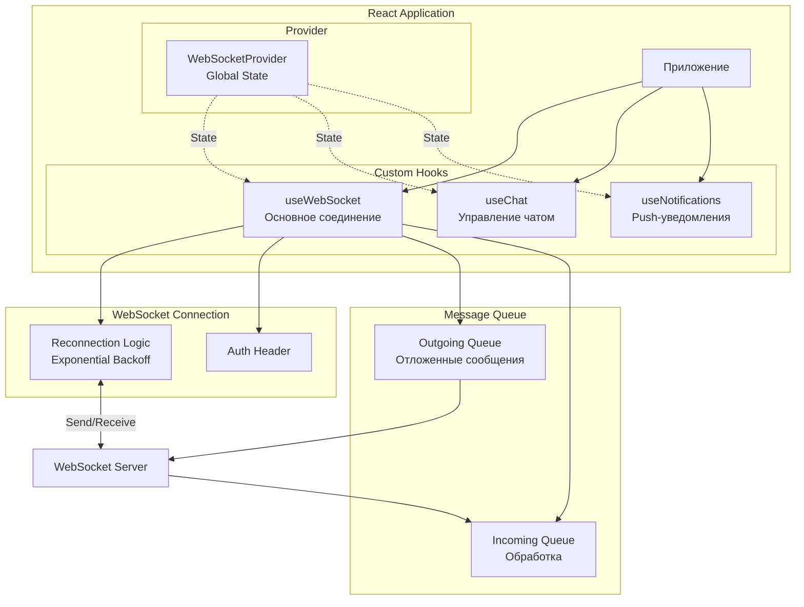

# WebSocket Client — Клиентская часть WebSocket

## Статус: На обсуждении

---

## 0. Общие положения

### 0.1 Назначение

Спецификация определяет правила реализации клиентской части WebSocket-соединения для чатов и push-уведомлений.

### 0.2 Архитектура клиентской части



---

## 1. WebSocket Provider

### 1.1 Назначение

Глобальный React Context для управления WebSocket-соединением и состоянием.

### 1.2 Структура Context

```typescript
interface WebSocketContextType {
  // Состояние соединения
  isConnected: boolean
  isConnecting: boolean
  lastError: string | null
  
  // Отправка сообщений
  sendMessage: (message: WebSocketMessage) => void
  
  // Управление подписками
  joinRoom: (chatId: string) => void
  leaveRoom: (chatId: string) => void
}
```

### 1.3 Реализация Provider

```typescript
'use client'

import { createContext, useContext, useState, useEffect, useRef } from 'react'
import { useSession } from 'next-auth/react'

interface WebSocketContextType {
  isConnected: boolean
  isConnecting: boolean
  lastError: string | null
  sendMessage: (message: WebSocketMessage) => void
  joinRoom: (chatId: string) => void
  leaveRoom: (chatId: string) => void
}

const WebSocketContext = createContext<WebSocketContextType | null>(null)

export function WebSocketProvider({ children }: { children: React.ReactNode }) {
  const [isConnected, setIsConnected] = useState(false)
  const [isConnecting, setIsConnecting] = useState(false)
  const [lastError, setLastError] = useState<string | null>(null)
  
  const wsRef = useRef<WebSocket | null>(null)
  const { data: session } = useSession()
  
  // Логика подключения и управления соединением
  // ...
  
  return (
    <WebSocketContext.Provider value={{
      isConnected,
      isConnecting,
      lastError,
      sendMessage,
      joinRoom,
      leaveRoom,
    }}>
      {children}
    </WebSocketContext.Provider>
  )
}

export function useWebSocketContext() {
  const context = useContext(WebSocketContext)
  if (!context) {
    throw new Error('useWebSocketContext must be used within WebSocketProvider')
  }
  return context
}
```

---

## 2. useWebSocket — Основный хук

### 2.1 Назначение

Управление WebSocket-соединением: подключение, переподключение, отправка/получение сообщений.

### 2.2 Интерфейс

```typescript
interface UseWebSocketOptions {
  // URL WebSocket-сервера
  url: string
  
  // Токен для аутентификации
  token?: string
  
  // Максимальное количество переподключений (0 = бесконечно)
  maxReconnectAttempts?: number
  
  // Начальная задержка переподключения (мс)
  initialReconnectDelay?: number
  
  // Максимальная задержка переподключения (мс)
  maxReconnectDelay?: number
  
  // Множитель задержки (экспоненциальный рост)
  delayMultiplier?: number
  
  // Включить случайную задержку (для предотвращения thundering herd)
  jitter?: boolean
  
  // Callback при подключении
  onConnect?: () => void
  
  // Callback при отключении
  onDisconnect?: () => void
  
  // Callback при ошибке
  onError?: (error: Error) => void
  
  // Callback при получении сообщения
  onMessage?: (message: WebSocketMessage) => void
}

interface UseWebSocketReturn {
  // Состояние соединения
  isConnected: boolean
  isConnecting: boolean
  reconnectAttempts: number
  lastError: string | null
  
  // Отправка сообщений
  sendMessage: (message: WebSocketMessage) => void
  
  // Отправка текстового сообщения
  sendText: (text: string) => void
  
  // Отключение
  disconnect: () => void
}
```

### 2.3 Структура сообщения

```typescript
interface WebSocketMessage {
  type: string      // Тип сообщения
  payload: Record<string, unknown>  // Полезная нагрузка
}

interface WSResponse {
  type: string      // Тип сообщения
  payload: Record<string, unknown>  // Полезная нагрузка
  error?: string    // Сообщение об ошибке (если есть)
}
```

### 2.4 Реализация (псевдокод)

```typescript
export function useWebSocket(options: UseWebSocketOptions): UseWebSocketReturn {
  const [isConnected, setIsConnected] = useState(false)
  const [isConnecting, setIsConnecting] = useState(false)
  const [reconnectAttempts, setReconnectAttempts] = useState(0)
  const [lastError, setLastError] = useState<string | null>(null)
  
  const wsRef = useRef<WebSocket | null>(null)
  const pendingMessagesRef = useRef<WebSocketMessage[]>([])
  
  // Расчет задержки с экспоненциальным ростом и джиттером
  const getReconnectDelay = useCallback(() => {
    const attempt = Math.min(reconnectAttempts, 10) // Максимум 10 попыток
    let delay = options.initialReconnectDelay * Math.pow(options.delayMultiplier || 2, attempt)
    delay = Math.min(delay, options.maxReconnectDelay || 30000)
    
    if (options.jitter) {
      delay = delay * (0.5 + Math.random() * 0.5)
    }
    
    return Math.floor(delay)
  }, [reconnectAttempts, options])
  
  // Подключение
  const connect = useCallback(() => {
    setIsConnecting(true)
    
    const ws = new WebSocket(options.url, {
      headers: {
        Authorization: `Bearer ${options.token}`,
      },
    })
    
    ws.onopen = () => {
      setIsConnected(true)
      setIsConnecting(false)
      setReconnectAttempts(0)
      setLastError(null)
      options.onConnect?.()
      
      // Отправка накопленных сообщений
      pendingMessagesRef.current.forEach(msg => ws.send(JSON.stringify(msg)))
      pendingMessagesRef.current = []
    }
    
    ws.onmessage = (event) => {
      const message: WSResponse = JSON.parse(event.data)
      options.onMessage?.(message)
    }
    
    ws.onerror = (event) => {
      const error = new Error('WebSocket error')
      setLastError(error.message)
      options.onError?.(error)
    }
    
    ws.onclose = (event) => {
      setIsConnected(false)
      setIsConnecting(false)
      options.onDisconnect?.()
      
      // Переподключение если нужно
      if (!event.wasClean && reconnectAttempts < (options.maxReconnectAttempts || 0)) {
        const delay = getReconnectDelay()
        setReconnectAttempts(prev => prev + 1)
        
        setTimeout(() => connect(), delay)
      }
    }
    
    wsRef.current = ws
  }, [options, reconnectAttempts, getReconnectDelay])
  
  // Отправка сообщения
  const sendMessage = useCallback((message: WebSocketMessage) => {
    if (wsRef.current?.readyState === WebSocket.OPEN) {
      wsRef.current.send(JSON.stringify(message))
    } else {
      pendingMessagesRef.current.push(message)
    }
  }, [])
  
  // Отключение
  const disconnect = useCallback(() => {
    wsRef.current?.close()
    wsRef.current = null
  }, [])
  
  // Подключение при монтировании
  useEffect(() => {
    if (options.token) {
      connect()
    }
    return () => disconnect()
  }, [options.token, connect, disconnect])
  
  return {
    isConnected,
    isConnecting,
    reconnectAttempts,
    lastError,
    sendMessage,
    sendText: (text: string) => sendMessage({ type: 'text', payload: { text } }),
    disconnect,
  }
}
```

---

## 3. useChat — Хук для чатов

### 3.1 Назначение

Управление подключением к конкретному чату, получение и отправка сообщений.

### 3.2 Интерфейс

```typescript
interface UseChatOptions {
  chatId: string
  initialMessages?: ChatMessage[]
  pageSize?: number
}

interface ChatMessage {
  id: string
  chatId: string
  senderId: string
  senderName?: string
  content: string
  createdAt: string
}

interface UseChatReturn {
  // Состояние
  messages: ChatMessage[]
  isTyping: boolean
  typingUsers: string[]
  
  // Действия
  sendMessage: (content: string) => void
  join: () => void
  leave: () => void
  
  // Состояние
  isLoading: boolean
  hasMoreMessages: boolean
  loadMoreMessages: () => void
}
```

### 3.3 Реализация

```typescript
export function useChat(options: UseChatOptions): UseChatReturn {
  const context = useWebSocketContext()
  const [messages, setMessages] = useState<ChatMessage[]>(options.initialMessages || [])
  const [isTyping, setIsTyping] = useState(false)
  const [typingUsers, setTypingUsers] = useState<string[]>([])
  const [isLoading, setIsLoading] = useState(false)
  
  // Подписка на сообщения чата
  useEffect(() => {
    if (!context) return
    
    const handleMessage = (message: WSResponse) => {
      switch (message.type) {
        case 'chat.message':
          setMessages(prev => [...prev, message.payload as ChatMessage])
          break
        
        case 'chat.typing':
          if (message.payload.isTyping) {
            setTypingUsers(prev => 
              prev.includes(message.payload.userId as string)
                ? prev
                : [...prev, message.payload.userId as string]
            )
          } else {
            setTypingUsers(prev => 
              prev.filter(id => id !== message.payload.userId)
            )
          }
          break
        
        case 'chat.joined':
          // Обновление списка сообщений при подключении
          if (message.payload.messages) {
            setMessages(message.payload.messages as ChatMessage[])
          }
          break
      }
    }
    
    // Регистрация обработчика
    // ...
    
    return () => {
      // Удаление обработчика
    }
  }, [context])
  
  // Отправка сообщения
  const sendMessage = useCallback((content: string) => {
    context.sendMessage({
      type: 'chat.message',
      payload: { chatId: options.chatId, content },
    })
  }, [context, options.chatId])
  
  // Индикатор набора текста
  const sendTyping = useCallback(() => {
    context.sendMessage({
      type: 'chat.typing',
      payload: { chatId: options.chatId, isTyping: true },
    })
  }, [context, options.chatId])
  
  // Подключение к чату
  const join = useCallback(() => {
    context.joinRoom(options.chatId)
  }, [context, options.chatId])
  
  // Отключение от чата
  const leave = useCallback(() => {
    context.leaveRoom(options.chatId)
  }, [context, options.chatId])
  
  return {
    messages,
    isTyping,
    typingUsers,
    sendMessage,
    join,
    leave,
    isLoading,
    hasMoreMessages: false,
    loadMoreMessages: () => {},
  }
}
```

---

## 4. useNotifications — Хук уведомлений

### 4.1 Назначение

Подписка на push-уведомления.

### 4.2 Интерфейс

```typescript
interface Notification {
  id: string
  type: string
  title: string
  content?: string
  link?: string
  isRead: boolean
  createdAt: string
}

interface UseNotificationsReturn {
  notifications: Notification[]
  unreadCount: number
  markAsRead: (id: string) => void
  markAllAsRead: () => void
  remove: (id: string) => void
}
```

### 4.3 Реализация

```typescript
export function useNotifications(): UseNotificationsReturn {
  const [notifications, setNotifications] = useState<Notification[]>([])
  
  const context = useWebSocketContext()
  
  // Подписка на уведомления
  useEffect(() => {
    if (!context) return
    
    const handleMessage = (message: WSResponse) => {
      if (message.type === 'notification') {
        const notification = message.payload as Notification
        setNotifications(prev => [notification, ...prev])
      }
    }
    
    // Регистрация обработчика
    // ...
    
    return () => {
      // Удаление обработчика
    }
  }, [context])
  
  const unreadCount = notifications.filter(n => !n.isRead).length
  
  const markAsRead = useCallback((id: string) => {
    setNotifications(prev => 
      prev.map(n => n.id === id ? { ...n, isRead: true } : n)
    )
  }, [])
  
  const markAllAsRead = useCallback(() => {
    setNotifications(prev => prev.map(n => ({ ...n, isRead: true })))
  }, [])
  
  const remove = useCallback((id: string) => {
    setNotifications(prev => prev.filter(n => n.id !== id))
  }, [])
  
  return {
    notifications,
    unreadCount,
    markAsRead,
    markAllAsRead,
    remove,
  }
}
```

---

## 5. Обработка переподключения

### 5.1 Стратегия экспоненциальной задержки

| Попытка | Базовая задержка (мс) | С джиттером (мс) |
|---------|----------------------|-------------------|
| 1 | 1000 | 500–1000 |
| 2 | 2000 | 1000–2000 |
| 3 | 4000 | 2000–4000 |
| 4 | 8000 | 4000–8000 |
| 5 | 16000 | 8000–16000 |
| 6+ | 30000 (max) | 15000–30000 |

### 5.2 Очередь сообщений

При разрыве соединения сообщения накапливаются в очереди и отправляются при восстановлении соединения:

```typescript
const pendingMessagesRef = useRef<WebSocketMessage[]>([])

// При отправке
if (wsRef.current?.readyState === WebSocket.OPEN) {
  wsRef.current.send(JSON.stringify(message))
} else {
  pendingMessagesRef.current.push(message)
}

// При подключении
pendingMessagesRef.current.forEach(msg => ws.send(JSON.stringify(msg)))
pendingMessagesRef.current = []
```

### 5.3 Состояние соединения

```typescript
type ConnectionStatus = 
  | 'connected'
  | 'connecting'
  | 'disconnected'
  | 'reconnecting'
  | 'error'
```

---

## 6. Используемые библиотеки

### 6.1 Стандрартная библиотека (без доп. зависимостей)

| Библиотека | Назначение |
|------------|-----------|
| `WebSocket` (browser API) | Базовое WebSocket соединение |
| `useSession` (next-auth) | Получение JWT токена |

### 6.2 Опциональные библиотеки

| Библиотека | Назначение | Вес | Обоснование |
|------------|-----------|-----|-------------|
| `socket.io-client` | Автоматическое переподключение, fallback | ~40 KB | Если нужна надёжность |
| `zustand` | Управление состоянием | ~1 KB | Альтернатива Context API |

**Рекомендация:** Использовать стандартную WebSocket API без доп. зависимостей для экономии RAM и disk.

---

## 7. Чек-лист качества

> ℹ️ **Полный чек-лист** WebSocket-клиента — в [`shared/checklists.md#8-websocket-клиент`](../../shared/checklists.md#8-websocket-клиент)

---

## 8. История изменений

> ℹ️ Единый журнал изменений — в [`CHANGELOG.md`](../../CHANGELOG.md)
