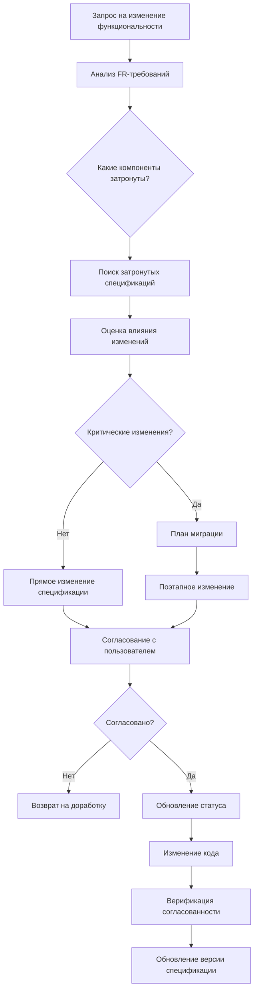
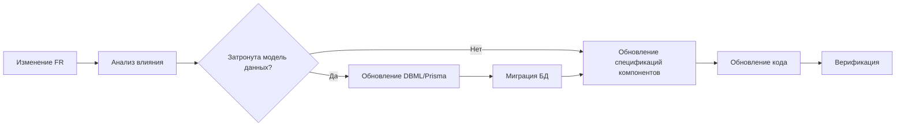

# Управление изменениями спецификаций компонентов

## Статус: Черновик (на обсуждении)

---

## 0. Общие положения

Настоящий документ описывает порядок управления (создание, изменение, удаление) спецификациями компонентов проекта при изменении функциональных требований.

### 0.1 Связанные документы

| Документ | Назначение |
|----------|------------|
| [`.roo/rules/architecture.md`](../../.roo/rules/architecture.md) | Spec-driven development, архитектурные правила |
| [`.roo/rules/data-model-rules.md`](../../.roo/rules/data-model-rules.md) | Правила изменения модели данных |
| [`.roo/rules/change-rules.md`](../../.roo/rules/change-rules.md) | Общий порядок внесения изменений |
| [`docs/requirements/fr-change-management.md`](../requirements/fr-change-management.md) | Управление изменениями функциональных требований |
| [`docs/specs/component-types-classification.md`](./component-types-classification.md) | Классификация типов компонентов |
| [`docs/specs/component-spec-requirements.md`](./component-spec-requirements.md) | Требования к спецификациям компонентов |

### 0.2 Принципы

1. **Спецификация — единственный источник истины.** Код пишется только на основе согласованных спецификаций.
2. **Изменения начинаются с анализа.** Прежде чем вносить изменения в спецификацию, необходимо оценить их влияние.
3. **Спецификации и код должны быть согласованы.** Любое изменение в коде, затрагивающее публичный API, должно сопровождаться обновлением спецификации.
4. **Все изменения согласовываются.** Результат анализа обсуждается до реализации.
5. **Версионирование.** Каждая спецификация имеет версию, которая меняется при breaking changes.

---

## 1. Область применения

### 1.1 Компоненты, подлежащие управлению

Данный документ applies к компонентам, которые имеют спецификации (см. [`component-types-classification.md`](./component-types-classification.md)):

- UI Component (Client)
- UI Component (Server)
- API Router
- Service
- Repository

### 1.2 Компоненты, исключаемые из управления

Следующие компоненты НЕ требуют отдельной спецификации и управления изменениями спецификаций:

- DTO
- Schema (Zod/Yup)
- UI Helper Functions
- Internal Hooks
- Configuration Files
- Test Files

Изменения в этих компонентах управляются через изменения в спецификациях их потребителей.

---

## 2. Процесс управления изменениями

### 2.1 Общий поток при изменении функциональных требований



### 2.2 Поиск затронутых спецификаций

При получении запроса на изменение:

1. **Определите затронутые FR-требования** (см. [`fr-change-management.md`](../requirements/fr-change-management.md) раздел 2.1)
2. **Найдите связанные сущности** в разделе "Связанные сущности" FR-требований
3. **Инцидентные компоненты:**
   - FR → Service (бизнес-логика)
   - Service → Repository (доступ к данным)
   - FR → API Router (интеграция)
   - Service/UI → UI Component (отображение)
4. **Проверьте зависимости** в разделах "Зависимости" спецификаций

### 2.3 Оценка влияния изменений

| Тип изменения | Примеры | Критичность |
|---------------|---------|-------------|
| **Некритическое** | Добавление необязательного param, уточнение описания, исправление опечаток | Низкая |
| **Минорное** | Добавление нового метода, расширение props, новый optional field | Средняя |
| **Критическое (Breaking)** | Удаление/переименование метода, изменение типа param, изменение поведения API | Высокая |

---

## 3. Добавление новой спецификации

### 3.1 Порядок действий

1. **Определите тип компонента**
   - UI Component (Client/Server)
   - API Router
   - Service
   - Repository

2. **Создайте файл спецификации**
   - Путь: `docs/specs/components/<тип>/<название>.md`
   - Используйте шаблон из [`component-spec-requirements.md`](./component-spec-requirements.md)

3. **Заполните метаданные**
   ```markdown
   ---
   тип: <тип компонента>
   название: <Название>
   статус: черновик
   автор: <имя>
   дата-создания: YYYY-MM-DD
   дата-обновления: YYYY-MM-DD
   версия: 0.1.0
   ---
   ```

4. **Опишите публичный API**
   - Интерфейсы (props, методы, endpoints)
   - Входные и выходные данные
   - Примеры использования

5. **Укажите зависимости**
   - Внутренние компоненты
   - Внешние пакеты

6. **Свяжите с FR-требованиями**
   - Укажите связанные FR в разделе "Зависимости"
   - Пример: `Связано с: FR-01-001, FR-01-002`

7. **Обновите индекс** (`docs/specs/components/README.md`)

8. **Установите статус "На обсуждении"**

### 3.2 Чек-лист создания

- [ ] Файл создан в правильной директории
- [ ] Метаданные заполнены
- [ ] Публичный API описан полностью
- [ ] Примеры использования приведены
- [ ] Зависимости указаны
- [ ] Связи с FR-требованиями установлены
- [ ] Индекс обновлён
- [ ] Статус установлен в "На обсуждении"

---

## 4. Изменение существующей спецификации

### 4.1 Некритические изменения

**Примеры:** уточнение описания, исправление опечаток, добавление новых optional полей

1. Обновите текст спецификации
2. Увеличьте PATCH версию (например, 1.0.0 → 1.0.1)
3. Добавьте запись в "Историю изменений"
4. Статус оставьте текущий (если "Согласовано", то не меняйте)

### 4.2 Минорные изменения

**Примеры:** добавление нового метода, расширение props, новый optional field

1. Обновите раздел "Публичный API"
2. Увеличьте MINOR версию (например, 1.0.0 → 1.1.0)
3. Установите статус "На обсуждении"
4. Обсудите изменения с пользователем
5. После согласования — установите статус "Согласовано"
6. Добавьте запись в "Историю изменений"

### 4.3 Критические изменения (Breaking)

**Примеры:** удаление метода, изменение типа param, изменение поведения API

1. **Оцените влияние**
   - Найдите всех потребителей спецификации
   - Проверьте использование в коде
   - Проверьте зависимости от других спецификаций

2. **Подготовьте план миграции**
   ```markdown
   ## План миграции

   ### Этап 1: Добавление нового (без удаления старого)
   - Добавить новый метод/поле
   - Старый помечать как @deprecated

   ### Этап 2: Обновление потребителей
   - Обновить код потребителей на новый API
   - Обновить спецификации потребителей

   ### Этап 3: Удаление старого
   - Удалить deprecated метод/поле
   - Увеличить MAJOR версию
   ```

3. **Увеличьте MAJOR версию** (например, 1.0.0 → 2.0.0)

4. **Установите статус "На обсуждении"**

5. **Представьте план миграции пользователю**

6. **После согласования — выполните поэтапно**

7. **Добавьте запись в "Историю изменений"**

### 4.4 Шаблон раздела "История изменений" в спецификации

```markdown
## История изменений

| Версия | Дата | Автор | Изменения |
|--------|------|-------|-----------|
| 1.0.0 | YYYY-MM-DD | Автор | Первоначальная версия |
| 1.0.1 | YYYY-MM-DD | Автор | Исправление опечатки в описании prop `userName` |
| 1.1.0 | YYYY-MM-DD | Автор | Добавлен optional prop `size` |
| 2.0.0 | YYYY-MM-DD | Автор | BREAKING: `name` переименован в `userName` |
```

---

## 5. Удаление спецификации

### 5.1 Проверка зависимостей

1. **Найдите все ссылки на спецификацию**
   - В других спецификациях (раздел "Зависимости")
   - В FR-требованиях (раздел "Связанные компоненты")
   - В коде (импорты)

2. **Если есть зависимые спецификации**
   - Уведомите авторов зависимых спецификаций
   - Предложите альтернативы
   - Обновите зависимости

3. **Если спецификация реализована в коде**
   - Проведите депрекацию (см. [5.2](#52-депрекация))
   - Или удалите код и спецификацию одновременно

### 5.2 Депрекация

1. Добавьте в начало спецификации:
   ```markdown
   > ⚠️ **DEPRECATED:** Эта спецификация депрекована и будет удалена в версии X.Y.0
   > **Причина:** <объяснение>
   > **Альтернатива:** [Ссылка на замену](./<альтернатива>.md)
   ```

2. Установите статус "Завершено"

3. После истечения срока депрекации — удалите спецификацию

### 5.3 Удаление

1. Удалите файл спецификации
2. Обновите индекс (`docs/specs/components/README.md`)
3. Обновите зависимости в связанных спецификациях
4. Добавьте запись в историю изменений файле-индексе

---

## 6. Верификация согласованности

### 6.1 Чек-лист после изменений

После любого изменения спецификации проверьте:

- [ ] Спецификация соответствует коду в проекте
- [ ] Публичный API в спецификации совпадает с кодом
- [ ] Типы данных совпадают
- [ ] Примеры использования актуальны
- [ ] Зависимости не нарушены
- [ ] Связи с FR-требованиями актуальны
- [ ] Версия спецификации увеличена
- [ ] История изменений обновлена

### 6.2 Ручная проверка при Code Review

При запросе на изменение кода, затрагивающего публичный API:

1. **Проверьте, обновлена ли спецификация**
   - Если нет — верните на доработку
   - Если да — проверьте соответствие кода спецификации

2. **Проверьте, что все потребители обновлены**
   - Смотрете раздел "Зависимости" других спецификаций
   - Убедитесь, что код потребителей соответствует новой спецификации

3. **Подпишите код-ревью только когда:**
   - Спецификация обновлена
   - Код соответствует спецификации
   - Потребители обновлены (если применимо)

---

## 7. Взаимосвязь с моделью данных

### 7.1 Принцип согласованности

Изменения спецификаций компонентов могут требовать изменений в модели данных, и наоборот.

### 7.2 Координация изменений



Порядок действий:
1. При изменении FR, затрагивающего сущности данных — сначала обновите модель данных (см. [`data-model-rules.md`](../../.roo/rules/data-model-rules.md))
2. Затем обновите спецификации компонентов, которые используют эти сущности
3. Затем обновите код

---

## 8. Роли и ответственность

### 8.1 Роли

| Роль | Ответственность |
|------|-----------------|
| **Архитектор** | Согласование изменений спецификаций, утверждение плана миграции |
| **Разработчик** | Обновление спецификаций при изменении кода, соблюдение согласованности |
| **Тестировщик** | Проверка соответствия кода спецификации |

### 8.2 Правила перехода статусов

| Статус | Кто может установить | Переходы |
|--------|---------------------|----------|
| **Черновик** | Автор | → На обсуждении |
| **На обсуждении** | Архитектор | → Черновик, Согласовано |
| **Согласовано** | Архитектор | → В реализации |
| **В реализации** | Разработчик | → Завершено, На обсуждении |
| **Завершено** | Архитектор | → На обсуждении (при обнаружении проблем) |

---

## 9. История изменений документа

> ℹ️ Единый журнал изменений — в [`CHANGELOG.md`](../CHANGELOG.md)
