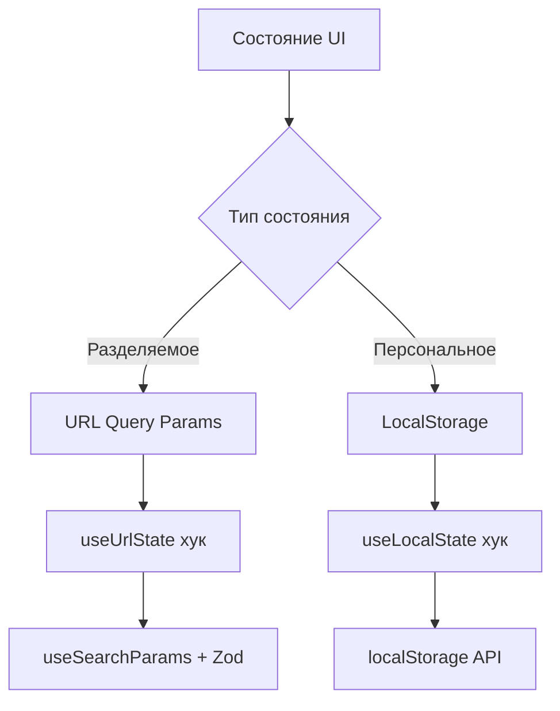
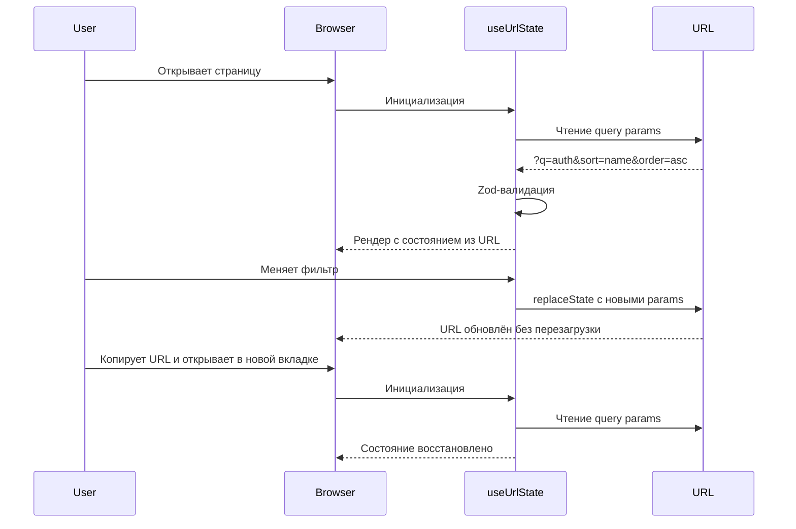

# Спецификация: Персистентность состояния UI

## Статус: Черновик (на обсуждении)

---

## 1. Цели

1. **Shareability** — ссылка в адресной строке полностью описывает текущее состояние UI
2. **Reload resilience** — состояние сохраняется при F5
3. **Browser navigation** — кнопки Назад/Вперёд корректно работают
4. **Minimal boilerplate** — простой API для разработчиков через кастомные хуки
5. **Type safety** — валидация параметров через Zod

---

## 2. Архитектура решения

### 2.1. Два уровня состояния



| Тип | Хранилище | Примеры | Передаётся по ссылке |
|-----|-----------|---------|---------------------|
| Разделяемое | URL Query Params | фильтр, сортировка, активная вкладка, развёрнутые группы | Да |
| Персональное | LocalStorage | размер страницы, видимость колонок, предпочтения темы | Нет |

### 2.2. Правила классификации параметров

Параметр относится к **разделяемому** состоянию (URL), если:
- Его важно передать другому пользователю через ссылку
- Он влияет на отображаемые данные или структуру страницы
- Без него страница будет выглядеть принципиально иначе

Параметр относится к **персональному** состоянию (localStorage), если:
- Это личное предпочтение пользователя
- Он не влияет на смысл передаваемой ссылки
- Другому пользователю этот параметр не нужен

---

## 3. API — Кастомные хуки

### 3.1. `useUrlState`

```typescript
// src/lib/hooks/useUrlState.ts

interface UseUrlStateOptions<T> {
  /** Zod-схема для валидации и парсинга */
  schema: z.ZodType<T>;
  /** Ключ query-параметра */
  key: string;
  /** Значение по умолчанию */
  defaultValue: T;
  /** Задержка обновления URL в мс. 0 = без debounce. По умолчанию: 0 */
  debounceMs?: number;
}

interface UseUrlStateReturn<T> {
  /** Текущее значение (обновляется мгновенно) */
  value: T;
  /** Установить новое значение (URL обновится с debounce если задан debounceMs) */
  setValue: (value: T | ((prev: T) => T)) => void;
}

/**
 * Хук для синхронизации состояния с URL query-параметрами.
 *
 * - Читает начальное значение из URL
 * - Валидирует через Zod-схему
 * - При изменении обновляет URL через replaceState
 * - При навигации назад/вперёд обновляет состояние
 * - Поддерживает debounce: value обновляется мгновенно,
 *   URL обновляется с задержкой (полезно для текстового поиска)
 */
function useUrlState<T>(options: UseUrlStateOptions<T>): UseUrlStateReturn<T>;
```

**Примеры использования:**

```typescript
// Без debounce — мгновенное обновление URL (сортировка, вкладки)
const SortOrderSchema = z.enum(["asc", "desc"]);

const { value: sortOrder, setValue: setSortOrder } = useUrlState({
  schema: SortOrderSchema,
  key: "order",
  defaultValue: "asc",
});

// С debounce — URL обновляется через 300мс после последнего ввода
const { value: filter, setValue: setFilter } = useUrlState({
  schema: z.string(),
  key: "q",
  defaultValue: "",
  debounceMs: 300,
});
```

### 3.2. `useLocalState`

```typescript
// src/lib/hooks/useLocalState.ts

interface UseLocalStateOptions<T> {
  /** Ключ в localStorage */
  key: string;
  /** Значение по умолчанию */
  defaultValue: T;
  /** Zod-схема для валидации */
  schema: z.ZodType<T>;
}

/**
 * Хук для хранения персональных настроек в localStorage.
 * 
 * - Читает начальное значение из localStorage
 * - Валидирует через Zod-схему
 * - При изменении записывает в localStorage
 * - Автоматически очищает невалидные данные
 */
function useLocalState<T>(options: UseLocalStateOptions<T>): [T, (value: T | ((prev: T) => T)) => void];
```

---

## 4. Zod-схемы параметров

Схемы определяются для каждой страницы индивидуально в `src/shared/schemas/ui-state.ts`.

```typescript
// src/shared/schemas/ui-state.ts

/**
 * Общий паттерн: каждая страница описывает свою схему
 * URL-параметров через Zod-объект с default-значениями.
 * 
 * Правила именования: <PageName>ParamsSchema
 * 
 * Пример:
 */

export const ExamplePageParamsSchema = z.object({
  q: z.string().default(""),                        // Фильтр поиска
  sort: z.string().default("name"),                 // Поле сортировки
  order: z.enum(["asc", "desc"]).default("asc"),    // Направление сортировки
  tab: z.string().default("list"),                  // Активная вкладка
  showRemoved: z
    .string()
    .transform((v) => v === "true")
    .pipe(z.boolean())
    .default(false),                                // Boolean через transform
});

export type ExamplePageParams = z.infer<typeof ExamplePageParamsSchema>;
```

---

## 5. Поведение при навигации



---

## 6. Граничные случаи

| Случай | Поведение |
|--------|-----------|
| Невалидный параметр в URL | Zod-схема вернёт default-значение, невалидный параметр удаляется из URL |
| Параметр отсутствует в URL | Используется default-значение из схемы |
| localStorage недоступен | useLocalState работает как обычный useState |
| Конфликт URL и localStorage | URL имеет приоритет для разделяемых параметров |
| Множественные вкладки браузера | Каждая вкладка читает своё состояние из URL независимо |
| Debounce: `value` vs URL | `value` обновляется мгновенно для реактивного UI, URL обновляется с задержкой `debounceMs`. При навигации назад/вперёд URL-значение записывается в `value` сразу без debounce |
| Debounce: размонтирование | При размонтировании компонента отложенное обновление URL отменяется через cleanup useEffect |

---

## 7. Альтернативы, рассмотренные и отклонённые

| Альтернатива | Причина отклонения |
|--------------|-------------------|
| **nuqs / next-usequerystate** | Внешняя зависимость, не разрешена без явного согласования |
| **Zustand + persist** | Избыточно для текущего масштаба, дублирование URL-состояния |
| **React Context** | Не решает проблему перезагрузки и передачи ссылок |
| **SessionStorage** | Не переживает перезагрузку в некоторых браузерах, не передаётся по ссылке |