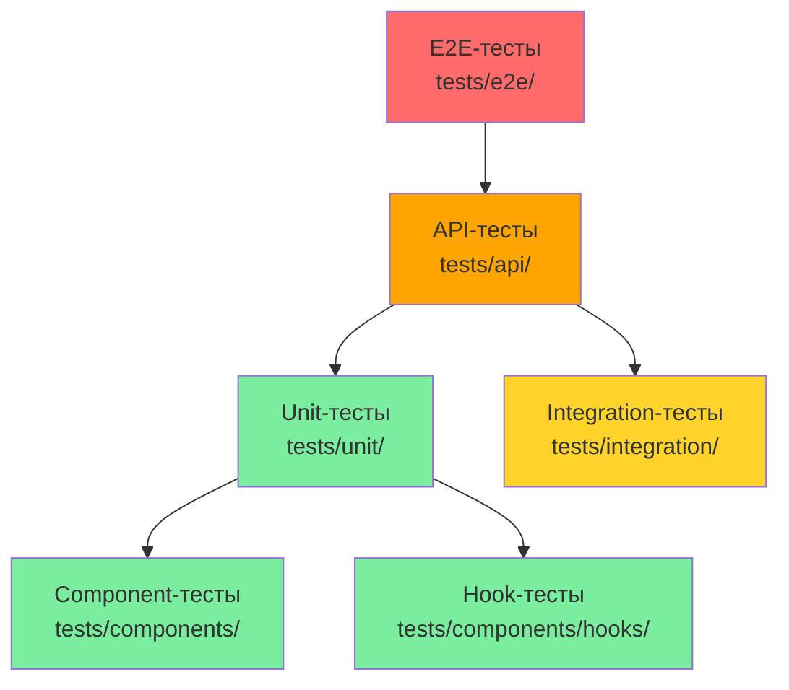
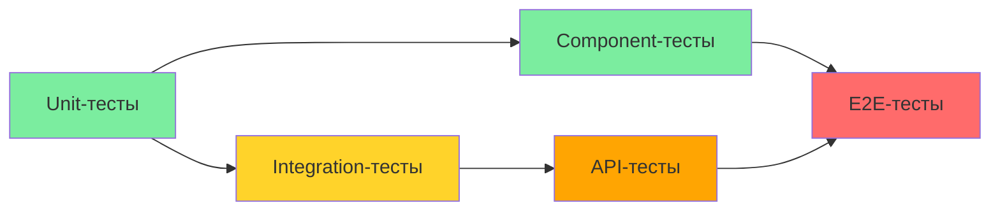

# 🧪 Руководство по тестированию SNT App

## Обзор

Это руководство определяет подходы, инструменты и практики тестирования для приложения SNT App (Next.js). Документы структурированы по типам тестов, образуя тест-пирамиду:



> **Принцип:** Чем ниже тест в пирамиде, тем быстрее и надёжнее он должен быть. Чем выше — тем ближе к реальному пользовательскому опыту.

---

## Архитектура тестирования

### Рекомендуемый стек

| Тип теста | Инструмент | Позиция | Зависимости |
|-----------|-----------|---------|-------------|
| **Unit** | Vitest | `tests/unit/` | `vitest`, `@vitest/coverage-v8` |
| **Integration** | Vitest + PostgreSQL in Docker | `tests/integration/` | `@prisma/client`, Docker/Podman |
| **API Contract** | Vitest + supertest | `tests/api/` | `supertest` |
| **Component** | Vitest + Testing Library | `tests/components/` | `@testing-library/react`, `@testing-library/jest-dom` |
| **Hook** | Vitest + Testing Library | `tests/components/hooks/` | `@testing-library/react` |
| **E2E** | Playwright | `tests/e2e/` | `@playwright/test` |

---

## Документы

| Документ | Описание | Домены |
|----------|----------|--------|
| [`unit-tests.md`](unit-tests.md) | Подход к Unit-тестированию: сервисы, валидаторы, ошибки | plot, plotUser, roles, userProfile, auth, shared |
| [`integration-tests.md`](integration-tests.md) | Подход к Integration-тестированию: Repository Layer с реальным БД | Все домены |
| [`api-tests.md`](api-tests.md) | Подход к API Contract-тестированию: статус-коды, форматы ответов | Все API Route Handlers |
| [`component-tests.md`](component-tests.md) | Подход к Component-тестированию: UI-компоненты в изоляции | UI атомы, Feature компоненты |
| [`e2e-tests.md`](e2e-tests.md) | Подход к E2E-тестированию: полные пользовательские сценарии | Кросс-доменные потоки |

---

## Структура тестовой папки

```
tests/
├── vitest.setup.ts                 # Глобальная настройка Vitest
├── vitest.config.ts                # Конфиг Vitest (опционально)
├── playwright.config.ts            # Конфиг Playwright для E2E
├── docker-compose.test.yml         # Конфиг PostgreSQL for Integration-тестов
├── unit/                           # Unit-тесты (Vitest)
│   ├── domains/
│   │   ├── plot/
│   │   │   ├── plot.service.test.ts
│   │   │   ├── plot.validators.test.ts
│   │   │   └── plot.errors.test.ts
│   │   ├── plotUser/
│   │   │   ├── plotUser.service.test.ts
│   │   │   └── plotUser.validators.test.ts
│   │   ├── roles/
│   │   │   ├── roles.service.test.ts
│   │   │   └── roles.validators.test.ts
│   │   ├── comms/
│   │   │   └── comms.repository.unread.test.ts   # ✨ NEW (B-027) — корректный учёт непрочитанных (isDeleted, lastReadAt)
│   │   └── userProfile/
│   │       ├── userProfile.service.test.ts
│   │       └── userProfile.validators.test.ts
│   └── shared/
│       └── zod.utils.test.ts
├── integration/                    # Integration-тесты (Vitest + PostgreSQL)
│   ├── setup.ts
│   ├── plot.test.ts
│   └── plotUser.test.ts
├── api/                            # API Contract-тесты (Vitest + supertest)
│   ├── setup.ts
│   ├── plots.test.ts
│   └── plotUsers.test.ts
├── components/                     # Component + Hook-тесты (Vitest + Testing Library)
│   ├── ui/
│   │   ├── Button.test.tsx
│   │   ├── Badge.test.tsx
│   │   └── Input.test.tsx
│   ├── features/
│   │   ├── plotUser/
│   │   │   ├── ParticipantList.test.tsx
│   │   │   └── PlotUserForm.test.tsx
│   │   ├── comms/
│   │   │   ├── ChatList.render.test.tsx                # ✨ NEW (B-022) — перенос ChatList в features/comms (R-21)
│   │   │   ├── CommsTab.test.tsx
│   │   │   ├── ConversationCard.test.tsx               # ✨ NEW (B-022) — аватар h-10 w-10 (R-18), chevron/hover (R-29)
│   │   │   ├── ConversationList.skeleton.test.tsx      # ✨ NEW (B-020) — скелетоны списка диалогов
│   │   │   ├── ConversationMessagesList.skeleton.test.tsx # ✨ NEW (B-020) — скелетоны сообщений
│   │   │   ├── comms-pages.skeleton.test.tsx          # ✨ NEW (B-020) — скелетоны messages/chats page
│   │   │   ├── edit-page-notfound.test.tsx             # ✨ NEW (B-022) — fallback «чат не найден» (R-28)
│   │   │   ├── MessageItem.delete.test.tsx             # ✨ NEW (B-020) — удаление сообщения с ConfirmDialog
│   │   │   ├── MessageItem.no-accent.test.tsx          # ✨ NEW (B-022) — отсутствие bg-акцента isLastMessage (R-24)
│   │   │   ├── comms-pages-spinner-a11y.test.tsx     # ✨ NEW (B-021) — aria-паттерн спиннеров страниц messages/chats
│   │   │   └── ParticipantSelector.a11y.test.tsx        # ✨ NEW (B-021) — aria-паттерн спиннера поиска участников
│   │   ├── documents/
│   │   │   └── documents-badges-tokens.test.tsx        # ✨ NEW (B-021) — миграция badge-токенов (R-27)
│   │   └── userProfile/
│   │       └── UserProfileForm.test.tsx
│   └── hooks/
│       ├── useTheme.test.ts
│       └── useUrlState.test.ts
└── e2e/                            # E2E-тесты (Playwright)
    ├── announcements/
    │   └── announcements.e2e.spec.ts
    ├── auth/
    │   ├── auth-errors.e2e.spec.ts
    │   ├── callback-url.spec.ts
    │   ├── change-password.e2e.spec.ts   # ✨ NEW (B-011)
    │   ├── helpers.ts
    │   ├── landing-redirect.e2e.spec.ts
    │   ├── login.e2e.spec.ts
    │   └── register.e2e.spec.ts
    ├── chats/
    │   └── chats.e2e.spec.ts
    ├── comms/
    │   ├── comms-tabs.e2e.spec.ts
    │   ├── conversations-list.e2e.spec.ts
    │   ├── new-conversation.e2e.spec.ts
    │   └── unread-counts.e2e.spec.ts           # ✨ NEW (B-027) — корректность счётчиков непрочитанных (AC-5/9/10/11/12 и др.)
    ├── documents/
    │   ├── documents-categories.e2e.spec.ts
    │   ├── documents-detail.e2e.spec.ts
    │   ├── documents-edit.e2e.spec.ts
    │   ├── documents-list.e2e.spec.ts
    │   ├── documents-upload.e2e.spec.ts
    │   └── fixtures.ts
    ├── navigation/
    │   ├── 404.e2e.spec.ts
    │   ├── breadcrumbs.e2e.spec.ts
    │   ├── mobile-menu.e2e.spec.ts
    │   ├── redirects.e2e.spec.ts
    │   └── sidebar.e2e.spec.ts
    ├── plots/
    │   ├── fixtures.ts
    │   ├── plot-card-view.e2e.spec.ts
    │   ├── plot-creation.e2e.spec.ts
    │   ├── plot-deletion.e2e.spec.ts
    │   ├── plot-editing.e2e.spec.ts
    │   ├── plot-list.e2e.spec.ts
    │   └── plot-search.e2e.spec.ts
    ├── profile/
    │   └── profile.e2e.spec.ts
    ├── roles/
    │   ├── role-guard.e2e.spec.ts
    │   └── roles-crud.e2e.spec.ts
    ├── users/
    │   └── users.e2e.spec.ts
    └── shared/
        ├── test-helpers.ts
        └── .gitkeep
```

---

## Установка и настройка

### 1. Установка зависимостей

```bash
# Unit, Integration, API, Component, Hook
npm install -D vitest @vitest/coverage-v8 jsdom supertest
npm install -D @testing-library/react @testing-library/jest-dom

# E2E
npm install -D @playwright/test

# Удалить устаревшее
npm uninstall jest ts-jest @types/jest
```

### 2. Установка Playwright браузера

```bash
npx playwright install
```

### 3. Конфигурация (vitest.config.ts)

```typescript
import { defineConfig } from 'vitest/config';
import react from '@vitejs/plugin-react';
import path from 'path';

export default defineConfig({
  plugins: [react()],
  resolve: {
    alias: {
      '@': path.resolve(__dirname, './src'),
    },
  },
  test: {
    globals: true,
    environment: 'jsdom',
    setupFiles: ['./tests/vitest.setup.ts'],
    coverage: {
      provider: 'v8',
      reporter: ['text', 'json', 'html'],
      exclude: [
        'node_modules/',
        'src/app/',
        'tests/',
      ],
    },
  },
});
```

### 4. Конфигурация (playwright.config.ts)

```typescript
import { defineConfig, devices } from '@playwright/test';

export default defineConfig({
  testDir: './tests/e2e',
  fullyParallel: true,
  forbidOnly: !!process.env.CI,
  retries: process.env.CI ? 2 : 0,
  timeout: 30000,
  use: {
    baseURL: 'http://localhost:3000',
    trace: 'on-first-retry',
  },
  projects: [
    {
      name: 'chromium',
      use: { ...devices['Desktop Chrome'] },
    },
  ],
  webServer: {
    command: 'npm run dev',
    url: 'http://localhost:3000',
    reuseExistingServer: !process.env.CI,
  },
});
```

---

## Команды для запуска

```bash
# Все тесты
npm run test              # vitest run

# Unit-тесты
npm run test:unit         # vitest run tests/unit/

# Integration-тесты
npm run test:integration  # vitest run tests/integration/

# API-тесты
npm run test:api          # vitest run tests/api/

# Component-тесты
npm run test:components   # vitest run tests/components/

# Hook-тесты (в составе components)
npm run test:hooks        # vitest run tests/components/hooks/

# E2E-тесты
npm run test:e2e          # playwright test

# С покрытием
npm run test:coverage     # vitest run --coverage

# Watch-режим
npm run test:watch        # vitest
```

---

## Приоритеты реализации

| Приоритет | Тип тестов | Описание |
|-----------|-----------|----------|
| **1** | Unit | Бизнес-логика доменных сервисов, валидаторы, ошибки |
| **2** | Integration | Repository Layer с реальным БД |
| **3** | API | Контракты API, валидация, обработка ошибок |
| **4** | Component | UI-компоненты, состояния, интерактивность |
| **5** | Hook | React хуки (useTheme, useUrlState) |
| **6** | E2E | Полные пользовательские сценарии |

---

## Общие принципы

### 1. Тест-пирамида

```
        /  E2E  \
       /  API / INT  \
      / UNIT / COMP / HOOK \
```

- **База пирамиды (Unit):** Быстрые, надёжные, изолированные тесты
- **Середина (Integration, API):** Тестирование взаимодействия слоёв
- **Вершина (E2E):** Медленные, но максимально близкие к реальному опыту

### 2. AAA паттерн

Каждый тест следует паттерну Arrange-Act-Assert:

```typescript
it('should return filtered results', () => {
  // Arrange
  const mockData = [{ id: '1', plotNumber: '10' }];
  
  // Act
  const result = service.search({ number: '10' });
  
  // Assert
  expect(result).toEqual(mockData);
});
```

### 3. Именование тестов

```typescript
describe('PlotService', () => {
  describe('create', () => {
    it('should create a plot with valid data', async () => { ... });
    it('should throw PlotDuplicateError when plotNumber already exists', async () => { ... });
    it('should transform empty strings to null for optional fields', async () => { ... });
  });
});
```

**Формат имени:** `should <expected behavior> when/given <condition>`

### 4. Мокирование

```typescript
// Vitest mocking
import { vi } from 'vitest';

const mockRepository = {
  findById: vi.fn(),
  create: vi.fn(),
  update: vi.fn(),
  delete: vi.fn(),
};

// Использование
mockRepository.findById.mockResolvedValue({ id: '1', plotNumber: '10' });
mockRepository.findById.mockRejectedValue(new Error('DB error'));
```

### 5. Покрытие кода

Минимальные требования к покрытию:

| Слой | Statement | Branch | Function | Line |
|------|-----------|--------|----------|------|
| Service | 80% | 70% | 85% | 80% |
| Validators | 90% | 80% | 90% | 90% |
| Repository | 70% | 50% | 70% | 70% |
| API | 70% | 60% | 70% | 70% |
| Components | 60% | 40% | 60% | 60% |

---

## Зависимости между документами



- **Unit-тесты** — основа для Integration и API тестов (мокают сервисы)
- **Integration-тесты** — основа для API тестов (мокают БД)
- **API-тесты** — основа для E2E тестов (мокают API)
- **Component-тесты** — изолированы, но используют моки API

---

## Связь с другими документами

| Документ | Связь |
|----------|-------|
| [`PROJECT.md`](../PROJECT.md) | Архитектурный стиль, слои, DI |
| [`SPECS.md`](../SPECS.md) | L1 Code-Spec, User Stories |
| [`MODEL.md`](../MODEL.md) | Модель данных, сущности |
| [`CODE_REVIEW.md`](../CODE_REVIEW.md) | Чеклист код-ревью, тестирование |

---

## Чек-лист готовности

### Перед созданием Unit-тестов

- [ ] Доменный сервис имеет JSDoc аннотации
- [ ] Doмен имеет Zod-схемы валидации
- [ ] Doмен имеет доменные ошибки
- [ ] Репозиторий имеет интерфейс

### Перед созданием Integration-тестов

- [ ] Repository реализация завершена
- [ ] Тестовая БД доступна (Docker/Podman)
- [ ] Prisma-схема синхронизирована

### Перед созданием API-тестов

- [ ] API Route Handler реализован
- [ ] Сервис проходит Unit-тесты
- [ ] next-auth сессия мокается корректно

### Перед созданием Component-тестов

- [ ] Component имеет `'use client'` директиву
- [ ] Component мокает apiClient
- [ ] Типы Props определены

### Перед созданием E2E-тестов

- [ ] Все предыдущие типы тестов покрыты
- [ ] User Story имеет acceptance criteria
- [ ] Тестовые данные созданы (seed)

---

## История версий

| Версия | Дата | Автор | Изменения |
|--------|------|-------|-----------|
| 0.6.0 | 2026-08-07 | Tech Writer | Добавлены 4 новых компонент-теста B-022 в структуру папок `features/comms/`: `ChatList.render.test.tsx` (перенос ChatList в features/comms, R-21), `ConversationCard.test.tsx` (аватар h-10 w-10, R-18; chevron/hover, R-29), `MessageItem.no-accent.test.tsx` (отсутствие bg-акцента isLastMessage, R-24), `edit-page-notfound.test.tsx` (fallback «чат не найден», R-28) |
| 0.5.0 | 2026-08-07 | Tech Writer | Добавлены 3 новых компонент-теста B-021 в структуру папок: `comms/comms-pages-spinner-a11y.test.tsx`, `comms/ParticipantSelector.a11y.test.tsx` (aria-паттерн спиннеров, R-17/R-26) и `documents/documents-badges-tokens.test.tsx` (миграция badge-токенов, R-27) |
| 0.4.0 | 2026-08-07 | Tech Writer | Добавлены 5 новых компонент-тестов B-020 в структуру папок `features/comms/`: `ConversationList.skeleton.test.tsx`, `ConversationMessagesList.skeleton.test.tsx`, `comms-pages.skeleton.test.tsx`, `MessageItem.delete.test.tsx`, `comms-breadcrumbs.test.tsx` (скелетоны, breadcrumbs, удаление сообщения) |
| 0.3.0 | 2026-08-03 | Tech Writer | Добавлены новые тесты B-027 в структуру папок: unit `comms/comms.repository.unread.test.ts` и E2E `comms/unread-counts.e2e.spec.ts` (корректность счётчиков непрочитанных) |
| 0.2.0 | 2026-07-27 | Tech Writer | Актуализация E2E-секции: структура папок, метрики покрытия, статус B-011 |
| 0.1.0 | 2026-07-05 | Architect | Первоначальная структура тестирования |

---

## Статус документов

Все документы созданы, готовы к использованию. Актуальное E2E-покрытие — 76% (31/41 сценариев):

| Документ | Статус | Описание |
|----------|--------|----------|
| [`unit-tests.md`](unit-tests.md) | ✅ Готов | Unit-тестирование: сервисы, валидаторы, ошибки |
| [`integration-tests.md`](integration-tests.md) | ✅ Готов | Integration-тестирование: Repository Layer с PostgreSQL |
| [`api-tests.md`](api-tests.md) | ✅ Готов | API Contract-тестирование: статус-коды, валидация |
| [`component-tests.md`](component-tests.md) | ✅ Готов | Component-тестирование: UI-компоненты, хуки |
| [`e2e-tests.md`](e2e-tests.md) | ✅ Готов | E2E: 1170 тестов, 32 файла, 76% сценариев покрыто |

---

## Текущий статус реализации

✅ **Все типы тестов реализованы.** E2E-покрытие актуализировано по B-011:

| Метрика | Значение |
|---------|----------|
| E2E-тестов | 1170 (×3 браузера = 3510 запусков) |
| E2E-файлов | 32 |
| Всего сценариев по карте покрытия | 41 |
| ✅ Покрыто | 31 (76%) |
| ⛔ Блокировано | 10 (COMMS, ожидают B-014 remediation) |
| Дата актуализации | 2026-07-27 |

> Подробная карта покрытия: [`e2e-tests.md`](e2e-tests.md#12-карта-покрытия-e2e-тестами-актуализация-2026-07-27)
