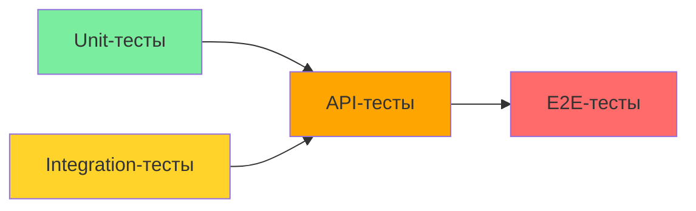

# 🔌 API-тесты (Contract Tests): Подход к реализации

## Обзор

API-тесты проверяют соответствие API Route Handlers спецификации: HTTP-статусы, форматы ответов, валидация входящих данных и обработка ошибок.

> **Отличие от Integration-тестов:** API-тесты мокают сервисы и сессии, фокусируясь на HTTP-контрактах. Integration-тесты используют реальную БД для проверки полного стека.

---

## Стек

| Инструмент | Назначение |
|------------|-----------|
| **Vitest** | Фреймворк для запуска тестов |
| **supertest** | HTTP-клиент для тестирования Express/Next.js API |
| **next-auth (mock)** | Мокирование сессий |

---

## Структура

```
tests/api/
├── setup.ts                    # Моки next-auth, конфигурация
├── helpers.ts                  # Утилиты для создания запросов
├── plots.test.ts
├── plots-id.test.ts
├── plotUsers.test.ts
├── plotUsers-connections.test.ts
├── profile.test.ts
├── roles.test.ts
└── auth.test.ts
```

---

## Настройка

### tests/api/setup.ts

```typescript
import { vi } from 'vitest';

// Моки next-auth
vi.mock('@/lib/auth', () => ({
  auth: vi.fn().mockResolvedValue({
    user: { id: 'user-1', email: 'test@example.com', role: 'ADMIN' },
  }),
}));

// Моки DI-контейнера
vi.mock('@/di/container', () => ({
  createPlotService: vi.fn(() => ({
    findAll: vi.fn().mockResolvedValue([]),
    findById: vi.fn().mockResolvedValue({ id: 'plot-1', plotNumber: '100' }),
    create: vi.fn().mockImplementation((data) => Promise.resolve({ id: 'new-plot', ...data })),
    update: vi.fn().mockImplementation((id, data) => Promise.resolve({ id, ...data })),
    delete: vi.fn().mockResolvedValue(undefined),
  })),
  createPlotUserRoleServiceDI: vi.fn(() => ({
    findWithPagination: vi.fn().mockResolvedValue({ data: [], total: 0, page: 1, limit: 20, totalPages: 0 }),
    create: vi.fn().mockImplementation((input) => Promise.resolve({ id: 'role-1', ...input })),
    findById: vi.fn().mockResolvedValue({ id: 'role-1', userId: 'user-1', plotId: 'plot-1' }),
    update: vi.fn().mockImplementation((id, data) => Promise.resolve({ id, ...data })),
    deactivate: vi.fn().mockResolvedValue({ id: 'role-1', status: 'expired' }),
  })),
  createProfileService: vi.fn(() => ({
    get: vi.fn().mockResolvedValue({ firstName: 'Test', lastName: 'User' }),
    update: vi.fn().mockImplementation((data) => Promise.resolve({ ...data })),
  })),
}));
```

---

## Что тестировать

### 1. Статус-коды

| Операция | Успех | Ошибка валидации | Не авторизован | Не авторизован (роль) | Ресурс не найден | Конфликт |
|----------|-------|-------------------|----------------|----------------------|------------------|---------|
| GET | 200 | — | 401 | 403 | 404 | — |
| POST | 201 | 400 | 401 | 403 | — | 409 |
| PATCH | 200 | 400 | 401 | 403 | 404 | 409 |
| DELETE | 204 | — | 401 | 403 | 404 | — |

### 2. Форматы ответов

**Успешный ответ:**
```json
{
  "success": true,
  "data": { ... }
}
```

**Ошибочный ответ:**
```json
{
  "success": false,
  "error": {
    "code": "VALIDATION_ERROR",
    "message": "Номер участка обязателен"
  }
}
```

### 3. Валидация входящих данных

| Поле | Невалидные данные | Ожидаемый результат |
|------|-------------------|---------------------|
| plotNumber | `""`, `null`, `< 1 символ` | 400 VALIDATION_ERROR |
| area | `0`, `-1`, `"text"`, `missing` | 400 VALIDATION_ERROR |
| cadastralNumber | `"invalid"` (не формат XX:XX:XXXXXXX:XXX) | 400 VALIDATION_ERROR |
| userId | не существует в БД | 400 VALIDATION_ERROR |
| plotId | не существует в БД | 400 VALIDATION_ERROR |
| role | `0`, `4`, `"admin"` | 400 VALIDATION_ERROR |

---

## Примеры тестов

### plots.test.ts

```typescript
// tests/api/plots.test.ts
import { describe, it, expect, vi, beforeEach } from 'vitest';
import request from 'supertest';
import { app } from '@/app'; // Экспорт Next.js app для тестов

describe('GET /api/v1/plots', () => {
  it('should return 200 with plots array', async () => {
    const response = await request(app).get('/api/v1/plots');

    expect(response.status).toBe(200);
    expect(response.body).toMatchObject({
      success: true,
      data: expect.any(Array),
    });
  });

  it('should return 401 without auth', async () => {
    vi.mocked(auth).mockResolvedValue(null);

    const response = await request(app).get('/api/v1/plots');

    expect(response.status).toBe(401);
    expect(response.body).toMatchObject({
      success: false,
      error: { code: 'UNAUTHORIZED' },
    });
  });

  it('should return 403 for MEMBER role', async () => {
    vi.mocked(auth).mockResolvedValue({
      user: { id: 'user-1', email: 'test@example.com', role: 'MEMBER' },
    });

    const response = await request(app).get('/api/v1/plots');

    expect(response.status).toBe(403);
    expect(response.body.error.code).toBe('FORBIDDEN');
  });
});

describe('POST /api/v1/plots', () => {
  it('should create a plot and return 201', async () => {
    const newPlot = { plotNumber: '999', area: 100 };

    const response = await request(app)
      .post('/api/v1/plots')
      .send(newPlot);

    expect(response.status).toBe(201);
    expect(response.body).toMatchObject({
      success: true,
      data: {
        id: expect.any(String),
        plotNumber: '999',
        area: 100,
      },
    });
  });

  it('should return 400 when plotNumber is empty', async () => {
    const response = await request(app)
      .post('/api/v1/plots')
      .send({ plotNumber: '', area: 100 });

    expect(response.status).toBe(400);
    expect(response.body).toMatchObject({
      success: false,
      error: { code: 'VALIDATION_ERROR' },
    });
  });

  it('should return 400 when area is missing', async () => {
    const response = await request(app)
      .post('/api/v1/plots')
      .send({ plotNumber: '1000' });

    expect(response.status).toBe(400);
    expect(response.body.error.code).toBe('VALIDATION_ERROR');
  });

  it('should return 400 when area is negative', async () => {
    const response = await request(app)
      .post('/api/v1/plots')
      .send({ plotNumber: '1000', area: -50 });

    expect(response.status).toBe(400);
    expect(response.body.error.code).toBe('VALIDATION_ERROR');
  });

  it('should return 400 when area is zero', async () => {
    const response = await request(app)
      .post('/api/v1/plots')
      .send({ plotNumber: '1000', area: 0 });

    expect(response.status).toBe(400);
    expect(response.body.error.code).toBe('VALIDATION_ERROR');
  });

  it('should return 400 when cadastralNumber format is invalid', async () => {
    const response = await request(app)
      .post('/api/v1/plots')
      .send({ plotNumber: '1000', area: 100, cadastralNumber: 'invalid' });

    expect(response.status).toBe(400);
    expect(response.body.error.code).toBe('VALIDATION_ERROR');
  });

  it('should return 409 when plotNumber already exists', async () => {
    // Мокаем сервис так, чтобы он бросал PlotDuplicateError
    const mockService = {
      create: vi.fn().mockRejectedValue(new PlotDuplicateError('1000')),
    };
    vi.mocked(createPlotService).mockReturnValue(mockService);

    const response = await request(app)
      .post('/api/v1/plots')
      .send({ plotNumber: '1000', area: 100 });

    expect(response.status).toBe(409);
    expect(response.body).toMatchObject({
      success: false,
      error: { code: 'CONFLICT' },
    });
    expect(response.body.error.message).toContain('Участок с номером 1000 уже существует');
  });
});
```

### plotUsers.test.ts

```typescript
// tests/api/plotUsers.test.ts
import { describe, it, expect, vi } from 'vitest';
import request from 'supertest';
import { app } from '@/app';

describe('GET /api/v1/plot-users', () => {
  it('should return 200 with paginated results', async () => {
    const response = await request(app)
      .get('/api/v1/plot-users')
      .query({ page: 1, limit: 10 });

    expect(response.status).toBe(200);
    expect(response.body).toMatchObject({
      success: true,
      data: expect.any(Array),
      total: expect.any(Number),
      page: 1,
      limit: 10,
      totalPages: expect.any(Number),
    });
  });

  it('should support filtering by userId', async () => {
    const response = await request(app)
      .get('/api/v1/plot-users')
      .query({ userId: 'user-1' });

    expect(response.status).toBe(200);
    expect(response.body.success).toBe(true);
  });

  it('should support filtering by plotId', async () => {
    const response = await request(app)
      .get('/api/v1/plot-users')
      .query({ plotId: 'plot-1' });

    expect(response.status).toBe(200);
  });

  it('should support filtering by role', async () => {
    const response = await request(app)
      .get('/api/v1/plot-users')
      .query({ role: 1 });

    expect(response.status).toBe(200);
  });

  it('should support filtering by status', async () => {
    const response = await request(app)
      .get('/api/v1/plot-users')
      .query({ status: 'active' });

    expect(response.status).toBe(200);
  });

  it('should use default pagination when not specified', async () => {
    const mockService = {
      findWithPagination: vi.fn().mockImplementation((filters) => {
        expect(filters.page).toBeUndefined();
        expect(filters.limit).toBeUndefined();
        return Promise.resolve({
          data: [],
          total: 0,
          page: 1,
          limit: 20,
          totalPages: 0,
        });
      }),
    };

    vi.mocked(createPlotUserRoleServiceDI).mockReturnValue(mockService);

    const response = await request(app).get('/api/v1/plot-users');

    expect(response.status).toBe(200);
  });
});

describe('POST /api/v1/plot-users', () => {
  it('should create a plot-user relation and return 201', async () => {
    const input = {
      userId: 'user-1',
      plotId: 'plot-1',
      role: 1,
      status: 'active',
    };

    const response = await request(app)
      .post('/api/v1/plot-users')
      .send(input);

    expect(response.status).toBe(201);
    expect(response.body).toMatchObject({
      success: true,
      data: expect.objectContaining({
        userId: 'user-1',
        plotId: 'plot-1',
        role: 1,
      }),
    });
  });

  it('should return 400 when required fields are missing', async () => {
    const response = await request(app)
      .post('/api/v1/plot-users')
      .send({ userId: 'user-1' }); // Missing plotId and role

    expect(response.status).toBe(400);
    expect(response.body.error.code).toBe('VALIDATION_ERROR');
  });

  it('should return 400 when role is invalid', async () => {
    const response = await request(app)
      .post('/api/v1/plot-users')
      .send({ userId: 'user-1', plotId: 'plot-1', role: 5 });

    expect(response.status).toBe(400);
  });

  it('should return 409 when active relation already exists', async () => {
    vi.mocked(createPlotUserRoleServiceDI).mockReturnValue({
      create: vi.fn().mockRejectedValue(
        new PlotUserRoleDuplicateError('Already exists')
      ),
    } as any);

    const response = await request(app)
      .post('/api/v1/plot-users')
      .send({ userId: 'user-1', plotId: 'plot-1', role: 1 });

    expect(response.status).toBe(409);
    expect(response.body.error.code).toBe('CONFLICT');
  });
});
```

---

## Чек-лист тестируемых сценариев

### plots

| ID | Метод | Путь | Статус | Описание |
|----|-------|------|--------|----------|
| P-01 | GET | /api/v1/plots | 200 | Возврат списка |
| P-02 | GET | /api/v1/plots | 401 | Без авторизации |
| P-03 | GET | /api/v1/plots | 403 | Недостаточно прав |
| P-04 | POST | /api/v1/plots | 201 | Создание |
| P-05 | POST | /api/v1/plots | 400 | plotNumber пустой |
| P-06 | POST | /api/v1/plots | 400 | area = 0 |
| P-07 | POST | /api/v1/plots | 400 | area < 0 |
| P-08 | POST | /api/v1/plots | 400 | cadastralNumber невалидный |
| P-09 | POST | /api/v1/plots | 409 | Дубликат plotNumber |
| P-10 | POST | /api/v1/plots | 409 | Дублиcad cadastralNumber |
| P-11 | PATCH | /api/v1/plots/:id | 200 | Обновление |
| P-12 | PATCH | /api/v1/plots/:id | 404 | Не существует |
| P-13 | DELETE | /api/v1/plots/:id | 204 | Удаление |
| P-14 | DELETE | /api/v1/plots/:id | 404 | Не существует |

### plotUsers

| ID | Метод | Путь | Статус | Описание |
|----|-------|------|--------|----------|
| PU-01 | GET | /api/v1/plot-users | 200 | Список с пагинацией |
| PU-02 | GET | /api/v1/plot-users | 200 | Фильтр по userId |
| PU-03 | GET | /api/v1/plot-users | 200 | Фильтр по plotId |
| PU-04 | GET | /api/v1/plot-users | 200 | Фильтр по role |
| PU-05 | GET | /api/v1/plot-users | 200 | Фильтр по status |
| PU-06 | POST | /api/v1/plot-users | 201 | Создание связи |
| PU-07 | POST | /api/v1/plot-users | 400 | Missing fields |
| PU-08 | POST | /api/v1/plot-users | 400 | Invalid role |
| PU-09 | POST | /api/v1/plot-users | 409 | Duplicate |

---

## Моки для next-auth

```typescript
// tests/api/helpers.ts
import { vi } from 'vitest';
import { auth } from '@/lib/auth';

/**
 * Создаёт мокированную сессию для тестов
 */
export function mockSession(user: {
  id: string;
  email: string;
  role: string;
}) {
  vi.mocked(auth).mockResolvedValue({ user });
}

/**
 * Создаёт мокированную несессированную сессию
 */
export function mockNoSession() {
  vi.mocked(auth).mockResolvedValue(null);
}

/**
 * Создаёт мокированную сессию с ролью MEMBER
 */
export function mockMemberSession() {
  mockSession({ id: 'user-1', email: 'member@example.com', role: 'MEMBER' });
}
```

---

## Тестирование ошибок

### Формат ответа ошибки

```json
{
  "success": false,
  "error": {
    "code": "VALIDATION_ERROR",
    "message": "Номер участка обязателен"
  }
}
```

### Коды ошибок

| Код | HTTP Status | Когда |
|-----|-------------|-------|
| `UNAUTHORIZED` | 401 | Нет сессии |
| `FORBIDDEN` | 403 | Недостаточно прав |
| `VALIDATION_ERROR` | 400 | Невалидные входные данные |
| `NOT_FOUND` | 404 | Ресурс не найден |
| `CONFLICT` | 409 | Дубликат |
| `UNKNOWN_ERROR` | 500 | Неожиданная ошибка |

---

## Тестирование пагинации

```typescript
it('should return correct pagination metadata', async () => {
  const mockService = {
    findWithPagination: vi.fn().mockResolvedValue({
      data: Array(10).fill({ id: '1' }),
      total: 45,
      page: 2,
      limit: 10,
      totalPages: 5,
    }),
  };

  vi.mocked(createPlotUserRoleServiceDI).mockReturnValue(mockService);

  const response = await request(app)
    .get('/api/v1/plot-users')
    .query({ page: 2, limit: 10 });

  expect(response.body).toMatchObject({
    success: true,
    data: expect.any(Array),
    total: 45,
    page: 2,
    limit: 10,
    totalPages: 5,
  });
});
```

---

## Цели покрытия кода

| Слой | Statement | Branch | Function | Line |
|------|-----------|--------|----------|------|
| **API Handlers** | 80% | 70% | 85% | 80% |

---

## Команды для запуска

```bash
# Все API-тесты
npm run test tests/api/

# Один файл
npm run test tests/api/plots.test.ts

# Конкретный тест
npm run test tests/api/plots.test.ts -t "should create"
```

---

## Преимущества и недостатки

### ✅ Преимущества
- Быстрое выполнение (нет БД)
- Детектирование изменений в HTTP-контрактах
- Проверка валидации входящих данных
- Простая настройка

### ❌ Недостатки
- Не проверяют реальное взаимодействие с БД
- Могут пропустить проблемы с сериализацией
- Зависимость от моков сервисов

---

## Связь с другими типами тестов



- **Unit → API:** API-тесты мокают сервисы, которые прошли Unit-тесты
- **Integration → API:** Integration проверяют полный стек, API проверяют контракты
- **API → E2E:** E2E используют реальные API-эндпоинты

---

## Связанные документы

| Документ | Связь |
|----------|-------|
| [`README.md`](README.md) | Общий обзор тестирования |
| [`unit-tests.md`](unit-tests.md) | Unit-тесты мокают репозитории, API мокают сервисы |
| [`integration-tests.md`](integration-tests.md) | Integration используют реальную БД, API мокают всё кроме HTTP |
| [`component-tests.md`](component-tests.md) | Component-тесты мокают API-клиент |
| [`e2e-tests.md`](e2e-tests.md) | E2E тестируют полный стек, API мокают сервисы |
