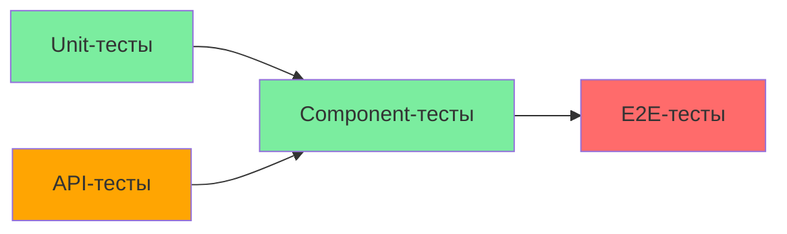

# 🧩 Component-тесты: Подход к реализации

## Обзор

Component-тесты проверяют UI-компоненты в изоляции от внешних зависимостей (API, БД, роутер). Они проверяют рендеринг, состояния, обработку событий и взаимодействие между компонентами.

---

## Стек

| Инструмент | Назначение |
|------------|-----------|
| **Vitest** | Фреймворк для запуска тестов |
| **@testing-library/react** | Рендеринг и проверка компонентов |
| **@testing-library/jest-dom** | Расширенные matchers для DOM |

---

## Структура

```
tests/components/
├── setup.ts                    # Моки, глобальные настройки
├── ui/
│   ├── Button.test.tsx
│   ├── Badge.test.tsx
│   ├── Input.test.tsx
│   ├── Select.test.tsx
│   ├── EmptyState.test.tsx
│   └── ConfirmDialog.test.tsx
├── features/
│   ├── plotUser/
│   │   ├── ParticipantList.test.tsx
│   │   ├── ParticipantTable.test.tsx
│   │   ├── ParticipantRow.test.tsx
│   │   ├── ParticipantFilters.test.tsx
│   │   ├── ParticipantSearch.test.tsx
│   │   └── PlotUserForm.test.tsx
│   ├── userProfile/
│   │   ├── UserProfileForm.test.tsx
│   │   └── AvatarUpload.test.tsx
│   └── roles/
│       ├── RoleList.test.tsx
│       └── RoleForm.test.tsx
└── hooks/
    ├── useTheme.test.tsx
    └── useUrlState.test.ts
```

---

## Настройка

### tests/components/setup.ts

```typescript
import { expect, vi, afterEach } from 'vitest';
import '@testing-library/jest-dom';

// Мокирование apiClient
const mockApiClient = {
  get: vi.fn(),
  post: vi.fn(),
  patch: vi.fn(),
  delete: vi.fn(),
  postFormData: vi.fn(),
  getWithQuery: vi.fn(),
};

vi.mock('@/lib/api-client', () => ({
  apiClient: mockApiClient,
}));

// Мокирование next-auth
vi.mock('next-auth/react', () => ({
  useSession: vi.fn(() => ({ data: null, status: 'unauthenticated' })),
}));

// Очистка моков после каждого теста
afterEach(() => {
  vi.clearAllMocks();
});
```

---

## UI-компоненты: Что тестировать

### Button

| Сценарий | Что проверять |
|----------|---------------|
| Рендер | Текст кнопки, className |
| Варианты | primary, secondary, danger, ghost |
| Размеры | sm, md, lg |
| Loading | Спиннер, disabled |
| Доступность | focus-ring, aria |
| Клик | onClick вызывается |

### Badge

| Сценарий | Что проверять |
|----------|---------------|
| Рендер | Текст, цвет |
| Варианты | active, pending, expired, owner |
| Пустое состояние | Пустой бейдж |

### Input

| Сценарий | Что проверять |
|----------|---------------|
| Рендер | Placeholder, value, disabled |
| Ввод | onChange вызывается |
| Валидация | error state |
| Disabled | Не принимает ввод |

---

## Feature-компоненты: Что тестировать

### ParticipantList

| Сценарий | Что проверять |
|----------|---------------|
| Загрузка | Skeleton отображается |
| Данные | Таблица рендерится с данными |
| Пустое состояние | EmptyState при пустом списке |
| Ошибка | Alert с ошибкой |
| Фильтры | Фильтрация работает |
| Поиск | Поиск работает (debounce) |
| Пагинация | Переключение страниц |
| Удаление | Confirm + удаление |

### UserProfileForm

| Сценарий | Что проверять |
|----------|---------------|
| Загрузка | Skeleton |
| Валидация | Обязательные поля |
| Отправка | API вызывается |
| Успех | Показ success |
| Ошибка | Показ ошибки |

---

## Примеры тестов

### UI-компоненты: Button.test.tsx

```typescript
// tests/components/ui/Button.test.tsx
import { describe, it, expect } from 'vitest';
import { render, screen, fireEvent } from '@testing-library/react';
import { Button } from '@/components/ui/Button/Button';

describe('Button', () => {
  it('should render with default props', () => {
    render(<Button>Click me</Button>);
    
    const button = screen.getByRole('button', { name: /click me/i });
    expect(button).toBeInTheDocument();
    expect(button).toHaveClass('bg-indigo-600'); // primary variant
    expect(button).toHaveClass('px-4'); // md size
  });

  it('should apply variant styles', () => {
    const { rerender } = render(
      <Button variant="danger">Delete</Button>
    );
    
    expect(screen.getByRole('button')).toHaveClass('bg-red-600');

    rerender(<Button variant="secondary">Cancel</Button>);
    expect(screen.getByRole('button')).toHaveClass('bg-white');
  });

  it('should apply size styles', () => {
    render(<Button size="sm">Small</Button>);
    expect(screen.getByRole('button')).toHaveClass('px-3'); // sm

    render(<Button size="lg">Large</Button>);
    expect(screen.getByRole('button')).toHaveClass('px-6'); // lg
  });

  it('should be disabled when isLoading is true', () => {
    render(<Button isLoading>Loading...</Button>);
    
    const button = screen.getByRole('button');
    expect(button).toBeDisabled();
    expect(screen.getByRole('button')).toHaveTextContent('Loading...');
  });

  it('should show spinner when isLoading is true', () => {
    render(<Button isLoading>Saving</Button>);
    
    const spinner = screen.getByRole('button').querySelector('.animate-spin');
    expect(spinner).toBeInTheDocument();
  });

  it('should call onClick when clicked', () => {
    const handleClick = vi.fn();
    render(<Button onClick={handleClick}>Click</Button>);
    
    fireEvent.click(screen.getByRole('button'));
    expect(handleClick).toHaveBeenCalledTimes(1);
  });

  it('should not call onClick when disabled', () => {
    const handleClick = vi.fn();
    render(
      <Button disabled onClick={handleClick}>Disabled</Button>
    );
    
    fireEvent.click(screen.getByRole('button'));
    expect(handleClick).not.toHaveBeenCalled();
  });
});
```

### UI-компоненты: Badge.test.tsx

```typescript
// tests/components/ui/Badge.test.tsx
import { describe, it, expect } from 'vitest';
import { render, screen } from '@testing-library/react';
import { Badge } from '@/components/ui/Badge/Badge';

describe('Badge', () => {
  it('should render text', () => {
    render(<Badge>Active</Badge>);
    expect(screen.getByText('Active')).toBeInTheDocument();
  });

  it('should apply variant styles', () => {
    const { rerender } = render(<Badge variant="success">Active</Badge>);
    expect(screen.getByText('Active')).toHaveClass('bg-green');

    rerender(<Badge variant="warning">Pending</Badge>);
    expect(screen.getByText('Pending')).toHaveClass('bg-yellow');

    rerender(<Badge variant="error">Expired</Badge>);
    expect(screen.getByText('Expired')).toHaveClass('bg-red');
  });
});
```

### Feature-компоненты: ParticipantList.test.tsx

```typescript
// tests/components/features/plotUser/ParticipantList.test.tsx
import { describe, it, expect, vi } from 'vitest';
import { render, screen, fireEvent, waitFor } from '@testing-library/react';
import { ParticipantList } from '@/components/features/plotUser/ParticipantList';
import { apiClient } from '@/lib/api-client';

// Мокирование apiClient
const mockGet = vi.fn();
vi.mocked(apiClient.getWithQuery).mockImplementation(mockGet);

describe('ParticipantList', () => {
  const mockPlotId = 'plot-123';

  const mockParticipants = [
    {
      id: 'pu-1',
      user: { email: 'user1@example.com', firstName: 'Иван', lastName: 'Иванов' },
      role: 1,
      status: 'active',
      comment: null,
    },
    {
      id: 'pu-2',
      user: { email: 'user2@example.com', firstName: 'Петр', lastName: 'Петров' },
      role: 2,
      status: 'pending',
      comment: 'Ожидает подтверждения',
    },
  ];

  beforeEach(() => {
    vi.clearAllMocks();
  });

  describe('Загрузка', () => {
    it('should show skeleton while loading', () => {
      // Возвращаем Promise, который никогда не резолвится
      mockGet.mockReturnValue(new Promise(() => {}));

      render(<ParticipantList plotId={mockPlotId} />);

      // Skeleton или текст загрузки должен быть
      expect(screen.getByText('Участники участка')).toBeInTheDocument();
    });
  });

  describe('Данные загружены', () => {
    it('should display participants table', async () => {
      mockGet.mockResolvedValue({
        data: mockParticipants,
        total: 2,
        page: 1,
        limit: 25,
        totalPages: 1,
      });

      render(<ParticipantList plotId={mockPlotId} />);

      await waitFor(() => {
        expect(screen.getByText('Иван Иванов')).toBeInTheDocument();
        expect(screen.getByText('Петр Петров')).toBeInTheDocument();
      });
    });
  });

  describe('Пустое состояние', () => {
    it('should show EmptyState when no participants', async () => {
      mockGet.mockResolvedValue({
        data: [],
        total: 0,
        page: 1,
        limit: 25,
        totalPages: 0,
      });

      render(<ParticipantList plotId={mockPlotId} />);

      await waitFor(() => {
        expect(screen.getByText('Участники не найдены')).toBeInTheDocument();
      });
    });
  });

  describe('Ошибка загрузки', () => {
    it('should show error message', async () => {
      mockGet.mockRejectedValue(new Error('Network error'));

      render(<ParticipantList plotId={mockPlotId} />);

      await waitFor(() => {
        expect(screen.getByText('Ошибка')).toBeInTheDocument();
        expect(screen.getByText(/network error/i)).toBeInTheDocument();
      });
    });
  });

  describe('Фильтры', () => {
    it('should apply role filter', async () => {
      mockGet.mockResolvedValue({
        data: [mockParticipants[0]],
        total: 1,
        page: 1,
        limit: 25,
        totalPages: 1,
      });

      render(<ParticipantList plotId={mockPlotId} />);

      // Фильтр по роли должен быть доступен
      expect(screen.getByText('Участники участка')).toBeInTheDocument();
    });
  });

  describe('Поиск', () => {
    it('should filter participants by search query', async () => {
      mockGet.mockResolvedValue({
        data: [mockParticipants[0]],
        total: 1,
        page: 1,
        limit: 25,
        totalPages: 1,
      });

      render(<ParticipantList plotId={mockPlotId} />);

      // Ввод поискового запроса
      const searchInput = screen.getByPlaceholderText(/поиск/i);
      fireEvent.change(searchInput, { target: { value: 'Иван' } });

      await waitFor(() => {
        expect(mockGet).toHaveBeenCalledWith(
          `/plots/${mockPlotId}/participants`,
          expect.objectContaining({ search: 'Иван' }),
          expect.any(Object)
        );
      });
    });
  });

  describe('Удаление', () => {
    it('should delete participant on confirm', async () => {
      mockGet.mockResolvedValue({
        data: mockParticipants,
        total: 2,
        page: 1,
        limit: 25,
        totalPages: 1,
      });

      // Мокирование window.confirm
      const originalConfirm = window.confirm;
      window.confirm = vi.fn(() => true);

      render(
        <ParticipantList
          plotId={mockPlotId}
          onDeleteParticipant={() => {}}
        />
      );

      await waitFor(() => {
        expect(screen.getByText('Иван Иванов')).toBeInTheDocument();
      });

      // Клик по кнопке удаления
      const deleteButton = screen.getAllByRole('button').find(
        btn => btn.textContent?.includes('Удалить')
      );
      if (deleteButton) {
        fireEvent.click(deleteButton);
      }

      window.confirm = originalConfirm;
    });
  });
});
```

### Хуки: useTheme.test.tsx

```typescript
// tests/components/hooks/useTheme.test.tsx
import { describe, it, expect, vi, beforeEach } from 'vitest';
import { renderHook, act } from '@testing-library/react';
import { ThemeProvider, useTheme } from '@/hooks/useTheme';

// Мокирование localStorage
const mockLocalStorage = (() => {
  let store: Record<string, string> = {};
  return {
    getItem: vi.fn((key: string) => store[key] || null),
    setItem: vi.fn((key: string, value: string) => {
      store[key] = value;
    }),
    removeItem: vi.fn((key: string) => {
      delete store[key];
    }),
    clear: vi.fn(() => {
      store = {};
    }),
  };
})();

Object.defineProperty(window, 'localStorage', {
  value: mockLocalStorage,
});

describe('useTheme', () => {
  it('should return current theme', () => {
    const { result } = renderHook(() => useTheme(), {
      wrapper: ThemeProvider,
    });

    expect(result.current.currentTheme).toBe('light'); // Дефолтная тема
  });

  it('should toggle theme', () => {
    const { result } = renderHook(() => useTheme(), {
      wrapper: ThemeProvider,
    });

    act(() => {
      result.current.toggleTheme();
    });

    expect(result.current.currentTheme).toBe('dark');

    act(() => {
      result.current.toggleTheme();
    });

    expect(result.current.currentTheme).toBe('green');
  });

  it('should set theme directly', () => {
    const { result } = renderHook(() => useTheme(), {
      wrapper: ThemeProvider,
    });

    act(() => {
      result.current.setTheme('dark');
    });

    expect(result.current.currentTheme).toBe('dark');
  });

  it('should save theme to localStorage', () => {
    const { result } = renderHook(() => useTheme(), {
      wrapper: ThemeProvider,
    });

    act(() => {
      result.current.setTheme('green');
    });

    expect(mockLocalStorage.setItem).toHaveBeenCalledWith('theme', 'green');
  });

  it('should restore theme from localStorage on mount', () => {
    mockLocalStorage.getItem.mockReturnValue('dark');

    const { result } = renderHook(() => useTheme(), {
      wrapper: ThemeProvider,
    });

    expect(result.current.currentTheme).toBe('dark');
    expect(mockLocalStorage.getItem).toHaveBeenCalledWith('theme');
  });
});
```

---

## Паттерны тестирования

### Мокирование apiClient

```typescript
// Мокирование API
vi.mock('@/lib/api-client', () => ({
  apiClient: {
    get: vi.fn().mockResolvedValue({ data: [...], total: 10 }),
    post: vi.fn().mockResolvedValue({ id: 'new-id' }),
    patch: vi.fn().mockResolvedValue({}),
    delete: vi.fn().mockResolvedValue({}),
  },
}));
```

### Тестирование состояний загрузки

```typescript
// Симуляция загрузки
it('should show loading state', async () => {
  // Promise, который никогда не резолвится
  mockGet.mockReturnValue(new Promise(() => {}));

  render(<ParticipantList plotId="123" />);

  expect(screen.getByText('Загрузка...')).toBeInTheDocument();
});
```

### Тестирование debounce

```typescript
// Debounce testing
it('should debounce search input', () => {
  render(<ParticipantSearch value="" onChange={vi.fn()} debounceMs={300} />);
  
  const input = screen.getByRole('textbox');
  fireEvent.change(input, { target: { value: 'test' } });

  // Проверяем что API не вызван сразу
  expect(apiClient.get).not.toHaveBeenCalled();

  // Ждём debounce
  await vi.advanceTimersByTimeAsync(300);
  
  expect(apiClient.get).toHaveBeenCalled();
});
```

### Мокирование window.confirm

```typescript
const originalConfirm = window.confirm;
window.confirm = vi.fn(() => true);

// ... тест ...

window.confirm = originalConfirm;
```

---

## Цели покрытия кода

| Слой | Statement | Branch | Function | Line |
|------|-----------|--------|----------|------|
| **UI-компоненты** | 60% | 40% | 60% | 60% |
| **Feature-компоненты** | 70% | 50% | 70% | 70% |
| **Hooks** | 80% | 60% | 85% | 80% |

---

## Команды для запуска

```bash
# Все Component-тесты
npm run test tests/components/

# UI-компоненты
npm run test tests/components/ui/

# Feature-компоненты
npm run test tests/components/features/

# Хуки
npm run test tests/components/hooks/

# Один файл
npm run test tests/components/ui/Button.test.tsx
```

---

## Связь с другими типами тестов



- **API → Component:** Component мокают API-клиент
- **Component → E2E:** E2E тестируют реальные компоненты

---

## Связанные документы

| Документ | Связь |
|----------|-------|
| [`README.md`](README.md) | Общий обзор тестирования |
| [`unit-tests.md`](unit-tests.md) | Unit-тесты тестируют логику, Component тестируют рендеринг |
| [`api-tests.md`](api-tests.md) | Component мокают API, API тестируют контракты |
| [`e2e-tests.md`](e2e-tests.md) | E2E тестируют реальные компоненты, Component мокают зависимости |
