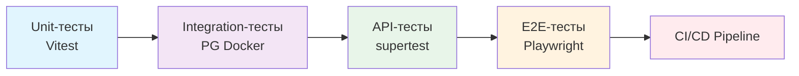

# E2E-тестирование — Playwright

## Обзор

End-to-End (E2E) тесты проверяют полные пользовательские сценарии от начала до конца, имитируя реальное поведение пользователя в браузере.

**Стек:** Playwright  
**Среда:**headed/ headless режимы  
**Селлектор:** CSS-селекторы, тестовые IDs

---

## 1. Структура тестовой папки

```
tests/e2e/
├── setup.ts                    # Глобальная настройка (browser, context, storageState)
├── global.teardown.ts          # Очистка тестовых данных
├── auth.spec.ts                # Аутентификация (регистрация, вход, выход)
├── plots.spec.ts               # Управление участками (CRUD, поиск)
├── plot-users.spec.ts          # Управление участниками (CRUD, фильтры, поиск)
├── profile.spec.ts             # Редактирование профиля, смена темы
├── navigation.spec.ts          # Навигация, роутинг, доступ по ролям
└── shared/
    ├── fixtures.ts             # Пользовательские фикстуры
    └── test-helpers.ts         # Переиспользуемые хелперы
```

---

## 2. Конфигурация Playwright

### playwright.config.ts

```typescript
import { defineConfig, devices } from '@playwright/test';

export default defineConfig({
  testDir: './tests/e2e',
  fullyParallel: true,
  forbidOnly: !!process.env.CI,
  retries: process.env.CI ? 2 : 0,
  workers: process.env.CI ? 1 : undefined,
  reporter: 'html',
  use: {
    baseURL: 'http://localhost:3000',
    trace: 'on-first-retry',
    screenshot: 'only-on-failure',
    video: 'retain-on-failure',
  },
  projects: [
    {
      name: 'chromium',
      use: { ...devices['Desktop Chrome'] },
    },
    {
      name: 'firefox',
      use: { ...devices['Desktop Firefox'] },
    },
    {
      name: 'webkit',
      use: { ...devices['Desktop Safari'] },
    },
  ],
  webServer: {
    command: 'npm run dev',
    url: 'http://localhost:3000',
    reuseExistingServer: !process.env.CI,
  },
});
```

---

## 3. Глобальная настройка и фикстуры

### tests/e2e/setup.ts

```typescript
import { test as setup } from '@playwright/test';
import path from 'path';

const authFile = path.join(__dirname, '../playwright/.auth/user.json');

setup('authenticate', async ({ page }) => {
  // Авторизация для сохранения сессии
  await page.goto('/login');
  await page.getByLabel('Email').fill('test@example.com');
  await page.getByLabel('Пароль').fill('Test1234!');
  await page.getByRole('button', { name: /войти|sign in/i }).click();
  await page.waitForURL('/dashboard');
  
  // Сохранение состояния аутентификации
  await page.context().storageState({ path: authFile });
});
```

### tests/e2e/shared/fixtures.ts

```typescript
import { test as base } from '@playwright/test';
import { loginAsAdmin, loginAsMember, createTestPlot } from './test-helpers';

export const test = base.extend<{
  adminContext: import('@playwright/test').BrowserContext;
  memberContext: import('@playwright/test').BrowserContext;
}>({
  adminContext: async ({ browser }, use) => {
    const context = await browser.newContext({
      storageState: require.resolve('../playwright/.auth/admin.json'),
    });
    await use(context);
    await context.close();
  },
  memberContext: async ({ browser }, use) => {
    const context = await browser.newContext({
      storageState: require.resolve('../playwright/.auth/user.json'),
    });
    await use(context);
    await context.close();
  },
});

export { expect } from '@playwright/test';
```

---

## 4. Примеры E2E-тестов

### tests/e2e/auth.spec.ts — Аутентификация

```typescript
import { test, expect } from '../e2e/shared/fixtures';

test.describe('Аутентификация', () => {
  test('AC-1: Регистрация нового пользователя', async ({ page }) => {
    // Navigating to registration page
    await page.goto('/register');
    
    // Filling registration form
    await page.getByLabel('Email').fill('newuser@example.com');
    await page.getByLabel('Пароль').fill('Test1234!');
    await page.getByLabel('Имя').fill('Новый');
    await page.getByLabel('Фамилия').fill('Пользователь');
    
    // Submitting form
    await page.getByRole('button', { name: /зарегистрироваться|register/i }).click();
    
    // Verifying success
    await expect(page).toHaveURL('/dashboard');
    await expect(page.getByText('Новый Пользователь')).toBeVisible();
  });

  test('AC-1: Вход с невалидным паролем', async ({ page }) => {
    await page.goto('/login');
    await page.getByLabel('Email').fill('test@example.com');
    await page.getByLabel('Пароль').fill('WrongPassword123!');
    await page.getByRole('button', { name: /войти|sign in/i }).click();
    
    await expect(page.getByRole('alert')).toBeVisible();
    await expect(page.getByRole('alert')).toContainText('Неверный email или пароль');
  });

  test('AC-4: Выход из системы', async ({ page }) => {
    await page.goto('/dashboard');
    await page.getByRole('button', { name: /профиль|menu/i }).click();
    await page.getByRole('menuitem', { name: /выйти|logout/i }).click();
    
    await expect(page).toHaveURL('/login');
  });
});
```

### tests/e2e/plots.spec.ts — Управление участками

```typescript
import { test, expect } from '../e2e/shared/fixtures';

test.describe('Управление участками', () => {
  test('AC-2: Создание нового участка', async ({ page }) => {
    await page.goto('/dashboard/plots');
    
    // Открытие формы создания
    await page.getByRole('button', { name: /добавить|создать|new plot/i }).click();
    
    // Заполнение формы
    await page.getByLabel('Номер участка').fill('42');
    await page.getByLabel('Кадастровый номер').fill('54:12:1234567:8901');
    await page.getByLabel('Площадь (м²)').fill('600');
    await page.getByLabel('Адрес').fill('ул. Садовая, д. 42');
    
    // Отправка формы
    await page.getByRole('button', { name: /сохранить|save/i }).click();
    
    // Проверка успеха
    await expect(page.getByText('Участок успешно создан')).toBeVisible();
    await expect(page.getByText('42')).toBeVisible();
  });

  test('AC-2: Валидация формы создания', async ({ page }) => {
    await page.goto('/dashboard/plots');
    await page.getByRole('button', { name: /добавить|создать/i }).click();
    
    // Отправка без заполнения
    await page.getByRole('button', { name: /сохранить/i }).click();
    
    await expect(page.getByText('Номер участка обязателен')).toBeVisible();
    await expect(page.getByText('Площадь должна быть больше 0')).toBeVisible();
  });

  test('AC-5: Редактирование участка', async ({ page }) => {
    await page.goto('/dashboard/plots');
    await page.getByRole('button', { name: /редактировать|edit/i }).first().click();
    
    await page.getByLabel('Адрес').fill('ул. Цветочная, д. 10');
    await page.getByRole('button', { name: /сохранить/i }).click();
    
    await expect(page.getByText('Участок обновлён')).toBeVisible();
    await expect(page.getByText('ул. Цветочная')).toBeVisible();
  });

  test('AC-6: Удаление участка с подтверждением', async ({ page }) => {
    await page.goto('/dashboard/plots');
    await page.getByRole('button', { name: /удалить|delete/i }).first().click();
    
    // Подтверждение удаления
    await page.getByRole('button', { name: /подтвердить|delete/i }).click();
    
    await expect(page.getByText('Участок удалён')).toBeVisible();
    await expect(page.getByText('42')).not.toBeVisible();
  });

  test('AC-7: Поиск по участкам', async ({ page }) => {
    await page.goto('/dashboard/plots');
    
    await page.getByLabel('Поиск').fill('42');
    await expect(page.getByText('42')).toBeVisible();
    
    await page.getByLabel('Поиск').fill('999');
    await expect(page.getByText('Не найдено')).toBeVisible();
  });

  test('AC-7: Фильтрация по кадастровому номеру', async ({ page }) => {
    await page.goto('/dashboard/plots');
    
    await page.getByLabel('Кадастровый номер').fill('54:12:');
    // Фильтрация по кадастру
    await expect(page.getByRole('table')).toBeVisible();
  });
});
```

### tests/e2e/plot-users.spec.ts — Управление участниками

```typescript
import { test, expect } from '../e2e/shared/fixtures';

test.describe('Управление участниками', () => {
  test('AC-3: Создание связи участка и участника', async ({ page }) => {
    await page.goto('/dashboard/plot-users');
    
    await page.getByRole('button', { name: /добавить|создать/i }).click();
    
    await page.getByLabel('Участок').selectOption('42');
    await page.getByLabel('Участник').selectOption('Иван Иванов');
    
    await page.getByRole('button', { name: /сохранить/i }).click();
    
    await expect(page.getByText('Связь создана')).toBeVisible();
  });

  test('AC-3: Фильтрация участников', async ({ page }) => {
    await page.goto('/dashboard/plot-users');
    
    // Фильтр по участку
    await page.getByLabel('Участок').selectOption('42');
    await expect(page.getByRole('table')).toBeVisible();
    
    // Фильтр по статусу
    await page.getByLabel('Статус').selectOption('active');
  });

  test('AC-3: Поиск участников по имени', async ({ page }) => {
    await page.goto('/dashboard/plot-users');
    
    await page.getByLabel('Поиск').fill('Иван');
    await expect(page.getByText('Иван Иванов')).toBeVisible();
  });

  test('AC-3: Деактивация участника', async ({ page }) => {
    await page.goto('/dashboard/plot-users');
    
    await page.getByRole('button', { name: /деактивировать|deactivate/i }).first().click();
    
    await expect(page.getByText('Участник деактивирован')).toBeVisible();
  });

  test('AC-3: Удаление связи', async ({ page }) => {
    await page.goto('/dashboard/plot-users');
    
    await page.getByRole('button', { name: /удалить|delete/i }).first().click();
    
    await expect(page.getByText('Связь удалена')).toBeVisible();
  });
});
```

### tests/e2e/profile.spec.ts — Редактирование профиля

```typescript
import { test, expect } from '../e2e/shared/fixtures';

test.describe('Профиль пользователя', () => {
  test('AC-4: Редактирование профиля', async ({ page }) => {
    await page.goto('/dashboard/profile');
    
    await page.getByLabel('Имя').fill('Обновлённое Имя');
    await page.getByLabel('Фамилия').fill('Обновлённая Фамилия');
    await page.getByLabel('Телефон').fill('+7 (999) 123-45-67');
    
    await page.getByRole('button', { name: /сохранить/i }).click();
    
    await expect(page.getByText('Профиль обновлён')).toBeVisible();
  });

  test('AC-4: Смена темы (светлая → тёмная)', async ({ page }) => {
    await page.goto('/dashboard/profile');
    
    // Переключение темы
    const themeToggle = page.getByRole('button', { name: /тема|theme/i });
    await themeToggle.click();
    
    // Проверка смены темы
    await expect(page.locator('html')).not.toHaveAttribute('class', '*light*');
  });

  test('AC-4: Загрузка аватара', async ({ page }) => {
    await page.goto('/dashboard/profile');
    
    await page.getByLabel('Аватар').setInputFiles('tests/e2e/fixtures/test-avatar.png');
    
    await expect(page.getByAltText('Аватар пользователя')).toBeVisible();
  });
});
```

### tests/e2e/navigation.spec.ts — Навигация и доступ по ролям

```typescript
import { test, expect } from '../e2e/shared/fixtures';

test.describe('Навигация и доступ', () => {
  test('Переход между разделами', async ({ page }) => {
    await page.goto('/dashboard');
    
    await page.getByRole('link', { name: /участки|plots/i }).click();
    await expect(page).toHaveURL('/dashboard/plots');
    
    await page.getByRole('link', { name: /участники|members/i }).click();
    await expect(page).toHaveURL('/dashboard/plot-users');
  });

  test('Доступ к страницам по ролям', async ({ adminContext }) => {
    const page = await adminContext.newPage();
    await page.goto('/dashboard/roles');
    
    await expect(page).toHaveURL('/dashboard/roles');
  });

  test('Редирект с защищённой страницы на login', async ({ page }) => {
    await page.goto('/login');
    await page.addInitScript(() => {
      localStorage.removeItem('next-auth.session-token');
    });
    
    await page.goto('/dashboard/plots');
    await expect(page).toHaveURL('/login');
  });
});
```

---

## 5. Чек-лист тестируемых сценариев

### Аутентификация
| ID | Сценарий | Статус |
|----|----------|--------|
| E-01 | Регистрация нового пользователя | ⬜ |
| E-02 | Вход с валидными данными | ⬜ |
| E-03 | Вход с невалидными данными | ⬜ |
| E-04 | Выход из системы | ⬜ |
| E-05 | Восстановление пароля | ⬜ |
| E-06 | Редирект неавторизованного пользователя | ⬜ |

### Управление участками
| ID | Сценарий | Статус |
|----|----------|--------|
| E-10 | Создание участка | ⬜ |
| E-11 | Валидация формы создания | ⬜ |
| E-12 | Редактирование участка | ⬜ |
| E-13 | Удаление участка с подтверждением | ⬜ |
| E-14 | Поиск по номеру участка | ⬜ |
| E-15 | Фильтрация по кадастровому номеру | ⬜ |
| E-16 | Пагинация списка участков | ⬜ |
| E-17 | Отображение пустого списка | ⬜ |

### Управление участниками
| ID | Сценарий | Статус |
|----|----------|--------|
| E-20 | Создание связи участка и участника | ⬜ |
| E-21 | Валидация формы создания связи | ⬜ |
| E-22 | Фильтрация по участку | ⬜ |
| E-23 | Фильтрация по статусу | ⬜ |
| E-24 | Поиск по имени участника | ⬜ |
| E-25 | Деактивация участника | ⬜ |
| E-26 | Удаление связи | ⬜ |
| E-27 | Пагинация списка участников | ⬜ |

### Профиль пользователя
| ID | Сценарий | Статус |
|----|----------|--------|
| E-30 | Редактирование имени/фамилии | ⬜ |
| E-31 | Смена темы | ⬜ |
| E-32 | Загрузка аватара | ⬜ |
| E-33 | Удаление аватара | ⬜ |
| E-34 | Валидация данных профиля | ⬜ |

### Навигация и доступ
| ID | Сценарий | Статус |
|----|----------|--------|
| E-40 | Переход между разделами | ⬜ |
| E-41 | Доступ к страницам по ролям | ⬜ |
| E-42 | Редирект с защищённой страницы | ⬜ |
| E-43 | Обработка 404 страницы | ⬜ |
| E-44 | Адаптивность мобильного меню | ⬜ |

---

## 6. Запуск E2E-тестов

### Команды

```bash
# Запуск всех E2E-тестов
npx playwright test e2e

# Запуск в headless режиме (для CI)
npx playwright test e2e --project=chromium

# Запуск в headed режиме для отладки
npx playwright test e2e --headed --project=chromium

# Запуск конкретного теста
npx playwright test e2e/auth.spec.ts

# Запуск с сохранением видео при ошибке
npx playwright test e2e --debug

# Открытие Trace Viewer
npx playwright show-trace test-results/*/trace.zip

# Генерация отчёта
npx playwright show-report
```

### CI/CD интеграция

```yaml
# .github/workflows/e2e-tests.yml (пример)
name: E2E Tests
on: [push, pull_request]
jobs:
  e2e:
    runs-on: ubuntu-latest
    steps:
      - uses: actions/checkout@v4
      - uses: actions/setup-node@v4
        with:
          node-version: 20
      - run: npm ci
      - run: npx playwright install --with-deps
      - run: npm run test:e2e
```

---

## 7. Паттерны и лучшие практики

### 7.1. Тестовые данные

```typescript
// tests/e2e/shared/test-helpers.ts
export const testUsers = {
  admin: {
    email: 'admin@test.com',
    password: 'Test1234!',
    role: 'ADMIN' as const,
  },
  member: {
    email: 'member@test.com',
    password: 'Test1234!',
    role: 'MEMBER' as const,
  },
};

export const testPlots = {
  valid: {
    plotNumber: '42',
    cadastralNumber: '54:12:1234567:8901',
    area: 600,
    address: 'ул. Садовая, д. 42',
  },
};
```

### 7.2. Селекторы

```typescript
// ✅ Правильно: доступные селекторы
page.getByRole('button', { name: /сохранить/i })
page.getByLabel('Email')
page.getByRole('link', { name: /участки/i })
page.getByText('Участок успешно создан')

// ❌ Неправильно: хрупкие CSS-селекторы
page.locator('.btn-primary')
page.locator('div > div > button')
```

### 7.3. Ожидания

```typescript
// ✅ Правильно: явные ожидания
await expect(page).toHaveURL('/dashboard')
await expect(page.getByText('Участок создан')).toBeVisible()
await page.waitForResponse(response => 
  response.url().includes('/api/v1/plots') && response.status() === 201
)

// ❌ Неправильно: фиксированные задержки
await page.waitForTimeout(1000)
```

### 7.4. Авторизация в тестах

```typescript
// ✅ Вариант 1: Использование storageState (быстрее)
const context = await browser.newContext({
  storageState: authFile,
});

// ✅ Вариант 2: Прямая авторизация (реалистичнее)
await page.goto('/login');
await page.getByLabel('Email').fill('test@example.com');
await page.getByLabel('Пароль').fill('Test1234!');
await page.getByRole('button', { name: /войти/i }).click();
await page.waitForURL('/dashboard');
```

---

## 8. Цели покрытия

| Аспект | Цель |
|--------|------|
| Ключевые пользовательские сценарии | 100% |
| Позитивные сценарии | 100% |
| Негативные сценарии (валидация) | 90% |
| Кросс-браузерность (Chromium, Firefox, WebKit) | 100% |
| Мобильная адаптивность | 80% |

---

## 9. Интеграция с другими тестами



**Взаимосвязь:**
- Unit-тесты проверяют бизнес-логику изолированно
- Integration-тесты проверяют работу с БД
- API-тесты проверяют HTTP-контракты
- E2E-тесты проверяют полные пользовательские сценарии

**Золотое правило:** E2E-тесты должны покрывать только критические пользовательские пути, которые невозможно проверить на нижних уровнях тестовой пирамиды.

---

## 10. Частые ошибки и решения

| Проблема | Причина | Решение |
|----------|---------|---------|
| Тесты нестабильны (flaky) | Отсутствие явных ожиданий | Использовать `expect()` вместо `waitForTimeout()` |
| Медленный запуск | Создание данных в каждом тесте | Использовать `storageState` для авторизации, транзакционный rollback |
| Ошибки селекторов | Использование CSS-классов | Перейти на `getByRole()`, `getByLabel()` |
| Конфликт тестов | Общие тестовые данные | Изолировать данные через уникальные префиксы |
| Ошибки авторизации | Устаревший storageState | Обновлять `setup.ts` при изменении форм входа |

---

## 11. Связь с другими документами

| Документ | Связь |
|----------|-------|
| [`docs/tests/README.md`](README.md) | Общий реестр тестовых подходов |
| [`docs/tests/unit-tests.md`](unit-tests.md) | Unit-тесты для Service-слоя |
| [`docs/tests/integration-tests.md`](integration-tests.md) | Integration-тесты для Repository-слоя |
| [`docs/tests/api-tests.md`](api-tests.md) | API Contract-тесты |
| [`docs/tests/component-tests.md`](component-tests.md) | Component-тесты для UI |
| [`.github/workflows/`](../../.github/workflows/) | CI/CD конфигурация |

---

**Последнее обновление:** 2026-07-05  
**Статус:** Создано  
**Приоритет реализации:** Последний этап тестовой пирамиды
