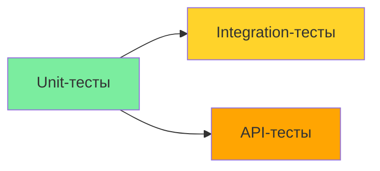

# 🧪 Unit-тесты: Подход к реализации

## Обзор

Unit-тесты — основа тест-пирамиды. Они тестируют отдельные функции, методы и классы в изоляции от внешних зависимостей (БД, API, файловая система).

### Критерии Unit-теста

| Критерий | Описание |
|----------|----------|
| **Изоляция** | Не зависят от внешних систем (БД, API, сеть) |
| **Скорость** | Выполняются за миллисекунды |
| **Определённость** | Один и тот же тест всегда даёт один и тот же результат |
| **Самоописываемость** | Название теста описывает тестируемое поведение |
| **Один ассерт на сценарий** | Один тест — одна проверяемая логика |

---

## Стек

| Инструмент | Назначение |
|------------|-----------|
| **Vitest** | Фреймворк для запуска тестов |
| **@vitest/coverage-v8** | Покрытие кода (V8 engine) |
| **TypeScript** | Нативная поддержка (без ts-jest) |

---

## Структура

```
tests/unit/
├── domains/
│   ├── plot/
│   │   ├── plot.service.test.ts
│   │   ├── plot.validators.test.ts
│   │   └── plot.errors.test.ts
│   ├── plotUser/
│   │   ├── plotUser.service.test.ts
│   │   ├── plotUser.validators.test.ts
│   │   └── plotUser.errors.test.ts
│   ├── roles/
│   │   ├── roles.service.test.ts
│   │   ├── roles.validators.test.ts
│   │   └── roles.errors.test.ts
│   ├── userProfile/
│   │   ├── userProfile.service.test.ts
│   │   ├── userProfile.validators.test.ts
│   │   └── userProfile.errors.test.ts
│   └── auth/
│       ├── auth.service.test.ts
│       ├── auth.validators.test.ts
│       └── auth.errors.test.ts
└── shared/
    └── zod.utils.test.ts
```

---

## Конфигурация

### vitest.config.ts (в корне tests/)

```typescript
import { defineConfig } from 'vitest/config';
import react from '@vitejs/plugin-react';
import path from 'path';

export default defineConfig({
  plugins: [react()],
  resolve: {
    alias: {
      '@': path.resolve(__dirname, '../../src'),
    },
  },
  test: {
    globals: true,          // require: false для describe/it/expect
    environment: 'node',    // Для Unit-тестов используем node
    include: ['**/*.test.ts', '**/*.test.tsx'],
    coverage: {
      provider: 'v8',
      reporter: ['text', 'json', 'html'],
      thresholds: {
        statements: 80,
        branches: 70,
        functions: 85,
        lines: 80,
      },
    },
  },
});
```

### vitest.setup.ts (в tests/vitest.setup.ts)

```typescript
import { expect, vi } from 'vitest';

// Глобальные настройки timeout
vi.setDefaultTimeout(10000);

// Расширенные matchers (если нужно)
expect.extend({
  // Кастомные matchers (при необходимости)
});
```

---

## Что тестировать

### 1. Domain Services

Для каждого сервиса в `src/domains/<domain>/<domain>.service.ts`:

| Метод | Что проверять |
|-------|---------------|
| `create()` | Валидация, создание, бизнес-правила, ошибки |
| `findById()` | Возврат найденного/null, ошибка |
| `update()` | Проверка существования, валидация, обновление |
| `delete()` | Проверка существования, удаление |
| `search()` | Фильтрация, edge cases |
| `findAll()` | Возврат всех записей |

**Примеры доменов:**

#### PlotService

```typescript
// tests/unit/domains/plot/plot.service.test.ts
import { describe, it, expect, vi, beforeEach } from 'vitest';
import { PlotService } from '@/domains/plot/plot.service';
import type { IPlotRepository } from '@/domains/plot/plot.repository.interface';
import { PlotNotFoundError, PlotDuplicateError, PlotInvalidDataError } from '@/domains/plot/plot.errors';

describe('PlotService', () => {
  let mockRepo: Partial<IPlotRepository>;
  let service: PlotService;

  beforeEach(() => {
    mockRepo = {
      findById: vi.fn(),
      findAll: vi.fn(),
      create: vi.fn(),
      update: vi.fn(),
      delete: vi.fn(),
      findByPlotNumber: vi.fn(),
      existsByCadstralNumber: vi.fn(),
      existsByCadstralNumberExcludingId: vi.fn(),
      search: vi.fn(),
    };
    service = new PlotService(mockRepo as IPlotRepository);
  });

  describe('create', () => {
    it('should create a plot with valid data', async () => {
      const data = { plotNumber: '1', area: 10 };
      vi.mocked(mockRepo.findByPlotNumber).mockResolvedValue(null);
      vi.mocked(mockRepo.create).mockResolvedValue({ ...data, id: 'plot-1' });

      const result = await service.create(data);

      expect(result).toEqual({ ...data, id: 'plot-1' });
      expect(mockRepo.create).toHaveBeenCalledWith(data);
    });

    it('should throw PlotDuplicateError when plotNumber already exists', async () => {
      const data = { plotNumber: '1', area: 10 };
      vi.mocked(mockRepo.findByPlotNumber).mockResolvedValue({ id: 'existing' });

      await expect(service.create(data)).rejects.toThrow(PlotDuplicateError);
      await expect(service.create(data)).rejects.toThrow('Участок с номером 1 уже существует');
    });

    it('should throw PlotDuplicateError when cadastralNumber already exists', async () => {
      const data = { plotNumber: '1', area: 10, cadastralNumber: '50:50:0000001:001' };
      vi.mocked(mockRepo.findByPlotNumber).mockResolvedValue(null);
      vi.mocked(mockRepo.existsByCadstralNumber).mockResolvedValue(true);

      await expect(service.create(data)).rejects.toThrow(PlotDuplicateError);
    });
  });

  describe('update', () => {
    it('should throw PlotNotFoundError when plot does not exist', async () => {
      vi.mocked(mockRepo.findById).mockResolvedValue(null);

      await expect(service.update('non-existent', { area: 20 }))
        .rejects.toThrow(PlotNotFoundError);
    });

    it('should not allow changing plotNumber', async () => {
      const existing = { id: 'plot-1', plotNumber: '1', area: 10, cadastralNumber: null, address: null, note: null, createdAt: new Date(), updatedAt: new Date() };
      vi.mocked(mockRepo.findById).mockResolvedValue(existing);
      vi.mocked(mockRepo.update).mockResolvedValue({ ...existing, area: 20, updatedAt: new Date() });

      const result = await service.update('plot-1', { plotNumber: '2', area: 20 });

      // plotNumber не должен быть передан в update
      expect(mockRepo.update).toHaveBeenCalledWith('plot-1', expect.not.objectContaining({ plotNumber: expect.anything() }));
      expect(result.area).toBe(20);
    });
  });

  describe('search', () => {
    it('should return empty array when no filters provided', async () => {
      const result = await service.search({});
      expect(result).toEqual([]);
      expect(mockRepo.search).not.toHaveBeenCalled();
    });

    it('should return empty array when all filters are empty', async () => {
      const result = await service.search({ number: '', cadstral: '   ', note: '' });
      expect(result).toEqual([]);
      expect(mockRepo.search).not.toHaveBeenCalled();
    });

    it('should delegate to repository when filters provided', async () => {
      const filters = { number: '10', cadstral: '50:' };
      const mockResults = [{ id: 'plot-1', plotNumber: '10', area: 10 }];
      vi.mocked(mockRepo.search).mockResolvedValue(mockResults);

      const result = await service.search(filters);

      expect(result).toEqual(mockResults);
      expect(mockRepo.search).toHaveBeenCalledWith(filters);
    });
  });
});
```

#### PlotUserRoleService

```typescript
// tests/unit/domains/plotUser/plotUser.service.test.ts
import { describe, it, expect, vi, beforeEach } from 'vitest';
import { PlotUserRoleService } from '@/domains/plotUser/plotUser.service';
import type { IPlotUserRoleRepository, IPlotUserRoleHistoryRepository } from '@/domains/plotUser/plotUser.repository.interface';
import { PlotUserRoleNotFoundError, PlotUserRoleDuplicateError, PlotUserRoleInvalidDataError } from '@/domains/plotUser/plotUser.errors';

describe('PlotUserRoleService', () => {
  let mockPlotRepo: Partial<IPlotUserRoleRepository>;
  let mockHistoryRepo: Partial<IPlotUserRoleHistoryRepository>;
  let service: PlotUserRoleService;

  beforeEach(() => {
    mockPlotRepo = {
      findById: vi.fn(),
      create: vi.fn(),
      update: vi.fn(),
      deactivate: vi.fn(),
      findByUserId: vi.fn(),
      findByPlotId: vi.fn(),
      findWithPagination: vi.fn(),
      existsActive: vi.fn(),
      existsActiveWithRole: vi.fn(),
      userExists: vi.fn(),
      plotExists: vi.fn(),
      findByPlot: vi.fn(),
      searchByName: vi.fn(),
      findByUser: vi.fn(),
      searchByPlot: vi.fn(),
    };
    mockHistoryRepo = {
      create: vi.fn(),
      findByRelationId: vi.fn(),
    };
    service = new PlotUserRoleService(
      mockPlotRepo as IPlotUserRoleRepository,
      mockHistoryRepo as IPlotUserRoleHistoryRepository
    );
  });

  describe('create', () => {
    it('should throw PlotUserRoleInvalidDataError when user does not exist', async () => {
      const input = { userId: 'user-1', plotId: 'plot-1', role: 1 };
      vi.mocked(mockPlotRepo.userExists).mockResolvedValue(false);

      await expect(service.create(input, 'admin')).rejects.toThrow(PlotUserRoleInvalidDataError);
      await expect(service.create(input, 'admin')).rejects.toThrow('Пользователь с ID \'user-1\' не найден');
    });

    it('should throw PlotUserRoleInvalidDataError when plot does not exist', async () => {
      const input = { userId: 'user-1', plotId: 'plot-1', role: 1 };
      vi.mocked(mockPlotRepo.userExists).mockResolvedValue(true);
      vi.mocked(mockPlotRepo.plotExists).mockResolvedValue(false);

      await expect(service.create(input, 'admin')).rejects.toThrow(PlotUserRoleInvalidDataError);
      await expect(service.create(input, 'admin')).rejects.toThrow('Участок с ID \'plot-1\' не найден');
    });

    it('should throw PlotUserRoleDuplicateError when active link already exists with same role', async () => {
      const input = { userId: 'user-1', plotId: 'plot-1', role: 1 };
      vi.mocked(mockPlotRepo.userExists).mockResolvedValue(true);
      vi.mocked(mockPlotRepo.plotExists).mockResolvedValue(true);
      vi.mocked(mockPlotRepo.existsActiveWithRole).mockResolvedValue(true);

      await expect(service.create(input, 'admin')).rejects.toThrow(PlotUserRoleDuplicateError);
    });

    it('should throw PlotUserRoleInvalidDataError when expiresAt is in the past', async () => {
      const input = { userId: 'user-1', plotId: 'plot-1', role: 1, expiresAt: new Date('2020-01-01') };
      vi.mocked(mockPlotRepo.userExists).mockResolvedValue(true);
      vi.mocked(mockPlotRepo.plotExists).mockResolvedValue(true);
      vi.mocked(mockPlotRepo.existsActiveWithRole).mockResolvedValue(false);

      await expect(service.create(input, 'admin')).rejects.toThrow(PlotUserRoleInvalidDataError);
      await expect(service.create(input, 'admin')).rejects.toThrow('Дата истечения должна быть больше текущего времени');
    });
  });

  describe('findById', () => {
    it('should return plot user role when found', async () => {
      const mockRole = { id: 'role-1', userId: 'user-1', plotId: 'plot-1', role: 1, status: 'active' };
      vi.mocked(mockPlotRepo.findById).mockResolvedValue(mockRole);

      const result = await service.findById('role-1');

      expect(result).toEqual(mockRole);
    });

    it('should throw PlotUserRoleNotFoundError when not found and required=true', async () => {
      vi.mocked(mockPlotRepo.findById).mockResolvedValue(null);

      await expect(service.findById('non-existent')).rejects.toThrow(PlotUserRoleNotFoundError);
    });

    it('should return null when not found and required=false', async () => {
      vi.mocked(mockPlotRepo.findById).mockResolvedValue(null);

      const result = await service.findById('non-existent', false);

      expect(result).toBeNull();
    });
  });

  describe('deactivate', () => {
    it('should throw PlotUserRoleInvalidDataError when already deactivated', async () => {
      const existing = { id: 'role-1', userId: 'user-1', plotId: 'plot-1', role: 1, status: 'expired' };
      vi.mocked(mockPlotRepo.findById).mockResolvedValue(existing);

      await expect(service.deactivate('role-1', 'admin')).rejects.toThrow(PlotUserRoleInvalidDataError);
      await expect(service.deactivate('role-1', 'admin')).rejects.toThrow('Связь уже деактивирована');
    });
  });
});
```

---

### 2. Zod Validators

Для каждого файла валидации `src/domains/<domain>/<domain>.validators.ts`:

| Что проверять | Пример |
|---------------|--------|
| Корректные данные проходят валидацию | `createPlotSchema.parse(validData)` не бросает ошибку |
| Некорректные данные отклоняются | `createPlotSchema.parse(invalidData)` бросает ZodError |
| Ограничения min/max | `plotNumber.length < 1` → ошибка |
| Формат данных | `cadastralNumber` формат XX:XX:XXXXXXX:XXX |
| Трансформации | Пустая строка → null |
| Опциональные поля | `undefined`, `null`, `''` обрабатываются |

**Пример:**

```typescript
// tests/unit/domains/plot/plot.validators.test.ts
import { describe, it, expect } from 'vitest';
import { createPlotSchema, updatePlotSchema } from '@/domains/plot/plot.validators';

describe('createPlotSchema', () => {
  it('should accept valid plot data', () => {
    const validData = {
      plotNumber: '1',
      area: 10,
    };

    expect(() => createPlotSchema.parse(validData)).not.toThrow();
  });

  it('should accept plot with optional fields', () => {
    const validData = {
      plotNumber: '1',
      area: 10,
      cadastralNumber: '50:50:0000001:001',
      address: 'ул. Ленина, 1',
      note: 'Ближе к дороге',
    };

    expect(() => createPlotSchema.parse(validData)).not.toThrow();
  });

  it('should reject when plotNumber is empty', () => {
    const invalidData = { plotNumber: '', area: 10 };

    expect(() => createPlotSchema.parse(invalidData)).toThrow();
  });

  it('should reject when plotNumber is too long', () => {
    const invalidData = { plotNumber: 'a'.repeat(51), area: 10 };

    expect(() => createPlotSchema.parse(invalidData)).toThrow();
  });

  it('should reject when area is zero', () => {
    const invalidData = { plotNumber: '1', area: 0 };

    expect(() => createPlotSchema.parse(invalidData)).toThrow();
  });

  it('should reject when area is negative', () => {
    const invalidData = { plotNumber: '1', area: -5 };

    expect(() => createPlotSchema.parse(invalidData)).toThrow();
  });

  it('should reject invalid cadastral number format', () => {
    const invalidData = { plotNumber: '1', area: 10, cadastralNumber: 'invalid' };

    expect(() => createPlotSchema.parse(invalidData)).toThrow();
  });

  it('should accept null cadastralNumber', () => {
    const validData = { plotNumber: '1', area: 10, cadastralNumber: null };

    expect(() => createPlotSchema.parse(validData)).not.toThrow();
  });

  it('should transform empty string to null for cadastralNumber', () => {
    const inputData = { plotNumber: '1', area: 10, cadastralNumber: '' };
    const result = createPlotSchema.parse(inputData);

    expect(result.cadastralNumber).toBeNull();
  });

  it('should transform empty string to null for address', () => {
    const inputData = { plotNumber: '1', area: 10, address: '' };
    const result = createPlotSchema.parse(inputData);

    expect(result.address).toBeNull();
  });

  it('should transform empty string to null for note', () => {
    const inputData = { plotNumber: '1', area: 10, note: '' };
    const result = createPlotSchema.parse(inputData);

    expect(result.note).toBeNull();
  });

  it('should reject address longer than 200 characters', () => {
    const invalidData = { plotNumber: '1', area: 10, address: 'a'.repeat(201) };

    expect(() => createPlotSchema.parse(invalidData)).toThrow();
  });

  it('should reject note longer than 500 characters', () => {
    const invalidData = { plotNumber: '1', area: 10, note: 'a'.repeat(501) };

    expect(() => createPlotSchema.parse(invalidData)).toThrow();
  });
});

describe('updatePlotSchema', () => {
  it('should accept partial data', () => {
    const validData = { area: 20 };

    expect(() => updatePlotSchema.parse(validData)).not.toThrow();
  });

  it('should allow null for all optional fields', () => {
    const validData = {
      plotNumber: null,
      cadastralNumber: null,
      area: null,
      address: null,
      note: null,
    };

    expect(() => updatePlotSchema.parse(validData)).not.toThrow();
  });
});
```

---

### 3. Domain Errors

Для каждого файла ошибок `src/domains/<domain>/<domain>.errors.ts`:

| Что проверять | Пример |
|---------------|--------|
| Наследование от базового класса | `PlotNotFoundError extends NotFoundError` |
| HTTP статус | 404, 409, 400 |
| Код ошибки | Формат `PLOT_NOT_FOUND`, `PLOT_DUPLICATE` |
| Сообщение об ошибке | Содержит контекст |
| Копирование ошибки | `error instanceof PlotNotFoundError` |

**Пример:**

```typescript
// tests/unit/domains/plot/plot.errors.test.ts
import { describe, it, expect } from 'vitest';
import { PlotNotFoundError, PlotDuplicateError, PlotInvalidDataError } from '@/domains/plot/plot.errors';
import { NotFoundError, ConflictError, ValidationError } from '@/shared/errors';

describe('PlotNotFoundError', () => {
  it('should extend NotFoundError', () => {
    const error = new PlotNotFoundError('plot-123');
    expect(error).toBeInstanceOf(NotFoundError);
  });

  it('should have correct error code', () => {
    const error = new PlotNotFoundError('plot-123');
    expect(error.code).toBe('PLOT_NOT_FOUND');
  });

  it('should include the ID in message', () => {
    const error = new PlotNotFoundError('plot-123');
    expect(error.message).toContain('plot-123');
  });
});

describe('PlotDuplicateError', () => {
  it('should extend ConflictError', () => {
    const error = new PlotDuplicateError('1');
    expect(error).toBeInstanceOf(ConflictError);
  });

  it('should have correct HTTP status', () => {
    const error = new PlotDuplicateError('1');
    expect(error.status).toBe(409);
  });

  it('should include the duplicate value in message', () => {
    const error = new PlotDuplicateError('1');
    expect(error.message).toContain('Участок с номером 1 уже существует');
  });
});

describe('PlotInvalidDataError', () => {
  it('should extend ValidationError', () => {
    const error = new PlotInvalidDataError('area must be positive');
    expect(error).toBeInstanceOf(ValidationError);
  });

  it('should have correct HTTP status', () => {
    const error = new PlotInvalidDataError('test');
    expect(error.status).toBe(400);
  });
});
```

---

## Практические советы

### Мокирование репозиториев

```typescript
// Создаём мок репозитория для каждого теста
const mockRepo = {
  findById: vi.fn(),
  findAll: vi.fn(),
  create: vi.fn(),
  update: vi.fn(),
  delete: vi.fn(),
};

// Настраиваем возвращаемые значения
mockRepo.findById.mockResolvedValue({ id: '1', name: 'Plot 1' });
mockRepo.findById.mockRejectedValue(new Error('DB error'));

// Проверяем вызовы
expect(mockRepo.create).toHaveBeenCalledWith(expectedData);
expect(mockRepo.create).toHaveBeenCalledTimes(1);
```

### Testing async code

```typescript
it('should handle async operations correctly', async () => {
  // Arrange
  vi.mocked(mockRepo.create).mockResolvedValue({ id: '1' });

  // Act
  const result = await service.create(data);

  // Assert
  expect(result).toEqual({ id: '1' });
});
```

### Mocking Date

```typescript
it('should reject past expiresAt', () => {
  // Freeze time for deterministic testing
  const fixedDate = new Date('2026-01-01T00:00:00Z');
  vi.useFakeTimers();
  vi.setSystemTime(fixedDate);

  const input = { expiresAt: new Date('2025-01-01') }; // In the past

  expect(() => service.create(input, 'admin')).rejects.toThrow();

  vi.useRealTimers();
});
```

### Grouping tests по бизнес-правилам

```typescript
describe('PlotService.create', () => {
  describe('BR-1: plotNumber обязателен', () => {
    it('...');
  });

  describe('BR-2: unique plotNumber', () => {
    it('...');
  });

  describe('BR-3: cadastralNumber format', () => {
    it('...');
  });
});
```

---

## Цели покрытия кода

| Слой | Statement | Branch | Function | Line |
|------|-----------|--------|----------|------|
| **Service** | 80% | 70% | 85% | 80% |
| **Validators** | 90% | 80% | 90% | 90% |
| **Errors** | 90% | 100% | 100% | 90% |

---

## Команды для запуска

```bash
# Все Unit-тесты
npm run test tests/unit/

# Один файл
npm run test tests/unit/domains/plot/plot.service.test.ts

# Watch-режим
npm run test -- tests/unit/ --watch

# С покрытием
npm run test:coverage -- tests/unit/

# Конкретный тест
npm run test -- tests/unit/domains/plot/plot.service.test.ts -t "should create"
```

---

## Связь с другими типами тестов



- **Unit-тесты** мокают репозитории — проверяют бизнес-логику
- **Integration-тесты** используют реальный БД — проверяют взаимодействие слоёв
- **API-тесты** мокают сессии — проверяют HTTP-контракты

---

## Связанные документы

| Документ | Связь |
|----------|-------|
| [`README.md`](README.md) | Общий обзор тестирования |
| [`integration-tests.md`](integration-tests.md) | Dependency: Integration-тесты используют моки из Unit |
| [`api-tests.md`](api-tests.md) | Dependency: API-тесты зависят от проверенных сервисов |
