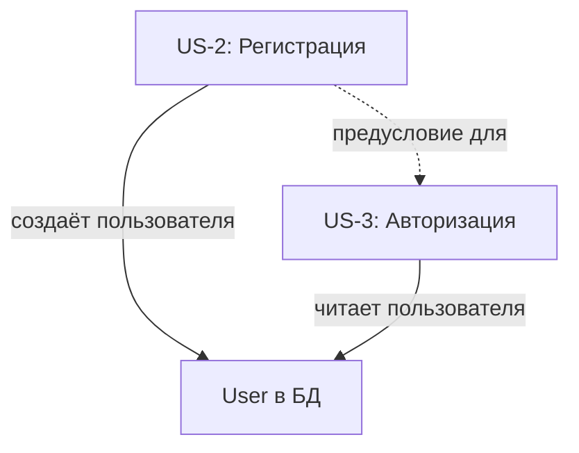

# US-2: Регистрация пользователя

---

## Формулировка

**Как** новый пользователь,
**я хочу** зарегистрироваться в системе по email и паролю,
**чтобы** получить учётную запись для входа в приложение СНТ Берёзки-НТ.

---

## Контекст

**Проблема**: На данный момент в системе нет способа самостоятельной регистрации. Пользователи не могут создать учётную запись — отсутствует страница регистрации, API-эндпоинт и соответствующий домен. Страница входа уже содержит ссылку «Зарегистрироваться» → `/register`, но маршрут возвращает 404.

**Решение**: Создать полный флоу регистрации — страница `/register` с формой, API-эндпоинт `POST /api/v1/auth/register`, домен `auth` с сервисом регистрации, хешированием пароля и валидацией. После успешной регистрации пользователь перенаправляется на `/login` с flash-сообщением об успехе.

**Границы**:
- Входит: страница регистрации, API регистрации, домен auth (типы, ошибки, интерфейс репозитория, реализация, сервис, валидаторы), хеширование пароля через bcrypt, flash-сообщение на странице входа
- НЕ входит: подтверждение email, создание профиля Member при регистрации, OAuth-авторизация, восстановление пароля, управление ролями

---

## Функциональные требования

### FR-1: Страница регистрации на маршруте `/register`
При переходе на `/register` неавторизованный пользователь видит форму регистрации с полями: email, пароль, подтверждение пароля. Страница является Client Component и использует layout публичной зоны. Авторизованные пользователи перенаправляются на `/dashboard`.

### FR-2: Поля формы регистрации
Форма содержит:
- Поле «Email» — тип email, обязательное, с валидацией формата
- Поле «Пароль» — тип password, обязательное, минимум 6 символов
- Поле «Подтверждение пароля» — тип password, обязательное, должно совпадать с паролем

### FR-3: Валидация формы на клиенте
Перед отправкой формы проверяются:
- Email заполнен и соответствует формату email
- Пароль заполнен и содержит минимум 6 символов
- Подтверждение пароля заполнено и совпадает с паролем
Ошибки валидации отображаются под соответствующими полями.

### FR-4: API-эндпоинт регистрации
`POST /api/v1/auth/register` принимает JSON с полями `email`, `password`, `confirmPassword`. Валидация через Zod-схему в сервисе. При успехе возвращает `201 Created` с данными пользователя (без пароля). При ошибке возвращает соответствующий HTTP-статус и JSON с ошибкой.

### FR-5: Уникальность email
Если пользователь с указанным email уже существует, API возвращает ошибку `409 Conflict` с сообщением «Пользователь с таким email уже зарегистрирован».

### FR-6: Хеширование пароля
Перед сохранением в БД пароль хешируется через bcrypt. В БД хранится только хеш, пароль в открытом виде не сохраняется и не логируется.

### FR-7: Роль пользователя при регистрации
При регистрации пользователю автоматически назначается роль `GUEST` — значение по умолчанию из Prisma-схемы. Поле `name` не заполняется (остаётся `null`).

### FR-8: Редирект после успешной регистрации
После успешной регистрации пользователь перенаправляется на `/login?registered=true`. Страница входа отображает flash-сообщение «Регистрация успешна! Войдите в систему, используя свои данные.».

### FR-9: Ссылка на страницу входа
На странице регистрации отображается ссылка «Уже есть аккаунт? Войти» → `/login`.

### FR-10: Блокировка повторной отправки формы
Во время выполнения запроса регистрации кнопка блокируется и отображается индикатор загрузки. Повторная отправка формы невозможна.

---

## Критерии приёмки

### AC-1: Отображение страницы регистрации
- **Given** пользователь не авторизован
- **When** открывает `/register`
- **Then** отображается форма регистрации с полями email, пароль, подтверждение пароля и кнопкой «Зарегистрироваться»

### AC-2: Успешная регистрация
- **Given** пользователь заполнил форму валидными данными — email не занят, пароль от 6 символов, подтверждение совпадает
- **When** нажимает «Зарегистрироваться»
- **Then** создаётся пользователь в БД с хешированным паролем и ролью GUEST, происходит редирект на `/login?registered=true`

### AC-3: Flash-сообщение после регистрации
- **Given** пользователь успешно зарегистрировался и перенаправлен на `/login?registered=true`
- **When** страница входа загружена
- **Then** отображается сообщение «Регистрация успешна! Войдите в систему, используя свои данные.»

### AC-4: Дублирование email
- **Given** пользователь заполнил форму с email, который уже зарегистрирован
- **When** нажимает «Зарегистрироваться»
- **Then** отображается ошибка «Пользователь с таким email уже зарегистрирован», форма остаётся заполненной

### AC-5: Валидация — короткий пароль
- **Given** пользователь ввёл пароль короче 6 символов
- **When** нажимает «Зарегистрироваться»
- **Then** под полем пароля отображается ошибка «Пароль должен содержать минимум 6 символов»

### AC-6: Валидация — несовпадение паролей
- **Given** пользователь ввёл разные значения в поля «Пароль» и «Подтверждение пароля»
- **When** нажимает «Зарегистрироваться»
- **Then** под полем подтверждения отображается ошибка «Пароли не совпадают»

### AC-7: Валидация — некорректный email
- **Given** пользователь ввёл некорректный email
- **When** нажимает «Зарегистрироваться»
- **Then** под полем email отображается ошибка «Введите корректный email»

### AC-8: Переход на страницу входа
- **Given** пользователь на странице регистрации
- **When** нажимает «Уже есть аккаунт? Войти»
- **Then** происходит переход на `/login`

### AC-9: Авторизованный пользователь не видит регистрацию
- **Given** пользователь авторизован
- **When** открывает `/register`
- **Then** происходит редирект на `/dashboard`

### AC-10: Состояние загрузки
- **Given** пользователь нажал «Зарегистрироваться» и запрос выполняется
- **When** запрос в процессе
- **Then** кнопка заблокирована, отображается индикатор загрузки, повторная отправка невозможна

---

## Бизнес-правила и валидация

| ID   | Правило                                                    | Валидация                     |
|------|------------------------------------------------------------|-------------------------------|
| BR-1 | Email обязателен и должен быть уникальным в системе       | Zod + DB Unique Constraint    |
| BR-2 | Пароль обязателен, минимум 6 символов                     | Zod                           |
| BR-3 | Подтверждение пароля должно совпадать с паролем           | Zod — refine                  |
| BR-4 | Email должен соответствовать формату email                 | Zod — .email                  |
| BR-5 | Пароль хранится в БД только в виде хеша                  | bcrypt — Runtime              |
| BR-6 | При регистрации назначается роль GUEST                  | DB Default — Prisma schema   |
| BR-7 | Поле name при регистрации не заполняется                  | Runtime — null                |

### Примеры валидаций
- **Длина пароля**: минимум 6 символов, без требований к регистру, цифрам или спецсимволам
- **Уникальность**: email уникален — проверка на уровне БД через `@unique`
- **Формат**: email — стандартная валидация Zod `.email()`
- **Обязательные поля**: email, password, confirmPassword

---

## Граничные случаи — Edge Cases

| #  | Ситуация                                          | Ожидаемое поведение                                             |
|----|---------------------------------------------------|-----------------------------------------------------------------|
| 1  | Email уже зарегистрирован                         | Вернуть 409 Conflict, показать подсказку под полем email       |
| 2  | Неверный формат email                             | Показать ошибку валидации под полем email                       |
| 3  | Пароль короче 6 символов                          | Показать ошибку валидации под полем пароля                     |
| 4  | Пароли не совпадают                               | Показать ошибку валидации под полем подтверждения              |
| 5  | Параллельная отправка двух запросов регистрации   | Заблокировать кнопку, показать загрузку                         |
| 6  | Пустые обязательные поля                          | Показать ошибки «Поле обязательно» под каждым пустым полем      |
| 7  | Email с пробелами                                 | Обрезать пробелы — trim — перед валидацией и сохранением       |
| 8  | Пароль с пробелами в начале или конце             | Не обрезать — пробелы могут быть частью пароля                 |
| 9  | Сбой при хешировании пароля                       | Вернуть 500, показать общую ошибку «Попробуйте позже»          |
| 10 | Регистрация с email в разном регистре — test@ и TEST@ | Привести email к нижнему регистру перед проверкой уникальности |

---

## Обработка ошибок

| Ситуация                            | Код HTTP | Доменная ошибка          | Сообщение пользователю                                             |
|-------------------------------------|----------|--------------------------|---------------------------------------------------------------------|
| Email уже зарегистрирован           | 409      | UserDuplicateError       | Пользователь с таким email уже зарегистрирован                     |
| Неверный формат email               | 400      | UserInvalidDataError     | Введите корректный email                                            |
| Пароль короче 6 символов            | 400      | UserInvalidDataError     | Пароль должен содержать минимум 6 символов                         |
| Пароли не совпадают                 | 400      | UserInvalidDataError     | Пароли не совпадают                                                 |
| Пустые обязательные поля            | 400      | UserInvalidDataError     | Указать какое поле обязательно                                      |
| Внутренняя ошибка сервера           | 500      | —                        | Произошла ошибка при регистрации. Попробуйте позже.                 |

---

## Влияние на слои архитектуры

### Модель данных
- [ ] Новая сущность: нет — используется существующая `User`
- [ ] Изменение сущности: нет
- [x] Без изменений — модель `User` уже содержит все необходимые поля

### Repository
- [ ] Новые методы: `IAuthRepository.findByEmail(email: string): Promise<User | null>`, `IAuthRepository.create(data: CreateUserData): Promise<User>`
- [ ] Изменение методов: нет
- [ ] Без изменений: нет

### Service
- [ ] Новые методы: `AuthService.registerUser(data: RegisterData): Promise<User>` — валидация, проверка уникальности, хеширование, сохранение
- [ ] Новые Zod-схемы: `registerSchema` — валидация email, пароль мин. 6 символов, подтверждение пароля
- [ ] Новые доменные ошибки: `UserDuplicateError`, `UserInvalidDataError`
- [ ] Без изменений: нет

### API

| Метод | Путь                          | Описание                       | Роль  |
|-------|-------------------------------|--------------------------------|-------|
| POST  | /api/v1/auth/register         | Регистрация нового пользователя| none  |

### UI

| Компонент                    | Тип      | Маршрут     | Описание                                   |
|------------------------------|----------|-------------|---------------------------------------------|
| RegisterPage                 | page     | /register   | Страница регистрации с формой               |
| /login — flash-сообщение     | доработка| /login      | Отображение сообщения об успешной регистрации |

---

## Нефункциональные требования

- **Производительность**: хеширование bcrypt с cost factor 10 — время ответа до 500мс допустимо для регистрации
- **Безопасность**:
  - Пароль хранится только в виде хеша — bcrypt с salt
  - Пароль не логируется и не возвращается в API-ответе
  - Email приводится к нижнему регистру перед проверкой уникальности
  - Защита от перебора: ограничение частоты запросов — rate limiting — на уровне API-эндпоинта
- **UX**:
  - Состояние загрузки: кнопка блокируется, показывается спиннер
  - Ошибки валидации: под соответствующими полями — inline
  - Общая ошибка: в верхней части формы — alert
  - Адаптивная верстка: мобильные и десктоп
  - a11y: правильные label, autocomplete, focus management

---

## Открытые вопросы

| #  | Вопрос                                          | Допущение                                   |
|----|--------------------------------------------------|---------------------------------------------|
| 1  | Нужен ли rate limiting на API регистрации?       | Да — базовая защита от перебора и спама     |
| 2  | Нужна ли капча при регистрации?                  | Пока нет — добавить в будущих итерациях    |
| 3  | Где хранить flash-сообщение после регистрации?   | Через query-параметр `?registered=true` на /login |
| 4  | Должна ли регистрация быть доступна с корневой страницы? | Нет — только через ссылку на странице входа |

---

## Зависимости

> US-2 является предусловием для US-3: для авторизации нужен пользователь, которого можно создать только через регистрацию.

---

## История

| Дата       | Автор | Действие              |
|------------|-------|-----------------------|
| 2026-06-28 | —     | Создание черновика    |