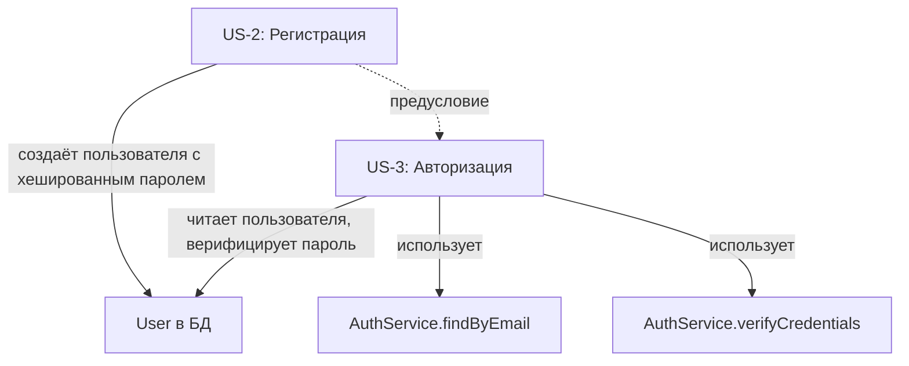

# US-3: Авторизация пользователя

---

## Формулировка

**Как** зарегистрированный пользователь,
**я хочу** войти в систему по email и паролю,
**чтобы** получить доступ к защищённой зоне приложения СНТ Берёзки-НТ.

---

## Контекст

**Проблема**: Страница входа `/login` существует, но авторизация не работает — в NextAuth конфигурации отсутствует Credentials Provider, нет API-маршрута NextAuth (`/api/auth/[...nextauth]`), и при попытке входа возвращается 404. Пользователи не могут войти в систему, несмотря на наличие формы входа.

**Решение**: Настроить полноценную авторизацию через NextAuth Credentials Provider — проверка email/пароля по БД, создание сессии, корректная обработка `callbackUrl` для возврата на исходную страницу после входа. Middleware уже реализует редирект неавторизованных пользователей на `/login?callbackUrl=...`.

**Границы**:
- Входит: Credentials Provider, NextAuth API route, верификация пароля через bcrypt, обработка callbackUrl-редиректа, доработка существующей страницы `/login`, flash-сообщение после регистрации
- НЕ входит: регистрация, восстановление пароля, OAuth-провайдеры, управление сессиями, выход из системы

---

## Функциональные требования

### FR-1: Credentials Provider в NextAuth
Настроить Credentials Provider в `auth.config.ts` с callback `authorize()` — поиск пользователя по email в БД, верификация пароля через bcrypt, возврат объекта пользователя при успехе.

### FR-2: NextAuth API route
Создать API-маршрут `src/app/api/auth/[...nextauth]/route.ts`, обрабатывающий запросы NextAuth — вход, выход, получение сессии. Маршрут использует `handlers` из `src/lib/auth.ts`.

### FR-3: Валидация формы входа на клиенте
Перед отправкой формы проверяются:
- Email заполнен и соответствует формату email
- Пароль заполнен
Ошибки валидации отображаются под соответствующими полями. Существующая валидация в [`login/page.tsx`](src/app/(public)/login/page.tsx:68) сохраняется.

### FR-4: Обработка неверных учётных данных
Если пользователь с указанным email не найден или пароль неверный, отображается общее сообщение «Неверный email или пароль» — без уточнения, что именно неверно. Это предотвращает перебор email-адресов.

### FR-5: Редирект после успешной авторизации
После успешного входа пользователь перенаправляется:
- На `callbackUrl`, если параметр присутствует и не равен `/` или `/login`
- На `/dashboard`, если `callbackUrl` отсутствует, равен `/` или `/login`

Значение `callbackUrl` извлекается из query-параметра URL — уже реализовано в [`login/page.tsx`](src/app/(public)/login/page.tsx:57).

### FR-6: Редирект неавторизованного пользователя на страницу входа
При попытке доступа к защищённому маршруту `/dashboard/*` неавторизованный пользователь перенаправляется на `/login?callbackUrl=<оригинальный URL>`. Уже реализовано в [`middleware.ts`](src/middleware.ts:25).

### FR-7: Flash-сообщение после регистрации
При переходе на `/login?registered=true` отображается сообщение «Регистрация успешна! Войдите в систему, используя свои данные.» Сообщение отображается в верхней части формы в зелёном блоке и исчезает после начала ввода в любое поле.

### FR-8: Ссылка на регистрацию
На странице входа отображается ссылка «Зарегистрироваться» → `/register`. Уже реализовано в [`login/page.tsx`](src/app/(public)/login/page.tsx:241).

### FR-9: Блокировка повторной отправки формы
Во время выполнения запроса авторизации кнопка «Войти» блокируется и отображается индикатор загрузки. Повторная отправка формы невозможна. Уже реализовано в [`login/page.tsx`](src/app/(public)/login/page.tsx:200).

### FR-10: Callbacks NextAuth — JWT и Session
Настроить callbacks в NextAuth:
- `jwt` — добавление `id` и `role` пользователя в JWT-токен
- `session` — передача `id` и `role` из токена в объект сессии для использования на клиенте и сервере

---

## Критерии приёмки

### AC-1: Успешная авторизация
- **Given** пользователь зарегистрирован с email `user@example.com` и паролем `secret123`
- **When** вводит email и пароль на странице входа и нажимает «Войти»
- **Then** создаётся сессия, пользователь перенаправляется на `/dashboard`

### AC-2: Редирект на исходную страницу
- **Given** неавторизованный пользователь пытается открыть `/dashboard/members`
- **When** перенаправлен на `/login?callbackUrl=/dashboard/members`, авторизуется
- **Then** после входа перенаправляется на `/dashboard/members`

### AC-3: Редирект при корневом callbackUrl
- **Given** пользователь авторизуется с `callbackUrl=/` или `callbackUrl=/login` или без callbackUrl
- **When** вход выполнен успешно
- **Then** перенаправляется на `/dashboard`

### AC-4: Неверные учётные данные
- **Given** пользователь вводит несуществующий email или неверный пароль
- **When** нажимает «Войти»
- **Then** отображается сообщение «Неверный email или пароль», форма остаётся заполненной

### AC-5: Валидация — пустой email
- **Given** пользователь оставил поле email пустым
- **When** нажимает «Войти»
- **Then** под полем email отображается ошибка «Email обязателен»

### AC-6: Валидация — некорректный email
- **Given** пользователь ввёл некорректный формат email
- **When** нажимает «Войти»
- **Then** под полем email отображается ошибка «Некорректный email»

### AC-7: Валидация — пустой пароль
- **Given** пользователь оставил поле пароля пустым
- **When** нажимает «Войти»
- **Then** под полем пароля отображается ошибка «Пароль обязателен»

### AC-8: Flash-сообщение после регистрации
- **Given** пользователь успешно зарегистрировался и перенаправлен на `/login?registered=true`
- **When** страница входа загружена
- **Then** отображается зелёное сообщение «Регистрация успешна! Войдите в систему, используя свои данные.»

### AC-9: Скрытие flash-сообщения
- **Given** на странице входа отображается flash-сообщение после регистрации
- **When** пользователь начинает вводить email или пароль
- **Then** flash-сообщение исчезает

### AC-10: Состояние загрузки
- **Given** пользователь нажал «Войти» и запрос выполняется
- **When** запрос в процессе
- **Then** кнопка заблокирована, отображается спиннер с текстом «Вход...», повторная отправка невозможна

### AC-11: Ссылка на регистрацию
- **Given** пользователь на странице входа
- **When** нажимает «Зарегистрироваться»
- **Then** происходит переход на `/register`

### AC-12: Доступ к данным сессии
- **Given** пользователь авторизован с ролью MEMBER
- **When** серверный код обращается к сессии через `auth()`
- **Then** сессия содержит `user.id`, `user.email`, `user.role`

---

## Бизнес-правила и валидация

| ID   | Правило                                                    | Валидация                     |
|------|------------------------------------------------------------|-------------------------------|
| BR-1 | Email обязателен и должен соответствовать формату          | Client-side + Zod             |
| BR-2 | Пароль обязателен                                          | Client-side                   |
| BR-3 | При неверных учётных данных — общая ошибка без уточнения  | Runtime — Credentials Provider|
| BR-4 | Пароль проверяется через сравнение хеша — bcrypt          | Runtime — bcrypt.compare      |
| BR-5 | После входа пользователь перенаправляется на callbackUrl  | Runtime — client redirect     |
| BR-6 | callbackUrl равен / или /login — редирект на /dashboard   | Runtime — client logic        |
| BR-7 | Сессия содержит id, email, role пользователя               | NextAuth — JWT + Session callbacks |

### Примеры валидаций
- **Формат email**: стандартная валидация на клиенте
- **Безопасность**: при неверных данных не раскрывать, какой именно параметр неверен
- **Обязательные поля**: email и пароль

---

## Граничные случаи — Edge Cases

| #  | Ситуация                                            | Ожидаемое поведение                                             |
|----|-----------------------------------------------------|-----------------------------------------------------------------|
| 1  | Неверный пароль для существующего email             | Показать «Неверный email или пароль» — без уточнения            |
| 2  | Несуществующий email                                | Показать «Неверный email или пароль» — без уточнения            |
| 3  | Параллельная отправка формы входа                   | Заблокировать кнопку, показать загрузку                         |
| 4  | Истёкшая сессия при навигации                       | Middleware перенаправит на /login с callbackUrl                 |
| 5  | Пользователь с email в другом регистре              | Привести email к нижнему регистру перед поиском в БД            |
| 6  | CallbackUrl содержит внешний домен                  | Игнорировать, редирект только на внутренние маршруты            |
| 7  | Сбой при проверке пароля — bcrypt error            | Показать «Произошла ошибка при входе», предложить повторить     |
| 8  | Повторный вход уже авторизованного пользователя    | Middleware перенаправит на /dashboard                           |

---

## Обработка ошибок

| Ситуация                            | Код HTTP | Доменная ошибка          | Сообщение пользователю                                             |
|-------------------------------------|----------|--------------------------|---------------------------------------------------------------------|
| Неверный email или пароль           | 401      | InvalidCredentialsError  | Неверный email или пароль                                           |
| Пустые обязательные поля            | —        | —                        | Валидация на клиенте: «Email обязателен» / «Пароль обязателен»      |
| Некорректный формат email           | —        | —                        | Валидация на клиенте: «Некорректный email»                         |
| Внутренняя ошибка сервера           | 500      | —                        | Произошла ошибка при входе. Попробуйте позже.                      |

---

## Влияние на слои архитектуры

### Модель данных
- [ ] Новая сущность: нет — используется существующая `User`
- [ ] Изменение сущности: нет
- [x] Без изменений

### Repository
- [ ] Новые методы: `IAuthRepository.findByEmail(email: string): Promise<User | null>` — используется совместно с US-2
- [ ] Изменение методов: нет
- [ ] Без изменений: нет — метод `findByEmail` создаётся в US-2

### Service
- [ ] Новые методы: `AuthService.verifyCredentials(email: string, password: string): Promise<User>` — поиск по email, сравнение хеша пароля
- [ ] Новые Zod-схемы: `loginSchema` — валидация email и пароля
- [ ] Новые доменные ошибки: `InvalidCredentialsError`
- [ ] Без изменений: нет

### API

| Метод | Путь                          | Описание                        | Роль  |
|-------|-------------------------------|---------------------------------|-------|
| POST  | /api/auth/[...nextauth]       | NextAuth API — вход, выход, сессия | none  |

### UI

| Компонент                    | Тип       | Маршрут | Описание                                              |
|------------------------------|-----------|---------|--------------------------------------------------------|
| LoginPage                    | доработка | /login  | Добавить flash-сообщение при `?registered=true`       |
| /login — скрытие flash       | доработка | /login  | Скрытие сообщения при начале ввода                     |

---

## Нефункциональные требования

- **Производительность**: верификация bcrypt — до 500мс допустимо; сессия через JWT — без запросов к БД при каждом запросе
- **Безопасность**:
  - Пароль проверяется через `bcrypt.compare` — никогда не расшифровывается
  - При неверных учётных данных — общее сообщение без уточнения, что именно неверно
  - Email приводится к нижнему регистру перед поиском в БД
  - CallbackUrl валидируется — только внутренние маршруты
  - JWT-токен содержит минимальный набор данных: id, email, role
  - HttpOnly cookie для сессии — стандартное поведение NextAuth
- **UX**:
  - Состояние загрузки: кнопка блокируется, показывается спиннер — уже реализовано
  - Ошибки валидации: под соответствующими полями — inline — уже реализовано
  - Общая ошибка авторизации: в верхней части формы — alert
  - Flash-сообщение: зелёный блок вверху формы, исчезает при вводе
  - Адаптивная верстка: мобильные и десктоп — уже реализовано
  - a11y: правильные label, autocomplete, focus management — уже реализовано

---

## Открытые вопросы

| #  | Вопрос                                          | Допущение                                             |
|----|--------------------------------------------------|-------------------------------------------------------|
| 1  | Нужен ли rate limiting на попытки входа?         | Да — базовая защита от брутфорса, до 5 попыток в минуту |
| 2  | Время жизни сессии NextAuth?                    | По умолчанию — 24 часа, настраивается в auth.config   |
| 3  | Использовать ли database session strategy?       | Нет — JWT strategy достаточно для текущих требований  |
| 4  | Блокировка аккаунта после N неудачных попыток?   | Пока нет — добавить в будущих итерациях               |

---

## Зависимости

> US-3 зависит от US-2: для авторизации нужен пользователь с хешированным паролем в БД. Общий домен `auth` создаётся в US-2, US-3 расширяет его методами верификации.

---

## История

| Дата       | Автор | Действие              |
|------------|-------|-----------------------|
| 2026-06-28 | —     | Создание черновика    |