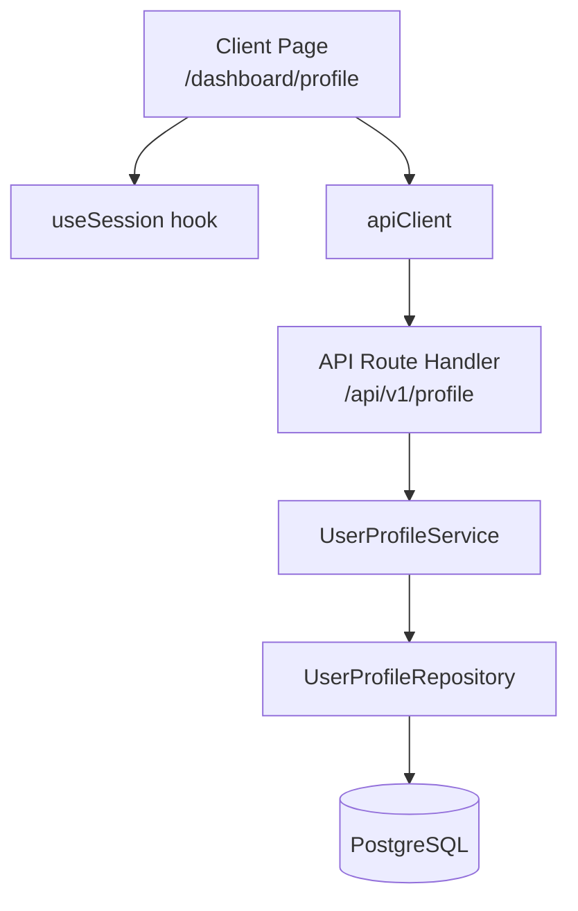
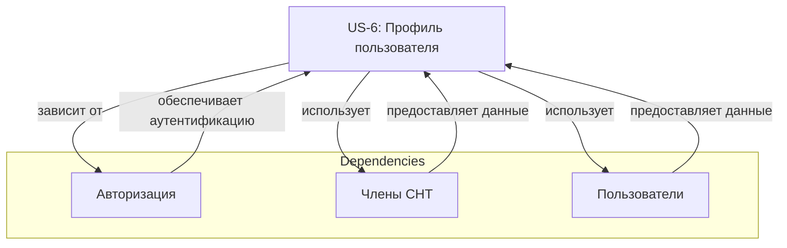

# US-6: Профиль пользователя

---

## Формулировка

**Как** авторизованный пользователь СНТ,
**я хочу** иметь возможность просматривать и обновлять свой профиль (имя, контактные данные),
**чтобы** мои данные были актуальны в системе управления СНТ.

---

## Контекст

**Проблема**: Пользователи не могут управлять своей личной информацией в системе. Отсутствует функциональность для просмотра и редактирования профиля, включая имя, email, телефон и другие контактные данные.

**Решение**: Создать интерфейс для просмотра и редактирования профиля пользователя, позволяющий обновлять контактные данные и отображать информацию в личном кабинете.

**Границы**:
- Входит: просмотр профиля, редактирование данных, загрузка аватара, валидация данных, сохранение изменений
- НЕ входит: смена пароля, смена email (эти функции вынесены в отдельные user stories), управление ролями, административские функции

---

## Модель данных

| Сущность | Описание |
|----------|----------|
| **UserProfile** | Расширенная информация о пользователе, связанная с сущностью User |
| **Member** | Сущность члена СНТ с расширенными данными (имя, фамилия, дата рождения, телефон) |
| **User** | Основная сущность пользователя с login-данными (email, password, role) |

> **Примечание**: Профиль пользователя может включать данные как из сущности `User` (email), так и из сущности `Member` (имя, фамилия, телефон, avatar). Необходимо определить стратегию хранения данных профиля.

### Предлагаемое обновление модели данных

```sql
-- Добавление поля avatar в таблицу users
ALTER TABLE users 
ADD COLUMN avatar VARCHAR(255);

-- Обновление сущности UserProfile для агрегации данных
Table user_profiles {
  id           varchar       [pk, not null]
  user_id      varchar       [unique, not null, ref: > users]
  first_name   varchar       [not null]
  last_name    varchar       [not null]
  phone        varchar
  email        varchar       [unique, not null, ref: > users]
  avatar       varchar
  bio          varchar
  created_at   timestamp     [default: now(), not null]
  updated_at   timestamp     [default: now(), not null]

  Notes:'''
    Primary key: id
    Unique constraint: user_id, email
    Foreign key: user_id -> users.id
    '''
}
```

---

## Функциональные требования

### FR-1: Отображение профиля пользователя
При переходе на страницу профиля система отображает:
- Имя пользователя (первое и последнее имя из Member или User)
- Email (из сущности User)
- Телефон (из сущности Member)
- Аватар (если загружен)
- Дату регистрации
- Статус участника СНТ (активный/неактивный)

### FR-2: Редактирование профиля
Пользователь может редактировать следующие поля (все опциональные, можно обновлять частичные данные):
- Имя (firstName) - опциональное поле, 2-50 символов (пустая строка удаляет поле)
- Фамилия (lastName) - опциональное поле, 2-50 символов (пустая строка удаляет поле)
- Отчество (middleName) - опциональное поле, 2-50 символов
- Телефон (phone) - опциональный, формат E.164 или национальный
- Аватар (avatar) - опциональное, изображение до 5MB
- Биография (bio) - опциональное, до 500 символов

**Примечание**: При обновлении профиля пользователь может указать только те поля, которые нужно изменить. Неуказанные поля остаются без изменений.

### FR-3: Загрузка аватара
- Максимальный размер файла: 5MB
- Форматы: JPG, PNG, GIF
- Автоматическая обрезка до квадратного формата (512x512px)
- Сохранение на файл-сервер или в Cloud Storage

### FR-4: Валидация данных
- Все поля, кроме email, опциональны для заполнения
- Email должен быть валидным форматом
- Телефон должен соответствовать шаблону (если предоставлен)
- Изображение должно соответствовать ограничениям по формату и размеру (если предоставлено)

### FR-5: Сохранение изменений
- При успешном сохранении отображается подтверждение
- Данные сохраняются в БД с обновлением timestamp
- Кэш данных очищается после обновления

### FR-6: Доступность только для авторизованных
- Непрошедшие авторизацию пользователи перенаправляются на страницу входа

### FR-7: Переход на страницу профиля из навбара
В навбаре авторизованного пользователя (AppLayout) отображается элемент навигации на профиль:
- Элемент расположен справа, рядом с кнопкой «Выйти»
- Отображается имя пользователя (`session.user.name`) или email (если имя пустое или null)
- При клике происходит переход на маршрут `/dashboard/profile`
- При наведении элемент получает hover-эффект (подсветка/изменение цвета)
- Элемент доступен на всех страницах в зоне `/dashboard/*`

---

## Критерии приёмки

### AC-1: Отображение профиля авторизованного пользователя
- **Given** пользователь авторизован
- **When** переходит на страницу `/profile`
- **Then** отображается полная информация профиля пользователя

### AC-2: Отображение профиля неавторизованного пользователя
- **Given** пользователь не авторизован
- **When** переходит на страницу `/profile`
- **Then** происходит редирект на `/login` с `callbackUrl=/profile`

### AC-3: Отображение ссылки на профиль в навбаре
- **Given** пользователь авторизован с заполненным полем `name`
- **When** открывается любая страница в `/dashboard/*`
- **Then** в правом углу навбара отображается имя пользователя как ссылка на профиль

### AC-4: Отображение email в навбаре при отсутствии имени
- **Given** пользователь авторизован без поля `name` (null)
- **When** открывается любая страница в `/dashboard/*`
- **Then** в правом углу навбара отображается email пользователя как ссылка на профиль

### AC-5: Переход на страницу профиля из навбара
- **Given** пользователь видит ссылку на профиль в навбаре
- **When** нажимает на ссылку с именем/email
- **Then** происходит переход на маршрут `/dashboard/profile`

### AC-3: Редактирование имени и фамилии
- **Given** пользователь открыл страницу профиля в режиме редактирования
- **When** изменил имя и/или фамилию
- **Then** изменения применяются и сохраняются в БД
- Поля name и lastName могут быть опциональными (можно не заполнять)

### AC-4: Валидация имени и фамилии
- **Given** пользователь ввел имя короче 2 символов
- **When** пытается сохранить изменения
- **Then** отображается ошибка "Имя должно содержать минимум 2 символа"

### AC-5: Загрузка аватара
- **Given** пользователь выбрал файл изображения
- **When** файл меньше 5MB и правильный формат (JPG, PNG, GIF)
- **Then** изображение загружается и отображается в профиле

### AC-6: Ошибка при загрузке слишком большого файла
- **Given** пользователь выбрал файл размером более 5MB
- **When** пытается загрузить аватар
- **Then** отображается ошибка "Размер файла не должен превышать 5MB"

### AC-7: Ошибка при загрузке неподдерживаемого формата
- **Given** пользователь выбрал файл формата BMP
- **When** пытается загрузить аватар
- **Then** отображается ошибка "Поддерживаются только форматы JPG, PNG, GIF"

### AC-8: Редактирование контактных данных
- **Given** пользователь заполнил форму с телефоном и bio
- **When** сохраняет изменения
- **Then** данные сохраняются и отображаются в профиле

### AC-9: Отмена редактирования
- **Given** пользователь изменил данные но не сохранил
- **When** нажал "Отмена"
- **Then** изменения отменяются и форма закрывается

### AC-10: Сообщение об успешном сохранении
- **Given** пользователь успешно сохранил изменения профиля
- **When** запрос завершен
- **Then** отображается уведомление "Профиль успешно обновлен"

---

## Бизнес-правила и валидация

| ID | Правило | Валидация |
|----|---------|-----------|
| BR-1 | Имя пользователя опционально при обновлении | Zod schema - optional |
| BR-2 | Фамилия пользователя опциональна при обновлении | Zod schema - optional |
| BR-3 | Имя должно быть от 2 до 50 символов (если указано) | Zod schema - min/max (conditional) |
| BR-4 | Фамилия должна быть от 2 до 50 символов (если указано) | Zod schema - min/max (conditional) |
| BR-5 | Email должен быть валидным форматом | Email authentication system |
| BR-6 | Телефон может быть пустым | Zod schema - optional |
| BR-7 | Аватар должен быть меньше 5MB | File validation - runtime |
| BR-8 | Аватар должен быть JPG, PNG или GIF | File validation - mime type |
| BR-9 | Профиль доступен только авторизованным | Auth check - useSession() |
| BR-10 | Email в профиле берется из сущности User | Data source - User table |
| BR-11 | В навбаре отображается имя пользователя как ссылка | Auth check + Conditional render |
| BR-12 | При отсутствии имени отображается email | Fallback logic - session.user.email |
| BR-13 | Все поля профиля опциональны при частичном обновлении | Zod schema - partial update support |
| BR-14 | Пустая строка для firstName/lastName трансформируется в null | Transform - empty string to null |

---

## Граничные случаи (Edge Cases)

| # | Ситуация | Ожидаемое поведение |
|---|----------|---------------------|
| 1 | Пользователь не имеет связанного Member-записи | Создать автоматически при первом редактировании |
| 2 | Пользователь не ввел имя при регистрации | Предложить заполнить при первом заходе в профиль |
| 3 | Изменение email в профиле | **НЕ разрешено** - email изменяется только через процедуру смены email |
| 4 | Загрузка некорректного изображения | Показать ошибку, оставить текущий аватар без изменений |
| 5 | Ошибка при загрузке изображения на сервер | Показать пользователю уведомление об ошибке, предложить повторить |
| 6 | Параллельное редактирование профиля двумя устройствами | Последнее сохранение побеждает, показать предупреждение |
| 7 | Пользователь с ролью ADMIN может редактировать любой профиль | **НЕ ВХОДИТ** в эту US, отдельная функциональность |
| 8 | Пользователь деактивирован (is_active=false) | Профиль доступен только для просмотра |
| 9 | Невозможность загрузки изображения из-за лимита хранилища | Показ ошибки "Доступное место ограничено" |
| 10 | Удаление аватара | Возможность установки аватара по умолчанию |

---

## Обработка ошибок

| Ситуация | Код HTTP | Доменная ошибка | Сообщение пользователю |
|----------|----------|-----------------|------------------------|
| Пользователь не авторизован | 401 | UnauthorizedError | Пожалуйста, авторизуйтесь для просмотра профиля |
| Профиль пользователя не найден | 404 | UserProfileNotFoundError | Профиль не найден |
| Неверные данные валидации | 400 | UserProfileInvalidDataError | Опишите ошибку валидации |
| Перегрузка файла | 413 | FileTooLargeError | Размер файла не должен превышать 5MB |
| Неподдерживаемый формат файла | 415 | UnsupportedFileTypeError | Поддерживаются только JPG, PNG, GIF |
| Ошибка сохранения в БД | 500 | DatabaseError | Произошла ошибка при сохранении. Попробуйте позже. |
| Ошибка загрузки изображения | 500 | ImageUploadError | Произошла ошибка при загрузке изображения. Попробуйте позже. |

---

## Влияние на слои архитектуры

### Архитектурный подход: Client Components

Согласно правилам проекта (`PROJECT.md`), все страницы являются Client Components с директивой `'use client'`.



### Данных

- [x] **Требуется обновление**: docs/model/schema.dbml, docs/model/entities/user.md
- [x] **Требуется обновление**: docs/model/entities/user-profile.md

### Repository
- [x] Новые методы: `IUserProfileRepository`
  - `findById(id: string): Promise<UserProfile | null>`
  - `findByUserId(userId: string): Promise<UserProfile | null>`
  - `create(data: CreateUserProfileInput): Promise<UserProfile>`
  - `update(id: string, data: UpdateUserProfileInput): Promise<UserProfile>`
  - `delete(id: string): Promise<void>`
- [x] Новые методы: `findWithUser(userId: string): Promise<UserProfileFull | null>`
- [x] Без изменений

### Service
- [x] Новые методы: `UserProfileService`
  - `getUserProfile(userId: string): Promise<UserProfileFull>`
  - `updateUserProfile(userId: string, data: UpdateUserProfileInput): Promise<UserProfile>`
  - `uploadAvatar(userId: string, file: Buffer): Promise<UploadAvatarResult>`
  - `deleteAvatar(userId: string): Promise<UserProfile>`
- [x] Новые Zod-схемы: `userProfileUpdateSchema`
- [x] Новые доменные ошибки: `UserProfileNotFoundError`, `UserProfileInvalidDataError`
- [x] Без изменений

### API
| Метод | Путь | Описание | Роль |
|-------|------|----------|------|
| GET | /api/v1/profile | Получить профиль текущего пользователя | authenticated |
| PATCH | /api/v1/profile | Обновить профиль текущего пользователя | authenticated |
| POST | /api/v1/profile/avatar | Загрузить аватар | authenticated |
| DELETE | /api/v1/profile/avatar | Удалить аватар | authenticated |

### UI
| Компонент | Тип | Маршрут | Описание |
|-----------|-----|---------|----------|
| UserProfilePage | Client Component | /dashboard/profile | Страница профиля пользователя (use client) |
| UserProfileForm | Client Component | Переиспользуемый | Форма редактирования профиля |
| AvatarUpload | Client Component | Переиспользуемый | Компонент загрузки аватара |
| ProfileCard | UI Component | Переиспользуемый | Карточка отображения профиля |
| Navbar - профиль пользователя | Client Component | /dashboard/* | Добавление ссылки на профиль справа от навбара |

---

## Нефункциональные требования

- **Производительность**:
  - Загрузка профиля: < 300ms
  - Обновление профиля: < 500ms
  - Загрузка аватара: < 2s для файлов до 5MB
  - Кэширование: кэширование профиля на 5 минут

- **Безопасность**:
  - Аутентификация обязательна для всех операций с профилем (useSession)
  - Обработка XSS при отображении пользовательского контента (bio)
  - Валидация всех входных данных на сервере
  - Ограничение размера загружаемых файлов
  - Санирование пользовательских данных перед сохранением

- **UX**:
  - Состояние загрузки: спиннер при сохранении данных
  - Валидация в реальном времени: подсветка ошибок при вводе
  - Уведомления: toast-сообщения об успехе/ошибке
  - Адаптивная верстка: мобильные и десктоп
  - Доступность: поддержка keyboard navigation, ARIA labels

- **Доступность (a11y)**:
  - Поддержка скринридеров
  - Keyboard navigation
  - Focus management
  - Color contrast в соответствии с WCAG 2.1

---

## Открытые вопросы

| # | Вопрос | Допущение |
|---|--------|-----------|
| 1 | Нужно ли поле bio в профиле? | Да - поле для короткого о себе (до 500 символов) |
| 2 | Как обрабатывать аватар - файл или URL? | Хранить URL на сохраненном изображении в объектном хранилище |
| 3 | Делить профиль на User и Member, или объединить? | Объединить в UserProfile с данными из обеих сущностей |
| 4 | Нужно ли удаление аватара? | Да - кнопка "Удалить аватар" с возвратом к дефолтному |
| 5 | Нужна ли приватность полей? | По умолчанию все поля публичные, кроме email |
| 6 | Нужно ли верификацию email? | Нет - email берется из системы аутентификации |

---

## Зависимости



> **US-6 зависит от US-3 (Авторизация)**: для работы профиля необходима авторизация пользователя.
> **US-6 зависит от Member и User доменов**: профиль агрегирует данные из обеих сущностей.

---

## L1 Code-Spec: @page /dashboard/profile

```typescript
/**
 * @page /dashboard/profile
 * @component UserProfilePage
 * @auth required - useSession() check
 * @role MEMBER, ADMIN
 * @description Страница профиля пользователя (Client Component)
 *
 * @spec
 * - Использует 'use client' directive
 * - Использует useSession() для получения сессии
 * - При отсутствии сессии - редирект на /login?callbackUrl=/dashboard/profile
 * - Загружает профиль пользователя через apiClient.get('/api/v1/profile')
 * - Отображает ProfileCard в режиме просмотра
 * - При клике "Редактировать" переключает режим редактирования
 * - Отображает UserProfileForm в режиме редактирования
 * - При сохранении вызывает apiClient.patch('/api/v1/profile')
 * - При загрузке аватара вызывает apiClient.postFormData('/api/v1/profile/avatar')
 * - При удалении аватара вызывает apiClient.delete('/api/v1/profile/avatar')
 * - Отображает Toast уведомление об успехе/ошибке
 * - Загружает данные при монтировании (useEffect)
 * - Обрабатывает состояния: loading, error, saving
 *
 * @data-flow
 * - useSession() -> session
 * - useEffect -> apiClient.get('/api/v1/profile') -> profile data
 * - handleSave -> apiClient.patch('/api/v1/profile', data) -> updated profile
 * - handleUploadAvatar -> apiClient.postFormData('/api/v1/profile/avatar', formData) -> avatar URL
 * - handleDeleteAvatar -> apiClient.delete('/api/v1/profile/avatar') -> success
 *
 * @UI-flow
 * - LoadingState: Spinner
 * - EmptyState: Профиль не найден
 * - ErrorState: Ошибка загрузки/сохранения
 * - ViewMode: ProfileCard
 * - EditMode: UserProfileForm
 * - AvatarUpload: AvatarUpload component
 *
 * @Dependencies
 * - @/lib/api-client
 * - @/domains/userProfile/userProfile.types
 * - @/components/features/userProfile/ProfileCard
 * - @/components/features/userProfile/UserProfileForm
 * - @/components/features/userProfile/AvatarUpload
 * - next-auth/react (useSession)
 */
'use client';

import { useState, useEffect } from 'react';
import { useSession } from 'next-auth/react';
import { useRouter } from 'next/navigation';
import { apiClient } from '@/lib/api-client';
import type { UserProfileFull } from '@/domains/userProfile/userProfile.types';
import { ProfileCard } from '@/components/features/userProfile/ProfileCard';
import { UserProfileForm } from '@/components/features/userProfile/UserProfileForm';
import { AvatarUpload } from '@/components/features/userProfile/AvatarUpload';

/**
 * Props для UserProfilePage
 */
interface UserProfilePageProps {
  // На сервере передает fallback user data для initial render
  // Но основной data load происходит через apiClient.get в useEffect
}

/**
 * Главная страница профиля пользователя
 * Client Component для управления состоянием и интерактивностью
 */
export default function UserProfilePage({}: UserProfilePageProps) {
  // Логика страницы
}
```

---

## История

| Дата | Автор | Действие |
|------|-------|----------|
| 2026-06-29 | — | Создание черновика |
| 2026-06-29 | Architect | Обновлено для соответствия Client Components подходу (PROJECT.md) |
| 2026-06-29 | Architect | Добавлен L1 Code-Spec @page аннотация |
| 2026-06-29 | Architect | Обновлены зависимости на User и Member домены |
| 2026-06-29 | Architect | Добавлены бизнес-правила BR-9, BR-11, BR-12 для Client Components |
|
