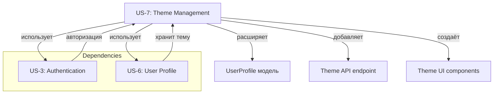

# US-7: Управление темой оформления профиля

---

## Формулировка

**Как** авторизованный пользователь СНТ,
**я хочу** выбирать и менять тему оформления приложения (светлая/тёмная/зелёная),
**чтобы** комфортно работать с системой в любых условиях освещения.

---

## Контекст

**Проблема**: В приложении отсутствует возможность выбора темы оформления. Пользователи вынуждены работать с темой по умолчанию, что может быть неудобно при разном освещении рабочего места или личных предпочтениях.

**Решение**: Реализовать возможность выбора и сохранения темы оформления для каждого пользователя. Тема применяется ко всем страницам авторизованной зоны и сохраняется в профиле пользователя.

**Границы**:
- Входит: выбор темы в профиле (`/profile`), быстрое переключение через навбар, сохранение в БД, учёт системных настроек при создании профиля, CSS-переменные для каждой темы
- НЕ входит: кастомные темы пользователя, настройки для разных устройств отдельно

---

## Модель данных

| Сущность | Описание |
|----------|----------|
| **UserProfile** | Добавляется поле `theme` со значениями `'light'`, `'dark'`, `'green'` |

### Обновление модели UserProfile

**DBML Schema (`docs/model/schema.dbml`):**
```dbml
Table user_profiles {
  // ... существующие поля
  theme         varchar       [default: 'light', not null]
  // ...
}
```

**Prisma Schema (`prisma/schema.prisma`):**
```prisma
model UserProfile {
  // ... существующие поля
  theme String @default("light") @map("theme")
  // ...
}
```

> **Примечание**: Значение по умолчанию `'light'` для существующих пользователей, которые ещё не выбрали тему.

---

## Функциональные требования

### FR-1: Отображение списка тем в профиле
В разделе настроек профиля (`/profile`) пользователь видит выбор темы с визуальным превью каждой доступной темы.

### FR-2: Изменение темы в профиле
Пользователь может выбрать новую тему из доступных (светлая, тёмная, зелёная) и сохранить изменения.

### FR-3: Быстрое переключение через навбар
В навбаре авторизованных страниц отображается кнопка/переключатель темы для быстрого изменения без перехода в профиль.

### FR-4: Сохранение темы в БД
Выбранная тема сохраняется в поле `UserProfile.theme` и применяется при следующем входе в систему.

### FR-5: Применение темы ко всем страницам
Выбранная тема применяется ко всем страницам авторизованной зоны через CSS-переменные.

### FR-6: Учёт системных настроек при создании профиля
При создании первого профиля пользователя (если профиль ещё не существует) учитывается системная настройка `prefers-color-scheme`:
- `'dark'` → `'dark'`
- `'light'` или `'no-preference'` → `'light'`

---

## Критерии приёмки

### AC-1: Отображение выбора темы в профиле
- **Given** авторизованный пользователь открыл `/profile`
- **When** страница загрузки завершена
- **Then** отображается секция "Тема оформления" с 3 вариантами (светлая/тёмная/зелёная)
- **Then** текущая тема пользователя выделена как выбранная
- **Then** каждый вариант показывает визуальное превью (миниатюру)

### AC-2: Изменение темы через профиль
- **Given** пользователь видит список тем в профиле
- **When** пользователь выбирает другую тему и нажимает "Сохранить"
- **Then** тема обновляется в БД
- **Then** интерфейс мгновенно переключается на новую тему
- **Then** отображается уведомление "Тема сохранена"

### AC-3: Быстрое переключение через навбар
- **Given** авторизованный пользователь на любой странице дашборда
- **When** пользователь нажимает кнопку переключения темы в навбаре
- **Then** тема переключается на следующую по очереди (light → dark → green → light)
- **Then** изменение сохраняется в БД
- **Then** отображается подтверждение изменения

### AC-4: Применение темы ко всем страницам
- **Given** пользователь выбрал тему
- **When** переходит на любую страницу в `/dashboard/*`
- **Then** выбранная тема применяется ко всей странице
- **Then** CSS-переменные используются для применения цветов

### AC-5: Учёт системных настроек при создании профиля
- **Given** пользователь проходит регистрацию или первый вход
- **When** создаётся запись в UserProfile
- **Then** если система имеет `prefers-color-scheme: dark` → тема `'dark'`
- **Then** если система имеет `prefers-color-scheme: light` или `no-preference` → тема `'light'`

### AC-6: Предпросмотр темы
- **Given** пользователь видит список тем в профиле
- **When** наводит курсор на вариант темы
- **Then** отображается превью (миниатюра) как будет выглядеть интерфейс

### AC-7: Системные настройки в браузере
- **Given** пользователь имеет системную настройку `prefers-color-scheme: dark`
- **When** открывается дашборд впервые
- **Then** интерфейс отображается в тёмной теме до изменения предпочтений

---

## Бизнес-правила и валидация

| ID | Правило | Валидация |
|----|---------|-----------|
| BR-1 | Тема обязательно должна быть одной из трёх: `light`, `dark`, `green` | Zod enum |
| BR-2 | Значение по умолчанию для темы: `light` | Prisma default |
| BR-3 | Тема сохраняется в UserProfile | БД constraint |
| BR-4 | Тема применяется ко всем страницам авторизованной зоны | CSS-переменные |
| BR-5 | При создании профиля учитывается системная тема | Client-side API |
| BR-6 | Изменение темы мгновенно применяется на клиенте | React state |

---

## Граничные случаи (Edge Cases)

| № | Ситуация | Ожидаемое поведение |
|---|----------|---------------------|
| 1 | У пользователя нет записи в UserProfile | Создаётся профиль с темой `light` по умолчанию |
| 2 | Пользователь удаляет тему из БД вручную | При следующем запросе используется значение по умолчанию `light` |
| 3 | Ошибка при сохранении темы в БД | Ошибка отображается пользователю, тема не меняется |
| 4 | Неизвестное значение темы в БД (старые данные) | Показывается текущая тема по умолчанию `light` |
| 5 | Медленное соединение при смене темы | Кнопка блокируется, показывается индикатор загрузки |
| 6 | Несколько вкладок с открытым приложением | При смене темы в одной вкладке, все обновляются (через storage event или polling) |
| 7 | Пользователь без интернета | Сохранение откладывается до восстановления соединения |
| 8 | Предпросмотр темы при отключённом JS | Показывается только текстовый выбор |

---

## Обработка ошибок

| Ситуация | Код HTTP | Доменная ошибка | Сообщение пользователю |
|----------|----------|-----------------|------------------------|
| Неверный формат темы | 400 | ThemeInvalidError | Выберите тему из доступных |
| Ошибка БД при сохранении | 500 | DatabaseError | Не удалось сохранить тему. Попробуйте позже |
| Недостаточно прав | 403 | ForbiddenError | У вас нет прав на изменение настроек |
| Несоответствие сессии | 401 | UnauthorizedError | Сессия истекла. Пожалуйста, войдите снова |

---

## Влияние на слои архитектуры

### Модель данных
- [x] Новая сущность: нет
- [x] Изменение сущности: `UserProfile` — добавление поля `theme`
- [x] Новый enum: нет
- [x] Обновить: `docs/model/schema.dbml`, `prisma/schema.prisma`, миграция

### Repository
- [ ] Новые методы: нет — поле `theme` автоматически добавлено в Prisma
- [x] Изменение методов: `findById`, `update` — добавление `theme` в результаты
- [ ] Без изменений: нет

### Service
- [x] Новые методы: `updateTheme(userId: string, theme: Theme): Promise<Theme>`
- [x] Новые Zod-схемы: `updateThemeSchema`
- [ ] Новые доменные ошибки: `ThemeInvalidError`
- [x] Обновить: `userProfile.service.ts`, `userProfile.validators.ts`, `userProfile.errors.ts`

### API
| Метод | Путь | Описание | Роль |
|-------|------|----------|------|
| `PATCH` | `/api/v1/profile/theme` | Изменить тему пользователя | authenticated |
| `GET` | `/api/v1/profile` | Получить профиль (включая theme) | authenticated |

> **Примечание**: `GET /api/v1/profile` уже существует, нужно добавить поле `theme` в ответ.

### UI
| Компонент | Тип | Маршрут | Описание |
|-----------|-----|---------|----------|
| `ThemeSelector` | Client Component | Переиспользуемый | Выбор темы с превью |
| `ThemeToggle` | Client Component | Переиспользуемый | Кнопка в навбаре для быстрого переключения |
| `ProfilePage` | Page | `/profile` | Добавление секции выбора темы |
| `AppLayout` | Layout | `/dashboard/*` | Добавление кнопки ThemeToggle в навбар |

---

## Нефункциональные требования

- **Производительность**: Смена темы происходит мгновенно на клиенте (< 100мс)
- **UX**: Анимация перехода между темами (transition)
- **Доступность**: Тема сохраняется после перезагрузки страницы
- **Кросс-браузерность**: Поддержка Chrome, Firefox, Safari, Edge
- **Mobile-first**: Адаптивное отображение выбора темы на мобильных устройствах

---

## Открытые вопросы

| № | Вопрос | Допущение |
|---|--------|-----------|
| 1 | Нужно ли сохранять историю изменений темы? | Нет — только текущее значение |
| 2 | Нужен ли синхронизация между вкладками? | Да — через `storage` event listener |
| 3 | Поддержка кастомных тем в будущем? | Да — schema extensible, enum может расширяться |
| 4 | Нужен ли Dark/Light mode toggle для превью? | Нет — статичное превью достаточно |

---

## Зависимости



> **US-7 зависит от US-3 (Authentication)** — требуется авторизация для доступа к настройкам профиля.
> **US-7 расширяет US-6 (User Profile)** — добавляет функциональность выбора темы.

---

## История

| Дата | Автор | Действие |
|------|-------|----------|
| 2024-06-30 | — | Создание User Story |
