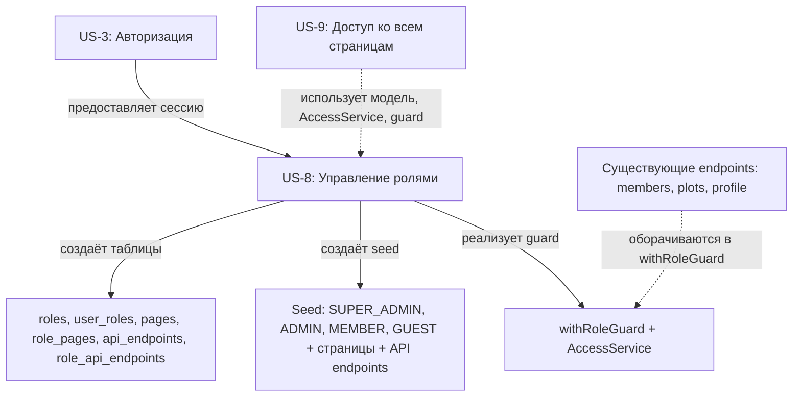

# US-8: Страница управления ролями и участниками

---

## Формулировка

**Как** пользователь с ролью SUPER_ADMIN,
**я хочу** управлять ролями, их доступом к страницам и участниками через страницу администрирования,
**чтобы** делегировать полномочия в системе и контролировать доступ пользователей к разделам приложения.

---

## Контекст

**Проблема**: В системе роли захардкожены в enum `Role` (GUEST, MEMBER, ADMIN) и хранятся в поле `users.role` (одна роль на пользователя). Невозможно настраивать список ролей, назначать роли страницам и управлять участниками ролей через UI. Доступ к страницам никак не контролируется ролями.

**Решение**: Переход к настраиваемой ролевой модели RBAC. Создаётся таблица `roles` (вместо enum), связь M:N `users`↔`roles` (таблица `user_roles`), реестр страниц `pages` и связь M:N `roles`↔`pages` (таблица `role_pages`), реестр API endpoints `api_endpoints` и связь M:N `roles`↔`api_endpoints` (таблица `role_api_endpoints`). Страница `/dashboard/roles` позволяет SUPER_ADMIN управлять ролями, страницами, API endpoints и участниками. Системная супер-роль `SUPER_ADMIN` обеспечивает полный доступ как runtime-правило. Защита API endpoints реализуется через `AccessService` и обёртку `withRoleGuard` с категориями доступа (`public`, `owner`, `role`, `super_admin`).

**Границы**:
- Входит: таблицы `roles`, `user_roles`, `pages`, `role_pages`, `api_endpoints`, `role_api_endpoints`; удаление enum `Role` и поля `users.role`; seed системных ролей, страниц и API endpoints; миграция существующих назначений; домен `roles` (типы, репозитории, сервисы, валидаторы, ошибки); API endpoints CRUD для ролей, страниц, участников, API endpoints; `AccessService` — единый сервис проверки доступа (страницы + API); `withRoleGuard` — обёртка для route handlers; `path-matcher` — сопоставление путей с `:param`; страница `/dashboard/roles`; базовая защита самой страницы управления (доступ только SUPER_ADMIN)
- НЕ входит: ролевая проверка доступа на всех остальных страницах приложения через guard/hook (US-9), фильтрация навигационного меню по ролям (US-9), страница «403 Доступ запрещён» (US-9), обновление сессии при изменении ролей (US-9), иерархия ролей, временные роли, аудит изменений

---

## Модель данных

| Сущность | Описание |
|----------|----------|
| **Role** | Настраиваемый реестр ролей: `id`, `name` (unique), `description`, `is_system`, `created_at`, `updated_at`. Системные роли (`is_system=true`) защищены от удаления/переименования |
| **UserRole** | Связь M:N users↔roles: `user_id`, `role_id`, составной PK. Один пользователь — несколько ролей |
| **Page** | Реестр страниц приложения: `id`, `path` (unique), `title`, `group_name`, `sort_order`, `is_active`, `created_at`, `updated_at`. Управляется через UI |
| **RolePage** | Связь M:N roles↔pages: `role_id`, `page_id`, составной PK. Определяет доступ роли к страницам |
| **ApiEndpoint** | Реестр API endpoints: `id`, `method`, `path` (unique вместе с method), `description`, `access_type` (public/owner/role/super_admin), `is_active`, `created_at`, `updated_at`. Управляется через UI |
| **RoleApiEndpoint** | Связь M:N roles↔api_endpoints: `role_id`, `api_endpoint_id`, составной PK. Определяет доступ роли к API endpoints (только при `access_type=role`) |
| **User** | Изменение: поле `role` (enum) удалено. Роли через `user_roles` |

> Полное описание сущностей см. в [`docs/model/entities/role.md`](../model/entities/role.md), [`page.md`](../model/entities/page.md), [`api-endpoint.md`](../model/entities/api-endpoint.md), [`user-role.md`](../model/entities/user-role.md), [`role-page.md`](../model/entities/role-page.md), [`role-api-endpoint.md`](../model/entities/role-api-endpoint.md). Фрагменты DBML/Prisma — в [`docs/model/schema-update-roles-notice.md`](../model/schema-update-roles-notice.md).

### Архитектурные правила доступа (runtime)

- **SUPER_ADMIN**: при наличии у пользователя роли `SUPER_ADMIN` сервис проверки доступа возвращает `true` без обращения к `role_pages`/`role_api_endpoints`. Полный доступ ко всем активным страницам и API endpoints (категорий `role`, `super_admin`).
- **Новая страница/endpoint по умолчанию закрыты**: страница без записей в `role_pages` или endpoint с `access_type=role` без записей в `role_api_endpoints` недоступны всем, кроме `SUPER_ADMIN`.
- **Неактивная страница/endpoint** (`is_active=false`): недоступны всем, включая SUPER_ADMIN.
- **Категории доступа API**: `public` (без авторизации), `owner` (auth + проверка владельца в handler), `role` (auth + проверка role_api_endpoints), `super_admin` (auth + только SUPER_ADMIN). Записи в `role_api_endpoints` имеют значение только при `access_type=role`.
- **Сопоставление путей**: API path может содержать `:param` (например `/members/:id`), сопоставление с реальным запросом через `path-matcher` в коде.

---

## Функциональные требования

### FR-1: Страница управления ролями
Страница `/dashboard/roles` доступна только пользователям с ролью `SUPER_ADMIN`. Неавторизованные пользователи перенаправляются на `/login`. Авторизованные пользователи без роли `SUPER_ADMIN` получают отказ доступа (403) — обрабатывается в US-9, но базовая проверка для самой страницы управления реализуется в US-8. Страница отображает четыре вкладки: «Роли», «Страницы», «API», «Участники».

### FR-2: Вкладка «Роли» — список ролей
Отображается таблица всех ролей с колонками: имя, описание, признак системной, количество участников, количество страниц. Системные роли помечаются значком. Для каждой роли доступны действия: «Редактировать», «Управлять страницами», «Управлять участниками», «Удалить» (недоступно для системных ролей).

### FR-3: Создание роли
Форма создания роли содержит поля: `name` (обязательное, 2-50 символов, уникальное), `description` (опциональное, до 500 символов). При успехе роль создаётся с `is_system=false`. При дублировании имени возвращается ошибка 409 Conflict.

### FR-4: Редактирование роли
Можно изменить `description` для любой роли. Поле `name` можно изменить только для несистемных ролей (`is_system=false`). Для системных ролей поле `name` недоступно для редактирования. При попытке переименовать несистемную роль в уже существующее имя — ошибка 409 Conflict.

### FR-5: Удаление роли
Удаление доступно только для несистемных ролей (`is_system=false`). Перед удалением отображается подтверждение со списком затронутых пользователей и страниц. При подтверждении роль удаляется каскадно (удаляются записи в `user_roles` и `role_pages`). Пользователи теряют эту роль и связанные с ней права доступа.

### FR-6: Вкладка «Страницы» — управление страницами роли
Для выбранной роли отображается список всех страниц из реестра `pages` с чекбоксами. Отмеченные страницы назначены роли (записи в `role_pages`). Изменение чекбокса мгновенно (или по кнопке «Сохранить») добавляет/удаляет запись в `role_pages`. Для SUPER_ADMIN назначение страниц не обязательно — доступ безусловен.

### FR-7: Управление реестром страниц (CRUD)
Вкладка «Страницы» (общий реестр) позволяет:
- Создавать новую страницу: поля `path` (обязательное, начинается с `/`, уникальное), `title` (обязательное, 2-100 символов), `group_name` (опциональное), `sort_order` (число, по умолчанию 0), `is_active` (чекбокс, по умолчанию true)
- Редактировать существующую страницу
- Деактивировать страницу (`is_active=false`) — скрывает её из меню и блокирует доступ (кроме SUPER_ADMIN)
- Удалить страницу — каскадно удаляет записи в `role_pages`

### FR-8: Вкладка «Участники» — управление участниками роли
Для выбранной роли отображается список назначенных пользователей с возможностью исключения. Есть форма поиска/добавления пользователя в роль (по email или имени). При добавлении создаётся запись в `user_roles`. При исключении — удаляется. Пользователь может состоять в нескольких ролях одновременно.

### FR-9: Защита системных ролей
Сервис блокирует операции: удаление роли с `is_system=true`, переименование роли с `is_system=true`. Возвращается ошибка 403 Forbidden с сообщением «Системную роль нельзя удалить или переименовать».

### FR-10: Защита последнего SUPER_ADMIN
Нельзя удалить роль `SUPER_ADMIN`, если это единственная роль `SUPER_ADMIN` хотя бы у одного пользователя. Нельзя исключить пользователя из роли `SUPER_ADMIN`, если это его последняя роль `SUPER_ADMIN` и других SUPER_ADMIN в системе нет. Возвращается ошибка 409 Conflict с пояснением.

### FR-11: Блокировка повторной отправки
Во время выполнения запросов (создание, редактирование, удаление) кнопки блокируются и отображается индикатор загрузки. Повторная отправка невозможна.

### FR-12: Пустые состояния
Если список ролей, страниц, API endpoints или участников пуст — отображается компонент `EmptyState` из [`src/components/ui/`](../components/ui/).

### FR-13: Вкладка «API» — управление реестром API endpoints (CRUD)
Вкладка «API» позволяет:
- Создавать новый API endpoint: поля `method` (select: GET, POST, PATCH, PUT, DELETE), `path` (обязательное, начинается с `/`, может содержать `:param`, уникальное в комбинации с method), `description` (опциональное), `access_type` (select: public, owner, role, super_admin; по умолчанию `role`), `is_active` (чекбокс, по умолчанию true)
- Редактировать существующий endpoint
- Деактивировать endpoint (`is_active=false`) — блокирует доступ всем, включая SUPER_ADMIN
- Удалить endpoint — каскадно удаляет записи в `role_api_endpoints`

### FR-14: Назначение API endpoints роли
Для выбранной роли (на вкладке «Роли» → действие «Управлять API») отображается список всех endpoints из реестра `api_endpoints` с чекбоксами. Отмеченные endpoints назначены роли (записи в `role_api_endpoints`). Назначение имеет значение только для endpoints с `access_type=role` — для остальных категорий (`public`, `owner`, `super_admin`) записи игнорируются. Для SUPER_ADMIN назначение не обязательно — доступ безусловен.

### FR-15: Защита API endpoints через AccessService
Все API Route Handlers в `src/app/api/v1/` защищаются через `AccessService` и обёртку `withRoleGuard`:
- `public` — пропускаются без проверки
- `owner` — проверка `auth()` + логика владельца в handler (не ролевая)
- `role` — проверка `auth()` + `AccessService.canAccessApi(userId, method, path)` через `role_api_endpoints`
- `super_admin` — проверка `auth()` + наличие роли SUPER_ADMIN
При отсутствии прав возвращается 403 Forbidden с сообщением «Недостаточно прав».

### FR-16: Сопоставление путей с параметрами
API path в реестре может содержать параметры `:param` (например `/members/:id`). При проверке доступа реальный путь запроса (например `/members/abc123`) сопоставляется с шаблоном через `path-matcher`. Совпадение: `/members/:id` соответствует `/members/abc123`, но не `/members/abc123/profile`.

### FR-17: Унификация auth() на всех endpoints
Все API Route Handlers в `src/app/api/v1/` (кроме `public`) обязаны вызывать `auth()` и возвращать 401 при отсутствии сессии. Устраняет текущую inconsistency: `members/route.ts` и `plots/route.ts` не имели проверки авторизации.

---

## Критерии приёмки

### AC-1: Доступ к странице управления ролями
- **Given** пользователь авторизован с ролью `SUPER_ADMIN`
- **When** открывает `/dashboard/roles`
- **Then** отображается страница управления ролями с четырьмя вкладками: «Роли», «Страницы», «API», «Участники»

### AC-2: Создание роли
- **Given** SUPER_ADMIN на вкладке «Роли» нажимает «Создать роль»
- **When** вводит уникальное имя «Редактор» и описание, нажимает «Сохранить»
- **Then** роль создаётся с `is_system=false`, появляется в списке, отображается уведомление об успехе

### AC-3: Дублирование имени роли
- **Given** SUPER_ADMIN создаёт роль с именем существующей несистемной роли
- **When** нажимает «Сохранить»
- **Then** отображается ошибка «Роль с таким именем уже существует», форма остаётся заполненной

### AC-4: Редактирование системной роли
- **Given** SUPER_ADMIN открывает редактирование системной роли (например MEMBER)
- **When** пытается изменить поле `name`
- **Then** поле `name` недоступно для редактирования, можно изменить только `description`

### AC-5: Удаление несистемной роли
- **Given** SUPER_ADMIN нажимает «Удалить» на несистемной роли, у которой 3 участника и 2 страницы
- **When** подтверждает удаление в модальном окне
- **Then** роль удаляется, записи в `user_roles` и `role_pages` удаляются каскадно, 3 пользователя теряют эту роль

### AC-6: Запрет удаления системной роли
- **Given** SUPER_ADMIN нажимает «Удалить» на системной роли
- **When** действие недоступно
- **Then** кнопка «Удалить» заблокирована или скрыта

### AC-7: Назначение страниц роли
- **Given** SUPER_ADMIN открывает управление страницами для роли «Редактор»
- **When** отмечает чекбокс у страницы `/dashboard/members` и снимает с `/dashboard/plots`
- **Then** в `role_pages` создаётся/удаляется соответствующая запись, изменения сохраняются

### AC-8: Создание новой страницы
- **Given** SUPER_ADMIN на вкладке «Страницы» (реестр) нажимает «Добавить страницу»
- **When** вводит path=`/dashboard/votes`, title=`Голосования`, group=`Основное`
- **Then** страница создаётся в `pages`, доступна для назначения ролям. Доступ к самой странице по умолчанию закрыт всем, кроме SUPER_ADMIN.

### AC-9: Деактивация страницы
- **Given** SUPER_ADMIN редактирует страницу и снимает флаг `is_active`
- **When** сохраняет
- **Then** страница помечается `is_active=false`, при проверке доступа (US-9) будет недоступна всем, кроме SUPER_ADMIN

### AC-10: Добавление участника в роль
- **Given** SUPER_ADMIN на вкладке «Участники» для роли «Редактор» ищет пользователя по email
- **When** находит и нажимает «Добавить»
- **Then** создаётся запись в `user_roles`, пользователь появляется в списке участников роли

### AC-11: Исключение участника из роли
- **Given** SUPER_ADMIN на вкладке «Участники» видит пользователя в списке
- **When** нажимает «Исключить» и подтверждает
- **Then** запись в `user_roles` удаляется, пользователь теряет эту роль

### AC-12: Защита последнего SUPER_ADMIN
- **Given** в системе один пользователь с ролью `SUPER_ADMIN`
- **When** SUPER_ADMIN пытается исключить себя из роли `SUPER_ADMIN`
- **Then** возвращается ошибка «Нельзя удалить последнего SUPER_ADMIN»

### AC-13: Валидация пути страницы
- **Given** SUPER_ADMIN создаёт страницу с path=`dashboard/members` (без ведущего `/`)
- **When** нажимает «Сохранить»
- **Then** отображается ошибка «Путь должен начинаться с /»

### AC-14: Уникальность пути страницы
- **Given** SUPER_ADMIN создаёт страницу с path, который уже существует
- **When** нажимает «Сохранить»
- **Then** отображается ошибка «Страница с таким путём уже существует»

### AC-15: Состояние загрузки
- **Given** SUPER_ADMIN нажал «Сохранить» при создании роли
- **When** запрос выполняется
- **Then** кнопка заблокирована, отображается индикатор загрузки

### AC-16: Пустое состояние
- **Given** в реестре `pages` нет записей
- **When** открывается вкладка «Страницы»
- **Then** отображается компонент `EmptyState` с предложением добавить первую страницу

### AC-17: Создание API endpoint
- **Given** SUPER_ADMIN на вкладке «API» нажимает «Добавить endpoint»
- **When** вводит method=GET, path=`/votes`, access_type=`role`
- **Then** endpoint создаётся в `api_endpoints`, доступен для назначения ролям. Доступ к endpoint по умолчанию закрыт всем, кроме SUPER_ADMIN.

### AC-18: Уникальность комбинации method+path
- **Given** SUPER_ADMIN создаёт endpoint GET `/members`, который уже существует
- **When** нажимает «Сохранить»
- **Then** отображается ошибка «Endpoint с таким методом и путём уже существует»

### AC-19: Назначение API endpoints роли
- **Given** SUPER_ADMIN открывает управление API для роли «Редактор»
- **When** отмечает чекбокс у endpoint `GET /members` и снимает с `DELETE /members/:id`
- **Then** в `role_api_endpoints` создаётся/удаляется соответствующая запись, изменения сохраняются

### AC-20: Доступ к API endpoint без прав
- **Given** пользователь с ролью MEMBER (нет прав на `POST /members`)
- **When** отправляет POST запрос на `/api/v1/members`
- **Then** возвращается 403 Forbidden с сообщением «Недостаточно прав»

### AC-21: Доступ к API endpoint с правами
- **Given** пользователь с ролью MEMBER (есть права на `GET /members` через `role_api_endpoints`)
- **When** отправляет GET запрос на `/api/v1/members`
- **Then** запрос выполняется успешно, возвращается список членов

### AC-22: Сопоставление пути с параметром
- **Given** в реестре есть endpoint `GET /members/:id`, пользователю назначена роль с доступом к нему
- **When** отправляет GET запрос на `/api/v1/members/abc123`
- **Then** `path-matcher` сопоставляет `/members/abc123` с шаблоном `/members/:id`, доступ разрешён

---

## Бизнес-правила и валидация

| ID | Правило | Валидация |
|----|---------|-----------|
| BR-1 | Имя роли обязательно, 2-50 символов, уникально | Zod + DB Unique Constraint |
| BR-2 | Описание роли опционально, до 500 символов | Zod — max 500 |
| BR-3 | Системную роль (`is_system=true`) нельзя удалить или переименовать | Runtime — сервисная проверка |
| BR-4 | Нельзя удалить роль `SUPER_ADMIN`, если это последняя такая роль у пользователя | Runtime — сервисная проверка |
| BR-5 | Нельзя исключить пользователя из `SUPER_ADMIN`, если это его последняя такая роль и других SUPER_ADMIN нет | Runtime — сервисная проверка |
| BR-6 | Путь страницы обязателен, начинается с `/`, уникален | Zod — regex `^/` + DB Unique |
| BR-7 | Заголовок страницы обязателен, 2-100 символов | Zod — min 2, max 100 |
| BR-8 | `sort_order` — целое число, по умолчанию 0 | Zod — int, default 0 |
| BR-9 | `is_active` — булево, по умолчанию true | Prisma default |
| BR-10 | При `is_active=false` страница недоступна всем, кроме SUPER_ADMIN | Runtime — сервис проверки |
| BR-11 | Новая страница без записей в `role_pages` недоступна всем, кроме SUPER_ADMIN | Runtime — по умолчанию закрыто |
| BR-12 | Комбинация (`user_id`, `role_id`) уникальна | DB — составной PK |
| BR-13 | Комбинация (`role_id`, `page_id`) уникальна | DB — составной PK |
| BR-14 | Удаление роли каскадно удаляет `user_roles` и `role_pages` | DB — CASCADE |
| BR-15 | Удаление страницы каскадно удаляет `role_pages` | DB — CASCADE |
| BR-16 | SUPER_ADMIN имеет полный доступ ко всем активным страницам через runtime-правило | Runtime — без обращения к `role_pages` |
| BR-17 | Назначение SUPER_ADMIN-у страниц в `role_pages` игнорируется сервисом доступа | Runtime — безусловный доступ |
| BR-18 | HTTP-метод обязателен, из списка GET, POST, PATCH, PUT, DELETE | Zod — enum |
| BR-19 | API path обязателен, начинается с `/`, уникален в комбинации с method | Zod — regex `^/` + DB Unique [method, path] |
| BR-20 | `access_type` — из списка public, owner, role, super_admin; по умолчанию `role` | Zod — enum, default `role` |
| BR-21 | При `access_type=public` endpoint доступен без авторизации; `role_api_endpoints` игнорируются | Runtime — сервис проверки |
| BR-22 | При `access_type=owner` endpoint требует `auth()` + проверку владельца в handler; `role_api_endpoints` игнорируются | Runtime — сервис проверки |
| BR-23 | При `access_type=role` endpoint без записей в `role_api_endpoints` недоступен всем, кроме SUPER_ADMIN | Runtime — по умолчанию закрыто |
| BR-24 | При `access_type=super_admin` endpoint доступен только SUPER_ADMIN; `role_api_endpoints` игнорируются | Runtime — сервис проверки |
| BR-25 | При `is_active=false` endpoint недоступен всем, включая SUPER_ADMIN | Runtime — сервис проверки |
| BR-26 | Комбинация (`role_id`, `api_endpoint_id`) уникальна | DB — составной PK |
| BR-27 | Удаление роли каскадно удаляет `role_api_endpoints` | DB — CASCADE |
| BR-28 | Удаление endpoint каскадно удаляет `role_api_endpoints` | DB — CASCADE |
| BR-29 | Сопоставление пути: `:param` в шаблоне соответствует любому сегменту в реальном запросе | Runtime — path-matcher |

### Примеры валидаций
- **Имя роли**: 2-50 символов, уникальное (проверка на уровне БД через `@unique`)
- **Путь страницы**: формат `^/[a-z0-9-/]*$`, начинается с `/`, уникальный
- **API endpoint**: комбинация (method, path) уникальна через `@@unique([method, path])` в Prisma
- **Обязательные поля**: `name` (роль), `path` и `title` (страница), `method` и `path` (endpoint)
- **CASCADE**: на уровне БД через `onDelete: Cascade` в Prisma

---

## Граничные случаи (Edge Cases)

| # | Ситуация | Ожидаемое поведение |
|---|----------|---------------------|
| 1 | Дублирование имени роли при создании | 409 Conflict, сообщение «Роль с таким именем уже существует» |
| 2 | Попытка удалить системную роль | Кнопка «Удалить» недоступна; при прямом API-вызове — 403 Forbidden |
| 3 | Удаление роли с большим количеством участников | Показать список затронутых пользователей перед подтверждением |
| 4 | Попытка переименовать системную роль через API | 403 Forbidden, сообщение «Системную роль нельзя переименовать» |
| 5 | Исключение последнего SUPER_ADMIN | 409 Conflict, сообщение «Нельзя удалить последнего SUPER_ADMIN» |
| 6 | Создание страницы с путём без ведущего `/` | 400, ошибка валидации «Путь должен начинаться с /» |
| 7 | Дублирование пути страницы | 409 Conflict, сообщение «Страница с таким путём уже существует» |
| 8 | Назначение уже назначенной страницы роли | Идемпотентно — не создаёт дубликат (составной PK) |
| 9 | Параллельное редактирование роли двумя админами | Последнее сохранение побеждает, `updated_at` фиксирует последнее изменение |
| 10 | Добавление пользователя в роль, где он уже состоит | Идемпотентно — не создаёт дубликат (составной PK) |
| 11 | Удаление страницы, назначенной нескольким ролям | Каскадно удаляются все записи в `role_pages` для этой страницы |
| 12 | SUPER_ADMIN удаляет свою собственную несистемную роль | Разрешено, если остаётся хотя бы одна роль SUPER_ADMIN |
| 13 | Создание роли с именем в разном регистре («Admin» vs «ADMIN») | Регистрозависимое — разные роли; но SUPER_ADMIN по соглашению — верхний регистр |
| 14 | Дублирование комбинации method+path при создании endpoint | 409 Conflict, сообщение «Endpoint с таким методом и путём уже существует» |
| 15 | Запрос к endpoint с `access_type=role` без назначения роли | 403 Forbidden, сообщение «Недостаточно прав» |
| 16 | Запрос к endpoint с `access_type=public` без авторизации | Пропускается без проверки |
| 17 | Запрос к неактивному endpoint (`is_active=false`) | 403 Forbidden — недоступен всем, включая SUPER_ADMIN |
| 18 | Сопоставление `/members/:id` с `/members/abc123/profile` | Не совпадает — разное количество сегментов, 403 если нет другого совпадающего endpoint |
| 19 | Назначение endpoint с `access_type=public` роли через `role_api_endpoints` | Запись создаётся, но игнорируется сервисом — доступ безусловен |
| 20 | Удаление endpoint, назначенного нескольким ролям | Каскадно удаляются все записи в `role_api_endpoints` для этого endpoint |
| 21 | Запрос к API без auth() при `access_type=role` | 401 Unauthorized |
| 22 | Endpoint `/members/:id` — запрос `/members/abc123` | Совпадает через path-matcher, доступ разрешён если есть права |

---

## Обработка ошибок

| Ситуация | Код HTTP | Доменная ошибка | Сообщение пользователю |
|----------|----------|-----------------|------------------------|
| Роль с таким именем уже существует | 409 | RoleDuplicateError | Роль с таким именем уже существует |
| Роль не найдена | 404 | RoleNotFoundError | Роль не найдена |
| Системную роль нельзя удалить/переименовать | 403 | RoleSystemProtectedError | Системную роль нельзя удалить или переименовать |
| Попытка удалить последнего SUPER_ADMIN | 409 | LastSuperAdminError | Нельзя удалить последнего SUPER_ADMIN |
| Страница с таким путём уже существует | 409 | PageDuplicateError | Страница с таким путём уже существует |
| Страница не найдена | 404 | PageNotFoundError | Страница не найдена |
| Неверный формат пути | 400 | PageInvalidDataError | Путь должен начинаться с / |
| Имя роли короче 2 символов | 400 | RoleInvalidDataError | Имя роли должно содержать минимум 2 символа |
| Пользователь не найден при добавлении в роль | 404 | UserNotFoundError | Пользователь не найден |
| Недостаточно прав (не SUPER_ADMIN) | 403 | ForbiddenError | Доступ к управлению ролями разрешён только SUPER_ADMIN |
| Endpoint с такой комбинацией method+path уже существует | 409 | ApiEndpointDuplicateError | Endpoint с таким методом и путём уже существует |
| API endpoint не найден | 404 | ApiEndpointNotFoundError | API endpoint не найден |
| Недостаточно прав к API endpoint | 403 | ForbiddenError | Недостаточно прав |
| Неавторизованный запрос к защищаемому API | 401 | UnauthorizedError | Требуется авторизация |
| Неверный формат API path | 400 | ApiEndpointInvalidDataError | Путь должен начинаться с / |
| Неверный HTTP-метод | 400 | ApiEndpointInvalidDataError | Метод должен быть одним из: GET, POST, PATCH, PUT, DELETE |
| Внутренняя ошибка сервера | 500 | — | Произошла ошибка. Попробуйте позже. |

---

## Влияние на слои архитектуры

### Модель данных
- [x] Новая сущность: `Role` (id, name, description, is_system, created_at, updated_at)
- [x] Новая сущность: `Page` (id, path, title, group_name, sort_order, is_active, created_at, updated_at)
- [x] Новая сущность: `ApiEndpoint` (id, method, path, description, access_type, is_active, created_at, updated_at)
- [x] Новая сущность: `UserRole` (user_id, role_id, created_at) — join-таблица M:N
- [x] Новая сущность: `RolePage` (role_id, page_id, created_at) — join-таблица M:N
- [x] Новая сущность: `RoleApiEndpoint` (role_id, api_endpoint_id, created_at) — join-таблица M:N
- [x] Изменение сущности: `User` — удалено поле `role` (enum Role)
- [x] Удалён enum: `Role` (GUEST, MEMBER, ADMIN)
- [x] Обновить: [`docs/model/schema.dbml`](../model/schema.dbml), [`prisma/schema.prisma`](../../prisma/schema.prisma), миграция
- [x] Создать описания сущностей: [`role.md`](../model/entities/role.md), [`page.md`](../model/entities/page.md), [`api-endpoint.md`](../model/entities/api-endpoint.md), [`user-role.md`](../model/entities/user-role.md), [`role-page.md`](../model/entities/role-page.md), [`role-api-endpoint.md`](../model/entities/role-api-endpoint.md)
- [x] Обновить: [`user.md`](../model/entities/user.md) (удалить поле role)
- [x] Seed: системные роли (SUPER_ADMIN, ADMIN, MEMBER, GUEST) + реестр страниц + реестр API endpoints
- [x] Миграция данных: `users.role` → `user_roles`

### Repository
- [x] Новые методы `IRoleRepository`:
  - `findAll(): Promise<Role[]>`
  - `findById(id: string): Promise<Role | null>`
  - `findByName(name: string): Promise<Role | null>`
  - `create(data: CreateRoleInput): Promise<Role>`
  - `update(id: string, data: UpdateRoleInput): Promise<Role>`
  - `delete(id: string): Promise<void>`
  - `findUsersByRoleId(roleId: string): Promise<User[]>`
  - `addUserToRole(userId: string, roleId: string): Promise<void>`
  - `removeUserFromRole(userId: string, roleId: string): Promise<void>`
- [x] Новые методы `IPageRepository`:
  - `findAll(): Promise<Page[]>`
  - `findByPath(path: string): Promise<Page | null>`
  - `findById(id: string): Promise<Page | null>`
  - `create(data: CreatePageInput): Promise<Page>`
  - `update(id: string, data: UpdatePageInput): Promise<Page>`
  - `delete(id: string): Promise<void>`
- [x] Новые методы `IRolePageRepository`:
  - `findPagesByRoleId(roleId: string): Promise<Page[]>`
  - `findRolesByPageId(pageId: string): Promise<Role[]>`
  - `assignPageToRole(roleId: string, pageId: string): Promise<void>`
  - `unassignPageFromRole(roleId: string, pageId: string): Promise<void>`
  - `unassignAllPagesFromRole(roleId: string): Promise<void>`
- [x] Новые методы `IApiEndpointRepository`:
  - `findAll(): Promise<ApiEndpoint[]>`
  - `findByMethodAndPath(method: string, path: string): Promise<ApiEndpoint | null>`
  - `findById(id: string): Promise<ApiEndpoint | null>`
  - `create(data: CreateApiEndpointInput): Promise<ApiEndpoint>`
  - `update(id: string, data: UpdateApiEndpointInput): Promise<ApiEndpoint>`
  - `delete(id: string): Promise<void>`
- [x] Новые методы `IRoleApiEndpointRepository`:
  - `findEndpointsByRoleId(roleId: string): Promise<ApiEndpoint[]>`
  - `findRolesByEndpointId(endpointId: string): Promise<Role[]>`
  - `assignEndpointToRole(roleId: string, endpointId: string): Promise<void>`
  - `unassignEndpointFromRole(roleId: string, endpointId: string): Promise<void>`
  - `unassignAllEndpointsFromRole(roleId: string): Promise<void>`
- [x] Изменение `IAuthRepository`: удаление поля `role` из `User`/`CreateUserInput`

### Service
- [x] Новые методы `RoleService`:
  - `findAll(): Promise<Role[]>`
  - `findById(id: string): Promise<Role>`
  - `create(data: CreateRoleInput): Promise<Role>`
  - `update(id: string, data: UpdateRoleInput): Promise<Role>`
  - `delete(id: string): Promise<void>`
  - `getRoleUsers(roleId: string): Promise<User[]>`
  - `addUserToRole(roleId: string, userId: string): Promise<void>`
  - `removeUserFromRole(roleId: string, userId: string): Promise<void>`
  - `getRolePages(roleId: string): Promise<Page[]>`
  - `assignPageToRole(roleId: string, pageId: string): Promise<void>`
  - `unassignPageFromRole(roleId: string, pageId: string): Promise<void>`
- [x] Новые методы `PageService`:
  - `findAll(): Promise<Page[]>`
  - `create(data: CreatePageInput): Promise<Page>`
  - `update(id: string, data: UpdatePageInput): Promise<Page>`
  - `delete(id: string): Promise<void>`
- [ ] Новые методы `ApiEndpointService`:
  - `findAll(): Promise<ApiEndpoint[]>`
  - `findById(id: string): Promise<ApiEndpoint>`
  - `findByMethodAndPath(method: HttpMethod, path: string): Promise<ApiEndpoint | null>`
  - `create(data: CreateApiEndpointInput): Promise<ApiEndpoint>`
  - `update(id: string, data: UpdateApiEndpointInput): Promise<ApiEndpoint>`
  - `delete(id: string): Promise<void>` — CASCADE удаляет `role_api_endpoints`
- [ ] Новые методы `RoleApiEndpointService`:
  - `getRoleEndpoints(roleId: string): Promise<ApiEndpoint[]>`
  - `assignEndpointToRole(roleId: string, endpointId: string): Promise<void>`
  - `unassignEndpointFromRole(roleId: string, endpointId: string): Promise<void>`
- [ ] Новые методы `AccessService`:
  - `canAccessPage(userId: string, path: string): Promise<boolean>`
  - `canAccessApi(userId: string, method: HttpMethod, path: string): Promise<boolean>`
  - `getAccessiblePages(userId: string): Promise<Page[]>` — для построения меню
  - Логика:
    - Если роль пользователя — `SUPER_ADMIN` → `true` (runtime-правило, не зависит от БД)
    - Если `access_type=public` → `true` (только проверка сессии не требуется)
    - Если `access_type=owner` → `true` при наличии сессии (владение ресурсом проверяется в handler)
    - Если `access_type=role` → проверка наличия `role_api_endpoints` для любой роли пользователя
    - Если `access_type=super_admin` → только `SUPER_ADMIN`
    - Сопоставление путей через `matchPath(pattern, actual)` — `:param` → `[\\w-]+`
    - Если `is_active=false` → `false` (endpoint/page деактивирован)
- [ ] Новые Zod-схемы: `createRoleSchema`, `updateRoleSchema`, `createPageSchema`, `updatePageSchema`, `createApiEndpointSchema`, `updateApiEndpointSchema`
- [ ] Новые доменные ошибки: `RoleNotFoundError`, `RoleDuplicateError`, `RoleSystemProtectedError`, `LastSuperAdminError`, `PageNotFoundError`, `PageDuplicateError`, `RoleInvalidDataError`, `PageInvalidDataError`, `ApiEndpointNotFoundError`, `ApiEndpointDuplicateError`, `ApiEndpointInvalidDataError`
- [ ] Новая утилита `matchPath(pattern: string, actual: string): boolean` в `src/shared/utils/path-matcher.ts`
- [ ] Новая функция-обёртка `withRoleGuard(handler, options)` в `src/app/api/v1/_shared/with-role-guard.ts`
- [x] Изменение `AuthService.registerUser`: удаление назначения роли GUEST (пользователь создаётся без ролей)
- [ ] Унификация `auth()` на ВСЕХ существующих API endpoints (members, plots, profile, register)

### API
| Метод | Путь | Описание | Роль |
|-------|------|----------|------|
| GET | /api/v1/roles | Список всех ролей | SUPER_ADMIN |
| POST | /api/v1/roles | Создать роль | SUPER_ADMIN |
| GET | /api/v1/roles/:id | Получить роль по ID | SUPER_ADMIN |
| PATCH | /api/v1/roles/:id | Обновить роль | SUPER_ADMIN |
| DELETE | /api/v1/roles/:id | Удалить роль | SUPER_ADMIN |
| GET | /api/v1/roles/:id/users | Участники роли | SUPER_ADMIN |
| POST | /api/v1/roles/:id/users | Добавить участника в роль | SUPER_ADMIN |
| DELETE | /api/v1/roles/:id/users/:userId | Исключить участника из роли | SUPER_ADMIN |
| GET | /api/v1/roles/:id/pages | Страницы, назначенные роли | SUPER_ADMIN |
| POST | /api/v1/roles/:id/pages | Назначить страницу роли | SUPER_ADMIN |
| DELETE | /api/v1/roles/:id/pages/:pageId | Снять страницу с роли | SUPER_ADMIN |
| GET | /api/v1/roles/:id/api-endpoints | API endpoints, назначенные роли | SUPER_ADMIN |
| POST | /api/v1/roles/:id/api-endpoints | Назначить API endpoint роли | SUPER_ADMIN |
| DELETE | /api/v1/roles/:id/api-endpoints/:endpointId | Снять API endpoint с роли | SUPER_ADMIN |
| GET | /api/v1/pages | Список всех страниц | SUPER_ADMIN |
| POST | /api/v1/pages | Создать страницу | SUPER_ADMIN |
| PATCH | /api/v1/pages/:id | Обновить страницу | SUPER_ADMIN |
| DELETE | /api/v1/pages/:id | Удалить страницу | SUPER_ADMIN |
| GET | /api/v1/api-endpoints | Список всех API endpoints | SUPER_ADMIN |
| POST | /api/v1/api-endpoints | Создать API endpoint | SUPER_ADMIN |
| PATCH | /api/v1/api-endpoints/:id | Обновить API endpoint | SUPER_ADMIN |
| DELETE | /api/v1/api-endpoints/:id | Удалить API endpoint | SUPER_ADMIN |

> Пути в `apiClient` передаются без префикса `/api/v1` — см. [`api-paths.md`](../rules/api-paths.md).

> Существующие endpoints (members, plots, profile) оборачиваются в `withRoleGuard` и заносятся в `api_endpoints` с соответствующим `access_type`.

### UI
| Компонент | Тип | Маршрут | Описание |
|-----------|-----|---------|----------|
| `RolesPage` | Page | `/dashboard/roles` | Страница управления ролями (Client Component) |
| `RoleList` | Feature | Переиспользуемый | Таблица ролей с действиями |
| `RoleForm` | Feature | Переиспользуемый | Форма создания/редактирования роли |
| `RoleUsersManager` | Feature | Переиспользуемый | Управление участниками роли |
| `RolePagesManager` | Feature | Переиспользуемый | Назначение страниц роли (чекбоксы) |
| `RoleApiEndpointsManager` | Feature | Переиспользуемый | Назначение API endpoints роли (чекбоксы; только для `access_type=role`) |
| `PageList` | Feature | Переиспользуемый | Таблица страниц реестра |
| `PageForm` | Feature | Переиспользуемый | Форма создания/редактирования страницы |
| `ApiEndpointList` | Feature | Переиспользуемый | Таблица API endpoints (method, path, access_type, is_active) |
| `ApiEndpointForm` | Feature | Переиспользуемый | Форма создания/редактирования API endpoint (method, path, description, access_type, is_active) |
| `UserSearch` | Feature | Переиспользуемый | Поиск пользователя по email/имени для добавления в роль |

---

## Нефункциональные требования

- **Производительность**:
  - Загрузка списка ролей/страниц/API endpoints: < 300мс
  - CRUD-операции: < 500мс
  - Поиск пользователей для добавления в роль: < 500мс
  - Проверка доступа `AccessService.canAccessApi`: < 50мс (с учётом кэширования реестра endpoints)
- **Безопасность**:
  - Все API endpoints требуют авторизацию через `auth()` — включая существующие (members, plots, profile)
  - Все API endpoints управления ролями/страницами/endpoints проверяют наличие роли `SUPER_ADMIN` у текущего пользователя
  - Защита через `withRoleGuard` оборачивает КАЖДЫй handler и проверяет `access_type`
  - При `access_type=role` без назначения в `role_api_endpoints` → 403 Forbidden
  - Системные роли защищены от удаления/переименования на уровне сервиса
  - Защита от удаления последнего SUPER_ADMIN
  - Валидация всех входных данных на сервере через Zod
  - Path страницы валидируется на формат (начинается с `/`)
  - Path API endpoint валидируется на формат (начинается с `/`, параметры в формате `:param`)
  - HTTP method валидируется на enum (GET, POST, PATCH, PUT, DELETE)
  - `access_type` валидируется на enum (public, owner, role, super_admin)
- **UX**:
  - Состояние загрузки: спиннеры при загрузке списков и выполнении операций
  - Кнопки блокируются во время запросов
  - Уведомления (toast) об успехе/ошибке операций
  - Модальные окна подтверждения для деструктивных действий (удаление роли, исключение участника, удаление endpoint)
  - Адаптивная верстка: мобильные и десктоп
  - a11y: keyboard navigation, ARIA labels, focus management
  - EmptyState для пустых списков
  - Цветовая индикация `access_type` в `ApiEndpointList` (Badge: public — зелёный, owner — синий, role — жёлтый, super_admin — красный)

---

## Открытые вопросы

| # | Вопрос | Допущение |
|---|--------|-----------|
| 1 | Нужно ли кэширование списка ролей/страниц? | Кэш на стороне клиента на 5 минут, инвалидация при мутациях |
| 2 | Нужен ли аудит изменений ролей (кто/когда изменил)? | Нет — вне scope US-8, возможно в будущих итерациях |
| 3 | Массовое назначение ролей/страниц? | Нет — по одной операции за раз |
| 4 | Поиск пользователей по частичному совпадению? | Да — по email и name, case-insensitive |
| 5 | Что с виртуальными пунктами меню голосования/документы/счета из Navbar? | Удаляются из захардкоженного списка; при создании страниц в реестре — появятся через US-9 |
| 6 | Нужен ли экспорт/импорт конфигурации ролей? | Нет — вне scope |
| 7 | Допускается ли переименование системной роли через прямой SQL? | Нет — защита только на уровне сервиса; прямой SQL не рекомендуется |

---

## Зависимости

> US-8 — фундамент ролевой модели. US-9 распространяет проверку доступа на все страницы приложения через `AccessService.canAccessPage`, опираясь на модель и `withRoleGuard`, заложенные в US-8. Существующие API endpoints (members, plots, profile) оборачиваются в `withRoleGuard` и регистрируются в `api_endpoints`.

---

## История

| Дата | Автор | Действие |
|------|-------|----------|
| 2026-06-30 | Architect | Создание черновика |
| 2026-06-30 | Architect | Расширение: защита API endpoints (api_endpoints, role_api_endpoints, AccessService, withRoleGuard, path-matcher). Добавлены FR-13..FR-17, AC-17..AC-22, BR-18..BR-29, edge cases 14-22, обновлены Service/API/UI/NFR/Dependencies |
