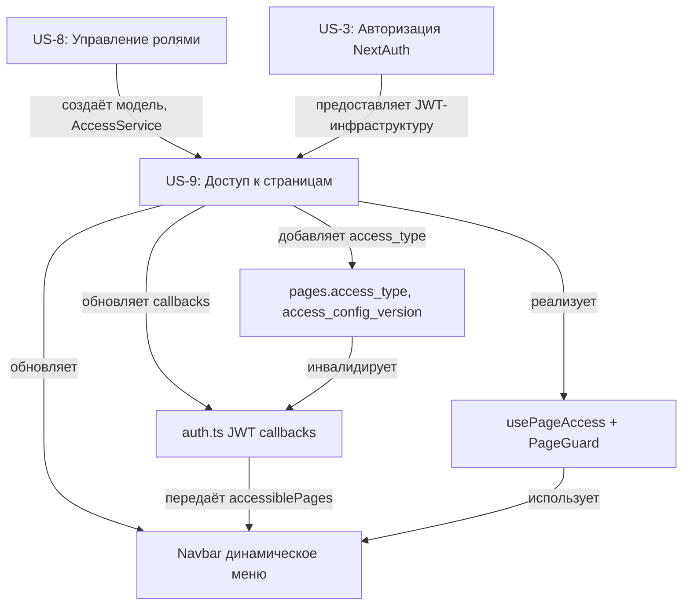

# US-9: Проверка доступа к страницам приложения

---

## Формулировка

**Как** авторизованный пользователь с определённой ролью,
**я хочу** видеть в навигационном меню только доступные мне страницы и получать понятный отказ при попытке зайти на недоступную страницу,
**чтобы** не сталкиваться с ошибками и понимать границы своих полномочий в системе.

---

## Контекст

**Проблема**: После внедрения ролевой модели (US-8) доступ к страницам настраивается через реестр `pages` и связи `role_pages`, но навигационное меню [`Navbar.tsx`](../../src/components/layouts/Navbar.tsx) остаётся захардкоженным: 6 пунктов для всех пользователей, включая страницы `/dashboard/votes`, `/dashboard/documents`, `/dashboard/bills`, которых не существует в реестре. Нет проверки доступа при прямом переходе по URL — пользователь может зайти на любую страницу, даже если у его роли нет прав. JWT хранит устаревшее поле `role` (строка), а не список ролей/страниц, что делает клиентскую проверку невозможной без дополнительного запроса.

**Решение**: Внедрить клиентскую проверку доступа через хук `usePageAccess(path)` и серверный механизм `AccessService.canAccessPage(userId, path)`. Навигационное меню строится динамически из доступных пользователю страниц (через `session.user.accessiblePages`). При прямом переходе на недоступную страницу — редирект на `/forbidden`. Для актуализации прав при изменении ролей/страниц — глобальная версия конфигурации (`access_config_version`), хранимая в JWT и сравниваемая при каждом запросе.

**Границы**:
- Входит: хук `usePageAccess(path)`; динамическое навигационное меню (из `session.user.accessiblePages`); страница `/forbidden` (403); обновление JWT callbacks (`auth.ts`) для хранения `accessVersion` и `accessiblePages`; инкремент `access_config_version` в сервисах US-8; поле `access_type` в `pages` (добавлено в модель US-9); таблица `access_config_version`; замена захардкоженного списка в `Navbar.tsx`
- НЕ входит: управление ролями и реестром страниц (US-8); защита API endpoints (US-8); аудит доступа; ролевая иерархия; временные доступы

---

## Модель данных

| Сущность | Описание |
|----------|----------|
| **Page** | Изменение: добавлено поле `access_type` (public/owner/role/super_admin, default `role`). Унификация с `api_endpoints` |
| **AccessConfigVersion** | Новая сущность: однострочная таблица глобальной версии конфигурации доступа. Инкрементируется при изменении ролей/страниц/endpoints/связей. Используется для инвалидации JWT-сессий |

> Полное описание сущностей см. в [`docs/model/entities/page.md`](../model/entities/page.md), [`docs/model/entities/access-config-version.md`](../model/entities/access-config-version.md). Фрагменты DBML/Prisma — в [`docs/model/schema-update-roles-notice.md`](../model/schema-update-roles-notice.md).

### Архитектурные правила проверки доступа (runtime)

- **SUPER_ADMIN**: при наличии у пользователя роли `SUPER_ADMIN` — полный доступ ко всем активным страницам (категорий `role`, `super_admin`). Реализуется в `AccessService.canAccessPage` без обращения к `role_pages`.
- **access_type=public**: страница доступна без авторизации. Меню не отображается (нет сессии), но прямой переход разрешён. Примеры: `/login`, `/register`, `/forbidden`.
- **access_type=owner**: страница требует `auth()`. Проверка владельца ресурса выполняется в компоненте/странице (не ролевая). Пример: `/profile`.
- **access_type=role**: страница требует `auth()` + наличие записи в `role_pages` для любой роли пользователя. Без записи — 403 (редирект на `/forbidden`). Примеры: `/dashboard`, `/dashboard/members`.
- **access_type=super_admin**: страница требует `auth()` + роль SUPER_ADMIN. Пример: `/dashboard/roles`.
- **is_active=false**: страница недоступна всем, включая SUPER_ADMIN. Скрыта из меню.
- **Новая страница по умолчанию закрыта**: при `access_type=role` без записей в `role_pages` — недоступна всем, кроме SUPER_ADMIN.
- **Инвалидация сессий**: при любом изменении в `roles`/`user_roles`/`pages`/`role_pages`/`api_endpoints`/`role_api_endpoints`/`is_active` — инкремент `access_config_version.version`. JWT callback сравнивает `token.accessVersion` с БД; при несовпадении — обновляет токен и список доступных страниц.

---

## Функциональные требования

### FR-1: Хук usePageAccess(path)
Хук `usePageAccess(path: string)` возвращает `{ hasAccess: boolean, isLoading: boolean }`. Проверка выполняется клиентски на основе `session.user.accessiblePages` (без дополнительного API-запроса). Если `isLoading=true` — компонент должен отображать состояние загрузки. Если `hasAccess=false` — компонент-обёртка выполняет `router.replace('/forbidden')`.

### FR-2: Динамическое навигационное меню
[`Navbar.tsx`](../../src/components/layouts/Navbar.tsx) строит меню из `session.user.accessiblePages` (массив объектов `{ path, title, groupName, sortOrder }`). Пункты группируются по `groupName` и сортируются по `sortOrder`. Захардкоженный массив `navigation` удаляется. Страницы с `access_type=public` и `is_active=false` не отображаются в меню.

### FR-3: Страница /forbidden (403)
Создаётся Client Component страница `/forbidden` с сообщением «Доступ запрещён» и кнопкой «На главную» (redirect на `/dashboard`). Страница имеет `access_type=public` (доступна без авторизации, т.к. redirect может прийти от неавторизованного пользователя).

### FR-4: Обновление JWT callbacks
Обновляются callbacks в [`auth.ts`](../../src/lib/auth.ts):
- **jwt callback**: если `token.accessVersion` отсутствует или не равен текущему значению `access_config_version.version` — обновить `token.accessVersion` и загрузить `token.accessiblePages` (список доступных страниц через `AccessService.getAccessiblePages(userId)`).
- **session callback**: передаёт `accessVersion` и `accessiblePages` из token в `session.user`.
- Удаляется поле `token.role` (и `session.user.role`) — заменяется на множественные роли через `user_roles`.

### FR-5: Инкремент access_config_version
При любом изменении в сервисах US-8 (RoleService, PageService, ApiEndpointService, RolePageService, RoleApiEndpointService, UserRoleService) — вызывается `accessConfigRepository.incrementVersion()` в той же транзакции. Инкремент НЕ выполняется при обновлении `description` (роль/страница/endpoint), `title`/`groupName`/`sortOrder` (страница) — эти поля не влияют на доступ.

### FR-6: Проверка access_type при доступе к странице
`AccessService.canAccessPage(userId, path)` проверяет:
1. Найти страницу по `path` в реестре `pages`
2. Если страница не найдена — `false` (страница не зарегистрирована)
3. Если `is_active=false` — `false`
4. Если `access_type=public` — `true` (доступ без авторизации)
5. Если пользователь не авторизован — `false` (для категорий owner/role/super_admin)
6. Если у пользователя есть роль `SUPER_ADMIN` и `access_type` в (`role`, `super_admin`) — `true`
7. Если `access_type=owner` — `true` (проверка владельца в компоненте)
8. Если `access_type=role` — проверить наличие записи в `role_pages` для любой роли пользователя
9. Если `access_type=super_admin` и пользователь не SUPER_ADMIN — `false`

### FR-7: Загрузка accessiblePages при рефреше сессии
При обнаружении устаревшего `accessVersion` в JWT callback — `AccessService.getAccessiblePages(userId)` возвращает массив активных страниц, к которым пользователь имеет доступ (по тем же правилам, что и `canAccessPage`). Включает страницы категорий `public`, `owner`, `role` (с доступом), `super_admin` (если SUPER_ADMIN). Результат сохраняется в `token.accessiblePages` и передаётся в `session.user.accessiblePages`.

### FR-8: Компонент-обёртка PageGuard
Создаётся компонент `<PageGuard>` (Client Component), оборачивающий содержимое страниц. Использует `usePageAccess(pathname)` и при `hasAccess=false` выполняет `router.replace('/forbidden')`. При `isLoading=true` отображает спиннер. Применяется в Dashboard Layout для всех страниц `/dashboard/*` и `/profile`.

### FR-9: Удаление захардкоженного меню
Из [`Navbar.tsx`](../../src/components/layouts/Navbar.tsx) удаляется массив `navigation` (6 пунктов: Dashboard, Члены СНТ, Участки, Голосования, Документы, Счета). Меню строится только из `session.user.accessiblePages`. Профиль остаётся отдельной ссылкой (как и ранее).

---

## Критерии приёмки

### AC-1: Доступ к странице по роли
- **Given** пользователь с ролью MEMBER, которому назначена страница `/dashboard/members` через `role_pages`
- **When** открывает `/dashboard/members`
- **Then** страница отображается, пункт «Члены СНТ» присутствует в меню

### AC-2: Запрет доступа к странице
- **Given** пользователь с ролью MEMBER, которому НЕ назначена страница `/dashboard/roles`
- **When** вводит `/dashboard/roles` в адресной строке
- **Then** выполняется редирект на `/forbidden`, отображается сообщение «Доступ запрещён» и кнопка «На главную»

### AC-3: Динамическое меню
- **Given** пользователь с ролью MEMBER имеет доступ к `/dashboard` и `/dashboard/members`
- **When** открывает любую страницу приложения
- **Then** в меню отображаются только «Дашборд» и «Члены СНТ» (отсортированные по `sortOrder`), пунктов «Участки», «Управление ролями» нет

### AC-4: SUPER_ADMIN видит все активные страницы
- **Given** пользователь с ролью SUPER_ADMIN
- **When** открывает `/dashboard`
- **Then** в меню отображаются все активные страницы из реестра, включая `/dashboard/roles`

### AC-5: Неактивная страница скрыта
- **Given** SUPER_ADMIN деактивировал страницу `/dashboard/members` (`is_active=false`) в US-8
- **When** открывает `/dashboard`
- **Then** пункт «Члены СНТ» отсутствует в меню, прямой переход на `/dashboard/members` → редирект на `/forbidden`

### AC-6: Инвалидация сессии при изменении ролей
- **Given** пользователь с ролью MEMBER имеет доступ к `/dashboard/members`
- **When** SUPER_ADMIN снимает назначение страницы `/dashboard/members` с роли MEMBER
- **Then** при следующем запросе пользователя `token.accessVersion` не совпадает с `access_config_version.version`, JWT обновляется, `accessiblePages` перезагружается, пункт «Члены СНТ» исчезает из меню

### AC-7: Публичная страница без авторизации
- **Given** неавторизованный пользователь
- **When** открывает `/login`
- **Then** страница отображается (access_type=public), редиректа нет

### AC-8: Страница /forbidden
- **Given** пользователь без прав на `/dashboard/roles` перенаправлен на `/forbidden`
- **When** видит страницу
- **Then** отображается сообщение «Доступ запрещён» и кнопка «На главную», при нажатии — редирект на `/dashboard`

### AC-9: Состояние загрузки
- **Given** пользователь открывает страницу, `usePageAccess` ещё не завершил проверку
- **When** `isLoading=true`
- **Then** отображается спиннер, контент страницы скрыт

### AC-10: Страница владельца /profile
- **Given** авторизованный пользователь открывает `/profile`
- **When** `access_type=owner`
- **Then** страница отображается (доступ через auth(), владелец — текущий пользователь)

### AC-11: Незарегистрированная страница
- **Given** пользователь открывает путь, которого нет в реестре `pages` (например `/dashboard/unknown`)
- **When** `AccessService.canAccessPage` не находит страницу
- **Then** выполняется редирект на `/forbidden`

### AC-12: Группировка меню
- **Given** в реестре есть страницы с `groupName` «Основное» и «Администрирование»
- **When** пользователь с доступом к обеим группам открывает меню
- **Then** пункты сгруппированы по `groupName`, внутри группы отсортированы по `sortOrder`

---

## Бизнес-правила и валидация

| ID | Правило | Валидация |
|----|---------|-----------|
| BR-1 | `access_type` страницы — из списка public, owner, role, super_admin; по умолчанию `role` | Zod — enum, default `role` |
| BR-2 | При `access_type=public` страница доступна без авторизации; `role_pages` игнорируются | Runtime — AccessService |
| BR-3 | При `access_type=owner` страница требует auth(); `role_pages` игнорируются; проверка владельца в компоненте | Runtime — AccessService |
| BR-4 | При `access_type=role` страница без записей в `role_pages` недоступна всем, кроме SUPER_ADMIN | Runtime — AccessService |
| BR-5 | При `access_type=super_admin` страница доступна только SUPER_ADMIN; `role_pages` игнорируются | Runtime — AccessService |
| BR-6 | При `is_active=false` страница недоступна всем, включая SUPER_ADMIN; скрыта из меню | Runtime — AccessService |
| BR-7 | SUPER_ADMIN имеет доступ ко всем активным страницам категорий `role`, `super_admin` через runtime-правило | Runtime — AccessService |
| BR-8 | Незарегистрированная страница (отсутствует в `pages`) — доступ запрещён, редирект на `/forbidden` | Runtime — AccessService |
| BR-9 | `access_config_version` — одна запись с `id=1`, `version` монотонно возрастает | DB — constraint + Runtime |
| BR-10 | Инкремент `version` при: создании/обновлении/удалении roles, user_roles, pages, role_pages, api_endpoints, role_api_endpoints, изменении is_active | Runtime — сервисы US-8 |
| BR-11 | Инкремент НЕ выполняется при: обновлении description (role/page/endpoint), title/groupName/sortOrder (page) | Runtime — сервисы US-8 |
| BR-12 | JWT хранит `accessVersion` (BigInt) и `accessiblePages` (массив объектов {path, title, groupName, sortOrder}) | Runtime — auth.ts jwt callback |
| BR-13 | При `token.accessVersion !== currentVersion` — токен обновляется, `accessiblePages` перезагружается из БД | Runtime — auth.ts jwt callback |
| BR-14 | Меню строится из `session.user.accessiblePages`; страницы с `access_type=public` и `is_active=false` не отображаются | Runtime — Navbar.tsx |
| BR-15 | Удаляется поле `token.role` и `session.user.role` — заменяется на множественные роли через `user_roles` | Runtime — auth.ts |

### Примеры валидаций
- **access_type**: enum `['public', 'owner', 'role', 'super_admin']` через Zod, default `'role'`
- **accessVersion**: BigInt, начальное `0`, инкремент через `UPDATE access_config_version SET version = version + 1 WHERE id = 1`
- **accessiblePages**: `z.array(z.object({ path: z.string(), title: z.string(), groupName: z.string().nullable(), sortOrder: z.number() }))`

---

## Граничные случаи (Edge Cases)

| # | Ситуация | Ожидаемое поведение |
|---|----------|---------------------|
| 1 | Пользователь без ролей открывает `/dashboard` | Редирект на `/forbidden` (нет записей в role_pages) |
| 2 | SUPER_ADMIN открывает неактивную страницу | Редирект на `/forbidden` (is_active=false — недоступна всем) |
| 3 | Одновременное изменение ролей двумя админами | Каждый инкремент version атомарный; сессии обоих админов обновятся при следующем запросе |
| 4 | Пользователь открывает страницу в момент обновления accessVersion | Текущая сессия использует старый accessiblePages до следующего запроса; при следующем — обновится |
| 5 | Пустой accessiblePages (пользователь без доступа ни к одной странице) | Меню пустое, открывается EmptyState или редирект на `/forbidden` при попытке зайти на `/dashboard` |
| 6 | Публичная страница (/login) в accessiblePages | Не включается в accessiblePages (нет сессии); при авторизованном доступе — тоже не в меню (public) |
| 7 | Прямой переход на `/forbidden` без предварительного редиректа | Страница отображается (access_type=public), кнопка «На главную» → `/dashboard` |
| 8 | JWT устарел на несколько инкрементов (version +5) | Однократное обновление при следующем запросе, accessiblePages актуализируется |
| 9 | Сессия истекла во время навигации | NextAuth редирект на `/login` (стандартное поведение) |
| 10 | Страница `/profile` (owner) — другой пользователь пытается открыть | Доступ через auth() разрешён, но компонент проверяет владельца и может показать 403 inline |

---

## Обработка ошибок

| Ситуация | Код HTTP / поведение | Доменная ошибка | Сообщение пользователю |
|----------|---------------------|-----------------|------------------------|
| Доступ к странице запрещён | Редирект 302 на `/forbidden` | — | (на странице /forbidden) «Доступ запрещён» |
| Страница не найдена в реестре | Редирект 302 на `/forbidden` | — (canAccessPage возвращает false) | «Доступ запрещён» |
| Неавторизованный доступ к защищённой странице | Редирект 302 на `/login` | — | (на /login) стандартный NextAuth |
| Сессия устарела (accessVersion не совпадает) | Автообновление токена | — | (прозрачно для пользователя) |
| Ошибка загрузки accessiblePages | 500, логирование | — | «Произошла ошибка. Попробуйте позже.» |
| Внутренняя ошибка сервера | 500 | — | «Произошла ошибка. Попробуйте позже.» |

---

## Влияние на слои архитектуры

### Модель данных
- [x] Изменение сущности: `Page` — добавлено поле `access_type` (public/owner/role/super_admin, default `role`)
- [x] Новая сущность: `AccessConfigVersion` (id, version, updated_at) — однострочная таблица
- [x] Обновить: [`docs/model/schema-update-roles-notice.md`](../model/schema-update-roles-notice.md) — DBML/Prisma для `access_type` в Page и новой таблицы `access_config_version`
- [x] Создать описание: [`docs/model/entities/access-config-version.md`](../model/entities/access-config-version.md)
- [x] Обновить: [`docs/model/entities/page.md`](../model/entities/page.md) — поле `access_type`, категории доступа, seed
- [x] Seed: `access_config_version` (id=1, version=0), обновлённый seed `pages` с access_type

### Repository
- [x] Новые методы `IAccessConfigRepository`:
  - `getCurrentVersion(): Promise<bigint>`
  - `incrementVersion(): Promise<void>` — `UPDATE ... SET version = version + 1`
- [x] Изменение `IPageRepository`: добавлен `access_type` в типы `CreatePageInput`/`UpdatePageInput`/`Page`

### Service
- [ ] Новые методы `AccessService` (расширение из US-8):
  - `canAccessPage(userId: string, path: string): Promise<boolean>` — проверка по правилам FR-6
  - `getAccessiblePages(userId: string): Promise<AccessiblePage[]>` — список для меню (FR-7)
- [ ] Изменение существующих сервисов US-8: вызов `accessConfigRepository.incrementVersion()` после мутаций (FR-5)
- [ ] Новые Zod-схемы: `accessTypeSchema` (enum), обновление `createPageSchema`/`updatePageSchema` (добавить accessType)
- [ ] Новых доменных ошибок не требуется — `canAccessPage` возвращает `boolean`, не бросает исключения. `PageNotFoundError` из US-8 используется при CRUD операциях.

### API
| Метод | Путь | Описание | Роль |
|-------|------|----------|------|
| GET | /api/v1/access/pages | Список доступных страниц для текущего пользователя | auth (любая роль) |

> Endpoint `/access/pages` используется fallback, если `session.user.accessiblePages` пуст (например, после первого входа до обновления токена). Основной механизм — через JWT.

> Управление `pages` (CRUD) и `access_config_version` — через API endpoints US-8 (super_admin).

### UI
| Компонент | Тип | Маршрут | Описание |
|-----------|-----|---------|----------|
| `usePageAccess` | Hook | — | Хук проверки доступа к странице по пути |
| `PageGuard` | Component | Переиспользуемый | Обёртка страниц, выполняющая редирект при запрете |
| `ForbiddenPage` | Page | `/forbidden` | Страница 403 с сообщением и кнопкой «На главную» |
| `Navbar` (обновлённый) | Layout | — | Динамическое меню из `session.user.accessiblePages` |
| `DashboardLayout` (обновлённый) | Layout | — | Оборачивает страницы в `<PageGuard>` |

---

## Нефункциональные требования

- **Производительность**:
  - Проверка `usePageAccess` — синхронная (из `session.user.accessiblePages`), < 1мс
  - Загрузка `accessiblePages` в JWT callback — < 100мс (с учётом кэширования)
  - Инкремент `access_config_version` — < 10мс (одна UPDATE-операция)
- **Безопасность**:
  - Проверка доступа выполняется на сервере в `AccessService.canAccessPage` (клиентский хук — только UX, не защита)
  - JWT содержит `accessVersion` — сравнение с БД при каждом запросе
  - При несовпадении — обновление токена и `accessiblePages` (без re-login)
  - Удаление поля `token.role`/`session.user.role` — заменяется на множественные роли
  - `/forbidden` — public, но не содержит конфиденциальных данных
- **UX**:
  - Состояние загрузки при проверке доступа (спиннер)
  - Меню обновляется без перезагрузки страницы (при обновлении сессии)
  - Понятное сообщение на `/forbidden` с кнопкой возврата
  - Адаптивная верстка меню
  - a11y: keyboard navigation, ARIA labels

---

## Открытые вопросы

| # | Вопрос | Допущение |
|---|--------|-----------|
| 1 | Кэшировать ли `access_config_version` в памяти процесса? | Да, с TTL 10 секунд — reduces DB load |
| 2 | Что делать, если `accessiblePages` пуст после обновления? | Редирект на `/forbidden` (у пользователя нет доступа ни к одной странице) |
| 3 | Показывать ли в меню страницы с `access_type=owner` (например /profile)? | Да, если пользователь авторизован — /profile в отдельной ссылке (как сейчас) |
| 4 | Middleware Next.js для серверной проверки до рендеринга? | Нет — клиентский PageGuard достаточен; серверная проверка в API endpoints (US-8) |
| 5 | Обновлять ли `accessVersion` при изменении `description` роли? | Нет — description не влияет на доступ (BR-11) |
| 6 | Хранить ли `roles` (массив названий) в JWT вместо `accessiblePages`? | Нет — `accessiblePages` эффективнее для меню; `roles` можно добавить при необходимости в будущем |

---

## Зависимости

> US-9 опирается на модель и `AccessService` из US-8. Добавляет `access_type` в `pages`, таблицу `access_config_version`, обновляет JWT callbacks и навигационное меню. US-8 и US-9 вместе формируют полную ролевую модель доступа приложения.

---

## История

| Дата | Автор | Действие |
|------|-------|----------|
| 2026-06-30 | Architect | Создание черновика |
