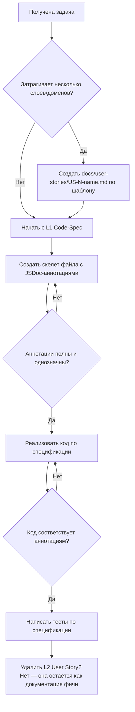

# 📋 ЧЕРНОВИК `.roo/rules/SPECS.md` — Правила управления спецификациями

---

## 1. Философия: Spec-in-Code

> **Принцип:** Спецификация компонента живёт в самом компоненте через JSDoc/TSDoc аннотации. Отдельные markdown-документы спецификаций создаются только для объектов, которые нельзя выразить в коде.

### Два уровня спецификаций

| Уровень | Носитель | Что описывает | Когда используется |
|---------|----------|---------------|-------------------|
| **L1: Code-Spec** | JSDoc/TSDoc в исходном коде | Контракты: типы, параметры, возвращаемые значения, выбрасываемые ошибки, инварианты | Обязательно для всех публичных API проекта |
| **L2: User Story** | Markdown в `docs/user-stories/` | Пользовательские истории, бизнес-потоки, acceptance criteria, edge cases, cross-cutting concerns | Только для фич, затрагивающих несколько слоёв/доменов |

> **Правило:** Если спецификацию можно выразить в JSDoc — она ДОЛЖНА быть в JSDoc. Markdown-файлы в `docs/user-stories/` создаются только когда JSDoc недостаточно.

### Зоны ответственности — что где описывается

| Артефакт | Где описан | Пример |
|----------|-----------|--------|
| Типы, интерфейсы, поля | L1 JSDoc | `@property {string} firstName - Имя члена СНТ` |
| Сигнатуры методов, возвращаемые значения | L1 JSDoc | `@returns Member[]`, `@throws MemberNotFoundError` |
| Инварианты отдельного компонента | L1 JSDoc `@spec` | `@spec - При isLoading=true: кнопка блокируется` |
| Бизнес-поток фичи | L2 User Story | AC-1: Given/When/Then |
| Валидация на уровне фичи | L2 User Story | BR-1: email уникален → Zod |
| Edge cases на уровне фичи | L2 User Story | Таблица граничных случаев |
| Обработка ошибок на уровне фичи | L2 User Story | Таблица HTTP-коды + доменные ошибки |
| Кросс-доменные зависимости | L2 User Story | Секция влияния на слои архитектуры |
| Модель данных | Отдельно: `docs/model/` | DBML + entity.md (см. MODEL.md) |

---

## 2. Рабочий процесс: Spec-First Development



### Порядок действий для ИИ-агента

1. **DISCOVER:** Проверить наличие User Story в `docs/user-stories/`
2. **PLAN:** Составить план реализации — какие файлы нужно создать/изменить
3. **SKELETON:** Создать файлы-скелеты с JSDoc-аннотациями — БЕЗ реализации
4. **REVIEW:** Убедиться, что аннотации полностью описывают контракт компонента
5. **IMPLEMENT:** Добавить код реализации, не меняя аннотации
6. **TEST:** Написать тесты, основываясь на аннотациях и User Story

---

## 3. Стандарты JSDoc-аннотаций по слоям

### 3.1. UI-компоненты — `src/components/`

Каждый публичный компонент обязан иметь:

```typescript
/**
 * @component ComponentName
 * @category ui | features
 * @description Краткое назначение компонента — 1-2 предложения
 *
 * @example
 * ```tsx
 * <ComponentName prop="value" />
 * ```
 *
 * @spec
 * - Состояния: [перечень визуальных состояний]
 * - Доступность: [a11y-требования]
 * - Зависимости: [внешние зависимости кроме React]
 */
```

**Для Props-интерфейса:**

```typescript
/**
 * @interface ComponentNameProps
 * @property {Type} propName - Описание свойства
 * @property {Type} optionalProp? - Описание [default: значение]
 */
```

#### Пример: Button до и после

**До — текущий код без спецификации:**
```typescript
export interface ButtonProps extends ButtonHTMLAttributes<HTMLButtonElement> {
  variant?: 'primary' | 'secondary' | 'danger' | 'ghost';
  size?: 'sm' | 'md' | 'lg';
  isLoading?: boolean;
}
```

**После — со спецификацией:**
```typescript
/**
 * @component Button
 * @category ui
 * @description Универсальная кнопка с вариантами оформления и состоянием загрузки
 *
 * @example
 * ```tsx
 * <Button variant="primary" size="md">Сохранить</Button>
 * <Button variant="danger" isLoading>Удаление...</Button>
 * ```
 *
 * @spec
 * - Состояния: default, hover, focus, disabled, loading
 * - Варианты: primary — основное действие, secondary — альтернатива, danger — деструктивное, ghost — контекстное
 * - Размеры: sm — компактный, md — стандартный, lg — акцентный
 * - Доступность: focus-ring обязателен, disabled через native attribute
 * - При isLoading=true: кнопка блокируется, показывается спиннер слева от текста
 */
export interface ButtonProps extends ButtonHTMLAttributes<HTMLButtonElement> {
  /** Вариант оформления кнопки @default 'primary' */
  variant?: 'primary' | 'secondary' | 'danger' | 'ghost';
  /** Размер кнопки @default 'md' */
  size?: 'sm' | 'md' | 'lg';
  /** Показывать ли индикатор загрузки. При true кнопка блокируется @default false */
  isLoading?: boolean;
}
```

### 3.2. Доменные типы — `src/domains/<domain>/<domain>.types.ts`

```typescript
/**
 * @type Member
 * @domain members
 * @description Член СНТ — основной субъект домена
 *
 * @spec
 * - Бизнес-ключ: нет натурального ключа, идентификация через id
 * - Жизненный цикл: создается активным, может быть деактивирован
 * - Инварианты: firstName и lastName обязательны и непусты
 *
 * @see docs/model/entities/member.md — концептуальная модель
 */
export interface Member {
  /** Уникальный идентификатор. Генерируется автоматически cuid */
  id: string;
  /** Ссылка на пользователя системы */
  userId: string;
  /** Имя — обязательно, непустое */
  firstName: string;
  /** Фамилия — обязательно, непустая */
  lastName: string;
  // ...каждое поле с описанием
}
```

### 3.3. Сервисы — `src/domains/<domain>/<domain>.service.ts`

```typescript
/**
 * @service MemberService
 * @domain members
 * @description Бизнес-логика управления членами СНТ
 *
 * @spec
 * - Валидация: через Zod-схемы из member.validators.ts
 * - Ошибки: MemberNotFoundError, MemberInvalidDataError, MemberDuplicateError
 * - Зависимости: IMemberRepository через DI
 */
export class MemberService {

  /**
   * Найти члена по идентификатору
   *
   * @param id - Уникальный идентификатор члена
   * @returns Полный объект Member
   * @throws {MemberNotFoundError} если член с данным id не найден
   *
   * @spec
   * - Возвращает полный объект Member без фильтрации полей
   * - Не кэширует результат
   */
  async findById(id: string): Promise<Member> { ... }
}
```

### 3.4. Репозитории — `src/domains/<domain>/<domain>.repository.interface.ts`

```typescript
/**
 * @interface IMemberRepository
 * @domain members
 * @description Контракт доступа к данным членов СНТ
 *
 * @spec
 * - Все методы асинхронные
 * - findById возвращает null если не найден — НЕ бросает ошибку
 * - create/update могут выбросить ошибку уникальности на уровне БД
 */
export interface IMemberRepository {
  /** Найти по ID. Возвращает null если не найден */
  findById(id: string): Promise<Member | null>;
  // ...
}
```

### 3.5. API Route Handlers — `src/app/api/v1/<resource>/route.ts`

```typescript
/**
 * @route GET /api/v1/members
 * @auth required
 * @description Возвращает список всех членов СНТ
 *
 * @response 200 { success: true, data: Member[] }
 * @response 500 { success: false, error: { code: string, message: string } }
 *
 * @spec
 * - Без пагинации в текущей реализации
 * - Возвращает всех членов включая неактивных
 */
export async function GET() { ... }

/**
 * @route POST /api/v1/members
 * @auth required
 * @description Создаёт нового члена СНТ
 *
 * @body CreateMemberData
 * @response 201 { success: true, data: Member }
 * @response 400 { success: false, error: { code: string, message: string } }
 * @response 409 { success: false, error: { code: string, message: string } }
 *
 * @spec
 * - Валидация тела запроса через Zod в сервисе
 * - При дублировании email возвращает 409
 */
export async function POST(request: NextRequest) { ... }
```

### 3.6. Страницы — `src/app/.../page.tsx`

```typescript
/**
 * @page /dashboard/members
 * @auth required
 * @role MEMBER, ADMIN
 * @description Страница списка членов СНТ
 *
 * @spec
 * - SSR: данные загружаются на сервере через API
 * - Пустое состояние: показывается EmptyState если список пуст
 * - Загрузка: через Suspense + loading.tsx
 * - Ошибки: через error.tsx
 *
 * @data-flow
 * - Server Component → fetch /api/v1/members → MemberList
 */
```

### 3.7. Хуки — `src/hooks/`

```typescript
/**
 * @hook useMemberList
 * @description Хук для загрузки и управления списком членов СНТ
 *
 * @spec
 * - Загружает данные при монтировании через apiClient
 * - Управляет состояниями: loading, error, data
 * - При ошибке повторяет запрос не более 3 раз
 *
 * @returns {Object} - Объект с полями data, isLoading, error, refetch
 */
```

### 3.8. Утилиты — `src/lib/`, `src/shared/utils/`

```typescript
/**
 * @function cn
 * @description Утилита для условного объединения CSS-классов. Обёртка над clsx + tailwind-merge
 *
 * @param {...ClassValue} inputs - Классы, условия, массивы классов
 * @returns {string} Объединённая строка классов
 *
 * @spec
 * - Разрешает конфликты Tailwind-классов через tailwind-merge
 * - Обрабатывает falsy-значения: null, undefined, false — игнорируются
 */
```

---

## 4. Custom JSDoc Tags — Реестр

| Тег | Слой | Назначение | Обязательность |
|-----|------|-----------|---------------|
| `@component` | UI | Имя компонента | Обязательно для компонентов |
| `@service` | Domain | Имя сервиса | Обязательно для сервисов |
| `@interface` | Domain | Имя интерфейса | Обязательно для интерфейсов |
| `@hook` | Hooks | Имя хука | Обязательно для хуков |
| `@function` | Utils | Имя функции | Обязательно для утилит |
| `@type` | Domain | Имя типа | Обязательно для доменных типов |
| `@route` | API | HTTP-метод + путь | Обязательно для route handlers |
| `@page` | Pages | URL маршрута | Обязательно для страниц |
| `@domain` | Domain | Принадлежность к домену | Обязательно для всех файлов домена |
| `@category` | UI | ui или features | Обязательно для компонентов |
| `@description` | Все | Краткое описание | Обязательно |
| `@spec` | Все | Спецификация поведения — маркированный список | Обязательно для нетривиальной логики |
| `@auth` | API, Pages | Требуется ли авторизация | Обязательно |
| `@role` | Pages | Допустимые роли | Условно — если есть авторизация |
| `@param` | Все | Параметр метода/функции | Обязательно для всех публичных методов |
| `@returns` | Все | Возвращаемое значение | Обязательно для всех публичных методов |
| `@throws` | Service, Repository | Выбрасываемые ошибки | Обязательно если метод может выбросить ошибку |
| `@response` | API | HTTP-ответ: статус + формат | Обязательно для route handlers |
| `@body` | API | Формат тела запроса | Обязательно для POST/PUT/PATCH |
| `@example` | UI | Пример использования | Рекомендовано для компонентов |
| `@see` | Все | Ссылка на связанный документ | Рекомендовано при наличии связей |
| `@data-flow` | Pages | Цепочка загрузки данных | Обязательно для страниц |
| `@default` | UI, Types | Значение по умолчанию | Рекомендовано для опциональных полей |

---

## 5. L2 User Story — связь с L1 Code-Spec

### Когда создавать User Story

User Story в `docs/user-stories/` создаётся ТОЛЬКО если выполняется хотя бы одно условие:

1. Фича затрагивает **2 и более доменов**
2. Фича включает сложный **бизнес-поток** со многими шагами и альтернативными ветками
3. Фича требует **acceptance criteria** в формате Given/When/Then
4. Фича затрагивает **внешние интеграции** — email, OAuth, платёжные системы

### Как User Story ссылается на Code-Spec

User Story НЕ дублирует информацию из JSDoc. Вместо этого она ссылается на L1:

**В секции «Влияние на слои архитектуры»** — вместо повторения сигнатур указывается файл и тег:

```markdown
### Service
- [ ] Новые методы: см. @service MemberService в src/domains/members/member.service.ts
- [x] Без изменений
```

**В секции «Бизнес-правила и валидация»** — вместо повторения полей указывается тип:

```markdown
| BR-1 | Email уникален | Zod + DB Constraint — см. @type CreateMemberData в member.types.ts |
```

### Чего НЕ должно быть в User Story

- ❌ Повторения типов, параметров, сигнатур — это в L1 JSDoc
- ❌ Описания модели данных — это в `docs/model/` (см. MODEL.md)
- ❌ Деталей реализации — это в коде

---

## 6. Связь с другими правилами

### С MODEL.md

- Модель данных — отдельный контур, управляемый через `docs/model/`
- JSDoc в доменных типах содержит **@see docs/model/entities/\<entity\>.md** для связи
- При изменении модели — сначала обновить `docs/model/`, потом обновить JSDoc в типах

### С architecture.md

- Правило SPEC-DRIVEN DEVELOPMENT уточняется:
  - L1 Code-Spec в JSDoc = спецификация компонента
  - L2 User Story в `docs/user-stories/` = спецификация фичи
- Пункт DISCOVER: проверить L2 в `docs/user-stories/`, затем L1 в JSDoc-аннотациях
- **Важно:** в architecture.md указан каталог `specs/`, но реально спецификации хранятся в `docs/user-stories/`. Требуется обновить architecture.md.

### С PROJECT.md

- EXECUTION PROTOCOL обновляется: шаг WRITE включает обязательный подшаг создания JSDoc-аннотаций перед реализацией

---

## 7. Обновление существующего кода

При рефакторинге или модификации существующего компонента:

1. **Если JSDoc отсутствует** — перед изменением кода добавить JSDoc-аннотации к текущему состоянию
2. **Если JSDoc есть** — обновить аннотации одновременно с кодом
3. **Запрещено** оставлять JSDoc неактуальным после изменения кода

---

## 8. Строгие запреты

- ❌ **Запрещено** реализовывать код без предшествующих JSDoc-аннотаций при создании новых файлов
- ❌ **Запрещено** дублировать информацию между L1 JSDoc и L2 User Story
- ❌ **Запрещено** создавать User Story для изолированного компонента одного домена — достаточно L1
- ❌ **Запрещено** оставлять аннотации без `@spec`-блока для нетривиальной логики
- ❌ **Запрещено** создавать отдельные markdown-файлы спецификаций для типов, сигнатур и контрактов — это должно быть в JSDoc
- ❌ **Запрещено** изменять поведение кода без обновления соответствующих JSDoc-аннотаций

---

## 9. Открытые вопросы для обсуждения

1. **Глубина @spec** — насколько детальным должно быть содержимое тега @spec? Минимальный порог?
2. **Генерация документации** — нужно ли настраивать TypeDoc для автогенерации, или достаточно JSDoc в IDE?
3. **Обратная совместимость** — аннотировать ли весь существующий код ретроактивно, или только новые и изменяемые файлы?
4. **Валидация** — добавлять ли lint-правило eslint-plugin-jsdoc для принудительного покрытия аннотациями?
5. **Скелет-режим** — стоит ли явно требовать создание файла с JSDoc + `throw new Error('Not implemented')` как артефакт шага SKELETON, или достаточно пустых функций?
6. **Каталог specs/** — architecture.md ссылается на `specs/`, но реально спецификации в `docs/user-stories/`. Обновить architecture.md чтобы ссылаться на `docs/user-stories/`?