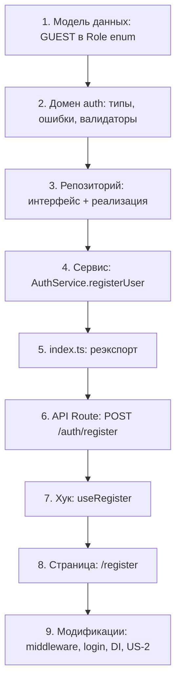

# План спецификаций US-2: Регистрация пользователя

## Согласованные решения

| # | Решение | Обоснование |
|---|---------|-------------|
| 1 | Роль при регистрации — **GUEST** | Требование FR-7; добавить в Prisma-схему и изменить default |
| 2 | Пакет хеширования — **bcryptjs** | Чистый JS, без нативной компиляции |
| 3 | Отдельный домен **auth** | Разделение ответственности: auth → аутентификация, members → бизнес-профиль |
| 4 | API-путь: **auth/register/route.ts** | Расширяемость: auth/login, auth/forgot-password в будущем |
| 5 | Хук **useRegister** | Инкапсуляция вызова apiClient из формы |
| 6 | Flash-сообщение на **/login** | Проверка `?registered=true` + зелёный alert |

---

## Порядок выполнения работ



---

## 1. Изменение модели данных

### 1.1. Prisma-схема: добавить GUEST в enum Role

**Файл:** `prisma/schema.prisma`

```prisma
enum Role {
  GUEST   // ← НОВОЕ: роль по умолчанию при регистрации
  MEMBER
  ADMIN
}
```

**Изменить default** в модели User:
```prisma
role  Role  @default(GUEST)  // было @default(MEMBER)
```

### 1.2. Концептуальная модель (по MODEL.md)

**Файл:** `docs/model/entities/user.md` — обновить описание Role
**Файл:** `docs/model/schema.dbml` — обновить DBML

### 1.3. Миграция

```bash
npx prisma migrate dev --name add_guest_role
```

---

## 2. Домен auth — Типы

### Файл: `src/domains/auth/auth.types.ts`

```typescript
/**
 * @type RegisterData
 * @domain auth
 * @description Данные для регистрации нового пользователя
 *
 * @spec
 * - Email: обязателен, приводится к нижнему регистру, обрезаются пробелы
 * - Пароль: обязателен, минимум 6 символов, пробелы в начале/конце НЕ обрезаются
 * - Подтверждение пароля: обязателено, должно совпадать с паролем
 *
 * @see docs/user-stories/US-2-registration.md — BR-1..BR-4
 */
export interface RegisterData {
  /** Email пользователя. Обязателен. Приводится к lowercase, обрезаются пробелы */
  email: string;
  /** Пароль. Обязателен, минимум 6 символов. Пробелы — часть пароля */
  password: string;
  /** Подтверждение пароля. Обязателено, должно совпадать с password */
  confirmPassword: string;
}

/**
 * @type UserData
 * @domain auth
 * @description Данные пользователя, возвращаемые после регистрации. Без пароля
 *
 * @spec
 * - Пароль никогда не включается в ответ API
 * - Роль при регистрации — всегда GUEST
 * - name — null при регистрации, заполняется позже через профиль
 *
 * @see docs/model/entities/user.md — концептуальная модель User
 */
export interface UserData {
  /** Уникальный идентификатор. Генерируется автоматически cuid */
  id: string;
  /** Email пользователя. Уникальный в системе */
  email: string;
  /** Имя пользователя. null при регистрации */
  name: string | null;
  /** Роль пользователя. GUEST при регистрации @default GUEST */
  role: 'GUEST' | 'MEMBER' | 'ADMIN';
  /** Дата создания учётной записи */
  createdAt: Date;
  /** Дата последнего обновления */
  updatedAt: Date;
}

/**
 * @type CreateUserInput
 * @domain auth
 * @description Внутренний тип для создания пользователя в БД. Содержит хеш пароля
 *
 * @spec
 * - Используется только внутри репозитория, не экспортируется в API
 * - passwordHash — результат bcrypt.hash
 * - email — уже lowercase и обрезан
 * - role — GUEST по умолчанию
 */
export interface CreateUserInput {
  /** Email. Уже приведён к lowercase, пробелы обрезаны */
  email: string;
  /** Хеш пароля. bcrypt hash с salt rounds = 10 */
  passwordHash: string;
  /** Имя. null при регистрации */
  name: null;
  /** Роль. GUEST при регистрации */
  role: 'GUEST';
}
```

---

## 3. Домен auth — Валидаторы

### Файл: `src/domains/auth/auth.validators.ts`

```typescript
/**
 * @function registerSchema
 * @domain auth
 * @description Zod-схема валидации данных регистрации пользователя
 *
 * @spec
 * - email: обязателен, строка, trim, lowercase, формат email через .email()
 * - password: обязателен, строка, минимум 6 символов, БЕЗ trim — пробелы часть пароля
 * - confirmPassword: обязателен, строка, должен совпадать с password через .refine()
 * - Ошибки валидации: пользовательские сообщения на русском языке
 *
 * @see docs/user-stories/US-2-registration.md — BR-1..BR-4, Edge Cases 2,3,4,6,7,8,10
 */
import { z } from 'zod';

export const registerSchema = z
  .object({
    email: z
      .string({ required_error: 'Email обязателен' })
      .trim()
      .toLowerCase()
      .email('Введите корректный email'),
    password: z
      .string({ required_error: 'Пароль обязателен' })
      .min(6, 'Пароль должен содержать минимум 6 символов'),
    confirmPassword: z
      .string({ required_error: 'Подтверждение пароля обязательно' }),
  })
  .refine((data) => data.password === data.confirmPassword, {
    message: 'Пароли не совпадают',
    path: ['confirmPassword'],
  });

export type RegisterInput = z.infer<typeof registerSchema>;
```

---

## 4. Домен auth — Ошибки

### Файл: `src/domains/auth/auth.errors.ts`

```typescript
/**
 * @type UserDuplicateError
 * @domain auth
 * @description Ошибка дублирования email при регистрации
 *
 * @spec
 * - Наследуется от ConflictError — HTTP 409
 * - Используется когда email уже зарегистрирован в системе
 *
 * @see docs/user-stories/US-2-registration.md — Edge Case 1, таблица ошибок
 */
import { ConflictError, ValidationError } from '@/shared/errors/index';

export class UserDuplicateError extends ConflictError {
  constructor(email: string) {
    super(`Пользователь с email ${email} уже зарегистрирован`);
    this.name = 'UserDuplicateError';
  }
}

/**
 * @type UserInvalidDataError
 * @domain auth
 * @description Ошибка валидации данных регистрации
 *
 * @spec
 * - Наследуется от ValidationError — HTTP 400
 * - Используется при невалидном email, коротком пароле, несовпадении паролей
 * - message содержит конкретную причину ошибки на русском языке
 *
 * @see docs/user-stories/US-2-registration.md — BR-1..BR-4, таблица ошибок
 */
export class UserInvalidDataError extends ValidationError {
  constructor(message: string) {
    super(message);
    this.name = 'UserInvalidDataError';
  }
}
```

---

## 5. Домен auth — Интерфейс репозитория

### Файл: `src/domains/auth/auth.repository.interface.ts`

```typescript
/**
 * @interface IAuthRepository
 * @domain auth
 * @description Контракт доступа к данным пользователей для аутентификации
 *
 * @spec
 * - Все методы асинхронные
 * - findByEmail возвращает null если не найден — НЕ бросает ошибку
 * - create может выбросить ошибку уникальности на уровне БД — P2002
 * - Работает с таблицей User, но только с полями нужными для auth
 *
 * @see docs/model/entities/user.md — концептуальная модель User
 */
import type { UserData, CreateUserInput } from './auth.types';

export interface IAuthRepository {
  /**
   * Найти пользователя по email
   *
   * @param email - Email пользователя. Ожидается lowercase
   * @returns UserData если найден, null если не найден
   *
   * @spec
   * - Поиск case-sensitive — email уже приведён к lowercase на уровне сервиса
   * - Возвращает все поля пользователя кроме пароля
   */
  findByEmail(email: string): Promise<UserData | null>;

  /**
   * Создать нового пользователя
   *
   * @param data - Данные для создания: email, passwordHash, name, role
   * @returns Созданный пользователь без пароля
   * @throws {PrismaError} при нарушении уникальности email — P2002
   *
   * @spec
   * - Возвращает UserData без пароля
   * - Может выбросить P2002 при дублировании email — обрабатывается в сервисе
   */
  create(data: CreateUserInput): Promise<UserData>;
}
```

---

## 6. Домен auth — Реализация репозитория

### Файл: `src/domains/auth/auth.repository.prisma.ts`

```typescript
/**
 * @class AuthRepository
 * @domain auth
 * @description Реализация IAuthRepository через Prisma Client
 *
 * @spec
 * - Использует singleton Prisma Client из infrastructure/prisma/client.ts
 * - Маппит Prisma-модель User в доменный тип UserData — без поля password
 * - При создании: поле password Prisma-модели = passwordHash из CreateUserInput
 * - Ошибка уникальности P2002 пробрасывается наверх для обработки в сервисе
 */
import type { IAuthRepository } from './auth.repository.interface';
import type { UserData, CreateUserInput } from './auth.types';
import { prisma } from '@/infrastructure/prisma/client';

export class AuthRepository implements IAuthRepository {
  /**
   * Найти пользователя по email
   *
   * @param email - Email пользователя. Ожидается lowercase
   * @returns UserData если найден, null если не найден
   */
  async findByEmail(email: string): Promise<UserData | null> {
    throw new Error('Not implemented');
  }

  /**
   * Создать нового пользователя
   *
   * @param data - Данные для создания с хешем пароля
   * @returns Созданный пользователь без пароля
   */
  async create(data: CreateUserInput): Promise<UserData> {
    throw new Error('Not implemented');
  }
}
```

---

## 7. Домен auth — Сервис

### Файл: `src/domains/auth/auth.service.ts`

```typescript
/**
 * @service AuthService
 * @domain auth
 * @description Бизнес-логика регистрации и аутентификации пользователей
 *
 * @spec
 * - Валидация: через Zod-схему registerSchema из auth.validators.ts
 * - Хеширование: bcrypt с salt rounds = 10
 * - Ошибки: UserDuplicateError, UserInvalidDataError
 * - Зависимости: IAuthRepository через DI
 * - Email приводится к lowercase и обрезается от пробелов ДО проверки уникальности
 * - Пароль НЕ обрезается — пробелы могут быть частью пароля
 * - При нарушении уникальности email на уровне БД — преобразует в UserDuplicateError
 *
 * @see docs/user-stories/US-2-registration.md — FR-4..FR-7, BR-1..BR-7
 */
import type { IAuthRepository } from './auth.repository.interface';
import type { RegisterData, UserData } from './auth.types';
import { registerSchema } from './auth.validators';
import { UserDuplicateError, UserInvalidDataError } from './auth.errors';
import bcrypt from 'bcryptjs';

/** Количество раундов salt для bcrypt */
const BCRYPT_SALT_ROUNDS = 10;

export class AuthService {
  constructor(private readonly repository: IAuthRepository) {}

  /**
   * Зарегистрировать нового пользователя
   *
   * @param data - Данные регистрации: email, password, confirmPassword
   * @returns Созданный пользователь без пароля
   * @throws {UserInvalidDataError} при ошибке валидации — невалидный email, короткий пароль, несовпадение
   * @throws {UserDuplicateError} если email уже зарегистрирован
   *
   * @spec
   * - Шаг 1: Валидация данных через registerSchema — Zod
   * - Шаг 2: Проверка уникальности email через repository.findByEmail
   * - Шаг 3: Хеширование пароля через bcrypt.hash — salt rounds = 10
   * - Шаг 4: Создание пользователя через repository.create — роль GUEST
   * - Если findByEmail нашёл пользователя — бросает UserDuplicateError
   * - Если bcrypt.hash выбросил ошибку — пробрасывается как есть — 500
   * - Если repository.create выбросил P2002 — преобразует в UserDuplicateError — race condition
   */
  async registerUser(data: unknown): Promise<UserData> {
    throw new Error('Not implemented');
  }
}
```

---

## 8. Домен auth — Реэкспорт

### Файл: `src/domains/auth/index.ts`

```typescript
/**
 * @domain auth
 * @description Публичный API домена аутентификации
 */
export { AuthService } from './auth.service';
export type { IAuthRepository } from './auth.repository.interface';
export type { RegisterData, UserData, CreateUserInput } from './auth.types';
export { UserDuplicateError, UserInvalidDataError } from './auth.errors';
export { registerSchema } from './auth.validators';
export type { RegisterInput } from './auth.validators';
```

---

## 9. API Route Handler

### Файл: `src/app/api/v1/auth/register/route.ts`

```typescript
/**
 * @route POST /api/v1/auth/register
 * @auth none
 * @description Регистрация нового пользователя в системе
 *
 * @body RegisterData — { email, password, confirmPassword }
 * @response 201 { success: true, data: UserData }
 * @response 400 { success: false, error: { code: string, message: string } }
 * @response 409 { success: false, error: { code: string, message: string } }
 * @response 500 { success: false, error: { code: string, message: string } }
 *
 * @spec
 * - Валидация тела запроса через Zod в AuthService
 * - При дублировании email возвращает 409 с UserDuplicateError
 * - При невалидных данных возвращает 400 с UserInvalidDataError
 * - Пароль НЕ возвращается в ответе — UserData не содержит password
 * - Внутренняя ошибка сервера — 500 с общим сообщением
 *
 * @see docs/user-stories/US-2-registration.md — FR-4, FR-5, таблица ошибок
 */
import { NextRequest, NextResponse } from 'next/server';
import { createAuthService } from '@/di/container';
import type { BaseError } from '@/shared/errors';

export async function POST(request: NextRequest) {
  throw new Error('Not implemented');
}
```

---

## 10. Хук useRegister

### Файл: `src/hooks/useRegister.ts`

```typescript
/**
 * @hook useRegister
 * @description Хук для регистрации нового пользователя через API
 *
 * @spec
 * - Вызывает apiClient.post /auth/register с данными формы
 * - Управляет состояниями: isLoading, error, isSuccess
 * - При успехе: перенаправление на /login?registered=true через router.push
 * - При ошибке 409: устанавливает error = сообщение о дублировании email
 * - При ошибке 400: устанавливает error = сообщение о валидации
 * - При ошибке 500: устанавливает error = общая ошибка
 * - Блокирует повторную отправку через isLoading
 *
 * @returns {Object} - Объект с полями:
 *   - register(data: RegisterData): Promise<void> — функция регистрации
 *   - isLoading: boolean — состояние загрузки
 *   - error: string | null — сообщение ошибки
 *   - isSuccess: boolean — признак успешной регистрации
 *
 * @see docs/user-stories/US-2-registration.md — FR-8, FR-10, AC-10
 */
```

---

## 11. Страница регистрации

### Файл: `src/app/(public)/register/page.tsx`

```typescript
/**
 * @page /register
 * @auth none
 * @description Страница регистрации нового пользователя
 *
 * @spec
 * - Client Component: использует хук useRegister для управления состоянием
 * - Поля формы: email, пароль, подтверждение пароля
 * - Валидация на клиенте: перед отправкой проверяются все поля
 *   - email: заполнен, формат email
 *   - пароль: заполнен, минимум 6 символов
 *   - подтверждение: заполнено, совпадает с паролем
 * - Ошибки валидации отображаются под соответствующими полями — inline
 * - Общая ошибка от сервера: alert в верхней части формы
 * - Состояние загрузки: кнопка заблокирована, показывается спиннер
 * - После успеха: редирект на /login?registered=true
 * - Авторизованные пользователи: редирект на /dashboard — через middleware
 * - Ссылка «Уже есть аккаунт? Войти» → /login
 * - a11y: правильные label, autocomplete, focus management
 * - Адаптивная верстка: мобильные и десктоп
 *
 * @data-flow
 * - Client Component → useRegister → apiClient.post /auth/register → /login?registered=true
 *
 * @see docs/user-stories/US-2-registration.md — FR-1..FR-3, FR-8..FR-10, AC-1..AC-10
 */
```

---

## 12. Модификации существующих файлов

### 12.1. Middleware — добавить /register в публичные маршруты

**Файл:** `src/middleware.ts`

Изменить строку:
```typescript
// Было:
const isPublicPath = nextUrl.pathname === '/' || nextUrl.pathname === '/login';

// Стало:
const isPublicPath = nextUrl.pathname === '/' || nextUrl.pathname === '/login' || nextUrl.pathname === '/register';
```

### 12.2. Страница /login — flash-сообщение

**Файл:** `src/app/(public)/login/page.tsx`

Добавить после `const callbackUrl = ...`:
```typescript
const isRegistered = searchParams.get('registered') === 'true';
```

Добавить в JSX перед формой — зелёный alert:
```tsx
{isRegistered && (
  <div className="rounded-md bg-green-50 p-4 mb-4">
    <div className="text-sm text-green-800">
      Регистрация успешна! Войдите в систему, используя свои данные.
    </div>
  </div>
)}
```

### 12.3. DI Container — добавить AuthService

**Файл:** `src/di/container.ts`

```typescript
import { AuthService } from '@/domains/auth/auth.service';
import { AuthRepository } from '@/domains/auth/auth.repository.prisma';
import type { IAuthRepository } from '@/domains/auth/auth.repository.interface';

export function createAuthService(): AuthService {
  const repository: IAuthRepository = new AuthRepository();
  return new AuthService(repository);
}

// Добавить в Container:
// private authService: AuthService | null = null;
// getAuthService(): AuthService { ... }
```

### 12.4. US-2 — исправить BR-6 и AC-2

**Файл:** `docs/user-stories/US-2-registration.md`

- BR-6: «При регистрации назначается роль **GUEST**» — было MEMBER
- AC-2: «с хешированным паролем и ролью **GUEST**» — было MEMBER

---

## 13. Установка зависимостей

```bash
npm install bcryptjs
npm install -D @types/bcryptjs
```

---

## Сводная таблица файлов

| # | Файл | Действие | Приоритет |
|---|------|----------|-----------|
| 1 | `prisma/schema.prisma` | Изменить: GUEST в Role, default GUEST | 1 |
| 2 | `docs/model/entities/user.md` | Обновить: описание Role | 1 |
| 3 | `docs/model/schema.dbml` | Обновить: DBML | 1 |
| 4 | `src/domains/auth/auth.types.ts` | **Создать** скелет | 2 |
| 5 | `src/domains/auth/auth.validators.ts` | **Создать** скелет | 2 |
| 6 | `src/domains/auth/auth.errors.ts` | **Создать** скелет | 2 |
| 7 | `src/domains/auth/auth.repository.interface.ts` | **Создать** скелет | 2 |
| 8 | `src/domains/auth/auth.repository.prisma.ts` | **Создать** скелет | 3 |
| 9 | `src/domains/auth/auth.service.ts` | **Создать** скелет | 3 |
| 10 | `src/domains/auth/index.ts` | **Создать** скелет | 3 |
| 11 | `src/app/api/v1/auth/register/route.ts` | **Создать** скелет | 4 |
| 12 | `src/hooks/useRegister.ts` | **Создать** скелет | 5 |
| 13 | `src/app/(public)/register/page.tsx` | **Создать** скелет | 5 |
| 14 | `src/middleware.ts` | Изменить: добавить /register | 6 |
| 15 | `src/app/(public)/login/page.tsx` | Изменить: flash-сообщение | 6 |
| 16 | `src/di/container.ts` | Изменить: AuthService | 6 |
| 17 | `docs/user-stories/US-2-registration.md` | Изменить: BR-6, AC-2 | 7 |