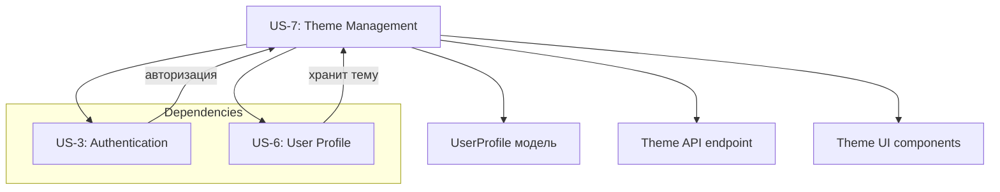

# US-7: Управление темой оформления профиля — Спецификации компонентов

## Обзор задачи

Реализация функциональности выбора и управления темой оформления приложения для авторизованных пользователей.

---

## 1. Модель данных

### 1.1 Концептуальная модель

Файл: `docs/model/entities/user-profile.md`

**Изменения:**
- Добавлено поле `theme` в таблицу `user_profiles`
- Добавлен бизнес-инвариант BR-1 и BR-2
- Обновлены конвенции именования

**Статус:** ✅ Выполнено

### 1.2 Физическая модель

Файл: `prisma/schema.prisma`

**Изменения:**
```prisma
model UserProfile {
  // ... существующие поля
  theme  String  @default("light") @map("theme")
  // ... остальные поля
}
```

**Статус:** ⏳ Требуется обновление

### 1.3 DBML схема

Файл: `docs/model/schema.dbml`

**Изменения:**
```dbml
Table user_profiles {
  // ... существующие поля
  theme        varchar       [not null, default: 'light']
  // ... остальные поля
}
```

**Статус:** ⏳ Требуется обновление

---

## 2. Репозиторий

### 2.1 Интерфейс репозитория

Файл: `src/domains/userProfile/userProfile.repository.interface.ts`

**Необходимые изменения:**

1. Обновить интерфейс `IUserProfileRepository`:
   - Добавить метод `updateTheme(userId: string, theme: Theme): Promise<Theme>`
   - Обновить типы возвращаемых методов `findById`, `findByUserId`, `findAll` — добавить поле `theme`
   - Обновить тип `findWithUser` и `findOrCreateWithUser` — добавить поле `theme`

**Скелет метода updateTheme:**
```typescript
/**
 * Обновить тему оформления пользователя
 * @param userId - Уникальный идентификатор пользователя
 * @param theme - Новая тема оформления
 * @returns Обновленная тема
 * @throws {UserProfileNotFoundError} если профиль не найден
 */
updateTheme(userId: string, theme: Theme): Promise<Theme>;
```

**Статус:** ⏳ Требуется создание скелета

### 2.2 Реализация репозитория

Файл: `src/domains/userProfile/userProfile.repository.prisma.ts`

**Необходимые изменения:**
1. Реализовать метод `updateTheme` с использованием Prisma
2. Обновить типы возвращаемых данных для соответствия новым интерфейсам

**Скелет метода updateTheme:**
```typescript
async updateTheme(userId: string, theme: Theme): Promise<Theme> {
  throw new Error('Not implemented');
}
```

**Статус:** ⏳ Требуется создание скелета

---

## 3. Валидаторы

Файл: `src/domains/userProfile/userProfile.validators.ts`

**Необходимые изменения:**

1. Добавить экспорт типа `Theme` из `userProfile.types.ts`
2. Создать Zod-схему для валидации темы:

```typescript
/**
 * @domain userProfile
 * @description Zod-схема для валидации темы оформления
 *
 * @spec
 * - Допустимые значения: 'light', 'dark', 'green' (BR-1)
 * - Используется для валидации входных данных при смене темы
 */
export const themeSchema = z.enum(['light', 'dark', 'green'], {
  errorMap: () => ({ message: 'Допустимые значения: light, dark, green' }),
});

/**
 * @domain userProfile
 * @description Zod-схема для обновления темы
 */
export const updateThemeSchema = z.object({
  theme: themeSchema,
});

/**
 * @domain userProfile
 * @description Тип входных данных для обновления темы
 */
export type UpdateThemeInput = z.infer<typeof updateThemeSchema>;
```

**Статус:** ⏳ Требуется создание скелета

---

## 4. Ошибки

Файл: `src/domains/userProfile/userProfile.errors.ts`

**Необходимые изменения:**

Добавить новую ошибку:

```typescript
/**
 * @domain userProfile
 * @description Ошибка: неверная тема оформления
 *
 * @spec
 * - Код ошибки: THEME_INVALID
 * - HTTP статус: 400
 * - Сообщение: тема должна быть одним из значений: light, dark, green
 */
export class ThemeInvalidError extends ValidationError {
  constructor(theme: string) {
    super(`Invalid theme: ${theme}. Must be one of: light, dark, green`);
  }
}
```

**Статус:** ⏳ Требуется создание скелета

---

## 5. Сервис

Файл: `src/domains/userProfile/userProfile.service.ts`

**Необходимые изменения:**

1. Импортировать новые типы и ошибки:
   - `Theme`, `UpdateThemeInput` из `userProfile.types.ts`
   - `ThemeInvalidError` из `userProfile.errors.ts`
   - `updateThemeSchema` из `userProfile.validators.ts`

2. Добавить метод `updateTheme`:

```typescript
/**
 * @service UserProfileService
 * @domain userProfile
 * @description Обновить тему оформления пользователя
 *
 * @param userId - ID пользователя
 * @param theme - Новая тема оформления
 * @returns Обновленная тема
 * @throws {ThemeInvalidError} если тема неверна
 * @throws {UserProfileNotFoundError} если профиль не найден
 *
 * @spec
 * - Валидация через updateThemeSchema (BR-1)
 * - Сохранение в БД через repository.updateTheme
 * - Мгновенное применение на клиенте (BR-6)
 */
async updateTheme(userId: string, theme: Theme): Promise<Theme> {
  throw new Error('Not implemented');
}
```

**Статус:** ⏳ Требуется создание скелета

---

## 6. API Route Handlers

Файл: `src/app/api/v1/profile/route.ts`

**Необходимые изменения:**

### 6.1 Обновить GET /api/v1/profile

- Добавить поле `theme` в ответ API
- Убедиться, что `UserProfileFull` содержит поле `theme`

### 6.2 Добавить PATCH /api/v1/profile/theme

```typescript
/**
 * @route PATCH /api/v1/profile/theme
 * @auth required
 * @description Обновить тему оформления текущего пользователя
 *
 * @body UpdateThemeInput
 * @response 200 { success: true, data: { theme: Theme } }
 * @response 400 { success: false, error: { code: 'THEME_INVALID', message: string } }
 * @response 401 { success: false, error: { code: 'UNAUTHORIZED', message: string } }
 * @response 404 { success: false, error: { code: 'USER_PROFILE_NOT_FOUND', message: string } }
 *
 * @spec
 * - Валидация через updateThemeSchema
 * - Обновление через service.updateTheme
 * - Возвращает обновленную тему
 */
export async function PATCH(request: NextRequest) {
  throw new Error('Not implemented');
}
```

**Статус:** ⏳ Требуется создание скелета

---

## 7. UI Компоненты

### 7.1 ThemeSelector компонент

Файл: `src/components/features/userProfile/ThemeSelector/ThemeSelector.tsx`

**Назначение:** Компонент выбора темы с визуальным превью для страницы профиля

```typescript
/**
 * @component ThemeSelector
 * @category features
 * @description Компонент выбора темы оформления с визуальным превью
 *
 * @example
 * ```tsx
 * <ThemeSelector 
 *   currentTheme="light"
 *   onThemeChange={(theme) => setTheme(theme)}
 * />
 * ```
 *
 * @spec
 * - Отображает 3 варианта тем: light, dark, green
 * - Текущая тема выделена как выбранная
 * - При наведении отображается превью (AC-6)
 * - При выборе вызывает onThemeChange
 * - Анимация перехода между темами (нефункциональное требование)
 */
interface ThemeSelectorProps {
  /** Текущая выбранная тема */
  currentTheme: Theme;
  /** Обработчик изменения темы */
  onThemeChange: (theme: Theme) => void;
  /** Показывать ли индикатор загрузки */
  isLoading?: boolean;
}

export function ThemeSelector({ currentTheme, onThemeChange, isLoading = false }: ThemeSelectorProps) {
  throw new Error('Not implemented');
}
```

**Статус:** ⏳ Требуется создание

### 7.2 ThemeToggle компонент

Файл: `src/components/features/userProfile/ThemeToggle/ThemeToggle.tsx`

**Назначение:** Компонент быстрого переключения темы в навбаре

```typescript
/**
 * @component ThemeToggle
 * @category features
 * @description Кнопка быстрого переключения темы в навбаре
 *
 * @example
 * ```tsx
 * <ThemeToggle 
 *   currentTheme="light"
 *   onThemeChange={(theme) => setTheme(theme)}
 * />
 * ```
 *
 * @spec
 * - Отображает иконку текущей темы
 * - При клике переключает тему по кругу: light → dark → green → light (AC-3)
 * - При загрузке показывает индикатор
 * - При успехе показывает уведомление
 * - Доступность: aria-label, keyboard navigation
 */
interface ThemeToggleProps {
  /** Текущая выбранная тема */
  currentTheme: Theme;
  /** Обработчик изменения темы */
  onThemeChange: (theme: Theme) => void;
  /** Показывать ли индикатор загрузки */
  isLoading?: boolean;
}

export function ThemeToggle({ currentTheme, onThemeChange, isLoading = false }: ThemeToggleProps) {
  throw new Error('Not implemented');
}
```

**Статус:** ⏳ Требуется создание

### 7.3 Хук useTheme

Файл: `src/hooks/useTheme.ts`

**Назначение:** Хук для управления темой на клиенте

```typescript
/**
 * @hook useTheme
 * @description Хук для управления темой оформления
 *
 * @spec
 * - При монтировании получает текущую тему из UserProfile
 * - При изменении вызывает API для сохранения
 * - Синхронизирует тему между вкладками через storage event (Edge Case 6)
 * - Учитывает системные настройки при первом входе (AC-5, AC-7)
 * - Мгновенное применение темы на клиенте (BR-6)
 *
 * @returns {Object} - Объект с полями
 *   - theme: Текущая тема
 *   - updateTheme: Функция для изменения темы
 *   - isLoading: Статус загрузки
 *   - error: Ошибка если есть
 */
export function useTheme() {
  throw new Error('Not implemented');
}
```

**Статус:** ⏳ Требуется создание

---

## 8. Страницы

### 8.1 ProfilePage

Файл: `src/app/(dashboard)/profile/page.tsx`

**Необходимые изменения:**

1. Импортировать `ThemeSelector` компонент
2. Добавить секцию выбора темы в интерфейс профиля
3. Использовать `useTheme` хук для управления темой

```typescript
/**
 * @page /profile
 * @auth required
 * @description Страница профиля пользователя с настройками темы
 *
 * @spec
 * - AC-1: Отображает секцию "Тема оформления" с 3 вариантами
 * - AC-1: Текущая тема выделена как выбранная
 * - AC-1: Каждый вариант показывает визуальное превью
 * - AC-2: При сохранении обновляется в БД
 * - AC-2: Интерфейс мгновенно переключается
 * - AC-2: Отображается уведомление "Тема сохранена"
 */
export default function ProfilePage() {
  throw new Error('Not implemented');
}
```

**Статус:** ⏳ Требуется обновление

### 8.2 AppLayout

Файл: `src/components/layouts/AppLayout.tsx`

**Необходимые изменения:**

1. Импортировать `ThemeToggle` компонент
2. Добавить `ThemeToggle` в навбар
3. Передавать текущую тему через `useTheme` хук

**Статус:** ⏳ Требуется обновление

### 8.3 Navbar

Файл: `src/components/layouts/Navbar.tsx`

**Необходимые изменения:**

1. Импортировать `ThemeToggle` компонент
2. Добавить `ThemeToggle` в правую часть навбара (рядом с LogoutButton)

**Статус:** ⏳ Требуется обновление

---

## 9. Глобальные стили

Файл: `src/app/globals.css`

**Необходимые изменения:**

Добавить CSS-переменные для каждой темы:

```css
/* Светлая тема (default) */
:root {
  --background: #ffffff;
  --foreground: #171717;
  --primary: #4f46e5;
  --primary-foreground: #ffffff;
  --muted: #f5f5f5;
  --muted-foreground: #737373;
  --border: #e5e5e5;
}

/* Тёмная тема */
[data-theme="dark"] {
  --background: #171717;
  --foreground: #fafafa;
  --primary: #818cf8;
  --primary-foreground: #171717;
  --muted: #262626;
  --muted-foreground: #a3a3a3;
  --border: #404040;
}

/* Зелёная тема */
[data-theme="green"] {
  --background: #f0fdf4;
  --foreground: #166534;
  --primary: #16a34a;
  --primary-foreground: #ffffff;
  --muted: #dcfce7;
  --muted-foreground: #15803d;
  --border: #bbf7d0;
}
```

**Статус:** ⏳ Требуется создание

---

## 10. Список файлов для изменения

### Обновляемые файлы:
1. `docs/model/schema.dbml` - DBML схема (через редактор)
2. `prisma/schema.prisma` - Добавить поле theme
3. `src/domains/userProfile/userProfile.types.ts` - Добавить Theme тип
4. `src/domains/userProfile/userProfile.repository.interface.ts` - Добавить updateTheme метод
5. `src/domains/userProfile/userProfile.repository.prisma.ts` - Реализовать updateTheme
6. `src/domains/userProfile/userProfile.validators.ts` - Добавить themeSchema, updateThemeSchema
7. `src/domains/userProfile/userProfile.errors.ts` - Добавить ThemeInvalidError
8. `src/domains/userProfile/userprofile.service.ts` - Добавить updateTheme метод
9. `src/app/api/v1/profile/route.ts` - Добавить PATCH endpoint
10. `src/app/(dashboard)/profile/page.tsx` - Добавить ThemeSelector
11. `src/components/layouts/AppLayout.tsx` - Добавить ThemeToggle
12. `src/components/layouts/Navbar.tsx` - Добавить ThemeToggle
13. `src/app/globals.css` - Добавить CSS переменные для тем

### Новые файлы:
1. `src/components/features/userProfile/ThemeSelector/ThemeSelector.tsx`
2. `src/components/features/userProfile/ThemeSelector/index.ts`
3. `src/components/features/userProfile/ThemeToggle/ThemeToggle.tsx`
4. `src/components/features/userProfile/ThemeToggle/index.ts`
5. `src/hooks/useTheme.ts`

---

## 11. Порядок реализации

### Этап 1: Модель данных
1. Обновить `docs/model/schema.dbml`
2. Обновить `prisma/schema.prisma`
3. Выполнить миграцию: `npx prisma migrate dev --name add_theme_to_user_profiles`

### Этап 2: Доменные типы и валидация
1. Обновить `userProfile.types.ts` - добавить Theme
2. Обновить `userProfile.validators.ts` - добавить схемы валидации
3. Обновить `userProfile.errors.ts` - добавить ThemeInvalidError

### Этап 3: Репозиторий
1. Обновить `userProfile.repository.interface.ts` - добавить интерфейс
2. Обновить `userProfile.repository.prisma.ts` - реализовать

### Этап 4: Сервис
1. Обновить `userProfile.service.ts` - добавить метод

### Этап 5: API
1. Обновить `api/v1/profile/route.ts` - добавить PATCH endpoint

### Этап 6: UI компоненты
1. Создать `ThemeSelector` компонент
2. Создать `ThemeToggle` компонент
3. Создать `useTheme` хук

### Этап 7: Страницы и layout
1. Обновить `ProfilePage`
2. Обновить `AppLayout`
3. Обновить `Navbar`

### Этап 8: Стили
1. Обновить `globals.css` - добавить CSS переменные

---

## 12. Критерии приёмки

### AC-1: Отображение выбора темы в профиле
- [ ] Компонент `ThemeSelector` отображается на странице `/profile`
- [ ] Отображаются 3 варианта тем
- [ ] Текущая тема выделена
- [ ] Есть визуальное превью при наведении

### AC-2: Изменение темы через профиль
- [ ] При выборе и сохранении тема обновляется в БД
- [ ] Интерфейс мгновенно переключается
- [ ] Отображается уведомление

### AC-3: Быстрое переключение через навбар
- [ ] Компонент `ThemeToggle` отображается в навбаре
- [ ] Клик переключает тему по кругу
- [ ] Изменение сохраняется в БД

### AC-4: Применение темы ко всем страницам
- [ ] CSS-переменные применяются глобально
- [ ] Смена темы видна на всех страницах

### AC-5: Учёт системных настроек
- [ ] При первом входе учитывается prefers-color-scheme
- [ ] Если dark → theme dark, иначе light

### AC-6: Предпросмотр темы
- [ ] При наведении показывается превью

### AC-7: Системные настройки в браузере
- [ ] Первый вход с тёмной темой если системная настройка dark

---

## 13. Бизнес-правила

| ID | Правило | Реализация |
|----|---------|-----------|
| BR-1 | Тема: light/dark/green | Zod enum в updateThemeSchema |
| BR-2 | Default: light | Prisma default, CSS default |
| BR-3 | Сохранение в UserProfile | API endpoint + DB |
| BR-4 | Применение ко всем страницам | CSS переменные |
| BR-5 | Учёт системной темы | useTheme при первой загрузке |
| BR-6 | Мгновенное применение | React state + CSS |

---

## 14. Граничные случаи

| № | Ситуация | Обработка |
|---|----------|-----------|
| 1 | Нет профиля | Создать с theme='light' (AC-5) |
| 2 | Удалена тема из БД | Использовать default 'light' |
| 3 | Ошибка БД | Показать ошибку пользователю |
| 4 | Неизвестное значение | Использовать default 'light' |
| 5 | Медленное соединение | Блокировка кнопки, индикатор загрузки |
| 6 | Несколько вкладок | Storage event listener |
| 7 | Нет интернета | Показать ошибку, пробовать позже |
| 8 | JS отключён | Текстовый выбор |

---

## 15. Зависимости



---

## 16. Отклонения от спецификаций

- **Режим Architect** не может редактировать TypeScript файлы — только .md
- Для реализации необходимо переключиться в режим **Code**
- Файл DBML схемы редактируется вручную вне Git
