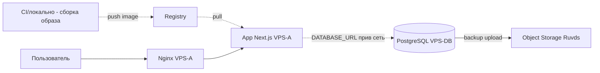
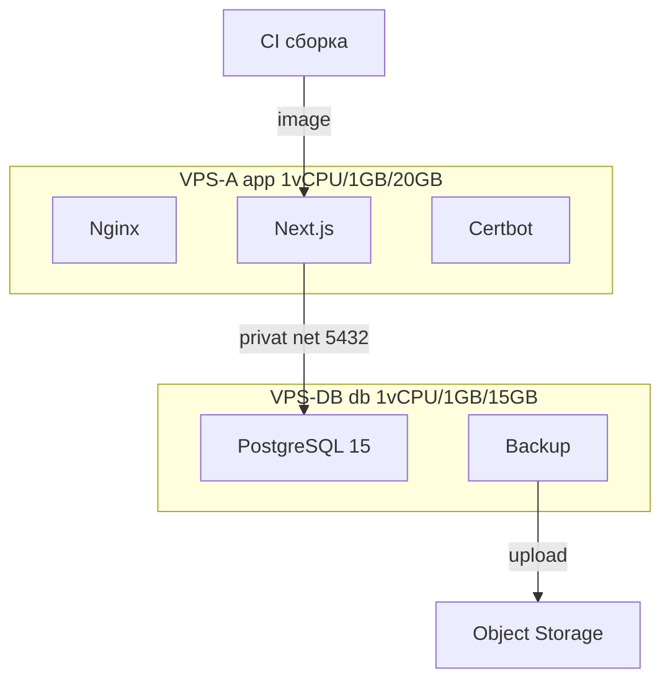

# План публикации приложения СНТ «Берёзки-НТ» — двухсерверная архитектура с минимизацией стоимости (Ruvds)

## 1. Итоговые решения

| Параметр | Решение |
|---|---|
| Хостинг | Ruvds, 2 VPS в одной приватной сети + Object Storage |
| Домен | `snt-berezki-nt.ru` |
| **VPS-A (app)** | 1 vCPU / 1 ГБ ОЗУ / 20 ГБ SSD — Next.js, nginx, certbot |
| **VPS-DB (db)** | 1 vCPU / 1 ГБ ОЗУ / 15 ГБ SSD — PostgreSQL + backup |
| Сборка образа | **На CI/локально**, на VPS-A грузится готовый образ (снимает потребность в памяти на сервере) |
| Бэкапы | **Во внешнее объектное хранилище** (Ruvds Object Storage / S3-совместимое), на локальном диске не хранятся |
| Связь app↔db | Приватная сеть Ruvds (internal IP), публичный 5432 закрыт |
| Стек | Docker Compose (раздельно на каждом VPS) + Let's Encrypt |
| WebSocket | НЕ входит на первом этапе |
| Деплой | Ручной pull + загрузка образа на VPS-A → `docker compose up -d` |
| Обновление | Простой restart-деплой (допустим небольшой простой) |
| Откат | Перезапуск предыдущего образа + восстановление из Object Storage |

---

## 2. Целевая архитектура

Распределение сервисов:

---

## 3. Ключевые изменения относительно текущего стека

Текущий [`docker-compose.prod.yml`](docker-compose.prod.yml:4) объединяет всё на одном хосте с `db` на `127.0.0.1:5432`. Для 2-VPS с минимальной стоимостью нужны правки:

1. **App compose** (VPS-A) — сервисы `app`, `nginx`, `certbot`. `db` отсутствует.
2. **DB compose** (VPS-DB) — сервисы `db`, `backup`. Отдельный compose-файл на VPS-DB.
3. **DATABASE_URL** в `.env` VPS-A → на internal IP VPS-DB: `postgresql://snt_user:...@<INTERNAL_IP_DB>:5432/snt_db?schema=public`.
4. **Postgres** на VPS-DB слушает только приватный интерфейс; `pg_hba.conf` ограничен IP VPS-A; публичный 5432 закрыт.
5. **Сборка образа — на CI/локально.** Dockerfile используется там, результат пушится в registry. VPS-A содержит только рантайм-контейнеры.
6. **Бэкапы** — в Object Storage, локально не накапливаются.

---

## 4. Этап 0 — Предподготовка

- [ ] Домен `snt-berezki-nt.ru` зарегистрирован и оплачен.
- [ ] Настроить доступ к DNS-записям у регистратора.
- [ ] Выбрать Object Storage (Ruvds Object Storage / S3-совместимое) и подготовить bucket + ключи доступа `AWS_ACCESS_KEY_ID`/`AWS_SECRET_ACCESS_KEY`.
- [ ] Выбрать Container Registry (Docker Hub / Ruvds CR / GHCR) и подготовить учётные данные.

## 5. Этап 1 — Покупка и приватная сеть VPS на Ruvds

- [ ] Создать **VPS-A (app)**: 1 vCPU / 1 ГБ ОЗУ / 20 ГБ SSD, Debian 12 или Ubuntu 22.04.
- [ ] Создать **VPS-DB (db)**: 1 vCPU / 1 ГБ ОЗУ / 15 ГБ SSD, Debian 12 или Ubuntu 22.04.
- [ ] Подключить оба VPS к **одной приватной сети Ruvds** (internal IP).
- [ ] Настроить SSH-ключи, отключить парольный вход root.
- [ ] Добавить swap: VPS-A 2 ГБ, VPS-DB 1 ГБ.
- [ ] Порты: VPS-A — 22, 80, 443; VPS-DB — 22 (5432 только внутри приватной сети).

## 6. Этап 2 — Базовая настройка серверов и CI-сборка

- [ ] Обновить системы, установить Docker + Compose v2 на оба VPS.
- [ ] Пользователь `deploy` в группе `docker` на обоих серверах.
- [ ] UFW: VPS-A (22/80/443), VPS-DB (22 + приватный интерфейс 5432; публичный 5432 запрещён).
- [ ] **Настроить CI (GitHub Actions)**: на коммит в main → `docker build -f Dockerfile` → push в registry. Либо: локальный скрипт сборки/публикации образа.
- [ ] Проверить связность VPS-A ↔ VPS-DB по приватной сети (`ping`/`pg_isready` после поднятия БД).

## 7. Этап 3 — Настройка DNS

- [ ] A-запись `@` и `www` → публичный IP VPS-A.
- [ ] Дождаться распространения (`dig/nslookup`).

## 8. Этап 4 — Развёртывание кода на VPS-A

- [ ] Клонировать репозиторий: `git clone <repo> /opt/snt-app` на VPS-A (только конфигурационные файлы compose/nginx/.env).
- [ ] Создать `.env` VPS-A:
  - `DATABASE_URL=postgresql://snt_user:ПАРОЛЬ@<INTERNAL_IP_DB>:5432/snt_db?schema=public`
  - `NEXTAUTH_URL=https://snt-berezki-nt.ru`
  - `NEXTAUTH_SECRET` и `WS_INTERNAL_SECRET` = `openssl rand -base64 32`
  - `DOMAIN=snt-berezki-nt.ru`, `ACME_EMAIL`
  - `NEXT_PUBLIC_APP_NAME`, `NEXT_PUBLIC_APP_DESCRIPTION` (встраиваются в build на CI)
  - `IMAGE=<registry>/snt-app:<tag>` (образ из registry)

## 9. Этап 5 — PostgreSQL на VPS-DB и бэкапы в Object Storage

- [ ] Создать `docker-compose.db.yml` и `.env` на VPS-DB:
  - `POSTGRES_USER=snt_user`, `POSTGRES_PASSWORD=<надёжный>`, `POSTGRES_DB=snt_db`
  - Postgres слушает на internal IP приватной сети.
- [ ] Запустить БД: `docker compose -f docker-compose.db.yml up -d`.
- [ ] Настроить `pg_hba.conf`: только internal IP VPS-A.
- [ ] **Настроить бэкапы в Object Storage**: сервис backup делает `pg_dump` → gzip → `rclone s3:/bucket/...` (или скрипт с `aws s3 cp`). Локально бэкапы не накапливаются.
- [ ] Проверить загрузку тестового бэкапа в Object Storage.
- [ ] Проверить доступ с VPS-A: `pg_isready -h <INTERNAL_IP_DB> -p 5432` и подключение Prisma.

> ⚠️ Секреты (пароль БД) передаются только через `.env`; никогда в коде/репозитории.

## 10. Этап 6 — Запуск app на VPS-A (образ из registry)

- [ ] Правка [`docker-compose.prod.yml`](docker-compose.prod.yml:4): убрать сервис `db`, убрать `build:` (используется `image:` из registry), убрать `depends_on: db`. Оставить `app`, `nginx`, `certbot`.
- [ ] Правка [`nginx/default.conf`](nginx/default.conf:8): `server_name snt-berezki-nt.ru;` в обоих server-блоках.
- [ ] `docker login` на VPS-A к registry.
- [ ] Запуск: `docker compose -f docker-compose.prod.yml pull && docker compose -f docker-compose.prod.yml up -d`.
- [ ] Миграции: `docker compose exec app npx prisma migrate deploy` (на удалённую БД).
- [ ] Проверить health: `curl http://localhost:3000/api/health` (ожидать `db: ok`).
- [ ] Валидация: `docker compose -f docker-compose.prod.yml config`.

## 11. Этап 7 — SSL/Let's Encrypt

- [ ] Выпустить сертификат: `docker compose -f docker-compose.prod.yml run --rm certbot`.
- [ ] Перезагрузка nginx: `docker compose exec -T nginx nginx -t && docker compose exec -T nginx nginx -s reload`.
- [ ] Проверка: `curl -I https://snt-berezki-nt.ru/` → 200; `http://` → 301.

## 12. Этап 8 — Автопродление (cron) и экономия диска

- [ ] VPS-A: cron 03:00 — certbot renew + reload nginx (лог `/var/log/certbot-renew.log`).
- [ ] VPS-DB: cron 02:00 — backup в Object Storage (лог `/var/log/db-backup.log`).
- [ ] Регулярная очистка: `docker image prune -af` по cron на обоих VPS (экономия ~1-2 ГБ).
- [ ] Задокументировать восстановление из Object Storage.

## 13. Этап 9 — Инициализация данных

- [ ] Применить сид с VPS-A: `docker compose exec app npx prisma db seed` ([`prisma/seed.ts`](../../prisma/seed.ts)).
- [ ] Создать начального администратора/председателя.
- [ ] Проверить вход через NextAuth на боевом URL.

## 14. Этап 10 — Финальная проверка и приёмка (QA)

- [ ] Healthcheck app (VPS-A) и db (VPS-DB).
- [ ] Проверка регистрации/входа/выхода.
- [ ] Проверка RBAC-страниц (дашборд, участки, общение, документы).
- [ ] Проверка HTTPS, редиректа, отсутствия mixed-content.
- [ ] Проверка загрузки/скачивания файлов (лимит MAX_FILE_SIZE).
- [ ] Проверка восстановления из бэкапа Object Storage.
- [ ] Smoke-тест Playwright против прод-URL (опционально).

## 15. Этап 11 — Процедура обновления и отката

- [ ] CI/локально собирает новый образ (тег, например `vX.Y`) и пушит в registry.
- [ ] На VPS-A: сменить `IMAGE` тег в `.env` → `docker compose pull app && docker compose up -d app` → проверить health/логи.
- [ ] Миграции применяются в CMD app-контейнера автоматически (`npx prisma migrate deploy && node server.js`) — либо через отдельный шаг, если требуется порядок.
- [ ] Откат app: вернуть предыдущий тег образа + `up -d`.
- [ ] Откат/восстановление БД: скачать бэкап из Object Storage и восстановить psql.

## 16. Риски и ограничения

- `NEXT_PUBLIC_*` встраиваются в build — их изменение требует пересборки на CI.
- **Обязательна CI/локальная сборка** — на VPS-A нет ресурсов для `next build` (1 ГБ ОЗУ).
- Сборка на CI должна проходить в том же контексте (build args `NEXT_PUBLIC_*`).
- Object Storage — отдельный платный сервис; бэкапы зависят от доступности хранилища.
- Postgres на 1 ГБ ОЗУ работает, но менее производителен; при росте нагрузки потребуется увеличение.
- Известная проблема миграции `remove_members_and_payments` — требует ручного вмешательства.
- WebSocket вне скоупа — чаты/уведомления реального времени не работают на первом этапе.
- Единственная точка отказа — связь VPS-A↔VPS-DB по приватной сети.

## 17. Итоговые артефакты

- [ ] Домен `snt-berezki-nt.ru` + DNS.
- [ ] 2 VPS в приватной сети Ruvds + Object Storage + registry.
- [ ] CI-сборка образа (или локальный скрипт).
- [ ] Сертификаты Let's Encrypt + автопродление.
- [ ] Бэкапы БД в Object Storage с восстановлением.
- [ ] Начальные данные (роли, админ).
- [ ] Проверенный прод-URL `https://snt-berezki-nt.ru`.
