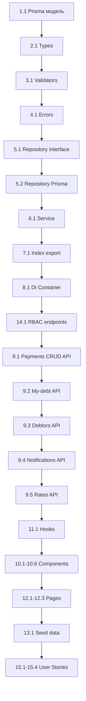

# План реализации: Уведомления о задолженности по взносам (Payments Domain)

> **Шаблон используется для декомпозиции на технические задачи по слоям архитектуры.**
> Статусы задач: `[TODO]` → `[IN PROGRESS]` → `[DONE]`

---

## 📋 Метаданные

| Параметр | Значение |
|----------|----------|
| **Domain** | `payments` |
| **Название** | Уведомления о задолженности по взносам |
| **Версия плана** | `v1.0` |
| **Дата создания** | `2026-07-21` |
| **Статус** | `[NOT STARTED]` |
| **Зависит от** | `REQ-AUTH-001` (аутентификация), `REQ-PLOT-001` (участки), `REQ-PLOTUSER-001` (связи пользователей с участками) |

---

## 📎 Ссылки

- **Требования:** [`docs/requirements/REQ-PAYMENTS-001.md`](../docs/requirements/REQ-PAYMENTS-001.md)
- **Модель данных:** `docs/model/entities/payment.md` (создать)
- **Шаблон реализации:** [`docs/skills/implement-domain.md`](../docs/skills/implement-domain.md)
- **API endpoint rules:** [`docs/rules/api-endpoint-rules.md`](../docs/rules/api-endpoint-rules.md)

---

## 📁 Дерево файлов

```
src/
├── domains/
│   └── payments/                          # 🆕 Новый домен
│       ├── index.ts                       # 🆕 Re-export
│       ├── payment.types.ts               # 🆕 Типы сущностей
│       ├── payment.validators.ts          # 🆕 Zod-схемы валидации
│       ├── payment.errors.ts              # 🆕 Классы доменных ошибок
│       ├── payment.repository.interface.ts # 🆕 Интерфейс репозитория
│       ├── payment.repository.prisma.ts   # 🆕 Prisma-реализация репозитория
│       └── payment.service.ts             # 🆕 Бизнес-логика
│
├── app/api/v1/
│   └── payments/
│       ├── route.ts                       # 🆕 GET (список), POST (создание)
│       ├── [id]/route.ts                  # 🆕 GET, PATCH, DELETE
│       ├── my-debt/route.ts              # 🆕 GET (задолженность текущего пользователя)
│       ├── debtors/route.ts              # 🆕 GET (список должников для админа)
│       ├── notifications/route.ts        # 🆕 POST (создание уведомлений)
│       └── rates/
│           ├── route.ts                   # 🆕 GET, POST (ставки)
│           └── [id]/route.ts              # 🆕 PATCH (ставка)
│
├── di/
│   └── container.ts                       # ✏️ Регистрация PaymentService
│
├── components/
│   └── features/
│       └── payments/
│           ├── MyDebtCard.tsx             # 🆕 Карточка задолженности садовода
│           ├── DebtorsTable.tsx           # 🆕 Таблица должников (админ)
│           ├── PaymentForm.tsx            # 🆕 Форма создания/редактирования платежа
│           ├── PaymentHistoryTable.tsx    # 🆕 Таблица истории платежей
│           ├── ContributionRateForm.tsx   # 🆕 Форма ставки взноса
│           ├── NotificationButton.tsx     # 🆕 Кнопка отправки уведомлений
│           └── index.ts                   # 🆕 Re-export
│
├── hooks/
│   └── usePayments.ts                    # 🆕 Хук для работы с платежами
│
├── app/dashboard/
│   └── payments/
│       ├── page.tsx                       # 🆕 Страница "Мои взносы"
│       ├── admin/page.tsx                # 🆕 Страница "Управление взносами" (админ)
│       └── rates/page.tsx                # 🆕 Страница "Ставки взносов" (админ)
│
prisma/
└── schema.prisma                          # ✏️ Добавить модели Payment, ContributionRate

docs/
├── model/
│   ├── schema.dbml                        # ✏️ Добавить таблицы payments, contribution_rates
│   └── entities/
│       └── payment.md                     # 🆕 Описание сущности Payment
├── requirements/
│   └── README.md                          # ✏️ Добавить REQ-PAYMENTS-001 в реестр
└── user-stories/
    ├── US-36-01-prosmotr-zadolzhennosti.md     # 🆕
    ├── US-36-02-upravlenie-platezhami.md       # 🆕
    ├── US-36-03-stavki-vznosov.md              # 🆕
    └── US-36-04-uvvedomleniya-dolzhnikov.md    # 🆕
```

---

## 📦 Задачи по слоям

---

### 1. Модель данных (Prisma + DBML)

#### Задача 1.1: Добавить модель Payment в Prisma schema

| Параметр | Значение |
|----------|----------|
| **ID** | `PAY-T1.1` |
| **Статус** | `[TODO]` |
| **Файлы** | `prisma/schema.prisma`, `docs/model/schema.dbml`, `docs/model/entities/payment.md` |
| **Действие** | Изменить (schema.prisma), Изменить (schema.dbml), Создать (payment.md) |

**Целевое состояние:**

- В `prisma/schema.prisma` добавлена модель `Payment` и модель `ContributionRate`
- В `docs/model/schema.dbml` добавлены соответствующие таблицы
- Создан `docs/model/entities/payment.md` с описанием сущности

**Чек-лист:**

- [ ] Добавлен enum `PaymentType` (`MEMBERSHIP_FEE`, `TARGET_FEE`, `PENALTY`)
- [ ] Добавлен enum `PaymentStatus` (`PAID`, `PENDING`, `OVERDUE`, `CANCELLED`)
- [ ] Добавлена модель `Payment` со всеми полями согласно спецификации
- [ ] Добавлена модель `ContributionRate` с уникальной парой (year, type)
- [ ] Настроены связи: User → Payment, Plot → Payment, User → ContributionRate
- [ ] Использован `@map()` для snake_case маппинга
- [ ] Установлен `@@index` для частых запросов (userId, plotId, year, is_deleted)
- [ ] Обновлён `docs/model/schema.dbml`
- [ ] Создан `docs/model/entities/payment.md`
- [ ] Создана миграция: `npx prisma migrate dev --name "add-payments-domain"`

---

### 2. Types (Доменные типы)

#### Задача 2.1: Определить типы Payment, CreatePaymentData, UpdatePaymentData, PaymentFilter

| Параметр | Значение |
|----------|----------|
| **ID** | `PAY-T2.1` |
| **Статус** | `[TODO]` |
| **Файл** | `src/domains/payments/payment.types.ts` |
| **Действие** | Создать |

**Целевое состояние:**

- Определены интерфейсы: `Payment`, `CreatePaymentData`, `UpdatePaymentData`, `PaymentFilter`
- Определены типы: `PaymentType`, `PaymentStatus`
- Определены интерфейсы: `ContributionRate`, `CreateContributionRateData`, `UpdateContributionRateData`
- Определён интерфейс: `DebtInfo` (year, type, totalDue, totalPaid, balance)
- Определён интерфейс: `DebtorInfo` (userId, userName, plotNumber, debtAmount)

**Чек-лист:**

- [ ] `PaymentType` — союзный тип литералов
- [ ] `PaymentStatus` — союзный тип литералов
- [ ] `Payment` — полный интерфейс с JSDoc-аннотациями
- [ ] `CreatePaymentData` — для создания платежа
- [ ] `UpdatePaymentData` — все поля опциональны
- [ ] `PaymentFilter` — фильтры по userId, plotId, year, type, status
- [ ] `ContributionRate`, `CreateContributionRateData`, `UpdateContributionRateData`
- [ ] `DebtInfo`, `DebtorInfo` — для расчёта задолженности
- [ ] Все интерфейсы с JSDoc-аннотациями (`@type`, `@domain`, `@spec`)

---

### 3. Validators (Zod-схемы)

#### Задача 3.1: Создать Zod-схемы для платежей и ставок

| Параметр | Значение |
|----------|----------|
| **ID** | `PAY-T3.1` |
| **Статус** | `[TODO]` |
| **Файл** | `src/domains/payments/payment.validators.ts` |
| **Действие** | Создать |

**Целевое состояние:**

- Определены схемы: `createPaymentSchema`, `updatePaymentSchema`, `debtFilterSchema`
- Определены схемы: `createRateSchema`, `updateRateSchema`, `notificationSchema`
- Валидация всех полей с сообщениями на русском языке

**Чек-лист:**

- [ ] `createPaymentSchema`: amount (positive, Decimal), type (enum), year (int, >2000), plotId, userId, dueDate
- [ ] `updatePaymentSchema`: все поля опциональны, status может быть изменён
- [ ] `debtFilterSchema`: year опционально
- [ ] `createRateSchema`: year (int), type (enum), amountPerPlot (positive Decimal)
- [ ] `updateRateSchema`: amountPerPlot опционально, isActive опционально
- [ ] `notificationSchema`: debtorIds (массив userId), message (string)
- [ ] JSDoc-аннотации (`@schema`, `@domain`, `@spec`)

---

### 4. Errors (Доменные ошибки)

#### Задача 4.1: Создать классы ошибок для домена payments

| Параметр | Значение |
|----------|----------|
| **ID** | `PAY-T4.1` |
| **Статус** | `[TODO]` |
| **Файл** | `src/domains/payments/payment.errors.ts` |
| **Действие** | Создать |

**Целевое состояние:**

- Определены классы ошибок, наследующиеся от базовых ошибок в `@/shared/errors`

**Чек-лист:**

- [ ] `PaymentNotFoundError` extends `NotFoundError`
- [ ] `PaymentInvalidDataError` extends `ValidationError`
- [ ] `PaymentAccessDeniedError` extends `ForbiddenError`
- [ ] `RateNotFoundError` extends `NotFoundError`
- [ ] `RateDuplicateError` extends `ConflictError` (дубликат year+type)
- [ ] `DebtCalculationError` extends `BusinessRuleError`
- [ ] Все классы с JSDoc-аннотациями (`@error`, `@domain`)

---

### 5. Repository (Интерфейс + Реализация)

#### Задача 5.1: Определить интерфейс репозитория IPaymentRepository

| Параметр | Значение |
|----------|----------|
| **ID** | `PAY-T5.1` |
| **Статус** | `[TODO]` |
| **Файл** | `src/domains/payments/payment.repository.interface.ts` |
| **Действие** | Создать |

**Целевое состояние:**

- Определён интерфейс `IPaymentRepository` с методами для работы с платежами и ставками

**Чек-лист:**

- [ ] CRUD для Payment: findAll, findById, findByUser, findByPlot, create, update, delete (soft)
- [ ] `findByUserAndYear(userId, year)` — платежи пользователя за год
- [ ] `findByPlotAndYear(plotId, year)` — платежи по участку за год
- [ ] `findDebtors(year)` — все должники за указанный год (с агрегацией)
- [ ] CRUD для ContributionRate: findAll, findById, findByYearAndType, create, update
- [ ] `findActiveRatesByYear(year)` — активные ставки за год
- [ ] JSDoc-аннотации (`@interface`, `@domain`, `@spec`)

#### Задача 5.2: Реализовать PaymentRepositoryPrisma

| Параметр | Значение |
|----------|----------|
| **ID** | `PAY-T5.2` |
| **Статус** | `[TODO]` |
| **Файл** | `src/domains/payments/payment.repository.prisma.ts` |
| **Действие** | Создать |

**Целевое состояние:**

- Реализован `PaymentRepositoryPrisma`, имплементирующий `IPaymentRepository`
- Использует DI: принимает опциональный PrismaClient через конструктор
- Soft delete — установка флага `isDeleted = true`, `deletedAt`, `deletedBy`

**Чек-лист:**

- [ ] Все методы интерфейса реализованы
- [ ] Паттерн DI (опциональный PrismaClient через конструктор)
- [ ] Типы из `@prisma/client` распаковываются в доменные типы
- [ ] Soft delete корректно обрабатывается (фильтрация `is_deleted = false` для обычных запросов)
- [ ] Обработка ошибок Prisma (P2002 → RateDuplicateError)
- [ ] JSDoc-аннотации

---

### 6. Service (Бизнес-логика)

#### Задача 6.1: Реализовать PaymentService

| Параметр | Значение |
|----------|----------|
| **ID** | `PAY-T6.1` |
| **Статус** | `[TODO]` |
| **Файл** | `src/domains/payments/payment.service.ts` |
| **Действие** | Создать |

**Целевое состояние:**

- Реализован `PaymentService` с полной бизнес-логикой
- Валидация через Zod-схемы
- Расчёт задолженности по формуле: задолженность = ставка - сумма оплаченных платежей

**Чек-лист:**

- [ ] `findMyDebt(userId)` — возвращает `DebtInfo[]` для всех участков пользователя
  - Получает участки пользователя через `PlotUserRoleRepository`
  - Для каждого участка за каждый год рассчитывает задолженность
- [ ] `findAllDebtors(year?)` — возвращает `DebtorInfo[]` для администратора
- [ ] `createPayment(data)` — создание платежа (админ)
- [ ] `updatePayment(id, data)` — обновление платежа
- [ ] `softDeletePayment(id, deletedBy)` — мягкое удаление
- [ ] `findPayments(filter)` — поиск платежей с фильтрацией
- [ ] `findPaymentById(id, requestingUserId)` — с проверкой прав доступа
- [ ] CRUD для ContributionRate
- [ ] `sendNotifications(debtorIds, message)` — создание записей для уведомлений
- [ ] Проверка прав доступа: владелец видит только свои платежи
- [ ] JSDoc-аннотации (`@service`, `@domain`, `@spec`)

---

### 7. Export (index.ts)

#### Задача 7.1: Создать публичный API домена

| Параметр | Значение |
|----------|----------|
| **ID** | `PAY-T7.1` |
| **Статус** | `[TODO]` |
| **Файл** | `src/domains/payments/index.ts` |
| **Действие** | Создать |

**Целевое состояние:**

- Re-export всех типов, схем, ошибок, сервиса и репозитория

**Чек-лист:**

- [ ] Re-export типов
- [ ] Re-export валидаторов
- [ ] Re-export ошибок
- [ ] Re-export интерфейса репозитория
- [ ] Re-export реализации репозитория
- [ ] Re-export сервиса

---

### 8. DI Container

#### Задача 8.1: Зарегистрировать PaymentService в DI-контейнере

| Параметр | Значение |
|----------|----------|
| **ID** | `PAY-T8.1` |
| **Статус** | `[TODO]` |
| **Файл** | `src/di/container.ts` |
| **Действие** | Изменить |

**Целевое состояние:**

- В контейнере зарегистрирован `PaymentService` через фабричную функцию
- `Container` содержит `getPaymentService()` метод

**Чек-лист:**

- [ ] Добавлен import `PaymentService` и `PaymentRepositoryPrisma`
- [ ] Добавлена фабричная функция `createPaymentService()`
- [ ] Добавлен приватный `paymentService` в классе `Container`
- [ ] Добавлен метод `getPaymentService()` с lazy initialization
- [ ] Обновлён метод `getContainer()` (если требуется)

---

### 9. API Routes

#### Задача 9.1: Реализовать API endpoints для платежей

| Параметр | Значение |
|----------|----------|
| **ID** | `PAY-T9.1` |
| **Статус** | `[TODO]` |
| **Файлы** | `src/app/api/v1/payments/route.ts`, `src/app/api/v1/payments/[id]/route.ts` |
| **Действие** | Создать |

**Целевое состояние:**

- `GET /api/v1/payments` — список платежей (с фильтрацией, ADMIN)
- `POST /api/v1/payments` — создание платежа (ADMIN)
- `GET /api/v1/payments/:id` — детали платежа (owner/admin)
- `PATCH /api/v1/payments/:id` — обновление платежа (ADMIN)
- `DELETE /api/v1/payments/:id` — soft delete (ADMIN)
- Использован `withRoleGuard` для проверки доступа

**Чек-лист:**

- [ ] GET handler с фильтрацией и пагинацией
- [ ] POST handler с валидацией через Zod
- [ ] GET /:id handler с проверкой прав (owner/admin)
- [ ] PATCH /:id handler
- [ ] DELETE /:id handler (soft delete)
- [ ] Обработка ошибок: PaymentNotFoundError → 404, PaymentAccessDeniedError → 403, ZodError → 400
- [ ] JSDoc-аннотации с описанием route

#### Задача 9.2: Реализовать API endpoint my-debt

| Параметр | Значение |
|----------|----------|
| **ID** | `PAY-T9.2` |
| **Статус** | `[TODO]` |
| **Файл** | `src/app/api/v1/payments/my-debt/route.ts` |
| **Действие** | Создать |

**Целевое состояние:**

- `GET /api/v1/payments/my-debt` — задолженность текущего пользователя
- Использован `withRoleGuard` с `access_type: owner`

**Чек-лист:**

- [ ] GET handler получает userId из сессии
- [ ] Вызов `paymentService.findMyDebt(userId)`
- [ ] Возврат `DebtInfo[]` с разбивкой по годам и типам взносов
- [ ] Обработка ошибок

#### Задача 9.3: Реализовать API endpoint debtors (админ)

| Параметр | Значение |
|----------|----------|
| **ID** | `PAY-T9.3` |
| **Статус** | `[TODO]` |
| **Файл** | `src/app/api/v1/payments/debtors/route.ts` |
| **Действие** | Создать |

**Целевое состояние:**

- `GET /api/v1/payments/debtors` — список должников (ADMIN)
- Фильтрация по году query-параметром

**Чек-лист:**

- [ ] GET handler — вызывает `paymentService.findAllDebtors(year?)`
- [ ] Возврат `DebtorInfo[]`
- [ ] Использован `withRoleGuard` с role ADMIN

#### Задача 9.4: Реализовать API endpoint notifications (админ)

| Параметр | Значение |
|----------|----------|
| **ID** | `PAY-T9.4` |
| **Статус** | `[TODO]` |
| **Файл** | `src/app/api/v1/payments/notifications/route.ts` |
| **Действие** | Создать |

**Целевое состояние:**

- `POST /api/v1/payments/notifications` — создание уведомлений для должников (ADMIN)

**Чек-лист:**

- [ ] POST handler принимает массив debtorIds и опциональное сообщение
- [ ] Создаются внутренние уведомления (через comms domain)
- [ ] Использован `withRoleGuard`

#### Задача 9.5: Реализовать API endpoints для ставок взносов

| Параметр | Значение |
|----------|----------|
| **ID** | `PAY-T9.5` |
| **Статус** | `[TODO]` |
| **Файлы** | `src/app/api/v1/payments/rates/route.ts`, `src/app/api/v1/payments/rates/[id]/route.ts` |
| **Действие** | Создать |

**Целевое состояние:**

- `GET /api/v1/payments/rates` — список ставок (ADMIN)
- `POST /api/v1/payments/rates` — создание ставки (ADMIN)
- `PATCH /api/v1/payments/rates/:id` — обновление ставки (ADMIN)

**Чек-лист:**

- [ ] GET handler — все ставки, отсортированные по year DESC
- [ ] POST handler — создание с валидацией уникальности year+type
- [ ] PATCH /:id handler — обновление amountPerPlot или isActive
- [ ] Использован `withRoleGuard`

---

### 10. UI Components

#### Задача 10.1: Создать компонент MyDebtCard

| Параметр | Значение |
|----------|----------|
| **ID** | `PAY-T10.1` |
| **Статус** | `[TODO]` |
| **Файл** | `src/components/features/payments/MyDebtCard.tsx` |
| **Действие** | Создать |

**Целевое состояние:**

- Компонент отображает карточку задолженности садовода
- Показывает разбивку по годам и типам взносов
- Выделяет просроченные суммы красным цветом
- Показывает положительный баланс (переплату) зелёным цветом

#### Задача 10.2: Создать компонент DebtorsTable

| Параметр | Значение |
|----------|----------|
| **ID** | `PAY-T10.2` |
| **Статус** | `[TODO]` |
| **Файл** | `src/components/features/payments/DebtorsTable.tsx` |
| **Действие** | Создать |

**Целевое состояние:**

- Таблица со списком должников для администратора
- Колонки: ФИО, участок, сумма долга, статус
- Чекбоксы для выбора нескольких должников
- Кнопка «Отправить уведомление» для выбранных

#### Задача 10.3: Создать компонент PaymentForm

| Параметр | Значение |
|----------|----------|
| **ID** | `PAY-T10.3` |
| **Статус** | `[TODO]` |
| **Файл** | `src/components/features/payments/PaymentForm.tsx` |
| **Действие** | Создать |

**Целевое состояние:**

- Форма создания/редактирования платежа
- Поля: пользователь (select), участок (select), сумма, тип взноса, год, дата оплаты, статус, примечание
- Валидация на клиенте

#### Задача 10.4: Создать компонент PaymentHistoryTable

| Параметр | Значение |
|----------|----------|
| **ID** | `PAY-T10.4` |
| **Статус** | `[TODO]` |
| **Файл** | `src/components/features/payments/PaymentHistoryTable.tsx` |
| **Действие** | Создать |

**Целевое состояние:**

- Таблица истории платежей пользователя
- Колонки: дата, тип, сумма, статус, участок
- Фильтрация по году

#### Задача 10.5: Создать компонент ContributionRateForm

| Параметр | Значение |
|----------|----------|
| **ID** | `PAY-T10.5` |
| **Статус** | `[TODO] |
| **Файл** | `src/components/features/payments/ContributionRateForm.tsx` |
| **Действие** | Создать |

**Целевое состояние:**

- Форма установки ставки взноса
- Поля: год, тип взноса, сумма на участок

#### Задача 10.6: Создать index.ts для компонентов

| Параметр | Значение |
|----------|----------|
| **ID** | `PAY-T10.6` |
| **Статус** | `[TODO]` |
| **Файл** | `src/components/features/payments/index.ts` |
| **Действие** | Создать |

**Целевое состояние:**

- Re-export всех компонентов

---

### 11. Hooks

#### Задача 11.1: Создать хук usePayments

| Параметр | Значение |
|----------|----------|
| **ID** | `PAY-T11.1` |
| **Статус** | `[TODO]` |
| **Файл** | `src/hooks/usePayments.ts` |
| **Действие** | Создать |

**Целевое состояние:**

- Хук предоставляет методы для взаимодействия с API платежей

**Чек-лист:**

- [ ] `useMyDebt()` — получение задолженности текущего пользователя
- [ ] `useDebtors(year?)` — получение списка должников (админ)
- [ ] `usePayments(filter)` — получение списка платежей
- [ ] `useCreatePayment()` — мутация для создания платежа
- [ ] `useUpdatePayment()` — мутация для обновления
- [ ] `useDeletePayment()` — мутация для soft delete
- [ ] `useSendNotifications()` — мутация для отправки уведомлений
- [ ] `useContributionRates()` — получение и управление ставками
- [ ] Обработка состояний загрузки и ошибок

---

### 12. Pages (Dashboard)

#### Задача 12.1: Создать страницу «Мои взносы»

| Параметр | Значение |
|----------|----------|
| **ID** | `PAY-T12.1` |
| **Статус** | `[TODO]` |
| **Файл** | `src/app/dashboard/payments/page.tsx` |
| **Действие** | Создать |

**Целевое состояние:**

- Страница для садовода с информацией о задолженности
- Компоненты: MyDebtCard, PaymentHistoryTable

#### Задача 12.2: Создать страницу «Управление взносами» (админ)

| Параметр | Значение |
|----------|----------|
| **ID** | `PAY-T12.2` |
| **Статус** | `[TODO]` |
| **Файл** | `src/app/dashboard/payments/admin/page.tsx` |
| **Действие** | Создать |

**Целевое состояние:**

- Страница для администратора со списком должников и управлением платежами
- Компоненты: DebtorsTable, PaymentForm, NotificationButton

#### Задача 12.3: Создать страницу «Ставки взносов» (админ)

| Параметр | Значение |
|----------|----------|
| **ID** | `PAY-T12.3` |
| **Статус** | `[TODO]` |
| **Файл** | `src/app/dashboard/payments/rates/page.tsx` |
| **Действие** | Создать |

**Целевое состояние:**

- Страница для управления ставками взносов
- Компоненты: ContributionRateForm, таблица текущих ставок

---

### 13. Seed Data

#### Задача 13.1: Добавить seed данные для платежей

| Параметр | Значение |
|----------|----------|
| **ID** | `PAY-T13.1` |
| **Статус** | `[TODO]` |
| **Файл** | `prisma/seed.ts` |
| **Действие** | Изменить |

**Целевое состояние:**

- В seeds добавлены тестовые платежи и ставки взносов

**Чек-лист:**

- [ ] Созданы ставки взносов на текущий и предыдущий годы
- [ ] Созданы тестовые платежи для части садоводов
- [ ] У части садоводов есть задолженность (для тестирования)

---

### 14. RBAC (Role-based access control)

#### Задача 14.1: Зарегистрировать API endpoints в реестре

| Параметр | Значение |
|----------|----------|
| **ID** | `PAY-T14.1` |
| **Статус** | `[TODO]` |
| **Файл** | `prisma/seed.ts` (endpoints seed) |
| **Действие** | Изменить |

**Целевое состояние:**

- Все API endpoints для payments зарегистрированы в таблице `api_endpoints`
- Настроен доступ для ролей ADMIN и MEMBER (owner)

**Чек-лист:**

| Метод | Путь | accessType |
|-------|------|------------|
| GET | /payments | role |
| POST | /payments | role |
| GET | /payments/:id | owner |
| PATCH | /payments/:id | role |
| DELETE | /payments/:id | role |
| GET | /payments/my-debt | owner |
| GET | /payments/debtors | role |
| POST | /payments/notifications | role |
| GET | /payments/rates | role |
| POST | /payments/rates | role |
| PATCH | /payments/rates/:id | role |

---

### 15. User Stories (документация)

#### Задача 15.1: Создать user story US-36-01: Просмотр задолженности

| Параметр | Значение |
|----------|----------|
| **ID** | `PAY-T15.1` |
| **Статус** | `[TODO]` |
| **Файл** | `docs/user-stories/US-36-01-prosmotr-zadolzhennosti.md` |
| **Действие** | Создать |

#### Задача 15.2: Создать user story US-36-02: Управление платежами

| Параметр | Значение |
|----------|----------|
| **ID** | `PAY-T15.2` |
| **Статус** | `[TODO]` |
| **Файл** | `docs/user-stories/US-36-02-upravlenie-platezhami.md` |
| **Действие** | Создать |

#### Задача 15.3: Создать user story US-36-03: Ставки взносов

| Параметр | Значение |
|----------|----------|
| **ID** | `PAY-T15.3` |
| **Статус** | `[TODO]` |
| **Файл** | `docs/user-stories/US-36-03-stavki-vznosov.md` |
| **Действие** | Создать |

#### Задача 15.4: Создать user story US-36-04: Уведомления должников

| Параметр | Значение |
|----------|----------|
| **ID** | `PAY-T15.4` |
| **Статус** | `[TODO]` |
| **Файл** | `docs/user-stories/US-36-04-uvvedomleniya-dolzhnikov.md` |
| **Действие** | Создать |

---

## 🔄 Порядок выполнения



---

## ⚠️ Важные замечания

1. **Финансовые данные** — все суммы хранятся в `Decimal(10, 2)`. В TypeScript использовать `number`, в Prisma — `Decimal`.
2. **Soft delete** — при удалении платежа устанавливается `isDeleted = true`, `deletedAt`, `deletedBy`. Обычные запросы (`findAll`, `findById`) фильтруют `isDeleted = false`.
3. **Права доступа** — `my-debt` endpoint использует `accessType: owner`, остальные админские endpoints — `accessType: role` с проверкой роли ADMIN.
4. **Расчёт задолженности** — бизнес-логика в `PaymentService`, не в репозитории.
5. **Правило 50 строк** — компоненты должны быть не более 50 строк, иначе декомпозировать.
6. **Всегда экспорт через `index.ts`** — каждый слой домена имеет `index.ts` для re-export.
