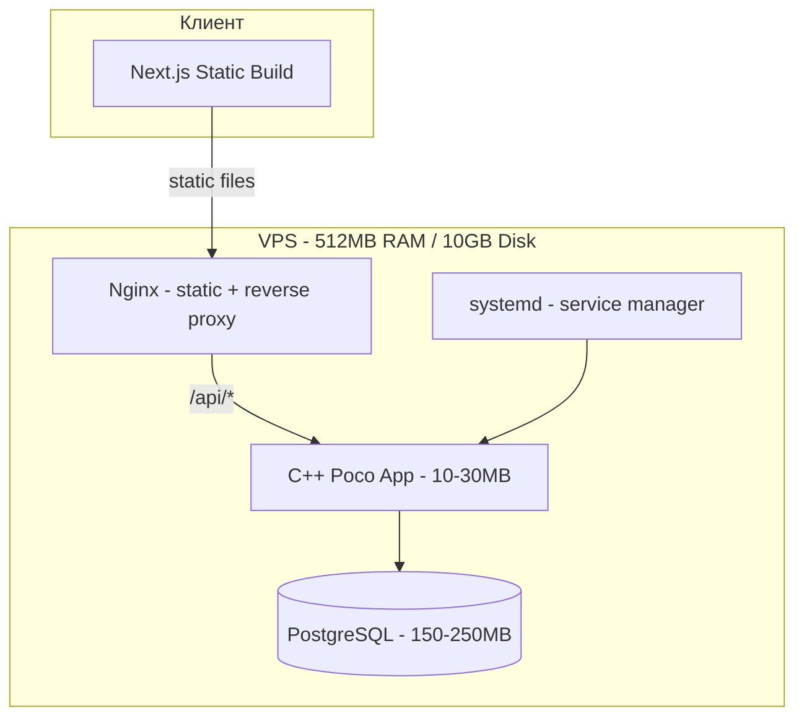

# Вариант C: C++ + Poco + PostgreSQL

## Стек

```
Frontend:  Next.js (static export) + TailwindCSS
Backend:   C++ + Poco
DB:        PostgreSQL + libpqxx
Runtime:   Статическая линковка
```

## Плюсы

1. Минимальное потребление памяти backend — процесс C++ занимает ~10-30 MB
2. Максимальная производительность — тысячи запросов/сек при минимальной CPU нагрузке
3. Опыт команды — C++ знаком
4. Предсказуемое потребление ресурсов — нет GC, нет скачков памяти
5. Статическая линковка — один бинарник, минимум зависимостей
6. Poco — зрелая библиотека — HTTP, JSON, JWT, логирование, ORM, WebSocket
7. PostgreSQL — опыт команды, pg_dump, полнотекстовый поиск

## Минусы

1. Скорость разработки — в 3-5 раз медленнее JS/TS. Авторизация, валидация, сериализация — всё вручную
2. Нет ORM — libpqxx сырой SQL-драйвер, нет миграций из коробки. Нужен отдельный инструмент миграций
3. Нет Swagger/OpenAPI — нужно писать спецификацию вручную или генерировать отдельно
4. Сложность отладки — segfault, memory leaks, UB — нужны санитайзеры и тщательное тестирование
5. Долгая компиляция — инкрементальная сборка C++ ~30-60 сек vs ~2 сек для TS
6. Деплой сложнее — нужен CI для кросс-компиляции под целевую платформу VPS
7. Нет горячей перезагрузки — изменения требуют полной пересборки и перезапуска
8. Мало готовых библиотек — для email, PDF, Excel нужно искать C++ аналоги или вызывать внешние утилиты
9. Два языка — TypeScript для фронтенда, C++ для бэкенда, нет переиспользования типов

## Требования к ресурсам

| Ресурс | Минимум | Рекомендация |
|--------|---------|-------------|
| RAM | **512 MB** — впритык | **512 MB** — достаточно |
| Диск runtime | ~100-200 MB | ~300 MB с запасом |
| Диск данные | Зависит от данных | 2-5 GB |
| CPU | 1 ядро | 1 ядро достаточно |

## Бэкап

pg_dump по cron — аналогично Варианту A:
```bash
pg_dump -U snt_user snt_db | gzip > /backup/db-$(date +%Y%m%d).sql.gz
```

## Архитектура



## Специфичные риски

1. **Утечки памяти** — при неправильном управлении указателями. Решение: умные указатели, RAII, санитайзеры
2. **Сложность внесения изменений** — даже мелкие правки в API требуют перекомпиляции и редеплоя
3. **Поиск разработчиков** — C++ веб-разработчики редки, сложно найти замену
4. **Безопасность** — буферные переполнения, use-after-free. Решение: статический анализ, ASAN
5. **Документация Poco** — менее обширная чем у Fastify/Express