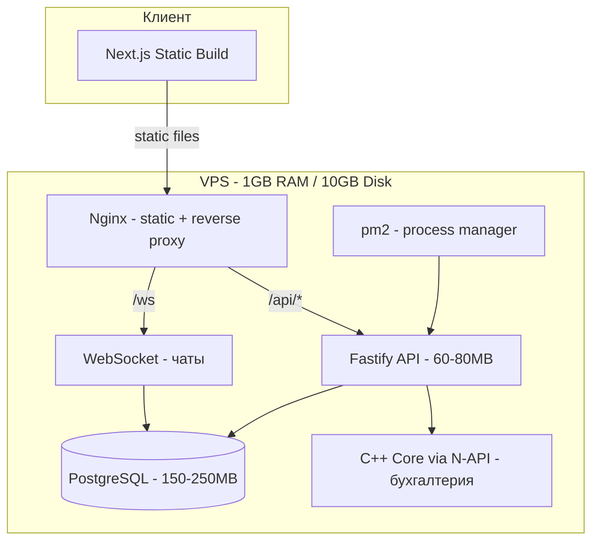

# Вариант D: Гибридный — C++ ядро + TypeScript API

## Стек

```
Frontend:  Next.js (static export) + TailwindCSS
Backend:   Node.js + Fastify (API, WebSocket, Auth)
Core:      C++ shared library через N-API (бухгалтерские расчёты)
DB:        PostgreSQL + Prisma ORM
Runtime:   pnpm
```

## Плюсы

1. Критичные вычисления на C++ — бухгалтерия, генерация отчётов — максимально быстро
2. API и WebSocket на TypeScript — скорость разработки как в Вариантах A/B
3. Prisma ORM — миграции, типобезопасность
4. PostgreSQL — опыт команды, полнотекстовый поиск, pg_dump
5. Опыт команды используется полностью — C++ для ядра, TS для API
6. Гибкость — C++ модули можно добавлять постепенно, начиная с чистого TS

## Минусы

1. Сложность сборки — нужен node-gyp или cmake-js, нативные модули ломаются при обновлении Node.js
2. Два языка — две сборочных цепочки, два набора зависимостей
3. Сложность отладки — нужно отлаживать и JS, и C++ код
4. N-API binding — ручное описание интерфейсов, потенциальные утечки при ошибках
5. CI/CD сложнее — нужна сборка C++ под целевую платформу
6.Overengineering — для СНТ-нагрузки C++ расчёты почти наверняка не нужны

## Требования к ресурсам

| Ресурс | Минимум | Рекомендация |
|--------|---------|-------------|
| RAM | 512 MB — впритык | **1 GB** — комфортно |
| Диск runtime | ~500-700 MB | ~1 GB с запасом |
| Диск данные | Зависит от данных | 2-5 GB |
| CPU | 1 ядро | 2 ядра |

## Бэкап

pg_dump по cron — аналогично Варианту A.

## Архитектура



## Вердикт по Варианту D

Не рекомендуется для старта. Сложность перевешивает пользу. Если в будущем появятся узкие места в производительности, C++ модуль можно добавить точечно через N-API. Начинать лучше с чистого TypeScript.