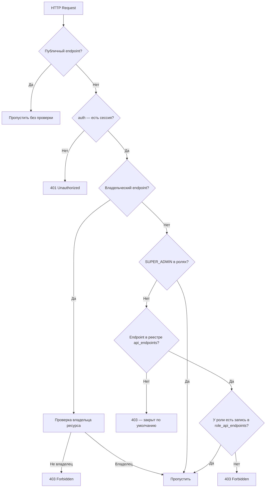

# Черновик: Защита API endpoints ролевой моделью (расширение US-8)

> Пользователь просит расширить US-8: добавить защиту API endpoints с учётом HTTP-методов. Если у роли нет прав на endpoint+метод — возвращать 403.

---

## Текущее состояние API endpoints

| Endpoint | Методы | Защита | Роли |
|----------|--------|--------|------|
| `/api/v1` (health) | GET | ❌ нет | публичный |
| `/api/v1/auth/register` | POST | ❌ нет | публичный (регистрация) |
| `/api/v1/auth/[...nextauth]` | GET, POST | ❌ нет | публичный (NextAuth) |
| `/api/v1/members` | GET, POST | ❌ нет | ❌ |
| `/api/v1/members/[id]` | GET, PUT | ❌ нет | ❌ |
| `/api/v1/plots` | GET, POST | ❌ нет | ❌ (TODO заглушки) |
| `/api/v1/profile` | GET, POST, DELETE | `auth()` → 401 | без ролей (данные владельца) |
| `/api/v1/profile/theme` | PATCH | `auth()` → 401 | без ролей (данные владельца) |
| `/api/v1/roles/*` (US-8) | CRUD | SUPER_ADMIN | SUPER_ADMIN |
| `/api/v1/pages/*` (US-8) | CRUD | SUPER_ADMIN | SUPER_ADMIN |

**Проблема:** inconsistent — members/plots без auth, profile с auth без ролей, roles/pages — с ролевой проверкой.

---

## Предлагаемая модель данных

### Новый подход: таблица `api_endpoints` + `role_api_endpoints`

```dbml
Table api_endpoints {
  id          varchar    [pk, not null]  // cuid()
  method      varchar    [not null]      // GET, POST, PATCH, PUT, DELETE
  path        varchar    [not null]      // /members, /members/:id, /plots
  description varchar
  is_active   boolean    [default: true, not null]
  created_at  timestamp  [default: now(), not null]
  updated_at  timestamp  [default: now(), not null]

  Notes:'''
    Primary key: id
    Unique constraint: (method, path) — комбинация метод+путь уникальна
    path — относительный путь без /api/v1 (например /members, /members/:id)
    is_active=false — endpoint заблокирован для всех, кроме SUPER_ADMIN
    '''
}

Table role_api_endpoints {
  role_id          varchar    [not null, ref: > roles]
  api_endpoint_id  varchar    [not null, ref: > api_endpoints]
  created_at       timestamp  [default: now(), not null]

  Notes:'''
    Primary key: (role_id, api_endpoint_id) — составной
    Foreign key: role_id -> roles.id (CASCADE)
    Foreign key: api_endpoint_id -> api_endpoints.id (CASCADE)
    SUPER_ADMIN имеет полный доступ через runtime-правило, без записей здесь
    '''
}
```

### Категории endpoints по типу доступа

| Категория | Описание | Примеры | Защита |
|-----------|----------|---------|--------|
| **Публичные** | Доступны без авторизации | `/auth/register`, `/auth/[...nextauth]`, health | Нет в реестре `api_endpoints` — не проверяются |
| **Владельческие** | Доступ только к своим данным | `/profile`, `/profile/theme` | `auth()` + проверка владельца (не ролевая) |
| **Ролевые** | Доступ по ролям | `/members`, `/members/:id`, `/plots`, `/roles/*` | `auth()` + проверка role_api_endpoints |
| **SUPER_ADMIN** | Только супер-админ | `/roles/*`, `/pages/*` | `auth()` + SUPER_ADMIN runtime |

> Публичные и владельческие endpoints **не включаются** в реестр `api_endpoints` — они проверяются отдельно через `auth()` и логику владельца.

---

## Seed данные: api_endpoints

| method | path | description | Роли по умолчанию |
|--------|------|-------------|-------------------|
| GET | `/members` | Список членов СНТ | MEMBER, ADMIN |
| POST | `/members` | Создание члена СНТ | ADMIN |
| GET | `/members/:id` | Просмотр члена СНТ | MEMBER, ADMIN |
| PUT | `/members/:id` | Редактирование члена СНТ | ADMIN |
| DELETE | `/members/:id` | Удаление члена СНТ | SUPER_ADMIN |
| GET | `/plots` | Список участков | MEMBER, ADMIN |
| POST | `/plots` | Создание участка | ADMIN |
| GET | `/roles` | Список ролей | SUPER_ADMIN |
| POST | `/roles` | Создать роль | SUPER_ADMIN |
| PATCH | `/roles/:id` | Обновить роль | SUPER_ADMIN |
| DELETE | `/roles/:id` | Удалить роль | SUPER_ADMIN |
| GET | `/roles/:id/users` | Участники роли | SUPER_ADMIN |
| POST | `/roles/:id/users` | Добавить участника | SUPER_ADMIN |
| DELETE | `/roles/:id/users/:userId` | Исключить участника | SUPER_ADMIN |
| GET | `/roles/:id/pages` | Страницы роли | SUPER_ADMIN |
| POST | `/roles/:id/pages` | Назначить страницу | SUPER_ADMIN |
| DELETE | `/roles/:id/pages/:pageId` | Снять страницу | SUPER_ADMIN |
| GET | `/pages` | Список страниц | SUPER_ADMIN |
| POST | `/pages` | Создать страницу | SUPER_ADMIN |
| PATCH | `/pages/:id` | Обновить страницу | SUPER_ADMIN |
| DELETE | `/pages/:id` | Удалить страницу | SUPER_ADMIN |
| GET | `/api_endpoints` | Список API endpoints | SUPER_ADMIN |
| POST | `/api_endpoints` | Создать endpoint | SUPER_ADMIN |
| PATCH | `/api_endpoints/:id` | Обновить endpoint | SUPER_ADMIN |
| DELETE | `/api_endpoints/:id` | Удалить endpoint | SUPER_ADMIN |
| GET | `/role_api_endpoints` | Связи роль-endpoint | SUPER_ADMIN |
| POST | `/role_api_endpoints` | Назначить endpoint роли | SUPER_ADMIN |
| DELETE | `/role_api_endpoints/:id` | Снять endpoint с роли | SUPER_ADMIN |

> `/profile` и `/profile/theme` — владельческие, НЕ в реестре. `/auth/*` — публичные, НЕ в реестре.

---

## Механизм проверки доступа к API



### Сервис проверки доступа

```typescript
// src/domains/roles/access.service.ts (скелет)
/**
 * @service AccessService
 * @domain roles
 * @description Проверка доступа пользователя к страницам и API endpoints
 *
 * @spec
 * - SUPER_ADMIN: полный доступ ко всем активным страницам и endpoints (runtime, без БД)
 * - Страницы: проверка через role_pages + pages.is_active
 * - API: проверка через role_api_endpoints + api_endpoints.is_active
 * - Публичные endpoints (/auth/*, health) — не проверяются
 * - Владельческие endpoints (/profile, /profile/theme) — auth() + логика владельца
 */
export class AccessService {
  /** Проверить доступ пользователя к странице по path */
  async canAccessPage(userId: string, pagePath: string): Promise<boolean>;

  /** Проверить доступ пользователя к API endpoint по method + path */
  async canAccessApi(userId: string, method: string, apiPath: string): Promise<boolean>;

  /** Получить список доступных пользователю страниц (для меню) */
  async getAccessiblePages(userId: string): Promise<Page[]>;
}
```

### Сопоставление путей с шаблонами

API endpoint path может содержать параметры: `/members/:id`. Реальный запрос — `/members/abc123`. Нужен matcher:

```typescript
// Сопоставление /members/:id с /members/abc123
function matchApiPath(pattern: string, actualPath: string): boolean {
  const patternParts = pattern.split('/').filter(Boolean);
  const actualParts = actualPath.split('/').filter(Boolean);
  if (patternParts.length !== actualParts.length) return false;
  return patternParts.every((part, i) =>
    part.startsWith(':') || part === actualParts[i]
  );
}
```

---

## Влияние на US-8

### Что меняется в US-8

1. **Новые сущности**: `ApiEndpoint`, `RoleApiEndpoint` (2 новые таблицы)
2. **Новые FR**: управление API endpoints через UI (вкладка «API» на странице /dashboard/roles)
3. **Новые API endpoints**: CRUD для `api_endpoints` и `role_api_endpoints`
4. **Новые доменные файлы**: `api-endpoint.types.ts`, `api-endpoint.repository.ts`, `api-endpoint.service.ts`, `api-endpoint.validators.ts`, `api-endpoint.errors.ts`
5. **Seed**: добавление всех существующих endpoints в реестр + назначение ролям по умолчанию
6. **AccessService**: единый сервис проверки доступа (страницы + API)

### Что остаётся в US-9

- Защита самих страниц приложения (guard/hook на client)
- Фильтрация навигационного меню
- Страница 403
- Инвалидация сессии (не нужна, т.к. usePageAccess + API-проверка)

### Защита API Route Handlers (в US-8)

Каждый защищаемый route handler должен вызывать AccessService:

```typescript
// Пример: src/app/api/v1/members/route.ts
export async function GET(request: NextRequest) {
  const session = await auth();
  if (!session?.user?.id) {
    return NextResponse.json(
      { success: false, error: { code: 'UNAUTHORIZED', message: 'Требуется авторизация' } },
      { status: 401 }
    );
  }

  // Ролевая проверка
  const accessService = createAccessService();
  const canAccess = await accessService.canAccessApi(session.user.id, 'GET', '/members');
  if (!canAccess) {
    return NextResponse.json(
      { success: false, error: { code: 'FORBIDDEN', message: 'Недостаточно прав' } },
      { status: 403 }
    );
  }

  // ... бизнес-логика
}
```

### Утилита-обёртка (helper)

Для устранения дублирования:

```typescript
// src/lib/api-guard.ts (скелет)
/**
 * @function withRoleGuard
 * @description Обёртка для API Route Handlers с ролевой проверкой
 *
 * @spec
 * - Проверяет auth() → 401 если нет сессии
 * - Проверяет AccessService.canAccessApi → 403 если нет прав
 * - Пропускает публичные endpoints (определяются по path)
 * - Пропускает владельческие endpoints (проверка владельца внутри handler)
 */
export function withRoleGuard(
  method: string,
  apiPath: string,
  handler: (request: NextRequest, context: { session: Session }) => Promise<NextResponse>
): (request: NextRequest) => Promise<NextResponse>;
```

---

## Открытые вопросы для обсуждения

1. **Параметры пути**: `/members/:id` — нужен matcher. Согласован формат `:param`?
2. **Владельческие endpoints**: `/profile` — проверка владельца остаётся в handler, не в AccessService?
3. **Публичные endpoints**: whitelist в коде (`/auth/*`, health) или тоже в реестре с особым флагом?
4. **UI управления API**: отдельная вкладка на /dashboard/roles или раздел на вкладке «Страницы»?
5. **Наследование**: если у роли есть доступ к странице /dashboard/members, нужен ли автоматически GET /members? Или это независимые разрешения?
6. **Health check** `/api/v1` GET — оставить публичным без реестра?

---

## Предлагаемая структура файлов

```
src/domains/roles/
├── index.ts
├── role.types.ts
├── role.repository.interface.ts
├── role.repository.prisma.ts
├── role.service.ts
├── role.validators.ts
├── role.errors.ts
├── page.types.ts
├── page.repository.interface.ts
├── page.repository.prisma.ts
├── page.service.ts
├── page.validators.ts
├── page.errors.ts
├── api-endpoint.types.ts          // НОВОЕ
├── api-endpoint.repository.interface.ts  // НОВОЕ
├── api-endpoint.repository.prisma.ts     // НОВОЕ
├── api-endpoint.service.ts        // НОВОЕ
├── api-endpoint.validators.ts     // НОВОЕ
├── api-endpoint.errors.ts         // НОВОЕ
├── role-page.types.ts
├── role-page.repository.interface.ts
├── role-page.repository.prisma.ts
├── role-api-endpoint.types.ts     // НОВОЕ
├── role-api-endpoint.repository.interface.ts  // НОВОЕ
├── role-api-endpoint.repository.prisma.ts     // НОВОЕ
├── access.service.ts              // НОВОЕ — единый сервис проверки доступа
└── access.errors.ts               // НОВОЕ

src/lib/
├── api-client.ts
├── api-guard.ts                   // НОВОЕ — обёртка withRoleGuard
└── path-matcher.ts                // НОВОЕ — сопоставление :param
```

---

## Сводка изменений в модели

| Действие | Сущность | Описание |
|----------|----------|----------|
| Создать | `ApiEndpoint` | Реестр API endpoints: method, path, description, is_active |
| Создать | `RoleApiEndpoint` | M:N roles↔api_endpoints |
| Создать | `AccessService` | Единый сервис проверки доступа (pages + API) |
| Создать | `api-guard.ts` | Обёртка для route handlers |
| Создать | `path-matcher.ts` | Сопоставление путей с :param |
| Обновить | US-8 spec | Добавить FR для управления API endpoints |
| Обновить | seed | Добавить все endpoints + назначения по умолчанию |

---

**Статус:** черновик для обсуждения. Жду решений по открытым вопросам.
