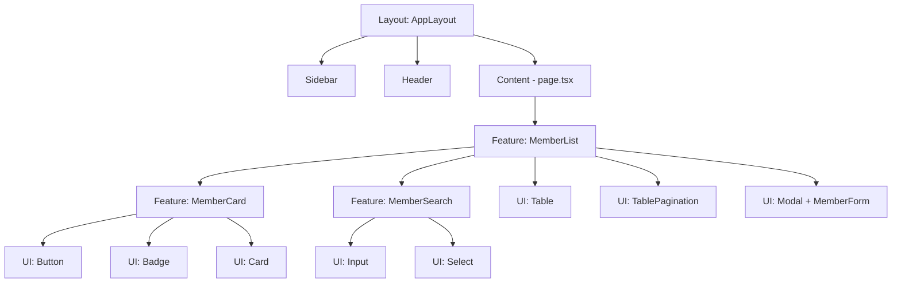
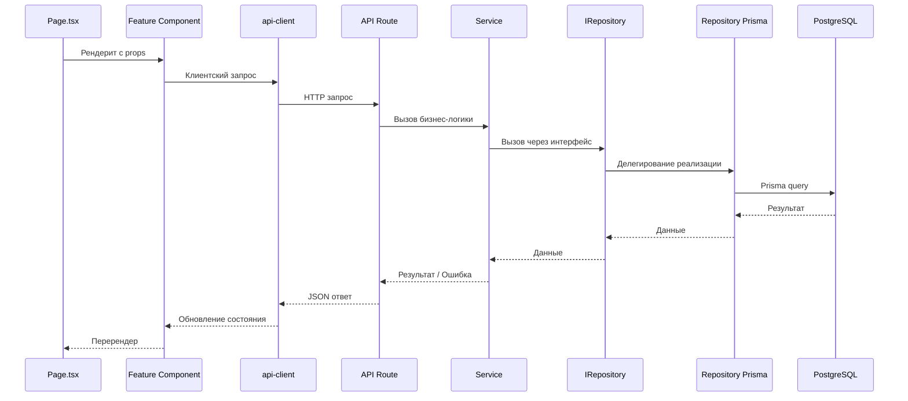

# План настройки рабочего пространства snt-app

> Вариант B: Доменная архитектура с разделением интерфейса/реализации Repository

---

## Полная структура проекта

```
snt-app/
├── prisma/
│   ├── schema.prisma                    # Prisma схема БД
│   └── seed.ts                          # Начальные данные
│
├── public/
│   ├── favicon.ico
│   └── images/
│
├── src/
│   │
│   ├── app/                             # ── Next.js App Router ────────────────
│   │   ├── api/                         #   API Routes (тонкие handlers)
│   │   │   └── v1/
│   │   │       ├── members/
│   │   │       │   └── route.ts        #   GET, POST /api/v1/members
│   │   │       ├── members/[id]/
│   │   │       │   └── route.ts        #   GET, PUT, DELETE /api/v1/members/:id
│   │   │       ├── plots/
│   │   │       │   └── route.ts
│   │   │       ├── plots/[id]/
│   │   │       │   └── route.ts
│   │   │       └── auth/
│   │   │           └── [...nextauth]/
│   │   │               └── route.ts    #   NextAuth handler
│   │   │
│   │   ├── (auth)/                      #   Route Group: страницы авторизации
│   │   │   ├── login/
│   │   │   │   └── page.tsx            #   Страница входа
│   │   │   ├── register/
│   │   │   │   └── page.tsx            #   Страница регистрации
│   │   │   └── layout.tsx              #   Layout без Sidebar
│   │   │
│   │   ├── (dashboard)/                 #   Route Group: основное приложение
│   │   │   ├── layout.tsx              #   Layout с Sidebar + Header
│   │   │   ├── page.tsx                #   Главная / Dashboard
│   │   │   ├── members/
│   │   │   │   └── page.tsx            #   Список членов СНТ
│   │   │   ├── members/[id]/
│   │   │   │   └── page.tsx            #   Карточка члена СНТ
│   │   │   ├── plots/
│   │   │   │   └── page.tsx            #   Список участков
│   │   │   ├── plots/[id]/
│   │   │   │   └── page.tsx            #   Карточка участка
│   │   │   ├── votes/
│   │   │   │   └── page.tsx            #   Голосования
│   │   │   ├── documents/
│   │   │   │   └── page.tsx            #   Документы
│   │   │   ├── bills/
│   │   │   │   └── page.tsx            #   Счета/платежи
│   │   │   └── settings/
│   │   │       └── page.tsx            #   Настройки (для ADMIN)
│   │   │
│   │   ├── layout.tsx                   #   Корневой layout (провайдеры)
│   │   ├── globals.css                  #   Глобальные стили + Tailwind
│   │   └── not-found.tsx               #   404 страница
│   │
│   ├── domains/                         # ── Домены — ядро приложения ─────────
│   │   │
│   │   ├── members/                     #   Домен: Члены СНТ
│   │   │   ├── member.service.ts       #     Бизнес-логика
│   │   │   ├── member.repository.interface.ts  #  Контракт Repository
│   │   │   ├── member.repository.prisma.ts     #  Реализация через Prisma
│   │   │   ├── member.validators.ts    #     Zod-схемы
│   │   │   ├── member.types.ts         #     Типы домена
│   │   │   ├── member.errors.ts        #     Доменные ошибки
│   │   │   └── index.ts               #     Публичный API домена
│   │   │
│   │   ├── plots/                       #   Домен: Участки
│   │   │   ├── plot.service.ts
│   │   │   ├── plot.repository.interface.ts
│   │   │   ├── plot.repository.prisma.ts
│   │   │   ├── plot.validators.ts
│   │   │   ├── plot.types.ts
│   │   │   ├── plot.errors.ts
│   │   │   └── index.ts
│   │   │
│   │   ├── votes/                       #   Домен: Голосования
│   │   │   └── ...
│   │   │
│   │   ├── documents/                   #   Домен: Документы
│   │   │   └── ...
│   │   │
│   │   ├── bills/                       #   Домен: Счета/Платежи
│   │   │   └── ...
│   │   │
│   │   └── _shared/                     #   Общий код доменов
│   │       ├── types.ts                 #     Общие типы (PaginatedResult, etc.)
│   │       └── errors.ts               #     Базовые ошибки (NotFoundError, ...)
│   │
│   ├── components/                      # ── React-компоненты ─────────────────
│   │   │
│   │   ├── ui/                          #   Примитивы — не привязаны к домену
│   │   │   ├── Button/
│   │   │   │   ├── Button.tsx           #     Компонент
│   │   │   │   ├── Button.test.tsx      #     Тест
│   │   │   │   └── index.ts            #     Реэкспорт
│   │   │   ├── Input/
│   │   │   │   ├── Input.tsx
│   │   │   │   ├── Input.test.tsx
│   │   │   │   └── index.ts
│   │   │   ├── Modal/
│   │   │   │   ├── Modal.tsx
│   │   │   │   ├── Modal.test.tsx
│   │   │   │   └── index.ts
│   │   │   ├── Table/
│   │   │   │   ├── Table.tsx
│   │   │   │   ├── TablePagination.tsx  #     Подкомпонент
│   │   │   │   ├── Table.test.tsx
│   │   │   │   └── index.ts
│   │   │   ├── Card/
│   │   │   ├── Badge/
│   │   │   ├── Select/
│   │   │   ├── Loader/
│   │   │   └── index.ts                #   Общий реэкспорт всех ui-компонентов
│   │   │
│   │   ├── features/                    #   Фичи — привязаны к доменам
│   │   │   ├── members/                 #     Фичи домена members
│   │   │   │   ├── MemberList.tsx       #       Список членов
│   │   │   │   ├── MemberCard.tsx       #       Карточка в списке
│   │   │   │   ├── MemberDetails.tsx    #       Подробности
│   │   │   │   ├── MemberForm.tsx       #       Форма создания/редактирования
│   │   │   │   ├── MemberSearch.tsx     #       Поиск с фильтрами
│   │   │   │   └── index.ts
│   │   │   ├── plots/                   #     Фичи домена plots
│   │   │   │   ├── PlotList.tsx
│   │   │   │   ├── PlotCard.tsx
│   │   │   │   ├── PlotDetails.tsx
│   │   │   │   ├── PlotForm.tsx
│   │   │   │   └── index.ts
│   │   │   ├── votes/
│   │   │   │   └── ...
│   │   │   ├── documents/
│   │   │   │   └── ...
│   │   │   ├── bills/
│   │   │   │   └── ...
│   │   │   └── shared/                 #     Кросс-доменные фичи
│   │   │       ├── SearchBar.tsx
│   │   │       ├── DataExport.tsx
│   │   │       ├── ConfirmDialog.tsx
│   │   │       └── index.ts
│   │   │
│   │   └── layouts/                    #   Layout-компоненты
│   │       ├── AppLayout.tsx            #     Основной layout (Sidebar + Content)
│   │       ├── AuthLayout.tsx           #     Layout авторизации
│   │       ├── Sidebar.tsx             #     Боковое меню
│   │       ├── Header.tsx              #     Шапка
│   │       ├── Footer.tsx
│   │       └── index.ts
│   │
│   ├── hooks/                           # ── Общие React-хуки ────────────────
│   │   ├── useDebounce.ts
│   │   ├── usePagination.ts
│   │   ├── useConfirm.ts
│   │   └── index.ts
│   │
│   ├── lib/                             # ── Клиентские утилиты ───────────────
│   │   ├── api-client.ts               #   Типизированный fetch-клиент для API
│   │   └── utils.ts                    #   Общие утилиты (cn, formatDate, ...)
│   │
│   ├── shared/                          # ── Общий код ───────────────────────
│   │   ├── errors/
│   │   │   ├── ValidationError.ts
│   │   │   ├── NotFoundError.ts
│   │   │   ├── ConflictError.ts
│   │   │   ├── BusinessRuleError.ts
│   │   │   └── index.ts
│   │   ├── types/
│   │   │   ├── api.types.ts           #   ApiResponse<T>, ApiError, PaginatedResponse<T>
│   │   │   └── index.ts
│   │   └── constants.ts                #   Общие константы
│   │
│   ├── infrastructure/                 # ── Инфраструктура ───────────────────
│   │   ├── prisma/
│   │   │   └── client.ts              #   Prisma client singleton
│   │   ├── auth/
│   │   │   ├── auth.config.ts         #   NextAuth конфигурация
│   │   │   └── auth.options.ts        #   Провайдеры, колбэки
│   │   └── ws/
│   │       ├── ws.client.ts           #   WebSocket клиент
│   │       ├── ws.hooks.ts            #   useWebSocket, useSubscription
│   │       └── ws.types.ts            #   Типы сообщений
│   │
│   └── di/                             # ── Composition Root ────────────────
│       └── container.ts               #   Фабрики: сервисы с внедрёнными репозиториями
│
├── tests/
│   ├── unit/
│   │   └── domains/
│   │       ├── members/
│   │       │   └── member.service.test.ts
│   │       └── plots/
│   │           └── plot.service.test.ts
│   ├── e2e/
│   └── setup.ts                        #   Jest setup
│
├── scripts/
│   └── generate-domain.ts              #   Генератор шаблона нового домена
│
├── .env.example
├── .env.local                           #   Локальные переменные (gitignored)
├── .gitignore
├── package.json
├── tsconfig.json
├── next.config.ts
├── tailwind.config.ts
├── postcss.config.mjs
├── jest.config.ts
└── README.md
```

---

## Детализация: Pages (страницы)

### Принципы

1. **Каждый `page.tsx` — это `'use client'` тонкий компонент**
   - Не содержит бизнес-логики
   - Импортирует feature-компоненты и компонует их
   - Получает данные через `api-client` → API Route → Service → Repository

2. **Route Groups для разных layouts**
   - `(auth)/` — страницы без Sidebar (login, register)
   - `(dashboard)/` — страницы с Sidebar + Header

3. **Динамические маршруты для детальных страниц**
   - `members/[id]/page.tsx` — карточка члена СНТ
   - `plots/[id]/page.tsx` — карточка участка

### Пример страницы

```typescript
// src/app/(dashboard)/members/page.tsx
'use client';

import { MemberList } from '@/components/features/members';
import { memberApi } from '@/lib/api-client';

export default function MembersPage() {
  const { data, isLoading, error } = memberApi.useMembers();

  if (isLoading) return <Loader />;
  if (error) return <ErrorMessage error={error} />;

  return <MemberList members={data} />;
}
```

### Пример детальной страницы

```typescript
// src/app/(dashboard)/members/[id]/page.tsx
'use client';

import { use } from 'react';
import { MemberDetails, MemberForm } from '@/components/features/members';
import { memberApi } from '@/lib/api-client';

export default function MemberDetailPage({
  params,
}: {
  params: Promise<{ id: string }>;
}) {
  const { id } = use(params);
  const { data: member, isLoading } = memberApi.useMemberById(id);

  if (isLoading) return <Loader />;
  if (!member) return <NotFound />;

  return <MemberDetails member={member} />;
}
```

---

## Детализация: UI-компоненты

### Иерархия компонентов



### Правила для UI-компонентов

| Правило | Описание |
|---------|----------|
| **ui/** | Примитивы. Не знают о доменах. Принимают generic props. Переиспользуются везде. |
| **features/** | Составные компоненты. Знают о конкретном домене. Импортируют ui/ и hooks/. |
| **layouts/** | Структурные компоненты. Не содержат бизнес-данных. Отвечают за раскладку. |
| **50 строк** | Компонент > 50 строк → разбить на подкомпоненты |
| **PascalCase** | Имена файлов и компонентов в PascalCase |
| **index.ts** | Каждый ui-компонент в своей папке + index.ts для реэкспорта |
| **Нет прямого API** | Feature-компоненты получают данные через props или hooks, не вызывают API напрямую |

### Пример: UI-компонент

```typescript
// src/components/ui/Button/Button.tsx
'use client';

import { type ButtonHTMLAttributes, forwardRef } from 'react';

type ButtonVariant = 'primary' | 'secondary' | 'danger' | 'ghost';
type ButtonSize = 'sm' | 'md' | 'lg';

interface ButtonProps extends ButtonHTMLAttributes<HTMLButtonElement> {
  variant?: ButtonVariant;
  size?: ButtonSize;
  isLoading?: boolean;
}

export const Button = forwardRef<HTMLButtonElement, ButtonProps>(
  ({ variant = 'primary', size = 'md', isLoading, children, ...props }, ref) => {
    return (
      <button ref={ref} className={`btn btn-${variant} btn-${size}`} {...props}>
        {isLoading ? <Loader size="sm" /> : children}
      </button>
    );
  }
);

Button.displayName = 'Button';
```

### Пример: Feature-компонент

```typescript
// src/components/features/members/MemberCard.tsx
'use client';

import { Card, Badge, Button } from '@/components/ui';
import type { Member } from '@/domains/members';

interface MemberCardProps {
  member: Member;
  onEdit: (id: string) => void;
  onDelete: (id: string) => void;
}

export function MemberCard({ member, onEdit, onDelete }: MemberCardProps) {
  return (
    <Card>
      <Card.Header>
        <Card.Title>{member.fullName}</Card.Title>
        <Badge variant={member.isActive ? 'success' : 'error'}>
          {member.isActive ? 'Активен' : 'Неактивен'}
        </Badge>
      </Card.Header>
      <Card.Body>
        <p>Участок: {member.plotNumber}</p>
        <p>Телефон: {member.phone}</p>
      </Card.Body>
      <Card.Footer>
        <Button variant="secondary" onClick={() => onEdit(member.id)}>
          Редактировать
        </Button>
        <Button variant="danger" onClick={() => onDelete(member.id)}>
          Удалить
        </Button>
      </Card.Footer>
    </Card>
  );
}
```

---

## Детализация: api-client

```typescript
// src/lib/api-client.ts
import type { ApiResponse, PaginatedResponse } from '@/shared/types';

class ApiClient {
  private baseUrl = '/api/v1';

  async get<T>(path: string): Promise<ApiResponse<T>> {
    const res = await fetch(`${this.baseUrl}${path}`);
    return res.json();
  }

  async post<T>(path: string, body: unknown): Promise<ApiResponse<T>> {
    const res = await fetch(`${this.baseUrl}${path}`, {
      method: 'POST',
      headers: { 'Content-Type': 'application/json' },
      body: JSON.stringify(body),
    });
    return res.json();
  }

  async put<T>(path: string, body: unknown): Promise<ApiResponse<T>> {
    const res = await fetch(`${this.baseUrl}${path}`, {
      method: 'PUT',
      headers: { 'Content-Type': 'application/json' },
      body: JSON.stringify(body),
    });
    return res.json();
  }

  async delete(path: string): Promise<ApiResponse<void>> {
    const res = await fetch(`${this.baseUrl}${path}`, { method: 'DELETE' });
    return res.json();
  }
}

export const apiClient = new ApiClient();
```

---

## Поток данных: от UI до БД



---

## Пошаговый план реализации

### Шаг 1: Инициализация Next.js проекта
- `pnpm create next-app` с App Router, TypeScript, Tailwind, ESLint
- Настроить `tsconfig.json` (strict, path aliases `@/`)
- Настроить `next.config.ts`

### Шаг 2: Настройка Prisma + PostgreSQL
- Установить `prisma` и `@prisma/client`
- Создать `prisma/schema.prisma` с базовой моделью User
- Настроить `src/infrastructure/prisma/client.ts` (singleton)
- Проверить подключение к БД

### Шаг 3: Создание базовой структуры папок
- Создать все директории согласно структуре варианта B
- Добавить `.gitkeep` в пустые папки (для git)
- Настроить path aliases в `tsconfig.json`

### Шаг 4: Shared-модули (ошибки, типы, утилиты)
- `src/shared/errors/` — базовые классы ошибок
- `src/shared/types/api.types.ts` — ApiResponse, PaginatedResult
- `src/lib/utils.ts` — утилиты (cn, formatDate)
- `src/lib/api-client.ts` — типизированный fetch-клиент

### Шаг 5: Инфраструктура (Prisma, Auth, WS)
- `src/infrastructure/prisma/client.ts`
- `src/infrastructure/auth/` — NextAuth конфигурация
- `src/infrastructure/ws/` — WebSocket клиент (заглушка)

### Шаг 6: Первый домен (members) как шаблон
- `member.types.ts`
- `member.errors.ts`
- `member.repository.interface.ts`
- `member.repository.prisma.ts`
- `member.validators.ts`
- `member.service.ts`
- `index.ts`

### Шаг 7: DI Container
- `src/di/container.ts` — фабрики сервисов

### Шаг 8: Первый API Route
- `src/app/api/v1/members/route.ts`
- Проверить энд-то-энд: API → Service → Repository → Prisma → БД

### Шаг 9: Базовые UI-компоненты
- `src/components/ui/Button/`
- `src/components/ui/Input/`
- `src/components/ui/Modal/`
- `src/components/ui/Table/`
- `src/components/ui/Card/`
- `src/components/ui/Badge/`
- `src/components/ui/Loader/`

### Шаг 10: Layout-компоненты
- `src/components/layouts/AppLayout.tsx`
- `src/components/layouts/AuthLayout.tsx`
- `src/components/layouts/Sidebar.tsx`
- `src/components/layouts/Header.tsx`

### Шаг 11: Первые Feature-компоненты + Pages
- `src/components/features/members/`
- `src/app/(dashboard)/members/page.tsx`
- `src/app/(dashboard)/members/[id]/page.tsx`
- `src/app/(auth)/login/page.tsx`

### Шаг 12: Тестирование
- Настроить Jest
- Написать unit-тест для MemberService (с mock IMemberRepository)
- Проверить `pnpm test`

### Шаг 13: Генератор доменов
- `scripts/generate-domain.ts` — CLI-скрипт для создания шаблона нового домена

### Шаг 14: Документация
- `README.md` — описание структуры, команды, конвенции
- Обновить `.env.example` при необходимости