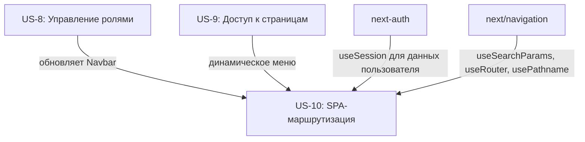
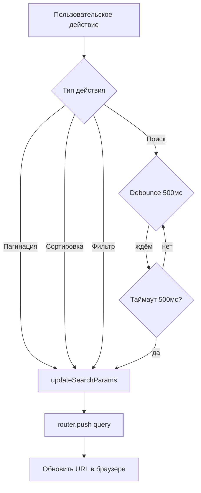

# US-10: SPA-маршрутизация с сохранением состояния в URL

---

## Формулировка

**Как** авторизованный пользователь приложения СНТ,
**я хочу** чтобы состояние страниц (фильтры, пагинация, сортировка) сохранялось в URL,
**чтобы** иметь возможность копировать и делиться ссылками на конкретные состояния списков, а также возвращаться к предыдущему состоянию через кнопку браузера "Назад".

---

## Контекст

**Проблема**: В текущем приложении состояние страниц (фильтры, пагинация, сортировка) хранится только в клиентском state и сбрасывается при переходе на другую страницу или обновлении страницы. Пользователи не могут:
- Скопировать ссылку на конкретную страницу с применёнными фильтрами
- Поделиться результатом поиска с коллегами
- Вернуться к предыдущему состоянию через кнопку "Назад" в браузере

**Решение**: Внедрить систему SPA-маршрутизации с синхронизацией состояния страниц с URL query parameters. Состояние фильтров, пагинации и сортировки будет сохраняться в URL, что позволит копировать ссылки и использовать историю браузера. Для поля поиска будет использоваться debounce-задержка 500мс перед обновлением URL для избежания "грязного" URL во время активного ввода.

**Границы**:
- Входит: хук `useUrlState`, страница с примером реализации (Members), обновление `Navbar` для корректной навигации через `Link`, обработка popstate events
- НЕ входит: серверная пагинация/фильтрация (это отдельная US), изменение модели данных, серверный рендеринг состояния

---

## Модель данных

| Сущность | Описание |
|----------|----------|
| **Нет изменений** | Состояние страниц сохраняется в URL query parameters, а не в базе данных. Модель данных не требует изменений |

> **Примечание**: Данная user story не требует изменений в модели данных, так как состояние хранится в URL.

---

## Функциональные требования

### FR-1: Хук useUrlState для синхронизации состояния с URL

Создать переиспользуемый хук `useUrlState` в `src/hooks/useUrlState.ts`, который:
- При монтировании читает параметры из URL и возвращает их как начальное состояние
- Предоставляет функцию `updateState` для обновления состояния и URL
- При вызове `updateState` обновляет React state и синхронизирует URL через `router.push` или `router.replace`
- Поддерживает типизированные параметры с defaults по умолчанию
- Автоматически обрабатывает событие `popstate` для восстановления состояния при навигации "Назад"

```typescript
// Пример сигнатуры
function useUrlState<T extends Record<string, string | number | boolean | undefined>>(
  defaults: T,
  options?: {
    debounceMs?: number; // для search — 500мс по умолчанию
    clearOnDefault?: boolean; // удалять параметр если значение равно default
  }
): [state: T, updateState: (updates: Partial<T>) => void]
```

### FR-2: Инициализация состояния из URL

При загрузке страницы параметры из URL query string используются как начальные значения состояния:
- Если параметр присутствует в URL — его значение используется
- Если параметр отсутствует — используется значение из `defaults`
- Неверные типы параметров (например, `?page=abc`) игнорируются, используется default

### FR-3: Обновление URL без перезагрузки страницы

При изменении состояния через `updateState`:
- URL обновляется через `router.push({ query: ... })` без перезагрузки страницы
- Новые параметры добавляются к существующим
- Удалённые параметры (возврат к default) удаляются из URL если `clearOnDefault=true`

### FR-4: Поддержка кнопки "Назад" браузера

При нажатии кнопки "Назад" в браузере:
- Событие `popstate` перехватывается хуком `useUrlState`
- Состояние страницы обновляется на основе новых URL параметров
- Данные перезагружаются если параметры изменились

### FR-5: Debounce для поиска

При изменении параметра поиска (`search`):
- URL обновляется с задержкой 500мс после прекращения ввода
- Во время ввода URL не обновляется
- Как только ввод прекращается на 500мс — URL обновляется

### FR-6: Мгновенное обновление для пагинации и сортировки

При изменении параметров пагинации (`page`, `limit`) и сортировки (`sort`, `order`):
- URL обновляется мгновенно без задержки
- Это обеспечивает корректную историю браузера для каждого шага пагинации

### FR-7: Копируемые ссылки

URL содержит полное состояние страницы — скопированная ссылка при открытии на другом устройстве или в инкогнито откроет страницу с теми же фильтрами, пагинацией и сортировкой.

### FR-8: Обновление навигации для использования Link

Все навигационные ссылки в приложении должны использовать компонент `Link` из `next/link` вместо прямого изменения `window.location` или `router.push` со строкой. Это обеспечивает предсказуемое поведение SPA-навигации.

### FR-9: Обработка пустых и некорректных URL

- Пустой URL (чистый путь, например `/dashboard/members`) — используются значения по умолчанию
- Неверный тип параметра (например, `?page=abc`) — параметр игнорируется, используется default
- Параметры неизвестных ключей — игнорируются

---

## Критерии приёмки

### AC-1: Инициализация состояния из URL
- **Given** пользователь переходит на `/dashboard/members?page=2&search=Иван`
- **When** страница_members загружена
- **Then** пагинация показывает страницу 2, в поле поиска отображается "Иван"

### AC-2: Обновление URL при изменении пагинации
- **Given** пользователь на странице members на странице 1
- **When** пользователь нажимает "Вперёд" для перехода на страницу 2
- **Then** URL обновляется на `/dashboard/members?page=2`, адресная строка меняется мгновенно

### AC-3: Обновление URL при поиске с debounce
- **Given** пользователь на странице members с пустым полем поиска
- **When** пользователь начинает вводить "Петр"
- **Then** URL не обновляется во время ввода
- **And** через 500мс после прекращения ввода URL обновляется на `/dashboard/members?search=Петр`

### AC-4: Возврат по кнопке "Назад"
- **Given** пользователь прошёл по страницам 1 → 2 → 3 и ввёл поиск "Иван"
- **When** пользователь нажимает кнопку "Назад" в браузере
- **Then** состояние страницы восстанавливается на предыдущее (например, страница 2 без поиска)

### AC-5: Копируемая ссылка
- **Given** пользователь настроил фильтры: страница 2, поиск "Иван", сортировка по имени
- **When** пользователь копирует URL из адресной строки и открывает его в новой вкладке
- **Then** страница открывается с теми же фильтрами: страница 2, поиск "Иван", сортировка по имени

### AC-6: Сброс к значениям по умолчанию
- **Given** пользователь установил `?page=5`
- **When** пользователь нажимает кнопку "Сбросить пагинацию"
- **Then** параметр `page` удаляется из URL, используется значение по умолчанию (страница 1)

### AC-7: Несколько параметров одновременно
- **Given** пользователь одновременно меняет пагинацию и сортировку
- **When** оба изменения применены
- **Then** URL содержит оба параметра: `/dashboard/members?page=2&sort=lastName&order=asc`

### AC-8: Неверный тип параметра
- **Given** пользователь переходит на `/dashboard/members?page=abc`
- **When** страница загружена
- **Then** параметр `page` игнорируется, используется значение по умолчанию (1)

### AC-9: Неизвестные параметры в URL
- **Given** пользователь переходит на `/dashboard/members?unknown=value`
- **When** страница загружена
- **Then** параметр `unknown` игнорируется, не вызывает ошибок

### AC-10: Использование Link для навигации
- **Given** пользователь нажимает на ссылку в навигационном меню
- **When** навигация происходит
- **Then** используется компонент `Link` из `next/link`, без полной перезагрузки страницы

---

## Бизнес-правила и валидация

| ID | Правило | Валидация |
|----|---------|-----------|
| BR-1 | Пагинация: page должен быть целым числом ≥ 1 | Типизация в хуке, парсинг `parseInt` |
| BR-2 | Пагинация: limit должен быть целым числом из списка [10, 20, 50, 100] | Валидация при парсинге |
| BR-3 | Поиск: search — строка, длина 0-100 символов | Обрезка, trim |
| BR-4 | Сортировка: sort — допустимое имя поля | Проверка по whitelist полей |
| BR-5 | Сортировка: order — только 'asc' или 'desc' | Проверка по enum |
| BR-6 | Debounce для поиска — 500мс | Конфигурация хука |
| BR-7 | Мгновенное обновление для пагинации и сортировки | Без debounce |
| BR-8 | Параметры по умолчанию задаются для каждой страницы | Обязательный параметр `defaults` |
| BR-9 | Неизвестные параметры игнорируются | Whitelist известных ключей |
| BR-10 | URL не содержит параметров со значениями по умолчанию (опционально) | `clearOnDefault=true` |

### Примеры валидаций
- **Page**: `parseInt(query.page) || 1` — если не число, используется 1
- **Search**: `query.search?.trim().slice(0, 100)` — обрезка до 100 символов
- **Sort**: `['firstName', 'lastName', 'createdAt'].includes(query.sort) ? query.sort : 'createdAt'`
- **Order**: `['asc', 'desc'].includes(query.order) ? query.order : 'asc'`

---

## Граничные случаи (Edge Cases)

| # | Ситуация | Ожидаемое поведение |
|----|----------|---------------------|
| 1 | URL содержит очень длинный search (>500 символов) | Параметр обрезается до 100 символов, остальное игнорируется |
| 2 | Пользователь быстро переключает страницы (клики по пагинации) | Каждый клик обновляет URL мгновенно, история браузера содержит все шаги |
| 3 | Пользователь вводит поиск и быстро нажимает "Назад" | Debounce не успевает обновить URL — история браузера не содержит промежуточные состояния поиска |
| 4 | Два таба с одной страницей, в одном табе изменён поиск | Каждый таб имеет независимое состояние — изменения в одном табе не влияют на другой |
| 5 | Пользователь вручную редактирует URL и добавляет несуществующий параметр | Параметр игнорируется, страница работает с default значениями |
| 6 | Страница загружена с `?page=0` или `?page=-1` | Значение игнорируется, используется default (page=1) |
| 7 | Отключён JavaScript в браузере | SPA-навигация не работает — полная перезагрузка страницы при переходах (не поддерживается, JS обязателен) |
| 8 | Состояние загрузки данных + изменение URL через "Назад" | Данные перезагружаются с новыми параметрами |
| 9 | Несколько параметров с одинаковым именем `?page=1&page=2` | Берётся первое значение |
| 10 | URL содержит спецсимволы в search (`?search=Иванов%20А.`) | Корректное декодирование через `decodeURIComponent` |

---

## Обработка ошибок

| Ситуация | Код HTTP | Доменная ошибка | Сообщение пользователю |
|----------|----------|-----------------|------------------------|
| Неверный тип параметра пагинации | — | — | Параметр игнорируется, используется значение по умолчанию |
| Данные не загрузились после изменения URL | — | — | Ошибка отображается через существующую систему обработки ошибок |
| Навигация на несуществующий маршрут | 404 | — | Страница not-found.tsx |

> **Примечание**: Ошибки парсинга параметров не бросают исключения — они тихо игнорируются с fallback на default значения.

---

## Влияние на слои архитектуры

### Модель данных
- [x] Без изменений — состояние хранится в URL

### Repository
- [x] Без изменений — репозитории не зависят от клиентского состояния

### Service
- [x] Без изменений — сервисы не зависят от клиентского состояния

### API
| Метод | Путь | Описание | Роль |
|-------|------|----------|------|
| — | — | Новая функциональность не требует новых API | — |

> **Примечание**: Существующие API-эндпоинты уже поддерживают параметры пагинации и фильтрации. Данная US влияет только на клиентскую часть.

### UI

| Компонент | Тип | Маршрут | Описание |
|-----------|-----|---------|----------|
| `useUrlState` | Hook | Переиспользуемый | Хук синхронизации состояния с URL |
| `MembersPage` | Page | `/dashboard/members` | Пример страницы с использованием `useUrlState` |
| `Navbar` | Component | Переиспользуемый | Обновление ссылок для использования `Link` |

---

## Нефункциональные требования

- **Производительность**:
  - Обновление URL без дебаунса: < 10мс (операция `pushState`)
  - Обновление URL с дебаунсом: задержка 500мс + < 10мс
  - Обработка `popstate`: < 5мс
  - Нет дополнительных HTTP-запросов для SPA-навигации

- **Безопасность**:
  - Параметры URL валидируются на клиенте перед использованием
  - Длинные строки поиска обрезаются до 100 символов
  - URL не содержит конфиденциальных данных (пароли, токены)

- **UX**:
  - URL обновляется без визуальных "миганий" или перезагрузок страницы
  - Дебаунс для поиска предотвращает "грязный" URL во время ввода
  - Кнопка "Назад" полностью восстанавливает предыдущее состояние
  - Состояние загрузки отображается при перегрузке данных после изменения URL

- **Доступность (a11y)**:
  - Навигационные ссылки используют `<Link>` с правильными `aria-current` атрибутами
  - Активный пункт меню подсвечивается через сравнение с `usePathname()`

---

## Открытые вопросы

| # | Вопрос | Допущение |
|---|--------|-----------|
| 1 | Нужно ли поддерживать deep linking для вложенных ресурсов (например `/members/123/edit`)? | Нет — это требует path parameters и отдельной US |
| 2 | Нужно ли сохранять состояние при уходе со страницы? | Нет — состояние живёт только пока открыта страница |
| 3 | Нужно ли инвалидировать URL при изменении API схемы? | Нет — параметры валидируются при каждом входе |
| 4 | Нужно ли поддерживать localStorage как fallback? | Нет — если JS отключён, SPA не работает в любом случае |
| 5 | Какой максимальный размер URL допустим? | Не более 8192 символов (лимит большинства браузеров) |

---

## Зависимости



> US-10 не зависит от реализации US-8 и US-9 — хук `useUrlState` может быть создан и протестирован независимо.
> US-10 использует встроенные API Next.js (`next/navigation`), не требует внешних зависимостей.

---

## Логика обновления URL (по типам параметров)



---

## Пример использования

### Базовое использование хука

```typescript
// src/app/(dashboard)/members/page.tsx
'use client';

import { useUrlState } from '@/hooks/useUrlState';

export default function MembersPage() {
  const [urlState, updateUrlState] = useUrlState({
    page: '1',
    limit: '20',
    search: '',
    sort: 'lastName',
    order: 'asc',
  });

  const page = parseInt(urlState.page, 10);
  const search = urlState.search;
  const sort = urlState.sort as 'lastName' | 'firstName' | 'createdAt';
  const order = urlState.order as 'asc' | 'desc';

  return (
    <div>
      <input
        value={search}
        onChange={(e) => updateUrlState({ search: e.target.value })}
        placeholder="Поиск..."
      />
      <button onClick={() => updateUrlState({ page: String(page + 1) })}>
        Вперёд
      </button>
    </div>
  );
}
```

### Обновлённая навигация в Navbar

```typescript
// src/components/layouts/Navbar.tsx
import Link from 'next/link';
import { usePathname } from 'next/navigation';

// Вместо window.location или router.push:
<Link href="/dashboard/members" prefetch={true}>
  Члены СНТ
</Link>
```

---

## История

| Дата | Автор | Действие |
|------|-------|----------|
| 2026-07-02 | Architect | Создание черновика |
