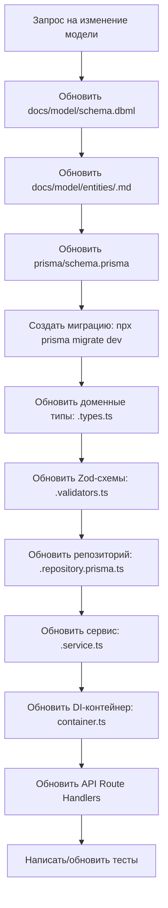

# 📋 ЧЕРНОВИК `.roo/rules/MODEL.md` — Правила управления моделью данных

---

## 1. Двухуровневая модель данных

| Уровень | Расположение | Назначение |
|---------|-------------|-----------|
| **Концептуальный** | `docs/model/` | DBML-схема + markdown-описание. Единый источник истины для структуры данных |
| **Физический** | `prisma/schema.prisma` | Исполняемая схема БД. Производная от концептуальной модели |

> **Принцип:** Концептуальная модель — Source of Truth. Физическая модель всегда следует за концептуальной.

---

## 2. Структура `docs/model/`

```
docs/model/
├── schema.dbml          # Полная DBML-схема БД
├── README.md            # Общее описание модели, ER-диаграмма
├── entities/            # Описание каждой сущности
│   ├── user.md
│   ├── plot.md
└── conventions.md       # Конвенции именования, типы данных, стандарты
```

---

## 3. Порядок внесения изменений в модель



**Запрещено** пропускать шаги или начинать с физического уровня.

---

## 4. Правила синхронизации

- Концептуальная модель (`docs/model/`) — **Source of Truth**. Любое изменение начинается с неё.
- Если ИИ-агент обнаруживает рассинхронизацию между DBML и Prisma — он обязан остановиться и запросить уточнение.
- После каждого изменения Prisma-схемы необходимо проверять, что доменные типы в `<domain>.types.ts` соответствуют полям модели.

---

## 5. Конвенции именования

| Слой | Сущность | Поле ID | Внешний ключ | Пример |
|------|----------|---------|-------------|--------|
| DBML | `snake_case` | `id` | `<ref>_id` | `member_id` |
| Prisma | `PascalCase` | `id` | `camelCase` | `memberId` |
| TypeScript types | `PascalCase` | `id: string` | `camelCase` | `memberId` |
| API JSON | `camelCase` | `id` | `camelCase` | `memberId` |

---

## 6. Обязательные артефакты при изменении модели

При добавлении/изменении сущности ИИ-агент обязан создать/обновить:

1. `docs/model/entities/<entity>.md` — описание сущности, поля, бизнес-правила, ограничения
2. `docs/model/schema.dbml` — актуальная DBML-схема
3. `prisma/schema.prisma` — физическая модель
4. Миграция через `npx prisma migrate dev --name <descriptive-name>`
5. `src/domains/<domain>/<domain>.types.ts` — типы DTO
6. `src/domains/<domain>/<domain>.validators.ts` — Zod-схемы
7. `src/domains/<domain>/<domain>.repository.interface.ts` — интерфейс репозитория
8. `src/domains/<domain>/<domain>.repository.prisma.ts` — реализация репозитория
9. `src/domains/<domain>/<domain>.service.ts` — сервис с бизнес-логикой
10. `src/domains/<domain>/<domain>.errors.ts` — доменные ошибки
11. `src/domains/<domain>/index.ts` — реэкспорт публичного API
12. `src/di/container.ts` — регистрация в DI

---

## 7. Шаблон описания сущности (`docs/model/entities/<entity>.md`)

```markdown
# <EntityName>

## Описание
<Бизнес-описание сущности>

## Поля
| Поле | Тип | Обязательное | Описание | Бизнес-правила |
|------|-----|-------------|----------|----------------|
| id | String | Да | Уникальный идентификатор | Генерируется автоматически (cuid) |
| ... | ... | ... | ... | ... |

## Связи
| Сущность | Тип связи | Описание |
|----------|-----------|----------|
| User | belongs_to | Член СНТ связан с пользователем |

## Индексы
| Поля | Тип | Описание |
|------|-----|----------|
| email | unique | Уникальный email |

## Бизнес-инварианты
- <правило 1>
- <правило 2>
```

---

## 8. Строгие запреты

- ❌ **Запрещено** изменять `prisma/schema.prisma` без предварительного обновления `docs/model/`
- ❌ **Запрещено** создавать миграции вручную (SQL-файлы) — только через `npx prisma migrate dev`
- ❌ **Запрещено** использовать `prisma db push` в продакшн-окружении
- ❌ **Запрещено** удалять миграции из `prisma/migrations/` — только создавать новые
- ❌ **Запрещено** импортировать Prisma Client напрямую в сервисы — только через репозиторий
- ❌ **Запрещено** дублировать типы: доменные типы должны быть совместимы с Prisma-генерируемыми, но не зависеть от них напрямую

---

## Открытые вопросы для обсуждения

1. **Структура docs/model/** — достаточно ли предложенной структуры, или нужно что-то добавить/убрать?
2. **Порядок изменений** — следует ли строго требовать «концептуальная → физическая», или допускаются исключения для быстрых багфиксов?
3. **Шаблон сущности** — нужно ли добавить секции «Примеры API-запросов/ответов» и «Статусная машина»?
4. **Генерация типов** — стоит ли добавить правило о возможности использования `prisma generate` для автоматической генерации типов?
5. **Лог миграций** — нужно ли добавить `docs/model/migrations.md` для истории изменений модели?