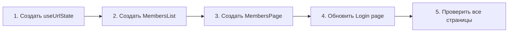

# US-10: SPA-маршрутизация с сохранением состояния в URL — Спецификации компонентов

---

## 1. Анализ проекта

### Текущее состояние
- Проект использует Next.js App Router с Client Components
- Состояние страниц хранится только в клиентском state и не синхронизируется с URL
- Существующие хуки: [`useTheme`](src/hooks/useTheme.tsx), [`useRegister`](src/hooks/useRegister.ts)
- Страница `/dashboard/members` **не существует** — требуется создание

### Компоненты, не требующие изменений
| Компонент | Причина |
|-----------|---------|
| Repository-слой | Не зависит от клиентского состояния |
| Service-слой | Не зависит от клиентского состояния |
| API Route Handlers | Не требуют новых эндпоинтов |

---

## 2. Полный список компонентов для US-10

### Новые компоненты

| Компонент | Путь | Тип | Описание |
|-----------|------|-----|----------|
| `useUrlState` | [`src/hooks/useUrlState.ts`](src/hooks/useUrlState.ts) | Hook | Переиспользуемый хук синхронизации состояния с URL query parameters |
| `MembersPage` | [`src/app/(dashboard)/members/page.tsx`](src/app/(dashboard)/members/page.tsx) | Page | Страница списка членов СНТ с использованием `useUrlState` |
| `MembersList` | [`src/components/features/members/MembersList.tsx`](src/components/features/members/MembersList.tsx) | Component | Обновлённый список с пагинацией, поиском и сортировкой |

### Изменяемые компоненты

| Компонент | Путь | Изменение |
|-----------|------|-----------|
| [`LoginFormDataComponent`](src/app/(public)/login/page.client.tsx) | [`src/app/(public)/login/page.client.tsx`](src/app/(public)/login/page.client.tsx) | FR-8: ссылка "Зарегистрироваться" `<a>` → `<Link>` |

### Компоненты без изменений (проверено)

| Компонент | Статус |
|-----------|--------|
| [`Navbar`](src/components/layouts/Navbar.tsx) | ✅ Уже использует `<Link>` для всех навигационных ссылок |
| [`DashboardPage`](src/app/(dashboard)/dashboard/page.tsx) | ✅ Уже использует `<Link>` для всех карточек |
| [`RegisterPage`](src/app/(public)/register/page.tsx) | ✅ Уже использует `<Link>` для ссылки "Войти" |
| `RolesPage`, `ProfilePage` | `router.push()` для программной защиты маршрутов — допустимый паттерн |

---

## 3. Спецификация: `useUrlState`

### Файл: [`src/hooks/useUrlState.ts`](src/hooks/useUrlState.ts)

```typescript
/**
 * @hook useUrlState
 * @description Переиспользуемый хук для синхронизации состояния страницы с URL query parameters
 *
 * @spec
 * - При монтировании читает параметры из URL и возвращает их как начальное состояние
 * - Предоставляет функцию updateState для обновления состояния и URL
 * - При вызове updateState обновляет React state и синхронизирует URL через router.push/replace
 * - Поддерживает типизированные параметры с defaults по умолчанию
 * - Автоматически обрабатывает событие popstate для восстановления состояния при навигации "Назад"
 * - Параметры со значениями по умолчанию удаляются из URL при clearOnDefault=true
 * - Неверные типы параметров игнорируются, используется default
 * - Неизвестные ключи параметров игнорируются
 * - Поддерживается debounce для search-параметра (500мс)
 * - Пагинация и сортировка обновляются мгновенно без debounce
 *
 * @example
 * ```tsx
 * const [urlState, updateUrlState] = useUrlState({
 *   page: '1',
 *   limit: '20',
 *   search: '',
 *   sort: 'lastName',
 *   order: 'asc',
 * }, {
 *   debounceMs: 500,
 *   clearOnDefault: true,
 * });
 * ```
 *
 * @see docs/user-stories/US-10-spa-routing.md
 */
```

### Сигнатура функции

```typescript
/**
 * Хук для синхронизации состояния с URL query parameters
 *
 * @template T - Тип объекта состояния с параметрами URL
 * @param defaults - Значения по умолчанию для каждого параметра URL
 * @param options - Опции хука
 * @returns [state, updateState] - Текущее состояние и функция обновления
 *
 * @spec
 * - Начальное состояние инициализируется из URL query params
 * - Если параметр отсутствует в URL — используется значение из defaults
 * - Неверные типы параметров (например, page=abc) игнорируются, используется default
 * - updateState обновляет React state и синхронизирует URL
 * - При clearOnDefault=true параметры со значением default удаляются из URL
 * - popstate event перехватывается для восстановления состояния при навигации "Назад"
 * - Неизвестные ключи в URL игнорируются
 * - Для search-параметров поддерживается debounce
 *
 * @throws {Error} не выбрасывает ошибок
 */
declare function useUrlState<T extends Record<string, string | number | boolean | undefined>>(
  defaults: T,
  options?: UseUrlStateOptions
): [state: T, updateState: (updates: Partial<T>) => void];

/**
 * @typedef {Object} UseUrlStateOptions
 * @property {number} [debounceMs=0] — Задержка обновления URL в мс. 0 = мгновенно.
 * @property {boolean} [clearOnDefault=false] — Удалять параметр из URL при значении default
 * @property {string[]} [whitelist] — Whitelist известных ключей параметров
 */
```

---

## 4. Спецификация: MembersPage

### Файл: [`src/app/(dashboard)/members/page.tsx`](src/app/(dashboard)/members/page.tsx)

```typescript
/**
 * @page /dashboard/members
 * @auth required
 * @description Страница списка членов СНТ с SPA-маршрутизацией
 *
 * @spec
 * - Client Component с 'use client'
 * - Использует useUrlState для синхронизации состояния с URL
 * - Параметры: page, limit, search, sort, order
 * - Debounce 500мс для search-параметра
 * - Мгновенное обновление для page, limit, sort, order
 * - При загрузке инициализирует состояние из URL query params
 * - Пустое состояние: показывается EmptyState если список пуст
 * - Загрузка: показывается индикатор загрузки при fetch
 * - Ошибки: обрабатываются через try/catch с отображением ошибки
 * - Пагинация: кнопки Вперёд/Назад обновляют URL мгновенно
 * - Поиск: input с debounce обновляет URL
 * - Сортировка: select обновляет URL мгновенно
 * - Сброс: кнопка сброса удаляет параметры из URL (clearOnDefault)
 *
 * @data-flow
 * - useUrlState() → чтение параметров URL
 * - apiClient.get('/members') → загрузка данных с параметрами
 * - MembersList → рендеринг списка с пагинацией
 *
 * @url-params
 * - page: number (default: 1) — номер страницы
 * - limit: number (default: 20) — количество элементов на странице
 * - search: string (default: '') — текст поиска
 * - sort: 'lastName' | 'firstName' | 'createdAt' (default: 'lastName') — поле сортировки
 * - order: 'asc' | 'desc' (default: 'asc') — направление сортировки
 *
 * @see docs/user-stories/US-10-spa-routing.md
 * @see src/hooks/useUrlState.ts
 */
```

---

## 5. Спецификация: MembersList

### Файл: [`src/components/features/members/MembersList.tsx`](src/components/features/members/MembersList.tsx)

Текущий [`MemberList.tsx`](src/components/features/members/MemberList.tsx:1) показывает только таблицу без пагинации, поиска и сортировки.

```typescript
/**
 * @component MembersList
 * @category features
 * @description Список членов СНТ с пагинацией, поиском и сортировкой
 *
 * @spec
 * - Отображает таблицу членов СНТ
 * - Содержит поле поиска с debounce
 * - Содержит select сортировки
 * - Содержит кнопки пагинации
 * - При пустом списке показывает EmptyState
 * - Все события обновляют URL через updateUrlState
 *
 * @param {Object} MembersListProps
 * @param {Member[]} members - Список членов
 * @param {number} page - Текущая страница
 * @param {number} totalPages - Всего страниц
 * @param {string} search - Текст поиска
 * @param {string} sort - Поле сортировки
 * @param {string} order - Направление сортировки
 * @param {(updates: Partial<UrlState>) => void} updateState - Функция обновления URL
 *
 * @see src/hooks/useUrlState.ts
 */
```

---

## 6. Спецификация: LoginFormDataComponent

### Файл: [`src/app/(public)/login/page.client.tsx`](src/app/(public)/login/page.client.tsx)

**Изменение:** FR-8 — Заменить `<a href="/register">` на `<Link href="/register">` для SPA-навигации.

```typescript
// Текущий код (строка 231-236):
// ❌ <a href="/register"> — вызывает полную перезагрузку страницы
<a
  href="/register"
  className="font-medium text-blue-600 hover:text-blue-500"
>
  Зарегистрироваться
</a>

// Новый код:
// ✅ <Link href="/register"> — SPA-навигация без перезагрузки
import Link from 'next/link';

<Link
  href="/register"
  className="font-medium text-blue-600 hover:text-blue-500"
>
  Зарегистрироваться
</Link>
```

---

## 7. Матрица изменений

### Зависимости между компонентами

```mermaid
flowchart TD
    MembersPage[MembersPage<br/>src/app/(dashboard)/members/page.tsx] --> useUrlState[useUrlState<br/>src/hooks/useUrlState.ts]
    MembersPage --> MembersList[MembersList<br/>src/components/features/members/MembersList.tsx]
    MembersPage --> apiClient[apiClient<br/>src/lib/api-client.ts]
    LoginFormDataComponent[LoginFormDataComponent<br/>src/app/public/login/page.client.tsx] --> Link[next/link Link]
```

### Сводная таблица файлов

| Файл | Действие | Тип | Описание |
|------|----------|-----|----------|
| `src/hooks/useUrlState.ts` | **Создать** | Hook | Хук синхронизации состояния с URL |
| `src/app/(dashboard)/members/page.tsx` | **Создать** | Page | Страница списка членов СНТ |
| `src/components/features/members/MembersList.tsx` | **Создать/Заменить** | Component | Обновлённый список с пагинацией/поиском/сортировкой |
| `src/app/(public)/login/page.client.tsx` | **Изменить** | Component | FR-8: заменить `<a>` на `<Link>` |
| `src/components/layouts/Navbar.tsx` | **Без изменений** | Component | ✅ Уже использует `<Link>` |
| `src/app/(dashboard)/dashboard/page.tsx` | **Без изменений** | Page | ✅ Уже использует `<Link>` |
| `src/app/(public)/register/page.tsx` | **Без изменений** | Page | ✅ Уже использует `<Link>` |

---

## 8. Критерии приёмки (чек-лист спецификаций)

### AC-1: Инициализация состояния из URL
- [x] `useUrlState` читает параметры из URL при монтировании
- [x] `MembersPage` инициализирует состояние из результатов `useUrlState`

### AC-2: Обновление URL при изменении пагинации
- [x] `updateUrlState({ page: ... })` вызывает `router.push` с новыми params
- [x] Мгновенное обновление без debounce

### AC-3: Обновление URL при поиске с debounce
- [x] `useUrlState` поддерживает debounce через options
- [x] `MembersPage` передаёт debounceMs=500

### AC-4: Возврат по кнопке "Назад"
- [x] `useUrlState` подписывается на `popstate` event
- [x] При popstate состояние обновляется из новых URL params

### AC-5: Копируемая ссылка
- [x] URL содержит все параметры состояния
- [x] При открытии URL params используются как начальное состояние

### AC-6: Сброс к значениям по умолчанию
- [x] `clearOnDefault=true` удаляет параметры из URL

### AC-7: Несколько параметров одновременно
- [x] `updateState` объединяет новые параметры с существующими

### AC-8: Неверный тип параметра
- [x] Неверные типы игнорируются, используется default

### AC-9: Неизвестные параметры в URL
- [x] Неизвестные ключи игнорируются

### AC-10: Использование Link для навигации
- [x] Navbar — уже использует `<Link>` ✅
- [x] Login page — заменён `<a>` на `<Link>`
- [x] Register page — уже использует `<Link>` ✅
- [x] Dashboard page — уже использует `<Link>` ✅

---

## 9. Порядок реализации



---

## 10. Границы US-10

### Входит в US-10
- ✅ Создание хука `useUrlState`
- ✅ Создание страницы `/dashboard/members`
- ✅ Обновлённый `MembersList` с пагинацией/поиском/сортировкой
- ✅ Замена `<a>` на `<Link>` в Login page
- ✅ Проверка всех существующих страниц на корректность навигации

### НЕ входит в US-10
- ❌ Серверная пагинация/фильтрация (отдельная US)
- ❌ Изменение модели данных
- ❌ Создание новых API Route Handlers
- ❌ Изменение Repository/Service слоёв
- ❌ Страницы `/dashboard/plots`, `/dashboard/votes` и др.

---

## 11. История

| Дата | Автор | Действие |
|------|-------|----------|
| 2026-07-02 | Architect | Создание спецификаций компонентов |
