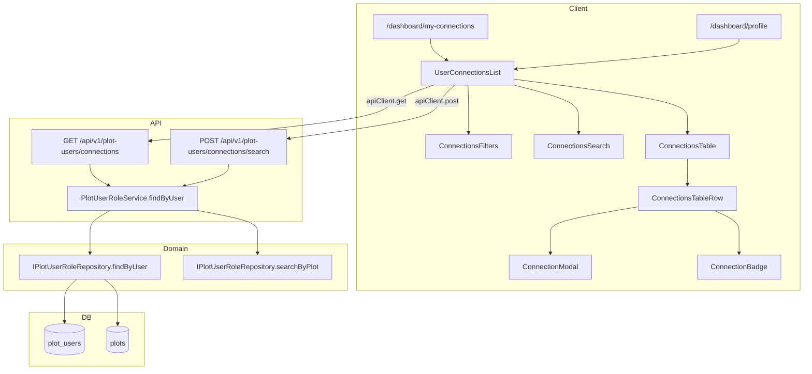

# US-19-3: Спецификации компонентов — Просмотр связей пользователя с участками

> **User Story:** [`docs/user-stories/US-19-3-user-plot-connections.md`](../docs/user-stories/US-19-3-user-plot-connections.md)
> **Режим:** Architect → Code (скелеты + JSDoc, без реализации)
> **Принцип:** Spec-Driven Development (SDD), L1 Code-Spec в JSDoc

---

## Архитектурный обзор



---

## Существующее состояние домена plotUser

Домен уже реализован для **US-19-1** (создание связи) и **US-19-2** (просмотр участников по участку). Текущие методы:
- `findByPlot(plotId, filter)` — участники участка (US-19-2)
- `searchByName(plotId, query)` — поиск участников по имени (US-19-2)
- `findByUserId(userId, includeInactive)` — простая выборка без фильтров/plot JOIN
- `create / update / deactivate` — мутации (US-19-1, US-19-4, US-19-5)

**Для US-19-3 не хватает:**
1. Методов выборки связей по `userId` с JOIN на `plots` (нужны номер/адрес/кадастр участка)
2. Фильтрации по role/status + пагинации для user-связей
3. Поиска по номеру участка/адресу (FR-5)
4. Кастомной сортировки active → pending → expired (AC-1.3)

---

## 1. Концептуальная модель — соответствие

Проверка соответствия типов [`docs/model/entities/plot-user.md`](../docs/model/entities/plot-user.md):

| Поле БД | Тип | Поле TS | Существующий тип | Соответствие |
|---------|-----|---------|------------------|--------------|
| `id` | varchar | `id: string` | `PlotUserRole.id` | ✅ |
| `user_id` | varchar | `userId: string` | `PlotUserRole.userId` | ✅ |
| `plot_id` | varchar | `plotId: string` | `PlotUserRole.plotId` | ✅ |
| `role` | integer | `role: PlotUserRoleRole` | `PlotUserRole.role` | ✅ |
| `status` | varchar | `status: PlotUserRoleStatus` | `PlotUserRole.status` | ✅ |
| `comment` | varchar? | `comment: string\|null` | `PlotUserRole.comment` | ✅ |
| `assigned_at` | timestamp | `assignedAt: Date` | `PlotUserRole.assignedAt` | ✅ |
| `expires_at` | timestamp? | `expiresAt: Date\|null` | `PlotUserRole.expiresAt` | ✅ |
| `created_at` | timestamp | `createdAt: Date` | `PlotUserRole.createdAt` | ✅ |
| `updated_at` | timestamp | `updatedAt: Date` | `PlotUserRole.updatedAt` | ✅ |

**Вывод:** Концептуальная модель не требует изменений. Новые DTO — проекции существующих сущностей.

---

## 2. Изменения типов (`plotUser.types.ts`)

### Добавляемые типы

```typescript
/**
 * @type PlotUserRoleConnection
 * @domain plotUser
 * @description Связь пользователя с участком + информация об участке для списка связей пользователя
 *
 * @spec
 * - Расширяет PlotUserRole данными участка
 * - plot: null если участок удалён (Edge Case #1)
 * - Используется в US-19-3 для отображения списка связей текущего пользователя
 *
 * @see US-19-3 FR-1 (список связей)
 * @see US-19-3 AC-1.2 (столбцы таблицы)
 * @see docs/model/entities/plot-user.md
 */
export interface PlotUserRoleConnection extends PlotUserRole {
  /** Связанный участок (null если удалён) */
  plot: {
    id: string;
    plotNumber: string;
    cadastralNumber: string | null;
    area: number | null;
    address: string | null;
  } | null;
}

/**
 * @type PlotUserRoleConnectionFilter
 * @domain plotUser
 * @description Фильтры для списка связей пользователя
 *
 * @spec
 * - role: фильтр по роли (1=owner, 2=resident, 3=representative)
 * - status: фильтр по статусу (active, pending, expired)
 * - search: поисковый запрос по номеру участка или адресу
 * - page: номер страницы (с 1)
 * - limit: записей на странице (по умолчанию 25)
 *
 * @see US-19-3 FR-3 (фильтр по роли)
 * @see US-19-3 FR-4 (фильтр по статусу)
 * @see US-19-3 FR-5 (поиск по участку)
 */
export interface PlotUserRoleConnectionFilter {
  /** Фильтр по роли (1=owner, 2=resident, 3=representative) */
  role?: PlotUserRoleRole;
  /** Фильтр по статусу (active, pending, expired) */
  status?: PlotUserRoleStatus;
  /** Поисковый запрос по номеру участка или адресу */
  search?: string;
  /** Номер страницы (с 1) */
  page?: number;
  /** Записей на странице (по умолчанию 25) */
  limit?: number;
}
```

---

## 3. Изменения Repository

### 3.1. `plotUser.repository.interface.ts` — добавить методы

```typescript
  /**
   * Получить все связи пользователя с информацией об участке
   *
   * @param userId - Идентификатор пользователя
   * @param filter - Фильтры: role, status, search, page, limit
   * @returns Массив связей с информацией об участке
   * @throws {PlotUserRoleNotFoundError} если пользователь не найден
   *
   * @spec
   * - JOIN с plots (plotNumber, cadastralNumber, area, address)
   * - Фильтрация по role, status, search (plot_number, plot.address)
   * - Сортировка: active → pending → expired, затем assignedAt DESC (BR-2)
   * - Пагинация: по умолчанию page=1, limit=25 (AC-1.3, Edge Case #3)
   * - Возвращает plot: null если участок удалён (Edge Case #1)
   * - search: case-insensitive contains по plot_number и plot.address
   *
   * @see US-19-3 FR-1 (список связей)
   * @see US-19-3 FR-3 (фильтр по роли)
   * @see US-19-3 FR-4 (фильтр по статусу)
   * @see US-19-3 AC-1.3 (сортировка по умолчанию)
   */
  findByUser(
    userId: string,
    filter?: PlotUserRoleConnectionFilter
  ): Promise<PlotUserRoleConnection[]>;

  /**
   * Поиск связей пользователя по номеру участка или адресу
   *
   * @param userId - Идентификатор пользователя
   * @param query - Поисковый запрос (plot_number, plot.address)
   * @returns Массив связей, соответствующих запросу
   * @throws {PlotUserRoleNotFoundError} если пользователь не найден
   *
   * @spec
   * - Case-insensitive contains по plot_number и plot.address
   * - Возвращает связи с информацией об участке
   * - Debounce обрабатывается на UI уровне (300ms)
   * - Сортировка: active → pending → expired, затем assignedAt DESC
   *
   * @see US-19-3 FR-5 (поиск по участку)
   * @see US-19-3 AC-5.2 (поиск по номеру)
   * @see US-19-3 AC-5.3 (поиск по адресу)
   */
  searchByPlot(
    userId: string,
    query: string
  ): Promise<PlotUserRoleConnection[]>;

  /**
   * Найти связь пользователя с информацией об участке
   *
   * @param userId - Идентификатор пользователя
   * @param id - Идентификатор связи plot_users
   * @returns Связь с информацией об участке или null
   *
   * @spec
   * - JOIN с plots
   * - Возвращает null если не найдена
   * - Используется для модального окна деталей (AC-2.4)
   *
   * @see US-19-3 AC-2.4 (кнопка Подробнее)
   */
  findWithPlot(
    userId: string,
    id: string
  ): Promise<PlotUserRoleConnection | null>;
```

### 3.2. `plotUser.repository.prisma.ts` — скелеты реализаций

```typescript
  /**
   * Получить все связи пользователя с информацией об участке
   *
   * @param userId - Идентификатор пользователя
   * @param filter - Фильтры: role, status, search, page, limit
   * @returns Массив связей с информацией об участке
   * @throws {PlotUserRoleNotFoundError} если пользователь не найден
   *
   * @spec
   * - JOIN с plots через $queryRaw (plotNumber, cadastralNumber, area, address)
   * - Фильтрация по role, status, search (plot_number, plot.address)
   * - Сортировка: active → pending → expired (CASE), затем assignedAt DESC
   * - Пагинация: по умолчанию page=1, limit=25
   * - Возвращает plot: null если участок удалён (LEFT JOIN)
   *
   * @see US-19-3 FR-1, FR-3, FR-4, AC-1.3
   */
  async findByUser(
    userId: string,
    filter?: PlotUserRoleConnectionFilter
  ): Promise<PlotUserRoleConnection[]> {
    throw new Error('Not implemented');
  }

  /**
   * Поиск связей пользователя по номеру участка или адресу
   *
   * @param userId - Идентификатор пользователя
   * @param query - Поисковый запрос (plot_number, plot.address)
   * @returns Массив связей, соответствующих запросу
   * @throws {PlotUserRoleNotFoundError} если пользователь не найден
   *
   * @spec
   * - Case-insensitive contains по plot_number и plot.address
   * - Сортировка: active → pending → expired, затем assignedAt DESC
   *
   * @see US-19-3 FR-5, AC-5.2, AC-5.3
   */
  async searchByPlot(
    userId: string,
    query: string
  ): Promise<PlotUserRoleConnection[]> {
    throw new Error('Not implemented');
  }

  /**
   * Найти связь пользователя с информацией об участке
   *
   * @param userId - Идентификатор пользователя
   * @param id - Идентификатор связи plot_users
   * @returns Связь с информацией об участке или null
   *
   * @spec
   * - JOIN с plots
   * - Возвращает null если не найдена
   *
   * @see US-19-3 AC-2.4
   */
  async findWithPlot(
    userId: string,
    id: string
  ): Promise<PlotUserRoleConnection | null> {
    throw new Error('Not implemented');
  }
```

---

## 4. Изменения Service

### `plotUser.service.ts` — добавить методы

```typescript
  /**
   * Получить все связи пользователя с участками
   *
   * @param userId - Идентификатор пользователя (из сессии)
   * @param filter - Фильтры: role, status, search, page, limit
   * @returns Массив связей с информацией об участке
   * @throws {PlotUserRoleNotFoundError} если пользователь не найден
   * @throws {UnauthorizedError} если userId не передан (BR-6)
   *
   * @spec
   * - BR-6: права доступа — только текущий пользователь или ADMIN
   * - Валидирует существование пользователя перед запросом
   * - Делегирует в repository.findByUser
   * - Возвращает PlotUserRoleConnection с данными участка
   * - Сортировка: active → pending → expired, затем assignedAt DESC
   *
   * @see US-19-3 FR-1 (список связей)
   * @see US-19-3 FR-3 (фильтр по роли)
   * @see US-19-3 FR-4 (фильтр по статусу)
   * @see US-19-3 AC-1.3 (сортировка по умолчанию)
   * @see US-19-3 BR-6 (права доступа)
   */
  async findByUser(
    userId: string,
    filter?: PlotUserRoleConnectionFilter
  ): Promise<PlotUserRoleConnection[]> {
    throw new Error('Not implemented');
  }

  /**
   * Поиск связей пользователя по номеру участка или адресу
   *
   * @param userId - Идентификатор пользователя (из сессии)
   * @param query - Поисковый запрос (plot_number, plot.address)
   * @returns Массив связей, соответствующих запросу
   * @throws {PlotUserRoleNotFoundError} если пользователь не найден
   *
   * @spec
   * - Валидирует существование пользователя
   * - Делегирует в repository.searchByPlot
   * - Case-insensitive поиск по plot_number и plot.address
   * - Debounce обрабатывается на UI уровне (300ms, OQ-6)
   *
   * @see US-19-3 FR-5 (поиск по участку)
   * @see US-19-3 AC-5.2 (поиск по номеру)
   * @see US-19-3 AC-5.3 (поиск по адресу)
   */
  async searchByPlot(
    userId: string,
    query: string
  ): Promise<PlotUserRoleConnection[]> {
    throw new Error('Not implemented');
  }
```

---

## 5. Изменения API Route Handlers

### 5.1. Новый файл `src/app/api/v1/plot-users/connections/route.ts`

```typescript
/**
 * @file plot-users/connections/route.ts
 * @description Route handlers для просмотра связей пользователя с участками (US-19-3)
 *
 * @see docs/user-stories/US-19-3-user-plot-connections.md
 */
import { NextRequest, NextResponse } from 'next/server';
import { createPlotUserRoleServiceDI } from '@/di/container';
import { auth } from '@/lib/auth';
import type { BaseError } from '@/shared/errors';
import {
  PlotUserRoleNotFoundError,
  PlotUserRoleInvalidDataError,
} from '@/domains/plotUser/plotUser.errors';

/**
 * @route GET /api/v1/plot-users/connections
 * @auth required
 * @description Возвращает список всех связей текущего пользователя с участками
 *
 * @query status=active|pending|expired&role=1|2|3&search=query&page=1&limit=25
 * @response 200 { success: true, data: PlotUserRoleConnection[] }
 * @response 401 { success: false, error: { code: 'UNAUTHORIZED', message: string } }
 * @response 404 { success: false, error: { code: 'NOT_FOUND', message: string } }
 * @response 500 { success: false, error: { code: string, message: string } }
 *
 * @spec
 * - BR-6: userId берётся из сессии (текущий пользователь)
 * - Фильтры: role, status, search передаются через query params
 * - Пагинация: page, limit (по умолчанию 1, 25)
 * - Сортировка: active → pending → expired, затем assignedAt DESC (AC-1.3)
 *
 * @see US-19-3 FR-1 (список связей)
 * @see US-19-3 FR-3 (фильтр по роли)
 * @see US-19-3 FR-4 (фильтр по статусу)
 * @see US-19-3 FR-5 (поиск)
 */
export async function GET(request: NextRequest): Promise<NextResponse> {
  throw new Error('Not implemented');
}
```

### 5.2. Новый файл `src/app/api/v1/plot-users/connections/search/route.ts`

```typescript
/**
 * @file plot-users/connections/search/route.ts
 * @description Route handler для поиска связей пользователя по участку (US-19-3)
 *
 * @see docs/user-stories/US-19-3-user-plot-connections.md
 */
import { NextRequest, NextResponse } from 'next/server';
import { createPlotUserRoleServiceDI } from '@/di/container';
import { auth } from '@/lib/auth';
import type { BaseError } from '@/shared/errors';
import {
  PlotUserRoleNotFoundError,
  PlotUserRoleInvalidDataError,
} from '@/domains/plotUser/plotUser.errors';

/**
 * @route POST /api/v1/plot-users/connections/search
 * @auth required
 * @description Поиск связей пользователя по номеру участка или адресу
 *
 * @body { search: string }
 * @response 200 { success: true, data: PlotUserRoleConnection[] }
 * @response 401 { success: false, error: { code: 'UNAUTHORIZED', message: string } }
 * @response 404 { success: false, error: { code: 'NOT_FOUND', message: string } }
 * @response 500 { success: false, error: { code: string, message: string } }
 *
 * @spec
 * - BR-6: userId берётся из сессии
 * - search: строка для поиска по plot_number и plot.address
 * - Case-insensitive contains
 * - Возвращает PlotUserRoleConnection с данными участка
 *
 * @see US-19-3 FR-5 (поиск по участку)
 * @see US-19-3 AC-5.2 (поиск по номеру)
 * @see US-19-3 AC-5.3 (поиск по адресу)
 */
export async function POST(request: NextRequest): Promise<NextResponse> {
  throw new Error('Not implemented');
}
```

---

## 6. Изменения UI компонентов

> **ВАЖНО:** Все компоненты — Client Components с директивой `'use client'`.
> **ЗАПРЕЩЕНО** использовать Server Components (см. PROJECT.md §2).

### 6.1. `src/components/features/plotUser/ConnectionBadge.tsx`

```typescript
/**
 * @component ConnectionBadge
 * @category features
 * @description Бейдж статуса или роли связи пользователя с участком
 *
 * @example
 * ```tsx
 * <ConnectionBadge type="status" value="active" />
 * <ConnectionBadge type="role" value={1} />
 * ```
 *
 * @spec
 * - type=status: active (зелёный), pending (жёлтый), expired (серый)
 * - type=role: owner, resident, representative — текстовые метки
 * - Использует ui/Badge
 *
 * @see US-19-3 AC-1.2 (бейдж статуса)
 */
'use client';

import { Badge } from '@/components/ui/Badge';
import type { PlotUserRoleRole, PlotUserRoleStatus } from '@/domains/plotUser/plotUser.types';
import { PlotUserRoleRoleLabel, PlotUserRoleStatusLabel } from '@/domains/plotUser/plotUser.types';

export interface ConnectionBadgeProps {
  type: 'status' | 'role';
  value: PlotUserRoleStatus | PlotUserRoleRole;
}

export function ConnectionBadge({ type, value }: ConnectionBadgeProps): JSX.Element {
  throw new Error('Not implemented');
}
```

### 6.2. `src/components/features/plotUser/ConnectionsFilters.tsx`

```typescript
/**
 * @component ConnectionsFilters
 * @category features
 * @description Фильтры по роли и статусу для списка связей пользователя
 *
 * @example
 * ```tsx
 * <ConnectionsFilters
 *   filters={filters}
 *   onFilterChange={handleFilterChange}
 *   onReset={handleReset}
 * />
 * ```
 *
 * @spec
 * - Фильтр по роли: Все / Владелец / Проживает / Представитель
 * - Фильтр по статусу: Все / Активные / Ожидание / Истёкшие
 * - Кнопка "Сбросить фильтры"
 * - Использует ui/Select
 * - aria-label для доступности (NFR: Доступность)
 *
 * @see US-19-3 FR-3 (фильтр по роли)
 * @see US-19-3 FR-4 (фильтр по статусу)
 */
'use client';

import { Select } from '@/components/ui/Select';
import type { PlotUserRoleRole, PlotUserRoleStatus } from '@/domains/plotUser/plotUser.types';

export interface ConnectionsFiltersValue {
  role?: PlotUserRoleRole | 'all';
  status?: PlotUserRoleStatus | 'all';
}

export interface ConnectionsFiltersProps {
  filters: ConnectionsFiltersValue;
  onFilterChange: (filters: ConnectionsFiltersValue) => void;
  onReset: () => void;
}

export function ConnectionsFilters({
  filters,
  onFilterChange,
  onReset,
}: ConnectionsFiltersProps): JSX.Element {
  throw new Error('Not implemented');
}
```

### 6.3. `src/components/features/plotUser/ConnectionsSearch.tsx`

```typescript
/**
 * @component ConnectionsSearch
 * @category features
 * @description Поле поиска связей по номеру участка или адресу
 *
 * @example
 * ```tsx
 * <ConnectionsSearch
 *   value={search}
 *   onChange={handleChange}
 *   onClear={handleClear}
 * />
 * ```
 *
 * @spec
 * - Placeholder: "Поиск по номеру участка или адресу"
 * - Debounce 300ms (OQ-6) — обрабатывается родителем
 * - Кнопка очистки (×)
 * - aria-describedby для доступности
 *
 * @see US-19-3 FR-5 (поиск)
 * @see US-19-3 AC-5.1 (поле поиска)
 */
'use client';

import { Input } from '@/components/ui/Input';

export interface ConnectionsSearchProps {
  value: string;
  onChange: (value: string) => void;
  onClear: () => void;
}

export function ConnectionsSearch({
  value,
  onChange,
  onClear,
}: ConnectionsSearchProps): JSX.Element {
  throw new Error('Not implemented');
}
```

### 6.4. `src/components/features/plotUser/ConnectionsTable.tsx`

```typescript
/**
 * @component ConnectionsTable
 * @category features
 * @description Таблица связей пользователя с участками
 *
 * @example
 * ```tsx
 * <ConnectionsTable
 *   connections={connections}
 *   onShowDetails={handleShowDetails}
 *   searchQuery={search}
 * />
 * ```
 *
 * @spec
 * - Колонки: Участок, Кадастр, Роль, Статус, Срок, Комментарий, Назначен, Детали (AC-1.2)
 * - Сортировка: активные → ожидание → истёкшие (выполняется на сервере, AC-1.3)
 * - Номер участка: "Уч. [plot_number]" (BR-3)
 * - Адрес: "Уч. [plot_number] — [address]" если есть (AC-2.2)
 * - Кадастр: "Кадастр: [cadastral_number]" если есть (AC-2.3)
 * - Удалённый участок: "[удалён]" (Edge Case #1)
 * - Срок: "Бессрочно" если expires_at=null (BR-4, AC-7.1)
 * - Срок: DD.MM.YYYY (AC-7.2)
 * - Истёкший срок: strikethrough (AC-7.3)
 * - Кнопка "Подробнее" открывает модалку (AC-2.4)
 * - Подсветка совпадений поиска (AC-5.4)
 * - `<th>` для доступности (NFR)
 *
 * @see US-19-3 AC-1.2 (столбцы)
 * @see US-19-3 AC-2.1-2.4 (информация об участке)
 * @see US-19-3 AC-7.1-7.3 (срок действия)
 * @see US-19-3 AC-5.4 (подсветка)
 */
'use client';

import type { PlotUserRoleConnection } from '@/domains/plotUser/plotUser.types';

export interface ConnectionsTableProps {
  connections: PlotUserRoleConnection[];
  onShowDetails: (connection: PlotUserRoleConnection) => void;
  searchQuery?: string;
}

export function ConnectionsTable({
  connections,
  onShowDetails,
  searchQuery,
}: ConnectionsTableProps): JSX.Element {
  throw new Error('Not implemented');
}
```

### 6.5. `src/components/features/plotUser/ConnectionModal.tsx`

```typescript
/**
 * @component ConnectionModal
 * @category features
 * @description Модальное окно с деталями участка для связи
 *
 * @example
 * ```tsx
 * <ConnectionModal
 *   connection={selectedConnection}
 *   isOpen={isModalOpen}
 *   onClose={handleCloseModal}
 * />
 * ```
 *
 * @spec
 * - Отображает полную информацию об участке (номер, кадастр, площадь, адрес)
 * - Информация о связи (роль, статус, срок, комментарий, дата назначения)
 * - Ссылка на страницу участка `/dashboard/plots/[id]` (AC-2.4)
 * - Кнопка "Закрыть"
 * - Доступность: focus trap, Esc для закрытия
 *
 * @see US-19-3 AC-2.4 (кнопка Подробнее)
 */
'use client';

import type { PlotUserRoleConnection } from '@/domains/plotUser/plotUser.types';

export interface ConnectionModalProps {
  connection: PlotUserRoleConnection | null;
  isOpen: boolean;
  onClose: () => void;
}

export function ConnectionModal({
  connection,
  isOpen,
  onClose,
}: ConnectionModalProps): JSX.Element | null {
  throw new Error('Not implemented');
}
```

### 6.6. `src/components/features/plotUser/UserConnectionsList.tsx`

```typescript
/**
 * @component UserConnectionsList
 * @category features
 * @description Список связей пользователя с участками — основной контейнер US-19-3
 *
 * @example
 * ```tsx
 * <UserConnectionsList userId={session.user.id} />
 * <UserConnectionsList userId={session.user.id} limit={5} showViewAll />
 * ```
 *
 * @spec
 * - Загружает данные через apiClient.get('/plot-users/connections') при монтировании
 * - Передаёт фильтры (role, status) через query params
 * - Поиск через apiClient.post('/plot-users/connections/search') с debounce 300ms
 * - Состояния: loading (skeleton), error (alert), data (table), empty (EmptyState)
 * - EmptyState: "Вы пока не привязаны ни к одному участку" (AC-6.1)
 * - EmptyState фильтр: "По вашему запросу ничего не найдено" + кнопка "Сбросить" (AC-6.2)
 * - Пагинация: 25 элементов на страницу (Edge Case #3)
 * - Кнопка "Показать все" если limit задан (TV-2 dashboard)
 * - Оптимистичное обновление после US-19-1/4/5
 *
 * @see US-19-3 FR-1 (список связей)
 * @see US-19-3 FR-6 (пустое состояние)
 * @see US-19-3 AC-6.1, AC-6.2 (EmptyState)
 * @see US-19-3 Edge Case #3 (пагинация)
 */
'use client';

import { useState, useEffect, useCallback } from 'react';
import { apiClient } from '@/lib/api-client';
import type { PlotUserRoleConnection } from '@/domains/plotUser/plotUser.types';
import { ConnectionsFilters } from './ConnectionsFilters';
import { ConnectionsSearch } from './ConnectionsSearch';
import { ConnectionsTable } from './ConnectionsTable';
import { ConnectionModal } from './ConnectionModal';

export interface UserConnectionsListProps {
  userId: string;
  limit?: number;
  showViewAll?: boolean;
}

export function UserConnectionsList({
  userId,
  limit,
  showViewAll,
}: UserConnectionsListProps): JSX.Element {
  throw new Error('Not implemented');
}
```

### 6.7. Обновление `src/components/features/plotUser/index.ts`

Добавить реэкспорты новых компонентов:

```typescript
// US-19-3: User Connections Components
export { ConnectionBadge } from './ConnectionBadge';
export type { ConnectionBadgeProps } from './ConnectionBadge';
export { ConnectionsFilters } from './ConnectionsFilters';
export type { ConnectionsFiltersProps, ConnectionsFiltersValue } from './ConnectionsFilters';
export { ConnectionsSearch } from './ConnectionsSearch';
export type { ConnectionsSearchProps } from './ConnectionsSearch';
export { ConnectionsTable } from './ConnectionsTable';
export type { ConnectionsTableProps } from './ConnectionsTable';
export { ConnectionModal } from './ConnectionModal';
export type { ConnectionModalProps } from './ConnectionModal';
export { UserConnectionsList } from './UserConnectionsList';
export type { UserConnectionsListProps } from './UserConnectionsList';
```

---

## 7. Изменения страниц (Client Components)

### 7.1. Новый файл `src/app/dashboard/my-connections/page.tsx`

```typescript
/**
 * @page /dashboard/my-connections
 * @auth required
 * @description Страница "Мои связи с участками" — точка входа TV-3
 *
 * @spec
 * - Client Component с 'use client'
 * - useSession() для авторизации
 * - При отсутствии сессии — редирект на /login
 * - Рендерит UserConnectionsList с userId из сессии
 * - Полная таблица со всеми связями
 *
 * @data-flow
 * - useSession() -> session.user.id -> UserConnectionsList
 *
 * @see US-19-3 TV-3 (точка входа)
 */
'use client';

import { useSession } from 'next-auth/react';
import { useRouter } from 'next/navigation';
import { useEffect } from 'react';
import { UserConnectionsList } from '@/components/features/plotUser';

export default function MyConnectionsPage(): JSX.Element {
  throw new Error('Not implemented');
}
```

### 7.2. Обновление `src/app/dashboard/profile/page.tsx`

Добавить вкладку "Мои участки" с `<UserConnectionsList>` (точка входа TV-1).

### 7.3. Обновление `src/app/dashboard/page.tsx`

Добавить блок "Мои участки" с `<UserConnectionsList limit={5} showViewAll />` (точка входа TV-2).

---

## 8. Проверка соответствия User Story

| AC | Реализация | Компонент | Статус |
|----|------------|-----------|--------|
| AC-1.1 Открытие списка | `UserConnectionsList` загружает при монтировании | UI | 📋 скелет |
| AC-1.2 Столбцы таблицы | `ConnectionsTable` | UI | 📋 скелет |
| AC-1.3 Сортировка по умолчанию | `repository.findByUser` CASE сортировка | Repo | 📋 скелет |
| AC-2.1-2.4 Информация об участке | `ConnectionsTable` + `ConnectionModal` | UI | 📋 скелет |
| FR-3 Фильтр по роли | `ConnectionsFilters` → query param | UI+API | 📋 скелет |
| FR-4 Фильтр по статусу | `ConnectionsFilters` → query param | UI+API | 📋 скелет |
| FR-5 Поиск по участку | `ConnectionsSearch` → `/connections/search` | UI+API | 📋 скелет |
| AC-5.4 Подсветка совпадений | `ConnectionsTable` highlight | UI | 📋 скелет |
| FR-6 Пустое состояние | `EmptyState` в `UserConnectionsList` | UI | 📋 скелет |
| FR-7 Срок действия | `ConnectionsTable` форматирование | UI | 📋 скелет |
| BR-6 Права доступа | userId из сессии в API route | API | 📋 скелет |
| Edge Case #3 Пагинация | limit=25 в `repository.findByUser` | Repo | 📋 скелет |

---

## 9. Проверка соответствия концептуальной модели

✅ Сущность `PlotUserRole` — без изменений (см. раздел 1)
✅ Новые типы `PlotUserRoleConnection`, `PlotUserRoleConnectionFilter` — проекции, не новая сущность
✅ Не требуется миграция БД
✅ Не требуется обновление `docs/model/` (нет изменений схемы)
✅ Соответствие SPECS.md: L1 Code-Spec в JSDoc, L2 User Story уже существует

---

## 10. Ограничения для Code mode

- ✅ Все новые функции — скелеты с `throw new Error('Not implemented')`
- ✅ Только Client Components (`'use client'`)
- ✅ JSDoc/TSDoc аннотации заполнены согласно SPECS.md §4
- ✅ Использование `apiClient` (не `fetch()`)
- ✅ Пути без `/api/v1` префикса в `apiClient`
- ✅ DI через `createPlotUserRoleServiceDI` для API routes
- ❌ НЕ изменять типы `PlotUserRole`, `CreatePlotUserRoleInput` и т.д.
- ❌ НЕ изменять существующие методы US-19-1/US-19-2

---

## 11. Порядок реализации (для Code mode)

1. Добавить типы `PlotUserRoleConnection`, `PlotUserRoleConnectionFilter` в `plotUser.types.ts`
2. Добавить методы в `plotUser.repository.interface.ts` (JSDoc + сигнатуры)
3. Добавить скелеты в `plotUser.repository.prisma.ts` (`throw new Error`)
4. Добавить методы в `plotUser.service.ts` (`throw new Error`)
5. Создать `src/app/api/v1/plot-users/connections/route.ts`
6. Создать `src/app/api/v1/plot-users/connections/search/route.ts`
7. Создать UI компоненты: `ConnectionBadge`, `ConnectionsFilters`, `ConnectionsSearch`, `ConnectionsTable`, `ConnectionModal`, `UserConnectionsList`
8. Обновить `src/components/features/plotUser/index.ts` (re-exports)
9. Создать `src/app/dashboard/my-connections/page.tsx`
10. Обновить `src/app/dashboard/profile/page.tsx` (вкладка)
11. Обновить `src/app/dashboard/page.tsx` (блок)
12. Запустить `npm run dev` и проверить страницы: `/dashboard/my-connections`, `/dashboard/profile`, `/dashboard`
13. Проверить типы: `npm run type-check`
